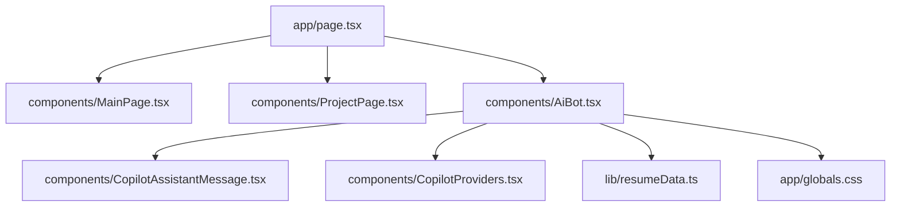
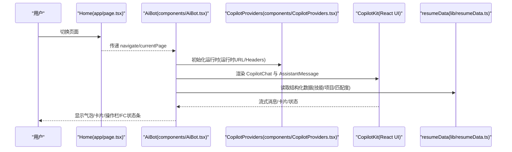
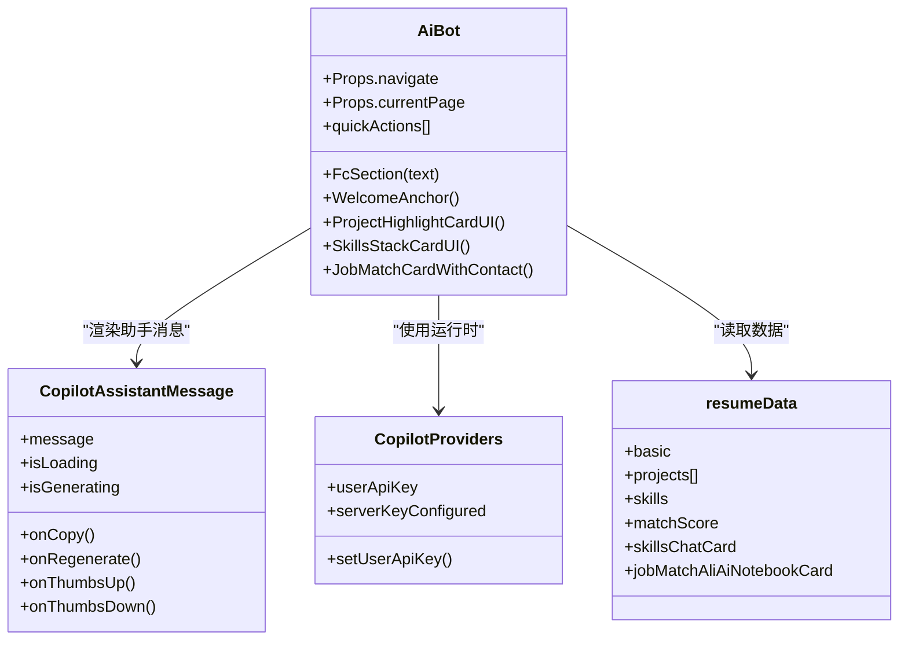
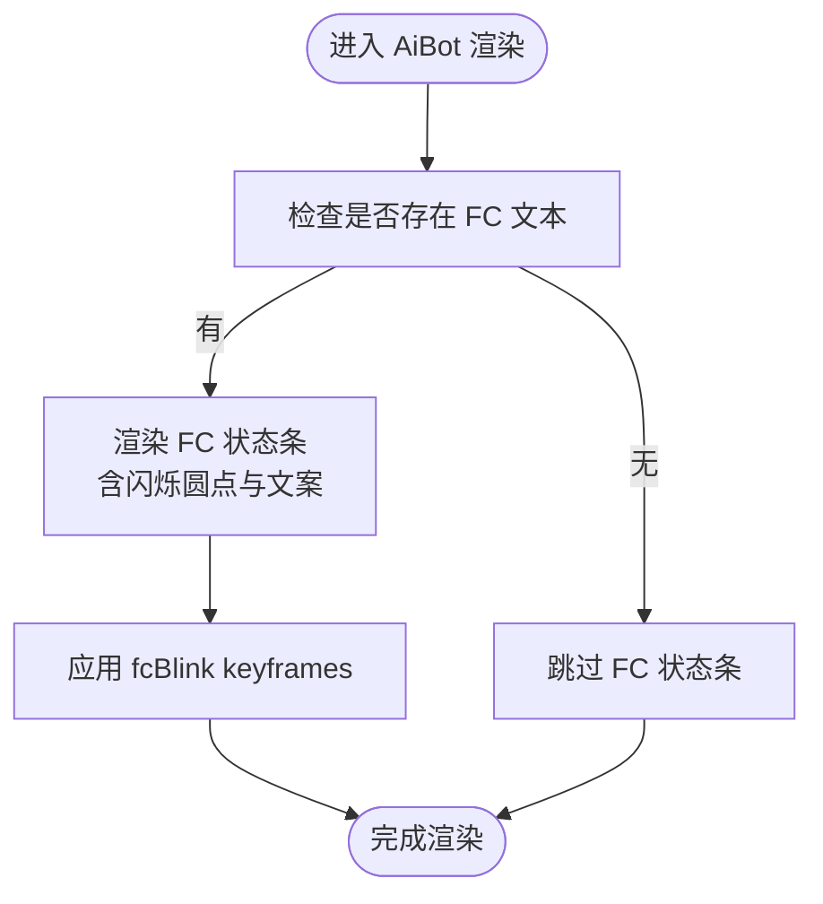
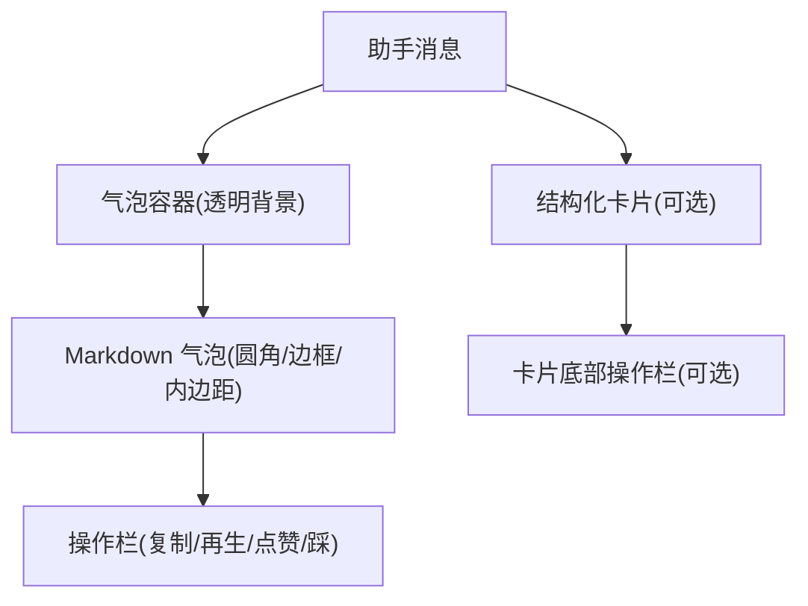
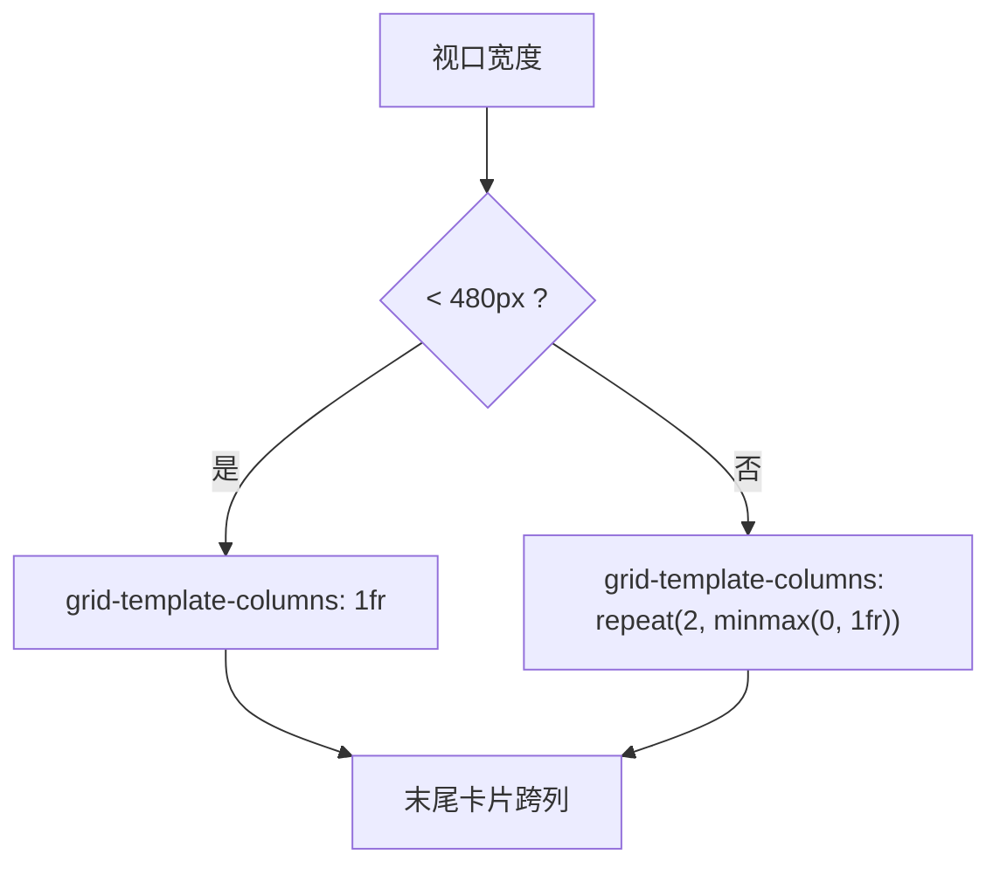
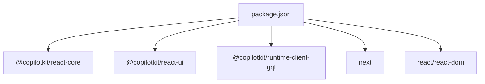

# AI 助手界面设计

<cite>
**本文档引用的文件**
- [app/page.tsx](file://app/page.tsx)
- [components/AiBot.tsx](file://components/AiBot.tsx)
- [components/CopilotAssistantMessage.tsx](file://components/CopilotAssistantMessage.tsx)
- [components/CopilotProviders.tsx](file://components/CopilotProviders.tsx)
- [components/MainPage.tsx](file://components/MainPage.tsx)
- [components/ProjectPage.tsx](file://components/ProjectPage.tsx)
- [app/globals.css](file://app/globals.css)
- [lib/resumeData.ts](file://lib/resumeData.ts)
- [package.json](file://package.json)
</cite>

## 目录
1. [简介](#简介)
2. [项目结构](#项目结构)
3. [核心组件](#核心组件)
4. [架构总览](#架构总览)
5. [详细组件分析](#详细组件分析)
6. [依赖分析](#依赖分析)
7. [性能考虑](#性能考虑)
8. [故障排查指南](#故障排查指南)
9. [结论](#结论)
10. [附录](#附录)

## 简介
本项目为一个赛博朋克风格的 AI 助手界面，围绕“傅倩娇”的个人简历与求职目标，提供可定制的对话体验。界面采用深色主题、青紫渐变与发光效果，结合 CopilotKit 提供的聊天 UI 与 Function Calling 能力，实现“结构化卡片 + 流式回复”的复合消息展示，并通过 CSS 变量与动画系统统一视觉风格与交互反馈。

## 项目结构
- 应用入口与路由：app/page.tsx 负责页面切换与 AiBot 常驻展示。
- 核心对话组件：components/AiBot.tsx 提供聊天面板、欢迎语、快捷问题、结构化卡片与 Function Calling 状态指示器。
- 自定义助手消息渲染：components/CopilotAssistantMessage.tsx 控制助手消息的 Markdown 展示、操作栏与空回复提示。
- 运行时与 API 集成：components/CopilotProviders.tsx 封装 CopilotKit Provider、SiliconFlow Key 管理与服务端 Key 探测。
- 主页与页面导航：components/MainPage.tsx、components/ProjectPage.tsx 提供主页与项目详情页，配合 AiBot 的卡片联动。
- 样式与主题：app/globals.css 定义 CSS 变量、气泡样式、输入区布局、动画与响应式网格。
- 知识库数据：lib/resumeData.ts 提供简历、项目、技能、匹配度等结构化数据，驱动 AiBot 的卡片生成。
- 依赖：package.json 中包含 @copilotkit/react-core、react、next 等依赖。

图表来源
- [app/page.tsx:11-29](file://app/page.tsx#L11-L29)
- [components/AiBot.tsx:1-31](file://components/AiBot.tsx#L1-L31)
- [components/CopilotAssistantMessage.tsx:37-52](file://components/CopilotAssistantMessage.tsx#L37-L52)
- [components/CopilotProviders.tsx:49-156](file://components/CopilotProviders.tsx#L49-L156)
- [lib/resumeData.ts:5-260](file://lib/resumeData.ts#L5-L260)
- [app/globals.css:1-122](file://app/globals.css#L1-L122)

章节来源
- [app/page.tsx:11-29](file://app/page.tsx#L11-L29)
- [package.json:12-20](file://package.json#L12-L20)

## 核心组件
- AiBot 对话面板：负责欢迎语、快捷问题、Function Calling 状态条、结构化卡片（项目亮点、技能图谱、岗位匹配度）与输入区集成。
- CopilotAssistantMessage 自定义渲染：确保“卡片 + 正文”组合展示，控制操作栏位置与空回复提示。
- CopilotProviders 运行时封装：注入运行时 URL、禁用 Inspector、屏蔽开发台弹窗、处理服务端 Key 与浏览器 Key 的优先级。
- 主页与项目页：提供导航与内容展示，配合 AiBot 的卡片联动跳转。
- 样式与主题：通过 CSS 变量统一背景、表面、强调色、边框与发光；通过 keyframes 定义气泡、进度条、脉冲等动画。

章节来源
- [components/AiBot.tsx:23-26](file://components/AiBot.tsx#L23-L26)
- [components/CopilotAssistantMessage.tsx:37-195](file://components/CopilotAssistantMessage.tsx#L37-L195)
- [components/CopilotProviders.tsx:49-156](file://components/CopilotProviders.tsx#L49-L156)
- [app/globals.css:25-122](file://app/globals.css#L25-L122)

## 架构总览
整体架构围绕“页面 + 对话 + 主题 + 数据”展开：
- 页面层：Home 负责路由切换与常驻 AiBot。
- 对话层：AiBot 使用 CopilotKit 的 Chat 与 AssistantMessage，结合自定义卡片与 Function Calling 状态条。
- 主题层：CSS 变量与 keyframes 统一气泡、输入区、操作栏、滚动条与动画。
- 数据层：resumeData 提供结构化数据，驱动卡片生成与匹配度计算。

图表来源
- [app/page.tsx:11-29](file://app/page.tsx#L11-L29)
- [components/AiBot.tsx:1-31](file://components/AiBot.tsx#L1-L31)
- [components/CopilotProviders.tsx:144-156](file://components/CopilotProviders.tsx#L144-L156)
- [lib/resumeData.ts:5-260](file://lib/resumeData.ts#L5-L260)

## 详细组件分析

### AiBot 对话面板
- 欢迎语与快捷问题：首次进入展示欢迎语，随后在底部建议区呈现胶囊式快捷问题，风格与顶部快捷胶囊一致。
- Function Calling 状态条：当存在进行中的函数调用时，显示带闪烁动画的状态条，颜色为青色系渐变。
- 结构化卡片：
  - 项目亮点卡片：展示项目名称、指标徽章与“查看完整 STAR 拆解”按钮。
  - 技能图谱卡片：按板块展示技能芯片与交付指标，支持强调态与 CTAs。
  - 岗位匹配度卡片：展示综合得分、维度得分与强项/缺口说明，支持展开联系方式。
- 气泡与操作栏：统一气泡字号、行高、圆角与内边距；操作栏位于气泡或卡片底部外侧，支持复制、再生、点赞/踩。
- 输入区：横向布局，左侧输入框右侧发送按钮，渐变色发送键，输入区带边框与发光。

图表来源
- [components/AiBot.tsx:28-31](file://components/AiBot.tsx#L28-L31)
- [components/CopilotAssistantMessage.tsx:37-52](file://components/CopilotAssistantMessage.tsx#L37-L52)
- [components/CopilotProviders.tsx:15-26](file://components/CopilotProviders.tsx#L15-L26)
- [lib/resumeData.ts:5-260](file://lib/resumeData.ts#L5-L260)

章节来源
- [components/AiBot.tsx:34-792](file://components/AiBot.tsx#L34-L792)
- [app/globals.css:92-475](file://app/globals.css#L92-L475)

### Function Calling 状态指示器
- 状态条结构：包含闪烁圆点与文案，使用 CSS keyframes 实现呼吸/闪烁效果。
- 触发条件：当存在进行中的函数调用时显示；文本来自上下文或运行时状态。
- 视觉反馈：圆点使用青色系渐变，文案使用强调色与紧凑字距，背景带轻微边框与圆角。

图表来源
- [components/AiBot.tsx:713-757](file://components/AiBot.tsx#L713-L757)
- [app/globals.css:92-101](file://app/globals.css#L92-L101)

章节来源
- [components/AiBot.tsx:713-757](file://components/AiBot.tsx#L713-L757)
- [app/globals.css:92-101](file://app/globals.css#L92-L101)

### 聊天气泡设计规范
- 字体与行高：统一使用 14px 字号、1.6 行高、400 字重，与 Markdown 元素一致。
- 圆角与边框：气泡圆角 12px，边框 1px，背景与边框透明度与主题一致。
- 内边距：气泡内边距 16px 22px，避免文字贴边。
- 最大宽度：气泡最大宽度限制在 92% 或 22rem，避免拉满屏幕。
- 用户气泡与助手气泡：用户气泡右对齐，助手气泡左对齐；助手 Markdown 气泡独立于外层容器，操作栏位于气泡下方。
- Markdown 元素：标题、段落、列表、代码块等尺寸与行高与气泡一致，避免层级放大。

图表来源
- [app/globals.css:124-286](file://app/globals.css#L124-L286)
- [components/CopilotAssistantMessage.tsx:162-195](file://components/CopilotAssistantMessage.tsx#L162-L195)

章节来源
- [app/globals.css:124-286](file://app/globals.css#L124-L286)
- [components/CopilotAssistantMessage.tsx:162-195](file://components/CopilotAssistantMessage.tsx#L162-L195)

### 响应式设计
- 主页 Hero 数字团队网格：移动端单列，480px 以上双列，末尾卡片跨列。
- 滚动条：自定义滚动条宽度与颜色，提升深色主题下的可读性。
- 关键动画：fadeUp、pulse、fabCyberPulse、barIn 等，用于页面进入、脉冲与进度条填充。

图表来源
- [app/globals.css:493-508](file://app/globals.css#L493-L508)

章节来源
- [app/globals.css:493-508](file://app/globals.css#L493-L508)

### 主题与样式覆盖
- CSS 变量：:root 定义 --bg/--surface/--accent/--text/--border 等，全局生效。
- CopilotKit 覆盖：通过 .copilot-custom 与 .copilotKitChat.copilot-custom 覆盖默认气泡、消息、输入区、操作栏与底部建议区样式。
- 气泡与输入区：统一字号、行高、圆角、边框、内边距与字体族，确保一致性。
- 操作栏：固定在气泡或卡片底部外侧，可见性与交互状态明确。
- 底部建议区：胶囊式快捷问题，小字号、圆角药丸、悬停过渡。

章节来源
- [app/globals.css:2-12](file://app/globals.css#L2-L12)
- [app/globals.css:25-122](file://app/globals.css#L25-L122)
- [app/globals.css:315-383](file://app/globals.css#L315-L383)

### 自定义选项与样式覆盖方法
- 主题定制：通过修改 :root 变量即可改变整体色调与对比度。
- 气泡样式：通过 --ck-bubble-* 变量与 .copilot-custom 覆盖气泡外观。
- 输入区与发送键：通过 .copilot-custom .copilotKitInput 与 .copilotKitInputControlButton 调整布局与颜色。
- 操作栏：通过 .copilotKitMessageControls 与 .copilotKitMessageControlButton 调整按钮尺寸与状态。
- 建议区：通过 .suggestions 与 .suggestion 类调整胶囊式快捷问题的尺寸、颜色与过渡。

章节来源
- [app/globals.css:38-122](file://app/globals.css#L38-L122)
- [app/globals.css:315-383](file://app/globals.css#L315-L383)

### 交互行为说明
- 复制/再生/点赞/踩：助手消息操作栏支持复制完整回复块、再生回复、点赞/踩反馈。
- 空回复提示：当助手回复为空且无卡片时，显示“未收到文字回复”的提示。
- 滚动与定位：首页“查看项目佐证”按钮点击后平滑滚动到指定位置。
- FAB 联系我：点击展开联系信息，悬停时渐变光晕与阴影增强赛博朋克氛围。

章节来源
- [components/CopilotAssistantMessage.tsx:75-112](file://components/CopilotAssistantMessage.tsx#L75-L112)
- [components/AiBot.tsx:614-655](file://components/AiBot.tsx#L614-L655)
- [components/MainPage.tsx:611-650](file://components/MainPage.tsx#L611-L650)

## 依赖分析
- @copilotkit/react-core：提供运行时与核心能力。
- @copilotkit/react-ui：提供聊天 UI 组件（CopilotChat、AssistantMessage 等）。
- @copilotkit/runtime-client-gql：客户端 GraphQL 运行时。
- next、react、react-dom：Next.js 14 与 React 生态。
- patch-package：应用补丁以修复第三方包问题。

图表来源
- [package.json:12-20](file://package.json#L12-L20)

章节来源
- [package.json:12-20](file://package.json#L12-L20)

## 性能考虑
- 流式渲染：CopilotKit 支持流式消息，AiBot 通过 isGenerating 与 isLoading 控制加载状态，避免阻塞。
- 动画与绘制：OrbCanvas 使用 requestAnimationFrame 绘制，注意在组件卸载时取消动画帧；建议在组件销毁时清理资源。
- 滚动性能：消息列表使用 flex 布局与最小高度约束，避免内容过多时的重排。
- 图片与音频：背景音乐采用同源 MP3，预加载与 readyState 检测减少首播卡顿。

章节来源
- [components/AiBot.tsx:794-850](file://components/AiBot.tsx#L794-L850)
- [components/BackgroundMusic.tsx:17-34](file://components/BackgroundMusic.tsx#L17-L34)

## 故障排查指南
- CopilotKit 开发台弹窗：通过 showDevConsole={false} 与 enableInspector={false} 禁用开发台，避免 SyntaxError 弹窗。
- 服务端 Key 探测：首次进入页面通过 /api/copilotkit 拉取服务端 Key 配置状态，避免空响应导致解析异常。
- 浏览器 Key 存储：用户可在面板保存 Key，存储在 localStorage；为空时退回服务端 Key。
- 空响应修复：对 /api/copilotkit 的空响应进行包装，避免 urql 解析错误。

章节来源
- [components/CopilotProviders.tsx:49-156](file://components/CopilotProviders.tsx#L49-L156)

## 结论
本项目通过 CSS 变量与 keyframes 实现统一的赛博朋克主题，结合 CopilotKit 的聊天 UI 与 Function Calling 能力，提供了“结构化卡片 + 流式回复”的丰富交互体验。AiBot 的设计规范、动画与响应式布局确保在不同设备与场景下保持一致的视觉与交互质量。通过 resumeData 驱动的卡片系统，能够灵活扩展内容与样式覆盖，便于二次开发与主题定制。

## 附录
- CSS 变量使用示例：:root 定义 --bg/--surface/--accent/--text/--border 等，全局生效。
- 动画配置：fcBlink、orbPulse、fadeUp、pulse、fabCyberPulse、barIn 等 keyframes。
- 交互行为：复制/再生/点赞/踩、空回复提示、平滑滚动、FAB 展开。

章节来源
- [app/globals.css:2-12](file://app/globals.css#L2-L12)
- [app/globals.css:92-101](file://app/globals.css#L92-L101)
- [app/globals.css:516-550](file://app/globals.css#L516-L550)