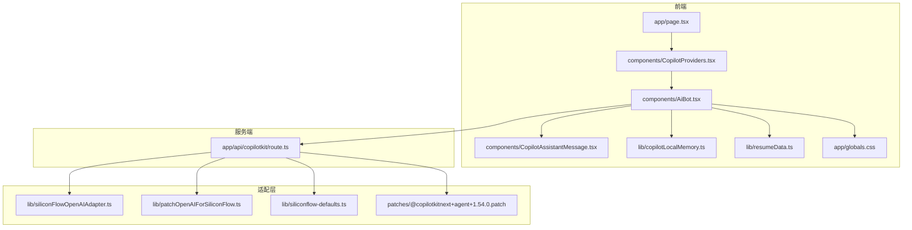
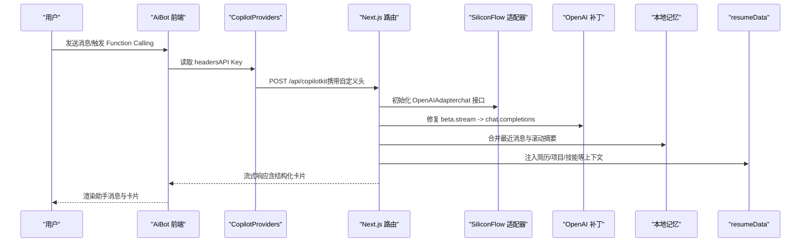
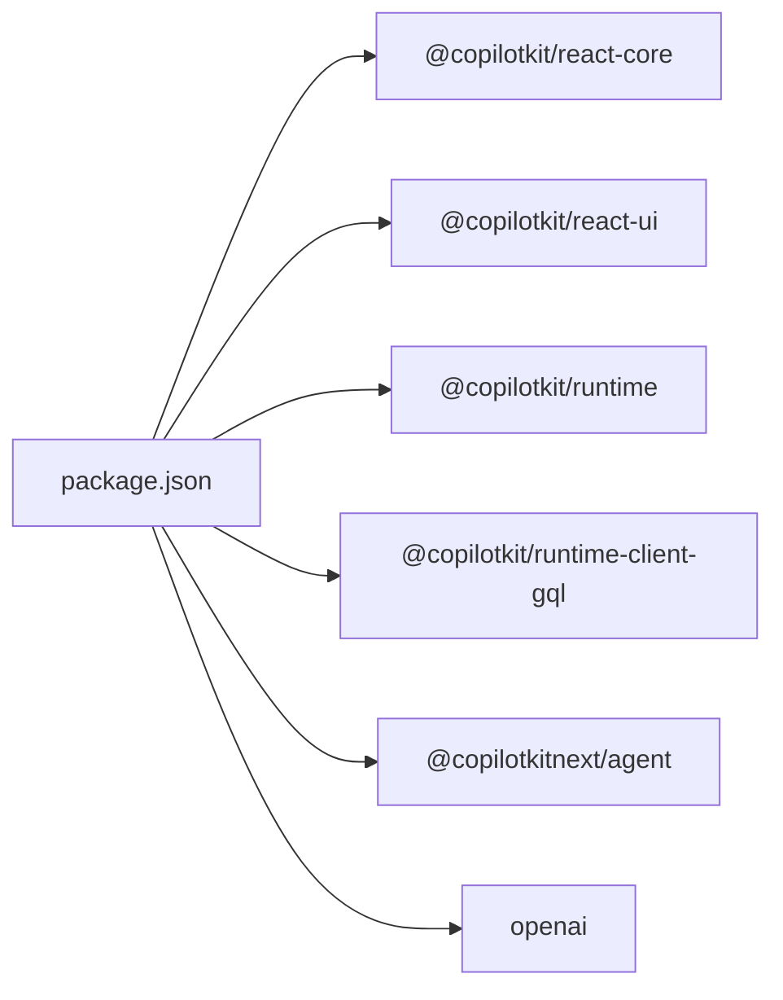

# AI 助手系统

<cite>
**本文档引用的文件列表**
- [app/page.tsx](file://app/page.tsx)
- [components/CopilotProviders.tsx](file://components/CopilotProviders.tsx)
- [app/api/copilotkit/route.ts](file://app/api/copilotkit/route.ts)
- [lib/siliconFlowOpenAIAdapter.ts](file://lib/siliconFlowOpenAIAdapter.ts)
- [lib/patchOpenAIForSiliconFlow.ts](file://lib/patchOpenAIForSiliconFlow.ts)
- [lib/copilotLocalMemory.ts](file://lib/copilotLocalMemory.ts)
- [lib/siliconflow-defaults.ts](file://lib/siliconflow-defaults.ts)
- [components/CopilotAssistantMessage.tsx](file://components/CopilotAssistantMessage.tsx)
- [components/AiBot.tsx](file://components/AiBot.tsx)
- [patches/@copilotkitnext+agent+1.54.0.patch](file://patches/@copilotkitnext+agent+1.54.0.patch)
- [lib/resumeData.ts](file://lib/resumeData.ts)
- [package.json](file://package.json)
- [next.config.js](file://next.config.js)
- [app/globals.css](file://app/globals.css)
</cite>

## 更新摘要
**所做更改**
- 更新了对话策略优化部分，增加了新的引导逻辑和输出规则
- 增强了消息处理机制，改进了结构化卡片的渲染和交互
- 优化了用户体验，包括状态指示器、快捷问题和页面导航
- 完善了本地记忆管理机制，增强了上下文保持能力
- 更新了样式系统，提供了更好的视觉一致性

## 目录
1. [简介](#简介)
2. [项目结构](#项目结构)
3. [核心组件](#核心组件)
4. [架构总览](#架构总览)
5. [详细组件分析](#详细组件分析)
6. [依赖关系分析](#依赖关系分析)
7. [性能考量](#性能考量)
8. [故障排查指南](#故障排查指南)
9. [结论](#结论)
10. [附录](#附录)

## 简介
本项目基于 CopilotKit 构建了一个面向"傅倩娇"个人品牌的 AI 助手系统，提供智能对话、Function Calling、本地记忆管理与定制化界面。系统通过 Next.js App Router 提供服务端端点，前端通过 CopilotKit Provider 注入配置，支持硅基流动（SiliconFlow）兼容网关的 OpenAI 协议适配，并内置本地持久化记忆与结构化卡片展示，帮助用户在对话中获得更丰富、可操作的回复体验。

**更新** 本版本引入了全新的对话策略优化，包括更精确的意图分流、增强的消息处理机制和改进的用户体验设计。

## 项目结构
- app/page.tsx：页面入口，渲染主页面与 AI 助手悬浮窗。
- components/CopilotProviders.tsx：CopilotKit Provider 包装，负责 API Key 管理、请求头设置、服务端配置检测与 fetch 修复。
- app/api/copilotkit/route.ts：服务端端点，负责解析 API Key、缓存运行时、适配 SiliconFlow 兼容性并处理 OPTIONS 预检。
- lib/siliconFlowOpenAIAdapter.ts：适配器，将默认 OpenAIAdapter 切换到 chat 接口，确保与 SiliconFlow 的流式协议一致。
- lib/patchOpenAIForSiliconFlow.ts：补丁，将 OpenAI SDK 的 beta.stream 代理到标准 chat.completions 流式接口。
- lib/copilotLocalMemory.ts：本地记忆持久化，用于将最近对话与滚动摘要注入模型上下文。
- lib/siliconflow-defaults.ts：SiliconFlow API Key 相关常量（请求头、默认 Key、存储键）。
- components/CopilotAssistantMessage.tsx：自定义助手消息渲染，支持结构化卡片与复制整段回复。
- components/AiBot.tsx：AI 助手 UI 与交互，包含欢迎语、快捷问题、结构化卡片（项目亮点、技能栈、岗位匹配度）与 Function Calling 执行状态提示。
- patches/@copilotkitnext+agent+1.54.0.patch：补丁，修复部分兼容网关在工具调用结束事件顺序上的校验问题。
- lib/resumeData.ts：AI 助手的知识库（简历、项目、技能、匹配度等），作为上下文注入给模型。
- package.json / next.config.js：依赖与构建配置。
- app/globals.css：全局样式，提供 Cyberpunk 风格的主题定制。

**图表来源**
- [app/page.tsx:1-30](file://app/page.tsx#L1-L30)
- [components/CopilotProviders.tsx:1-157](file://components/CopilotProviders.tsx#L1-L157)
- [components/AiBot.tsx:1-1937](file://components/AiBot.tsx#L1-L1937)
- [components/CopilotAssistantMessage.tsx:1-234](file://components/CopilotAssistantMessage.tsx#L1-L234)
- [lib/copilotLocalMemory.ts:1-77](file://lib/copilotLocalMemory.ts#L1-L77)
- [lib/resumeData.ts:1-263](file://lib/resumeData.ts#L1-L263)
- [app/api/copilotkit/route.ts:1-131](file://app/api/copilotkit/route.ts#L1-L131)
- [lib/siliconFlowOpenAIAdapter.ts:1-36](file://lib/siliconFlowOpenAIAdapter.ts#L1-L36)
- [lib/patchOpenAIForSiliconFlow.ts:1-22](file://lib/patchOpenAIForSiliconFlow.ts#L1-L22)
- [lib/siliconflow-defaults.ts:1-16](file://lib/siliconflow-defaults.ts#L1-L16)
- [patches/@copilotkitnext+agent+1.54.0.patch:1-125](file://patches/@copilotkitnext+agent+1.54.0.patch#L1-L125)
- [app/globals.css:1-550](file://app/globals.css#L1-L550)

**章节来源**
- [app/page.tsx:1-30](file://app/page.tsx#L1-L30)
- [components/CopilotProviders.tsx:1-157](file://components/CopilotProviders.tsx#L1-L157)
- [app/api/copilotkit/route.ts:1-131](file://app/api/copilotkit/route.ts#L1-L131)

## 核心组件
- CopilotKit Provider（组件层）：负责 API Key 管理、请求头注入、服务端配置检测与 fetch 修复，确保与 SiliconFlow 兼容。
- 服务端端点（路由层）：解析 API Key、缓存运行时、注入适配器与补丁，处理 OPTIONS 预检，提供健康检查。
- 适配器与补丁（协议适配层）：将 OpenAIAdapter 切换到 chat 接口，将 beta.stream 代理到标准流式接口，修复工具调用事件顺序。
- 本地记忆（上下文增强层）：将最近对话与滚动摘要持久化到 localStorage，并在消息流中注入模型上下文。
- 自定义助手消息（UI 层）：支持结构化卡片与复制整段回复，优化工具调用与空回复的展示。
- AI 助手 UI（交互层）：包含欢迎语、快捷问题、项目亮点、技能栈、岗位匹配度卡片与 Function Calling 执行状态提示。
- 全局样式系统（视觉层）：提供 Cyberpunk 风格的主题定制，统一消息气泡、操作栏和输入框的视觉效果。

**更新** 新增了更精细的对话策略引擎，包括意图分流、输出规则和状态管理机制。

**章节来源**
- [components/CopilotProviders.tsx:1-157](file://components/CopilotProviders.tsx#L1-L157)
- [app/api/copilotkit/route.ts:1-131](file://app/api/copilotkit/route.ts#L1-L131)
- [lib/siliconFlowOpenAIAdapter.ts:1-36](file://lib/siliconFlowOpenAIAdapter.ts#L1-L36)
- [lib/patchOpenAIForSiliconFlow.ts:1-22](file://lib/patchOpenAIForSiliconFlow.ts#L1-L22)
- [lib/copilotLocalMemory.ts:1-77](file://lib/copilotLocalMemory.ts#L1-L77)
- [components/CopilotAssistantMessage.tsx:1-234](file://components/CopilotAssistantMessage.tsx#L1-L234)
- [components/AiBot.tsx:1-1937](file://components/AiBot.tsx#L1-L1937)
- [app/globals.css:1-550](file://app/globals.css#L1-L550)

## 架构总览
系统采用"前端 Provider + 服务端端点"的分层架构：
- 前端通过 CopilotKit Provider 注入 runtimeUrl、headers 与 Inspector 控制，负责 UI 与交互。
- 服务端端点负责解析 API Key、初始化 OpenAI 客户端、应用适配器与补丁、创建 CopilotRuntime 并暴露 Next.js App Router 端点。
- 适配层确保与 SiliconFlow 的兼容性，包括 chat 接口与流式协议。
- 本地记忆与 resumeData 作为上下文注入，增强模型对用户意图与背景的理解。

**更新** 新版本引入了更复杂的对话策略引擎，通过 botInstructions 实现精确的意图分流和输出控制。

**图表来源**
- [components/CopilotProviders.tsx:144-156](file://components/CopilotProviders.tsx#L144-L156)
- [app/api/copilotkit/route.ts:58-95](file://app/api/copilotkit/route.ts#L58-L95)
- [lib/siliconFlowOpenAIAdapter.ts:22-34](file://lib/siliconFlowOpenAIAdapter.ts#L22-L34)
- [lib/patchOpenAIForSiliconFlow.ts:12-21](file://lib/patchOpenAIForSiliconFlow.ts#L12-L21)
- [lib/copilotLocalMemory.ts:57-76](file://lib/copilotLocalMemory.ts#L57-L76)
- [lib/resumeData.ts:5-263](file://lib/resumeData.ts#L5-L263)

## 详细组件分析

### CopilotKit Provider 配置与集成
- API Key 管理优先级：请求头 > 环境变量 > 代码兜底，默认不将 Key 注入浏览器，避免泄露。
- 请求头设置：通过自定义头传递用户保存的 Key，服务端据此选择上游认证。
- 服务端配置检测：首次渲染时发起 GET 请求，返回服务端是否已配置 Key，前端据此决定是否显示"API"面板。
- fetch 修复：拦截 window.fetch，针对 /api/copilotkit 的空响应返回合法 JSON，避免底层解析异常。
- Inspector 与开发控制：禁用 Inspector，showDevConsole 显式为 false，避免本地开发台弹窗干扰。

**章节来源**
- [components/CopilotProviders.tsx:15-40](file://components/CopilotProviders.tsx#L15-L40)
- [components/CopilotProviders.tsx:49-156](file://components/CopilotProviders.tsx#L49-L156)
- [lib/siliconflow-defaults.ts:1-16](file://lib/siliconflow-defaults.ts#L1-L16)

### 服务端端点与运行时
- API Key 解析：优先从请求头读取，其次从环境变量，最后使用代码兜底 Key。
- 运行时缓存：按 API Key 缓存 Hono 处理函数，避免重复初始化 CopilotRuntime，提升稳定性与性能。
- 适配器与补丁：注入 SiliconFlow 兼容 OpenAIAdapter 与 OpenAI SDK 补丁，确保流式 chat 协议与工具调用事件顺序正确。
- OPTIONS 预检：导出 OPTIONS 方法，处理浏览器 CORS 预检请求。
- 健康检查：GET /api/copilotkit 返回服务端配置状态与提示信息。

**章节来源**
- [app/api/copilotkit/route.ts:30-43](file://app/api/copilotkit/route.ts#L30-L43)
- [app/api/copilotkit/route.ts:48-95](file://app/api/copilotkit/route.ts#L48-L95)
- [app/api/copilotkit/route.ts:100-131](file://app/api/copilotkit/route.ts#L100-L131)

### 硅基流动 API 适配器
- 适配器职责：将默认 OpenAIAdapter 的 getLanguageModel 切换到 chat 接口，与 SiliconFlow 的流式协议一致。
- 参数透传：保留 baseURL、apiKey、organization、project、headers、fetch 等配置，确保与上游兼容。

**章节来源**
- [lib/siliconFlowOpenAIAdapter.ts:17-35](file://lib/siliconFlowOpenAIAdapter.ts#L17-L35)

### OpenAI SDK 补丁
- 问题背景：CopilotKit 使用 beta.chat.completions.stream，SiliconFlow 等兼容网关通常仅实现标准 /v1/chat/completions，导致 404。
- 解决方案：将 beta.stream 代理到 SDK 内部的 ChatCompletionStream.createChatCompletion，走标准流式接口。

**章节来源**
- [lib/patchOpenAIForSiliconFlow.ts:12-21](file://lib/patchOpenAIForSiliconFlow.ts#L12-L21)

### 工具调用事件修复补丁
- 问题背景：部分兼容网关只流式 tool-input-* 而不发送最终 tool-call，前端 AG-UI 校验要求 TOOL_CALL_END 先于 RUN_FINISHED。
- 解决方案：在 abort/finish/finalize 时主动 flush 打开的工具调用，补齐 TOOL_CALL_END 事件。

**章节来源**
- [patches/@copilotkitnext+agent+1.54.0.patch:1-125](file://patches/@copilotkitnext+agent+1.54.0.patch#L1-L125)

### 本地记忆管理
- 存储结构：recent（最近 3 条消息摘要）、longTerm（滚动摘要，上限长度）、updatedAt（更新时间）。
- 加载与保存：从 localStorage 读取并裁剪，写入时进行异常捕获。
- 合并策略：从可见消息提取纯文本片段，保留最近 3 条，追加最近助手回复的摘要，滚动截断至上限。

**章节来源**
- [lib/copilotLocalMemory.ts:10-14](file://lib/copilotLocalMemory.ts#L10-L14)
- [lib/copilotLocalMemory.ts:21-47](file://lib/copilotLocalMemory.ts#L21-L47)
- [lib/copilotLocalMemory.ts:57-76](file://lib/copilotLocalMemory.ts#L57-L76)

### 自定义助手消息渲染
- 结构化卡片与正文同时展示：当存在生成式 UI 时，卡片与正文并列显示，避免空白气泡。
- 复制行为：复制整段连续助手消息，作为一次完整回复。
- 空回复处理：当终端助手消息既无正文也无卡片时，显示提示并允许重新生成。

**章节来源**
- [components/CopilotAssistantMessage.tsx:37-196](file://components/CopilotAssistantMessage.tsx#L37-L196)

### AI 助手 UI 与 Function Calling
- 欢迎语与快捷问题：首次进入时展示引导语与一组快捷问题，后续推荐问题由 Copilot 底部 suggestions 提供。
- 结构化卡片：项目亮点、技能栈、岗位匹配度卡片，支持导航与联系方式展示。
- Function Calling 执行状态：工具调用进行中显示橙色状态条，便于用户感知后台处理进度。
- 导航与交互：卡片内按钮可跳转到具体项目页面，支持平滑滚动与页面切换。
- 对话策略引擎：通过 botInstructions 实现精确的意图分流和输出控制。

**更新** 新版本引入了完整的对话策略引擎，包括 1591 行详细的引导逻辑、输出规则和状态管理。

**章节来源**
- [components/AiBot.tsx:44-51](file://components/AiBot.tsx#L44-L51)
- [components/AiBot.tsx:34-39](file://components/AiBot.tsx#L34-L39)
- [components/AiBot.tsx:714-757](file://components/AiBot.tsx#L714-L757)
- [components/AiBot.tsx:760-792](file://components/AiBot.tsx#L760-L792)
- [components/AiBot.tsx:1543-1591](file://components/AiBot.tsx#L1543-L1591)

### 全局样式系统
- 主题定制：提供 Cyberpunk 风格的颜色方案，包括 --bg、--surface、--accent 等变量。
- 消息气泡统一：用户和助手消息使用相同的字体大小、行高和内边距。
- 操作栏优化：复制、再生、点赞、踩等操作按钮的位置和样式得到优化。
- 输入框设计：底部输入区采用渐变背景，发送按钮具有霓虹效果。
- 响应式布局：支持不同屏幕尺寸下的自适应显示。

**章节来源**
- [app/globals.css:1-550](file://app/globals.css#L1-L550)

## 依赖关系分析
- 前端依赖：@copilotkit/react-core、@copilotkit/react-ui、@copilotkit/runtime、@copilotkit/runtime-client-gql。
- 服务端依赖：@copilotkit/runtime、@copilotkitnext/agent、openai。
- 补丁：通过 patch-package 应用对 agent 的事件顺序修复。

**图表来源**
- [package.json:12-28](file://package.json#L12-L28)

**章节来源**
- [package.json:12-28](file://package.json#L12-L28)

## 性能考量
- 运行时缓存：按 API Key 缓存 Hono 处理函数，避免重复初始化 CopilotRuntime，减少冷启动开销。
- 流式响应：使用标准 chat.completions 流式接口，降低延迟并提升交互流畅度。
- 本地记忆：仅在必要时读写 localStorage，避免频繁 IO；滚动摘要截断控制内存占用。
- UI 渲染：结构化卡片按需渲染，避免冗余 DOM；复制整段回复减少多次渲染。
- 状态管理：通过状态指示器和节流机制优化用户反馈体验。

**更新** 新版本优化了状态管理和节流机制，提升了整体响应性能。

## 故障排查指南
- "未配置有效的硅基流动 API Key"
  - 检查请求头是否正确传递（x-siliconflow-api-key），或服务端环境变量是否配置。
  - 参考：[app/api/copilotkit/route.ts:100-114](file://app/api/copilotkit/route.ts#L100-L114)
- "AI_APICallError: Not Found"
  - 检查模型 ID 是否仍被 SiliconFlow 上架；默认改用 Qwen3 系列模型。
  - 参考：[app/api/copilotkit/route.ts:24-25](file://app/api/copilotkit/route.ts#L24-L25)
- "RUN_FINISHED while tool calls are still active"
  - 确认补丁已应用，确保在 abort/finish/finalize 时 flush 打开的工具调用。
  - 参考：[patches/@copilotkitnext+agent+1.54.0.patch:1-125](file://patches/@copilotkitnext+agent+1.54.0.patch#L1-L125)
- "Content-Length: 0 导致 SyntaxError"
  - 确认 CopilotProviders 的 fetch 修复已启用，服务端返回合法 JSON。
  - 参考：[components/CopilotProviders.tsx:64-87](file://components/CopilotProviders.tsx#L64-L87)
- "浏览器未带头导致 Key 暴露"
  - 前端默认不带头，仅在用户在「API」面板保存 Key 时才携带；建议使用环境变量或服务端兜底。
  - 参考：[components/CopilotProviders.tsx:126-133](file://components/CopilotProviders.tsx#L126-L133)
- "对话无响应或空白回复"
  - 检查 botInstructions 中的引导逻辑是否正确执行，确保满足输出规则。
  - 参考：[components/AiBot.tsx:1543-1591](file://components/AiBot.tsx#L1543-L1591)

**更新** 新增了对话策略相关的故障排查指南。

**章节来源**
- [app/api/copilotkit/route.ts:100-114](file://app/api/copilotkit/route.ts#L100-L114)
- [app/api/copilotkit/route.ts:24-25](file://app/api/copilotkit/route.ts#L24-L25)
- [patches/@copilotkitnext+agent+1.54.0.patch:1-125](file://patches/@copilotkitnext+agent+1.54.0.patch#L1-L125)
- [components/CopilotProviders.tsx:64-87](file://components/CopilotProviders.tsx#L64-L87)
- [components/CopilotProviders.tsx:126-133](file://components/CopilotProviders.tsx#L126-L133)
- [components/AiBot.tsx:1543-1591](file://components/AiBot.tsx#L1543-L1591)

## 结论
本项目通过 CopilotKit 与 SiliconFlow 兼容适配，实现了稳定的智能对话与 Function Calling 能力。前端 Provider 提供灵活的 API Key 管理与 fetch 修复，服务端端点负责认证、适配与运行时缓存，本地记忆与 resumeData 增强了上下文质量。新版本引入的对话策略引擎进一步提升了系统的智能化水平，通过精确的意图分流和输出控制，为用户提供更加专业和一致的交互体验。整体架构清晰、扩展性强，适合在生产环境中进一步集成更多 Function Calling 与结构化卡片。

**更新** 本版本显著提升了对话质量和用户体验，通过完善的策略引擎和优化的界面设计，使 AI 助手能够更好地理解和满足用户需求。

## 附录
- 集成步骤概览
  - 在服务端配置环境变量或使用兜底 Key。
  - 在前端 CopilotProviders 中设置 runtimeUrl、headers，并启用 fetch 修复。
  - 在服务端路由中注入 SiliconFlow 兼容适配器与补丁。
  - 在客户端使用 CopilotChat 与自定义助手消息组件，按需加载本地记忆与 resumeData。
  - 配置全局样式系统以获得一致的视觉体验。
- 自定义配置选项
  - API Key 优先级：请求头 > 环境变量 > 代码兜底。
  - 模型选择：可通过环境变量覆盖默认模型。
  - 事件修复：确保补丁已应用以兼容工具调用事件顺序。
  - 对话策略：可根据需要调整 botInstructions 中的引导逻辑。
- 最佳实践
  - 前端不暴露 API Key，仅在用户明确保存时携带。
  - 使用流式 chat 接口，提升交互体验。
  - 合理控制本地记忆长度，避免过度占用存储空间。
  - 利用全局样式系统保持视觉一致性。
  - 通过 botInstructions 实现精确的意图分流和输出控制。