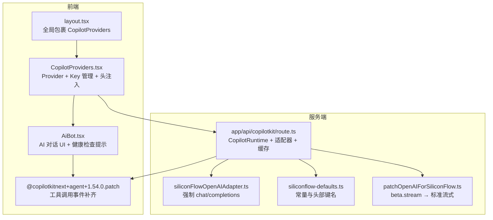
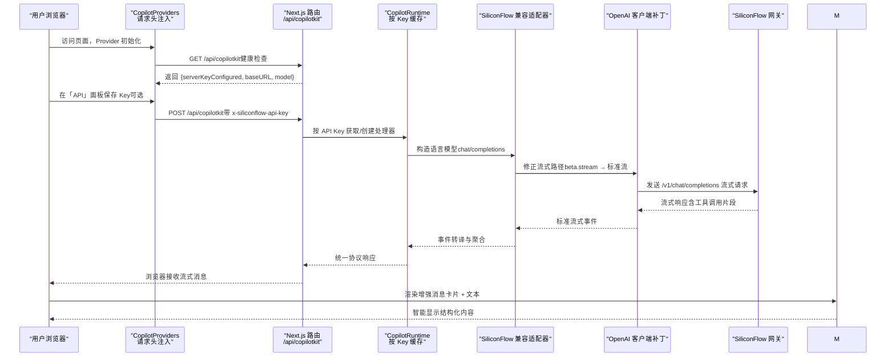
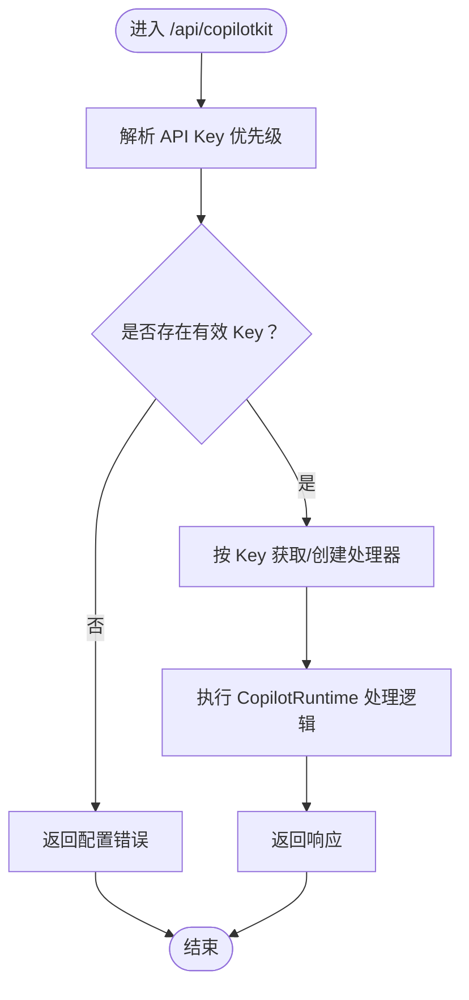
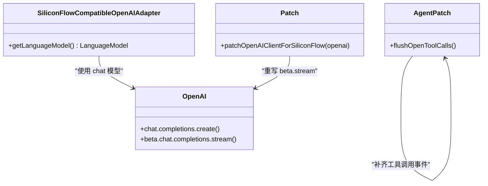
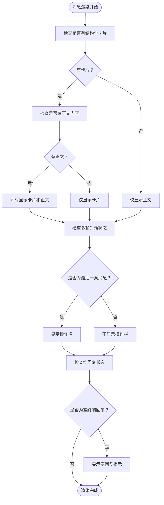
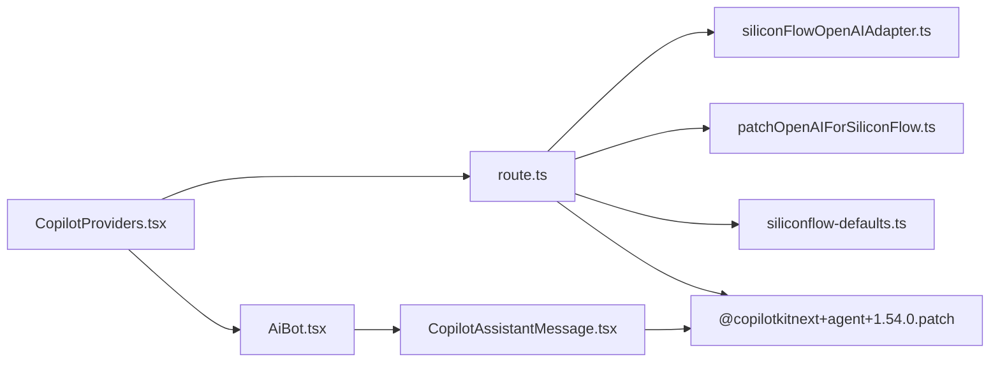

# CopilotKit 集成

<cite>
**本文引用的文件**
- [route.ts](file://app/api/copilotkit/route.ts)
- [CopilotProviders.tsx](file://components/CopilotProviders.tsx)
- [CopilotAssistantMessage.tsx](file://components/CopilotAssistantMessage.tsx)
- [AiBot.tsx](file://components/AiBot.tsx)
- [siliconFlowOpenAIAdapter.ts](file://lib/siliconFlowOpenAIAdapter.ts)
- [siliconflow-defaults.ts](file://lib/siliconflow-defaults.ts)
- [patchOpenAIForSiliconFlow.ts](file://lib/patchOpenAIForSiliconFlow.ts)
- [copilotLocalMemory.ts](file://lib/copilotLocalMemory.ts)
- [@copilotkitnext+agent+1.54.0.patch](file://patches/@copilotkitnext+agent+1.54.0.patch)
- [layout.tsx](file://app/layout.tsx)
- [page.tsx](file://app/page.tsx)
- [package.json](file://package.json)
- [README.md](file://README.md)
</cite>

## 更新摘要
**变更内容**
- 新增增强的消息渲染系统，支持结构化卡片与文本内容同时显示
- 改进多轮对话处理机制，优化连续助手消息的显示逻辑
- 实现空回复检测机制，防止出现空白回复气泡
- 增强复制功能，支持多轮对话内容的聚合复制

## 目录
1. [简介](#简介)
2. [项目结构](#项目结构)
3. [核心组件](#核心组件)
4. [架构总览](#架构总览)
5. [详细组件分析](#详细组件分析)
6. [消息渲染系统增强](#消息渲染系统增强)
7. [依赖关系分析](#依赖关系分析)
8. [性能考量](#性能考量)
9. [故障排查指南](#故障排查指南)
10. [结论](#结论)
11. [附录](#附录)

## 简介
本文件面向开发者，系统性说明 CopilotKit 在本项目中的集成方案与实现细节，涵盖以下方面：
- CopilotKit Provider 的配置与初始化流程，包括 API Key 管理、请求头设置与服务器配置检测机制
- 服务端代理 API 的实现细节：请求转发、响应处理与健康检查
- 硅基流动（SiliconFlow）API 的默认配置与环境变量管理策略
- CopilotKit 运行时的配置选项、安全注意事项与性能优化建议
- **新增**：增强的消息渲染系统，支持结构化卡片与文本内容同时显示
- **新增**：改进的多轮对话处理和空回复检测机制
- 实际代码示例与集成步骤，帮助快速正确地启用 AI 助手功能

## 项目结构
本项目采用 Next.js App Router 结构，AI 助手功能围绕 CopilotKit Provider 与服务端代理路由展开：
- 前端层：全局 Provider 包裹页面，负责 Key 管理、请求头注入与健康检查
- 服务端层：/api/copilotkit 路由作为 CopilotKit 运行时入口，对接 SiliconFlow 兼容网关
- 适配层：OpenAI 兼容适配器与 OpenAI 客户端补丁，确保流式协议与模型路径兼容
- **新增**：增强的消息渲染系统，支持结构化卡片与文本内容的智能显示

**图表来源**
- [layout.tsx:19-47](file://app/layout.tsx#L19-L47)
- [CopilotProviders.tsx:49-156](file://components/CopilotProviders.tsx#L49-L156)
- [route.ts:16-131](file://app/api/copilotkit/route.ts#L16-L131)
- [CopilotAssistantMessage.tsx:1-234](file://components/CopilotAssistantMessage.tsx#L1-L234)
- [siliconFlowOpenAIAdapter.ts:17-35](file://lib/siliconFlowOpenAIAdapter.ts#L17-L35)
- [siliconflow-defaults.ts:9-15](file://lib/siliconflow-defaults.ts#L9-L15)
- [patchOpenAIForSiliconFlow.ts:12-21](file://lib/patchOpenAIForSiliconFlow.ts#L12-L21)
- [@copilotkitnext+agent+1.54.0.patch:1-125](file://patches/@copilotkitnext+agent+1.54.0.patch#L1-L125)

**章节来源**
- [layout.tsx:19-47](file://app/layout.tsx#L19-L47)
- [page.tsx:11-29](file://app/page.tsx#L11-L29)
- [README.md:68-90](file://README.md#L68-L90)

## 核心组件
- CopilotKit Provider（前端）
  - 负责：运行时 URL 指向 /api/copilotkit、注入自定义请求头、禁用开发台、缓存用户 Key
  - 关键点：默认不将 Key 打包进前端；仅在用户面板保存时通过请求头携带；同时发起健康检查以判断服务端是否已配置 Key
- 服务端代理路由（后端）
  - 负责：解析 API Key 优先级、按 Key 缓存 CopilotRuntime 处理器、转发请求、健康检查
  - 关键点：支持 OPTIONS 预检；对 SiliconFlow 的 beta 流式路径做兼容；禁用并行工具调用以适配兼容网关
- OpenAI 兼容适配器与客户端补丁
  - 负责：强制使用 chat/completions 路径；将 beta.stream 代理到标准流式接口；补齐工具调用事件
- **新增**：增强的消息渲染系统
  - 负责：智能处理结构化卡片与文本内容的显示；支持多轮对话的连续消息渲染；检测空回复并提供用户提示
- 环境变量与默认值
  - 负责：SiliconFlow 基础地址、模型、API Key 的优先级解析与兜底

**章节来源**
- [CopilotProviders.tsx:49-156](file://components/CopilotProviders.tsx#L49-L156)
- [route.ts:16-131](file://app/api/copilotkit/route.ts#L16-L131)
- [CopilotAssistantMessage.tsx:1-234](file://components/CopilotAssistantMessage.tsx#L1-L234)
- [siliconFlowOpenAIAdapter.ts:17-35](file://lib/siliconFlowOpenAIAdapter.ts#L17-L35)
- [patchOpenAIForSiliconFlow.ts:12-21](file://lib/patchOpenAIForSiliconFlow.ts#L12-L21)
- [siliconflow-defaults.ts:9-15](file://lib/siliconflow-defaults.ts#L9-L15)

## 架构总览
下图展示了从浏览器到服务端、再到 SiliconFlow 的完整链路，以及关键的兼容性处理与缓存策略。

**图表来源**
- [route.ts:16-131](file://app/api/copilotkit/route.ts#L16-L131)
- [CopilotProviders.tsx:49-156](file://components/CopilotProviders.tsx#L49-L156)
- [CopilotAssistantMessage.tsx:1-234](file://components/CopilotAssistantMessage.tsx#L1-L234)
- [siliconFlowOpenAIAdapter.ts:17-35](file://lib/siliconFlowOpenAIAdapter.ts#L17-L35)
- [patchOpenAIForSiliconFlow.ts:12-21](file://lib/patchOpenAIForSiliconFlow.ts#L12-L21)

## 详细组件分析

### 1) CopilotKit Provider 配置与初始化
- 运行时配置
  - runtimeUrl 指向 /api/copilotkit
  - 禁用 Inspector 与开发台，避免本地调试干扰
  - 通过 headers 注入自定义 API Key 请求头
- API Key 管理
  - 优先使用用户面板保存的 Key（localStorage），否则尝试 NEXT_PUBLIC_SILICONFLOW_API_KEY（构建期注入，不推荐）
  - 若均无，则不注入头，交由服务端从环境变量读取
- 健康检查
  - 启动时拉取 /api/copilotkit，解析 serverKeyConfigured，决定是否显示「需要配置 Key」的提示
- 错误处理
  - 对 CopilotKit 底层可能返回空 Content-Length 的情况做兜底，返回合法 JSON，避免解析异常

**章节来源**
- [CopilotProviders.tsx:49-156](file://components/CopilotProviders.tsx#L49-L156)
- [AiBot.tsx:1741-1803](file://components/AiBot.tsx#L1741-L1803)

### 2) 服务端代理 API 实现
- 基础配置
  - baseURL 默认指向 SiliconFlow 官方 v1 接口，可通过 SILICONFLOW_BASE_URL 覆盖
  - 默认模型为 Qwen/Qwen3-14B，可通过 SILICONFLOW_MODEL 覆盖
- API Key 解析优先级（服务端）
  - 请求头（用户在面板保存的 Key）> 环境变量 SILICONFLOW_API_KEY > 代码内默认值
  - 任一可用即用于构造 OpenAI 客户端与适配器
- 处理器缓存
  - 按 API Key 缓存 Hono 处理器，避免重复创建 CopilotRuntime，提升稳定性与性能
- 请求处理
  - 支持 POST 与 OPTIONS（跨域预检）
  - 未配置有效 Key 时返回明确错误
- 健康检查
  - GET /api/copilotkit 返回服务端配置状态、baseURL、model 与提示信息

**图表来源**
- [route.ts:27-131](file://app/api/copilotkit/route.ts#L27-L131)

**章节来源**
- [route.ts:16-131](file://app/api/copilotkit/route.ts#L16-L131)

### 3) 硅基流动 API 的默认配置与环境变量管理
- 默认值与常量
  - 默认 baseURL：https://api.siliconflow.cn/v1
  - 默认模型：Qwen/Qwen3-14B
  - 默认 API Key 常量（不建议在公开仓库使用）
- 环境变量
  - SILICONFLOW_API_KEY：服务端主 Key
  - SILICONFLOW_MODEL：模型名称
  - SILICONFLOW_BASE_URL：网关基础地址
  - NEXT_PUBLIC_SILICONFLOW_API_KEY：仅限构建期注入（不推荐）
- 优先级与安全
  - 前端默认不携带 Key，避免泄露
  - 仅在用户面板保存 Key 时才通过请求头携带
  - 生产部署建议在 Vercel 等平台配置环境变量，访客无需手动填写

**章节来源**
- [route.ts:16-25](file://app/api/copilotkit/route.ts#L16-L25)
- [siliconflow-defaults.ts:9-15](file://lib/siliconflow-defaults.ts#L9-L15)
- [README.md:12-23](file://README.md#L12-L23)

### 4) OpenAI 兼容适配器与客户端补丁
- 适配器（SiliconFlowCompatibleOpenAIAdapter）
  - 将默认 Responses API 路径切换为 Chat Completions，与 SiliconFlow 兼容网关一致
- 客户端补丁（patchOpenAIClientForSiliconFlow）
  - 将 OpenAI 的 beta.stream 代理到标准流式接口，解决兼容网关不支持 /v1/beta/chat/completions 的问题
- 工具调用事件补齐（@copilotkitnext+agent+1.54.0.patch）
  - 针对部分兼容网关仅流式 tool-input-* 而不发最终 tool-call 的情况，在 RUN_FINISHED 前补齐 TOOL_CALL_END 事件

**图表来源**
- [siliconFlowOpenAIAdapter.ts:17-35](file://lib/siliconFlowOpenAIAdapter.ts#L17-L35)
- [patchOpenAIForSiliconFlow.ts:12-21](file://lib/patchOpenAIForSiliconFlow.ts#L12-L21)
- [@copilotkitnext+agent+1.54.0.patch:87-125](file://patches/@copilotkitnext+agent+1.54.0.patch#L87-L125)

**章节来源**
- [siliconFlowOpenAIAdapter.ts:17-35](file://lib/siliconFlowOpenAIAdapter.ts#L17-L35)
- [patchOpenAIForSiliconFlow.ts:12-21](file://lib/patchOpenAIForSiliconFlow.ts#L12-L21)
- [@copilotkitnext+agent+1.54.0.patch:87-125](file://patches/@copilotkitnext+agent+1.54.0.patch#L87-L125)

### 5) 运行时配置选项、安全与性能
- 运行时配置选项
  - runtimeUrl："/api/copilotkit"
  - enableInspector：false
  - showDevConsole：false（避免本地调试弹窗干扰）
  - headers：按需注入 x-siliconflow-api-key
- 安全考虑
  - 前端默认不携带 Key，避免打包泄露
  - 用户 Key 仅在面板保存后通过请求头携带，且仅在 HTTPS 下使用
  - 服务端优先使用环境变量，避免硬编码
- 性能优化
  - 按 API Key 缓存处理器，避免重复初始化 CopilotRuntime
  - 使用标准流式接口，减少中间层转换开销
  - 禁用并行工具调用，降低兼容网关压力

**章节来源**
- [CopilotProviders.tsx:146-151](file://components/CopilotProviders.tsx#L146-L151)
- [route.ts:46-95](file://app/api/copilotkit/route.ts#L46-L95)

## 消息渲染系统增强

### 1) 结构化卡片与文本内容同时显示
- **智能布局策略**：当消息包含结构化卡片（generativeUI）时，卡片与助手正文会同时展示
- **位置控制**：通过 generativeUIPosition 属性控制卡片在正文前或后显示
- **显示条件**：只要有模型正文就展示气泡，避免因存在卡片而隐藏正文导致空白气泡
- **工具专用布局**：仅当本回合无正文且仅有卡片时，才只显示卡片

### 2) 多轮对话处理机制
- **连续助手消息聚合**：CopilotKit 在一次回复里可能连续插入多条 role=assistant 的消息
- **操作栏显示策略**：仅在「连续助手段」的最后一条展示操作栏，避免重复显示
- **复制功能增强**：复制会拼接该段内所有助手消息的文本，视为一次完整回复
- **轮次识别**：通过查找用户消息（role=user）来确定多轮对话的开始和结束

### 3) 空回复检测机制
- **终端回复检测****：检测本段结束、无卡片、无文字的状态
- **状态判断**：检查是否有后续可显示的助手消息、是否处于加载状态、是否正在生成
- **用户提示**：当检测到空终端回复时，显示友好的提示信息，建议重新生成或换种问法
- **防止空白气泡**：确保每轮回复都有可见内容，避免出现完全空白的回复气泡

### 4) 消息收集与复制优化
- **轮次文本聚合**：按「一轮回复（直到下一条 user）」聚合助手正文
- **智能复制**：优先使用轮次内的完整文本进行复制，确保复制内容的完整性
- **回退机制**：如果轮次文本为空，则回退到原始消息内容

**图表来源**
- [CopilotAssistantMessage.tsx:136-149](file://components/CopilotAssistantMessage.tsx#L136-L149)

**章节来源**
- [CopilotAssistantMessage.tsx:1-234](file://components/CopilotAssistantMessage.tsx#L1-L234)

## 依赖关系分析
- 组件耦合
  - 前端 Provider 与路由之间通过 runtimeUrl 与 headers 解耦
  - 路由与适配器、补丁之间通过 OpenAI 客户端与 CopilotRuntime 紧密协作
  - **新增**：消息渲染组件与 AI Bot 组件协同工作，提供增强的用户体验
- 外部依赖
  - @copilotkit/react-core、@copilotkit/react-ui、@copilotkit/react-ui、@copilotkit/runtime、@copilotkit/runtime-client-gql
  - @ai-sdk/openai、openai
  - **新增**：@copilotkitnext/agent（工具调用事件补齐）
- 潜在循环依赖
  - 无直接循环；各模块职责清晰，通过函数与类边界隔离

**图表来源**
- [package.json:12-20](file://package.json#L12-L20)
- [route.ts:2-14](file://app/api/copilotkit/route.ts#L2-L14)

**章节来源**
- [package.json:12-20](file://package.json#L12-L20)
- [route.ts:2-14](file://app/api/copilotkit/route.ts#L2-L14)

## 性能考量
- 处理器缓存：按 Key 缓存 Hono 处理器，显著降低初始化成本
- 流式协议：统一走标准 /v1/chat/completions，减少路径转换与中间层开销
- 工具调用：禁用并行工具调用，避免兼容网关并发压力
- 健康检查：前端仅在首次渲染时拉取一次健康检查，避免频繁请求
- 构建期注入：NEXT_PUBLIC_SILICONFLOW_API_KEY 仅用于调试，不建议在生产使用
- **新增**：消息渲染优化：通过智能检测避免不必要的 DOM 操作，提升渲染性能

## 故障排查指南
- 常见错误与定位
  - AI_APICallError: Not Found
    - 可能原因：模型 ID 已下线或拼写错误；兼容网关不支持 /v1/responses
    - 解决方案：核对 SILICONFLOW_MODEL；使用本仓库的适配器与补丁
  - 无法对话或提示「需要配置 Key」
    - 可能原因：服务端未配置 SILICONFLOW_API_KEY 且无默认兜底
    - 解决方案：在 .env.local 或 Vercel 环境变量中配置；或在面板保存 Key
  - **新增**：空回复问题
    - 可能原因：模型未返回任何内容或流式异常
    - 解决方案：检查模型配置；查看空回复检测机制是否正常工作
  - **新增**：卡片显示异常
    - 可能原因：结构化卡片组件渲染失败或位置配置错误
    - 解决方案：检查 generativeUI 函数和 generativeUIPosition 配置
- 健康检查
  - GET /api/copilotkit 返回 {serverKeyConfigured}，前端据此决定是否显示 Key 输入面板
- 开发台干扰
  - showDevConsole 必须为 false，避免本地调试弹窗导致的异常提示

**章节来源**
- [README.md:25-30](file://README.md#L25-L30)
- [route.ts:120-131](file://app/api/copilotkit/route.ts#L120-L131)
- [CopilotProviders.tsx:90-113](file://components/CopilotProviders.tsx#L90-L113)

## 结论
本项目通过 Provider + 服务端代理 + 兼容适配器 + 客户端补丁的组合，实现了与 SiliconFlow 的稳定对接。其设计强调：
- 安全性：前端默认不携带 Key，Key 优先从服务端环境变量读取
- 兼容性：统一走标准流式接口，补齐工具调用事件，适配多种兼容网关
- 性能：按 Key 缓存处理器，减少初始化开销
- 可运维性：提供健康检查与明确的错误提示，便于快速定位问题
- **新增**：增强的用户体验：智能的消息渲染系统支持结构化卡片与文本内容的优雅显示，改进的多轮对话处理机制，以及完善的空回复检测

## 附录

### A. 集成步骤（开发者指南）
- 步骤 1：配置环境变量
  - 在本地 .env.local 或 Vercel 环境变量中设置：
    - SILICONFLOW_API_KEY
    - SILICONFLOW_MODEL（可选，默认 Qwen/Qwen3-14B）
    - SILICONFLOW_BASE_URL（可选，默认 https://api.siliconflow.cn/v1）
- 步骤 2：启动应用
  - 运行 npm run dev，访问 http://localhost:3000
- 步骤 3：验证健康检查
  - GET /api/copilotkit，确认返回 {serverKeyConfigured, baseURL, model}
- 步骤 4：可选，面板保存 Key
  - 在 AI Bot 的「API」面板输入并保存 Key，刷新后将通过请求头携带
- **新增**：验证消息渲染
  - 确认结构化卡片与文本内容能够同时显示
  - 测试多轮对话的连续消息渲染
  - 验证空回复检测机制正常工作

**章节来源**
- [README.md:12-23](file://README.md#L12-L23)
- [route.ts:120-131](file://app/api/copilotkit/route.ts#L120-L131)
- [CopilotProviders.tsx:115-124](file://components/CopilotProviders.tsx#L115-L124)

### B. 关键配置清单
- 服务端
  - SILICONFLOW_API_KEY：服务端主 Key
  - SILICONFLOW_MODEL：模型名称
  - SILICONFLOW_BASE_URL：网关基础地址
- 前端
  - x-siliconflow-api-key：请求头键名
  - siliconflow_api_key：浏览器存储键名
  - NEXT_PUBLIC_SILICONFLOW_API_KEY：仅限构建期注入（不推荐）
- **新增**：消息渲染配置
  - generativeUI：结构化卡片渲染函数
  - generativeUIPosition：卡片显示位置（before/after）
  - showMarkdownBubble：是否显示 Markdown 气泡
  - toolsOnlyLayout：仅工具卡片布局

**章节来源**
- [siliconflow-defaults.ts:9-15](file://lib/siliconflow-defaults.ts#L9-L15)
- [route.ts:16-25](file://app/api/copilotkit/route.ts#L16-L25)
- [CopilotAssistantMessage.tsx:127-134](file://components/CopilotAssistantMessage.tsx#L127-L134)