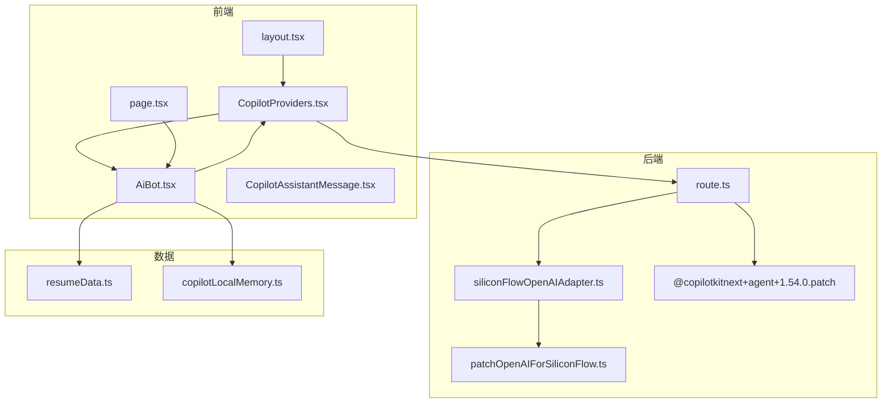
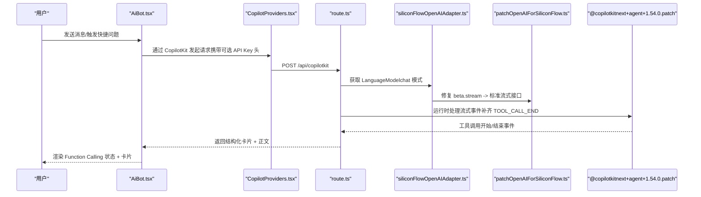
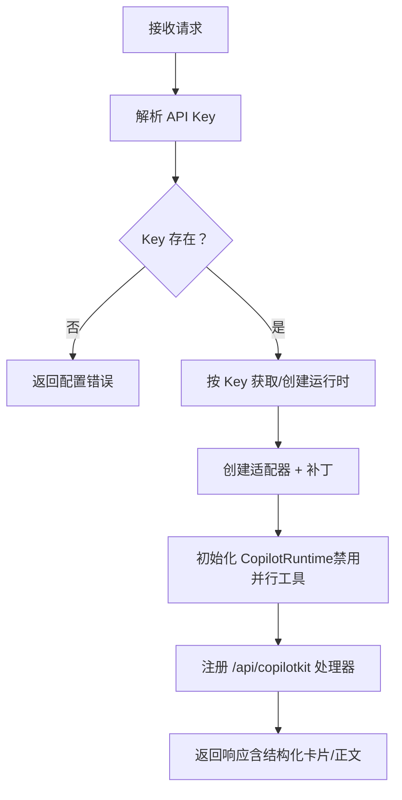
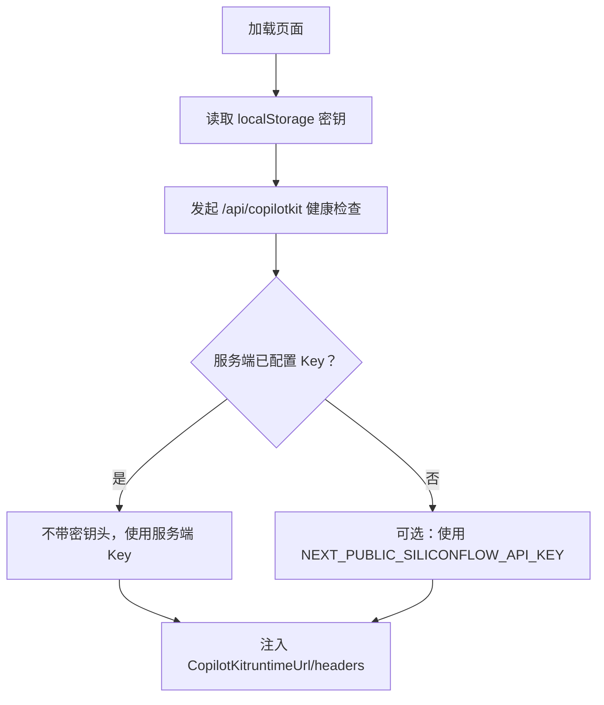
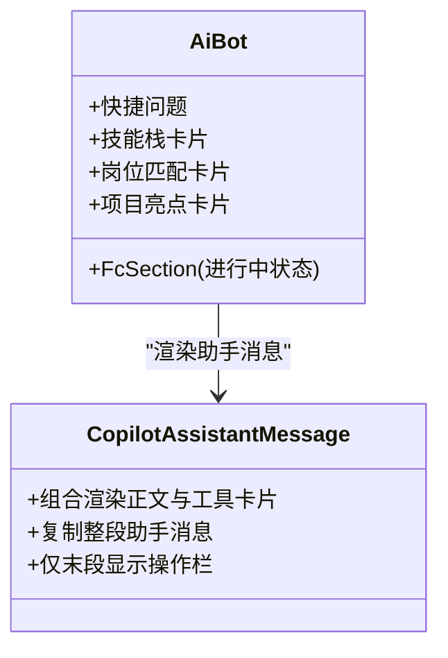
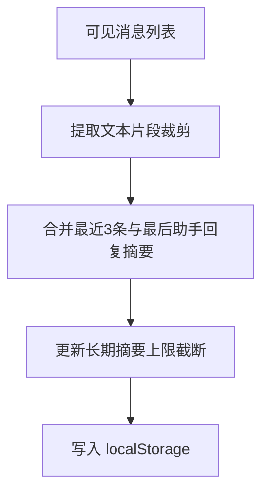
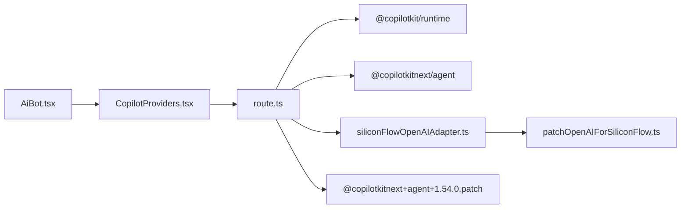

# Function Calling 功能

<cite>
**本文引用的文件**
- [route.ts](file://app/api/copilotkit/route.ts)
- [AiBot.tsx](file://components/AiBot.tsx)
- [CopilotProviders.tsx](file://components/CopilotProviders.tsx)
- [CopilotAssistantMessage.tsx](file://components/CopilotAssistantMessage.tsx)
- [siliconFlowOpenAIAdapter.ts](file://lib/siliconFlowOpenAIAdapter.ts)
- [patchOpenAIForSiliconFlow.ts](file://lib/patchOpenAIForSiliconFlow.ts)
- [@copilotkitnext+agent+1.54.0.patch](file://patches/@copilotkitnext+agent+1.54.0.patch)
- [resumeData.ts](file://lib/resumeData.ts)
- [copilotLocalMemory.ts](file://lib/copilotLocalMemory.ts)
- [layout.tsx](file://app/layout.tsx)
- [page.tsx](file://app/page.tsx)
- [package.json](file://package.json)
</cite>

## 目录
1. [简介](#简介)
2. [项目结构](#项目结构)
3. [核心组件](#核心组件)
4. [架构总览](#架构总览)
5. [组件详解](#组件详解)
6. [依赖关系分析](#依赖关系分析)
7. [性能考量](#性能考量)
8. [故障排查指南](#故障排查指南)
9. [结论](#结论)
10. [附录：函数扩展指南](#附录函数扩展指南)

## 简介
本文件围绕 Function Calling（函数调用）能力，系统化阐述 AI 助手如何通过 Function Calling 与应用交互，涵盖函数定义、参数传递、结果处理、状态管理、执行流程与错误处理，并给出扩展新函数的最佳实践与参考路径。项目基于 Next.js 与 CopilotKit，结合 SiliconFlow 兼容网关，实现了“技能展示”“岗位匹配”“项目导航”等核心功能的结构化卡片输出与交互。

## 项目结构
- 前端渲染与 UI
  - 页面布局与根组件：[layout.tsx](file://app/layout.tsx)、[page.tsx](file://app/page.tsx)
  - AI 助手与聊天 UI：[AiBot.tsx](file://components/AiBot.tsx)、[CopilotAssistantMessage.tsx](file://components/CopilotAssistantMessage.tsx)
  - Provider 与密钥管理：[CopilotProviders.tsx](file://components/CopilotProviders.tsx)
- 后端运行时与适配
  - CopilotKit 路由与运行时：[route.ts](file://app/api/copilotkit/route.ts)
  - OpenAI 兼容适配与补丁：[siliconFlowOpenAIAdapter.ts](file://lib/siliconFlowOpenAIAdapter.ts)、[patchOpenAIForSiliconFlow.ts](file://lib/patchOpenAIForSiliconFlow.ts)
  - 依赖与版本：[package.json](file://package.json)
- 数据与记忆
  - 知识库与结构化数据：[resumeData.ts](file://lib/resumeData.ts)
  - 本地对话记忆：[copilotLocalMemory.ts](file://lib/copilotLocalMemory.ts)

**图表来源**
- [layout.tsx:19-47](file://app/layout.tsx#L19-L47)
- [page.tsx:11-29](file://app/page.tsx#L11-L29)
- [CopilotProviders.tsx:49-156](file://components/CopilotProviders.tsx#L49-L156)
- [AiBot.tsx:1-120](file://components/AiBot.tsx#L1-L120)
- [CopilotAssistantMessage.tsx:37-195](file://components/CopilotAssistantMessage.tsx#L37-L195)
- [route.ts:16-95](file://app/api/copilotkit/route.ts#L16-L95)
- [siliconFlowOpenAIAdapter.ts:17-35](file://lib/siliconFlowOpenAIAdapter.ts#L17-L35)
- [patchOpenAIForSiliconFlow.ts:12-21](file://lib/patchOpenAIForSiliconFlow.ts#L12-L21)
- [@copilotkitnext+agent+1.54.0.patch:1-125](file://patches/@copilotkitnext+agent+1.54.0.patch#L1-L125)
- [resumeData.ts:5-263](file://lib/resumeData.ts#L5-L263)
- [copilotLocalMemory.ts:21-77](file://lib/copilotLocalMemory.ts#L21-L77)

**章节来源**
- [layout.tsx:19-47](file://app/layout.tsx#L19-L47)
- [page.tsx:11-29](file://app/page.tsx#L11-L29)
- [CopilotProviders.tsx:49-156](file://components/CopilotProviders.tsx#L49-L156)
- [AiBot.tsx:1-120](file://components/AiBot.tsx#L1-L120)
- [CopilotAssistantMessage.tsx:37-195](file://components/CopilotAssistantMessage.tsx#L37-L195)
- [route.ts:16-95](file://app/api/copilotkit/route.ts#L16-L95)
- [siliconFlowOpenAIAdapter.ts:17-35](file://lib/siliconFlowOpenAIAdapter.ts#L17-L35)
- [patchOpenAIForSiliconFlow.ts:12-21](file://lib/patchOpenAIForSiliconFlow.ts#L12-L21)
- [@copilotkitnext+agent+1.54.0.patch:1-125](file://patches/@copilotkitnext+agent+1.54.0.patch#L1-L125)
- [resumeData.ts:5-263](file://lib/resumeData.ts#L5-L263)
- [copilotLocalMemory.ts:21-77](file://lib/copilotLocalMemory.ts#L21-L77)

## 核心组件
- 后端运行时与路由
  - 路由负责解析 API Key、缓存运行时、装配 CopilotKit 运行时与适配器，并暴露 /api/copilotkit 接口。
  - 关键点：禁用并行工具调用、适配 SiliconFlow 的流式接口、在特定网关下补齐 TOOL_CALL_END 事件。
- 前端 Provider 与密钥管理
  - 统一注入 CopilotKit 运行时 URL、可选的用户自定义 API Key 头、健康检查与 fetch 修复。
- AI 助手与消息渲染
  - 提供快捷问题、结构化卡片（技能栈、岗位匹配、项目亮点）、Function Calling 执行状态提示。
  - 自定义助手消息组件支持“工具卡片 + 正文”的组合渲染与复制整段回复。
- 数据与记忆
  - resumeData.ts 提供结构化知识库；copilotLocalMemory.ts 提供本地对话记忆持久化与摘要合并。

**章节来源**
- [route.ts:16-95](file://app/api/copilotkit/route.ts#L16-L95)
- [CopilotProviders.tsx:49-156](file://components/CopilotProviders.tsx#L49-L156)
- [AiBot.tsx:34-711](file://components/AiBot.tsx#L34-L711)
- [CopilotAssistantMessage.tsx:37-195](file://components/CopilotAssistantMessage.tsx#L37-L195)
- [resumeData.ts:5-263](file://lib/resumeData.ts#L5-L263)
- [copilotLocalMemory.ts:21-77](file://lib/copilotLocalMemory.ts#L21-L77)

## 架构总览
Function Calling 的端到端流程如下：
- 前端通过 CopilotProviders 注入运行时与可选 API Key 头，访问 /api/copilotkit。
- 后端根据 API Key 缓存运行时，使用 SiliconFlow 兼容适配器与补丁，确保流式 chat/completions 协议一致。
- 运行时内置 Agent 在需要时触发工具调用（如生成技能栈卡片、岗位匹配卡片、导航到项目页）。
- 工具调用期间，前端显示“Function Calling 进行中”状态条；工具结束后，渲染结构化卡片与后续正文。

**图表来源**
- [route.ts:52-95](file://app/api/copilotkit/route.ts#L52-L95)
- [siliconFlowOpenAIAdapter.ts:22-34](file://lib/siliconFlowOpenAIAdapter.ts#L22-L34)
- [patchOpenAIForSiliconFlow.ts:12-21](file://lib/patchOpenAIForSiliconFlow.ts#L12-L21)
- [@copilotkitnext+agent+1.54.0.patch:87-99](file://patches/@copilotkitnext+agent+1.54.0.patch#L87-L99)
- [AiBot.tsx:713-757](file://components/AiBot.tsx#L713-L757)

**章节来源**
- [route.ts:52-95](file://app/api/copilotkit/route.ts#L52-L95)
- [siliconFlowOpenAIAdapter.ts:22-34](file://lib/siliconFlowOpenAIAdapter.ts#L22-L34)
- [patchOpenAIForSiliconFlow.ts:12-21](file://lib/patchOpenAIForSiliconFlow.ts#L12-L21)
- [@copilotkitnext+agent+1.54.0.patch:87-99](file://patches/@copilotkitnext+agent+1.54.0.patch#L87-L99)
- [AiBot.tsx:713-757](file://components/AiBot.tsx#L713-L757)

## 组件详解

### 后端运行时与路由（route.ts）
- API Key 解析优先级：请求头 > 环境变量 > 代码兜底。
- 运行时缓存：按 API Key 缓存 Hono 处理器，避免重复初始化。
- 适配器与补丁：
  - 使用 SiliconFlow 兼容适配器，强制使用 chat 模式以适配网关。
  - 通过补丁将 beta.stream 代理到标准流式接口。
- 并行工具调用：显式关闭 parallelToolCalls，避免网关不支持导致的校验失败。
- 事件补齐：在 RUN_FINISHED 前补齐 TOOL_CALL_END，防止“仍有活动工具调用”的错误。

**图表来源**
- [route.ts:30-95](file://app/api/copilotkit/route.ts#L30-L95)

**章节来源**
- [route.ts:30-95](file://app/api/copilotkit/route.ts#L30-L95)

### 前端 Provider 与密钥管理（CopilotProviders.tsx）
- 用户密钥：支持在“API”面板保存密钥（localStorage），优先用于请求头。
- 服务端兜底：GET /api/copilotkit 健康检查，判断服务端是否已配置 Key。
- fetch 修复：针对 CopilotKit 返回空内容长度时，返回合法 JSON，避免底层语法错误。
- 运行时注入：设置 runtimeUrl、enableInspector、showDevConsole、headers。

**图表来源**
- [CopilotProviders.tsx:49-156](file://components/CopilotProviders.tsx#L49-L156)

**章节来源**
- [CopilotProviders.tsx:49-156](file://components/CopilotProviders.tsx#L49-L156)

### AI 助手与消息渲染（AiBot.tsx 与 CopilotAssistantMessage.tsx）
- 结构化卡片：
  - 技能栈卡片：展示核心技术栈与交付数据，支持跳转到项目页。
  - 岗位匹配卡片：展示综合匹配度与维度得分，支持联系信息与锚点跳转。
  - 项目亮点卡片：展示项目指标与 STAR 拆解入口。
- Function Calling 状态：
  - “进行中”状态条（橙色闪烁），提示工具调用正在进行。
- 助手消息渲染：
  - 支持“工具卡片 + 正文”组合渲染，复制整段回复时合并连续助手消息。
  - 仅在连续助手消息的最后一段显示操作栏（复制/再生/点赞/踩）。

**图表来源**
- [AiBot.tsx:34-711](file://components/AiBot.tsx#L34-L711)
- [CopilotAssistantMessage.tsx:37-195](file://components/CopilotAssistantMessage.tsx#L37-L195)

**章节来源**
- [AiBot.tsx:34-711](file://components/AiBot.tsx#L34-L711)
- [CopilotAssistantMessage.tsx:37-195](file://components/CopilotAssistantMessage.tsx#L37-L195)

### 数据与记忆（resumeData.ts 与 copilotLocalMemory.ts）
- resumeData.ts
  - 提供基础信息、教育背景、项目与经验、技能、AI 笔记观点、岗位匹配与技能卡片数据。
  - 作为知识库注入到模型上下文中，支撑 Function Calling 的结构化输出。
- copilotLocalMemory.ts
  - 本地持久化最近消息摘要与长期摘要，随新回复滚动更新。
  - 用于增强上下文，帮助模型在多轮对话中保持一致性。

**图表来源**
- [copilotLocalMemory.ts:57-77](file://lib/copilotLocalMemory.ts#L57-L77)

**章节来源**
- [resumeData.ts:5-263](file://lib/resumeData.ts#L5-L263)
- [copilotLocalMemory.ts:57-77](file://lib/copilotLocalMemory.ts#L57-L77)

## 依赖关系分析
- 运行时与适配
  - route.ts 依赖 @copilotkit/runtime、@copilotkitnext/agent、SiliconFlow 兼容适配器与补丁。
  - 适配器强制使用 chat 模式，补丁将 beta.stream 代理到标准流式接口。
- 前后端耦合
  - 前端通过 CopilotProviders 注入 runtimeUrl 与 headers，后端据此选择 API Key 与模型。
- 错误与兼容
  - 网关差异导致的 404 或缺少 TOOL_CALL_END 事件，通过补丁与运行时选项规避。

**图表来源**
- [route.ts:2-14](file://app/api/copilotkit/route.ts#L2-L14)
- [siliconFlowOpenAIAdapter.ts:1-8](file://lib/siliconFlowOpenAIAdapter.ts#L1-L8)
- [patchOpenAIForSiliconFlow.ts:1-21](file://lib/patchOpenAIForSiliconFlow.ts#L1-L21)
- [CopilotProviders.tsx:12-151](file://components/CopilotProviders.tsx#L12-L151)
- [AiBot.tsx:1-14](file://components/AiBot.tsx#L1-L14)

**章节来源**
- [route.ts:2-14](file://app/api/copilotkit/route.ts#L2-L14)
- [siliconFlowOpenAIAdapter.ts:1-8](file://lib/siliconFlowOpenAIAdapter.ts#L1-L8)
- [patchOpenAIForSiliconFlow.ts:1-21](file://lib/patchOpenAIForSiliconFlow.ts#L1-L21)
- [CopilotProviders.tsx:12-151](file://components/CopilotProviders.tsx#L12-L151)
- [AiBot.tsx:1-14](file://components/AiBot.tsx#L1-L14)

## 性能考量
- 运行时缓存：按 API Key 缓存处理器，避免重复初始化，提升响应速度与稳定性。
- 禁用并行工具：减少并发开销与网关压力，避免校验失败。
- 本地记忆：仅存储必要片段与摘要，控制内存占用与序列化成本。
- 流式协议适配：统一走标准 chat/completions 流式接口，减少中间层转换。

[本节为通用性能讨论，不直接分析具体文件]

## 故障排查指南
- 未配置有效 API Key
  - 现象：后端返回配置错误。
  - 处理：在“API”面板保存密钥或设置环境变量。
  - 参考：[route.ts:100-114](file://app/api/copilotkit/route.ts#L100-L114)
- “仍有活动工具调用”
  - 现象：RUN_FINISHED 前 TOOL_CALL_END 未到达。
  - 处理：启用补丁补齐 TOOL_CALL_END；确认禁用并行工具。
  - 参考：[@copilotkitnext+agent+1.54.0.patch:87-99](file://patches/@copilotkitnext+agent+1.54.0.patch#L87-L99)
- 网关 404（Not Found）
  - 现象：调用 beta 路径或 Responses API。
  - 处理：使用 chat 模式适配器与补丁，确保走标准流式接口。
  - 参考：[siliconFlowOpenAIAdapter.ts:22-34](file://lib/siliconFlowOpenAIAdapter.ts#L22-L34)、[patchOpenAIForSiliconFlow.ts:12-21](file://lib/patchOpenAIForSiliconFlow.ts#L12-L21)
- 空响应导致解析错误
  - 现象：Content-Length: 0 导致 JSON 解析异常。
  - 处理：Provider 中对 /api/copilotkit 的响应进行修复，返回合法 JSON。
  - 参考：[CopilotProviders.tsx:64-87](file://components/CopilotProviders.tsx#L64-L87)

**章节来源**
- [route.ts:100-114](file://app/api/copilotkit/route.ts#L100-L114)
- [@copilotkitnext+agent+1.54.0.patch:87-99](file://patches/@copilotkitnext+agent+1.54.0.patch#L87-L99)
- [siliconFlowOpenAIAdapter.ts:22-34](file://lib/siliconFlowOpenAIAdapter.ts#L22-L34)
- [patchOpenAIForSiliconFlow.ts:12-21](file://lib/patchOpenAIForSiliconFlow.ts#L12-L21)
- [CopilotProviders.tsx:64-87](file://components/CopilotProviders.tsx#L64-L87)

## 结论
本项目通过 CopilotKit 与 SiliconFlow 兼容适配，实现了稳定的 Function Calling 能力。后端按 API Key 缓存运行时、禁用并行工具、补齐 TOOL_CALL_END 事件；前端提供结构化卡片与流畅的消息渲染。结合 resumeData 与本地记忆，AI 助手能够高质量地输出“技能展示”“岗位匹配”“项目导航”等业务结果，满足交互体验与功能需求。

[本节为总结，不直接分析具体文件]

## 附录：函数扩展指南

### 新增 Function Calling 函数的步骤
- 定义函数签名与参数
  - 在后端运行时中注册工具函数，明确名称、描述与参数 Schema。
  - 参考：[route.ts:73-84](file://app/api/copilotkit/route.ts#L73-L84)
- 实现函数逻辑
  - 在工具函数内部读取参数、访问数据源（如 resumeData.ts）、生成结构化结果。
  - 参考：[resumeData.ts:5-263](file://lib/resumeData.ts#L5-L263)
- 渲染结构化卡片
  - 在前端 AiBot.tsx 中新增对应卡片组件，遵循现有样式与交互。
  - 参考：[AiBot.tsx:66-711](file://components/AiBot.tsx#L66-L711)
- 状态与错误处理
  - 显示“Function Calling 进行中”状态条；在工具结束后渲染卡片与正文。
  - 参考：[AiBot.tsx:713-757](file://components/AiBot.tsx#L713-L757)
- 兼容性与稳定性
  - 确保使用 chat 模式适配器与补丁，避免网关差异导致的错误。
  - 参考：[siliconFlowOpenAIAdapter.ts:22-34](file://lib/siliconFlowOpenAIAdapter.ts#L22-L34)、[patchOpenAIForSiliconFlow.ts:12-21](file://lib/patchOpenAIForSiliconFlow.ts#L12-L21)
- 最佳实践
  - 参数尽量结构化、可验证；返回内容可复制；长文本进行摘要与裁剪；保持前后端一致的错误提示。

**章节来源**
- [route.ts:73-84](file://app/api/copilotkit/route.ts#L73-L84)
- [resumeData.ts:5-263](file://lib/resumeData.ts#L5-L263)
- [AiBot.tsx:66-757](file://components/AiBot.tsx#L66-L757)
- [siliconFlowOpenAIAdapter.ts:22-34](file://lib/siliconFlowOpenAIAdapter.ts#L22-L34)
- [patchOpenAIForSiliconFlow.ts:12-21](file://lib/patchOpenAIForSiliconFlow.ts#L12-L21)