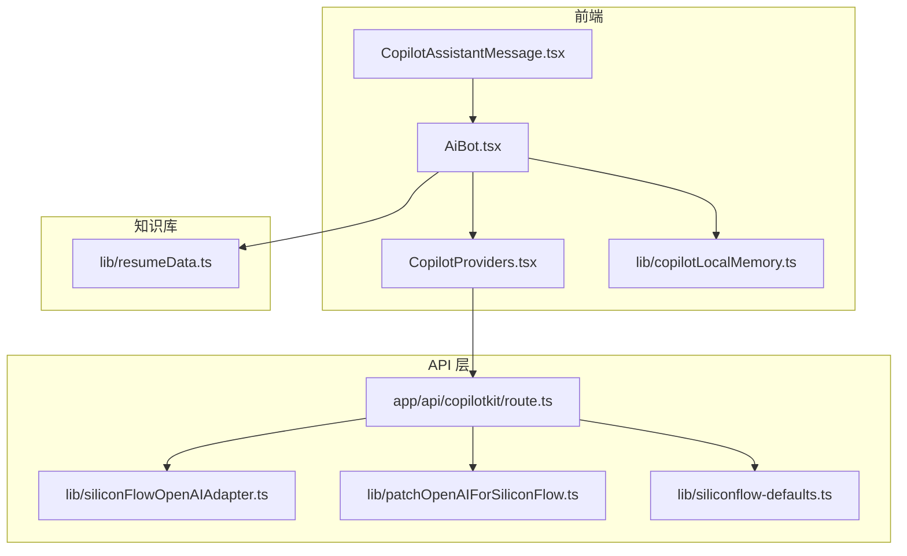
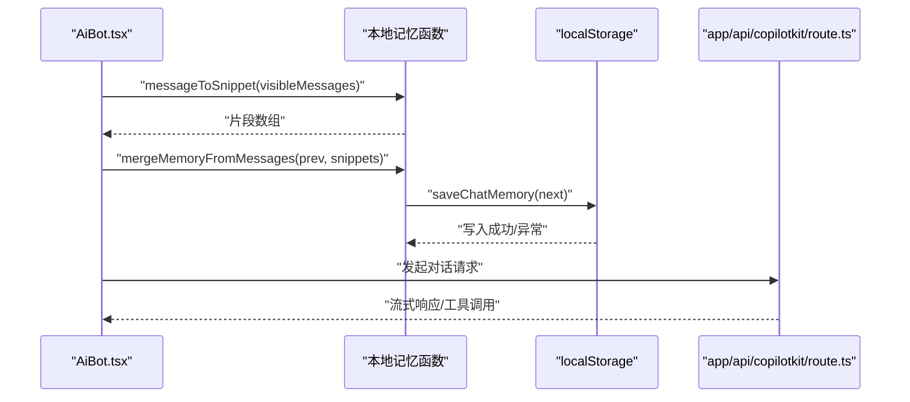
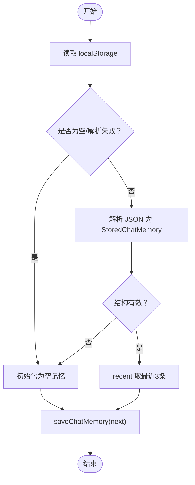
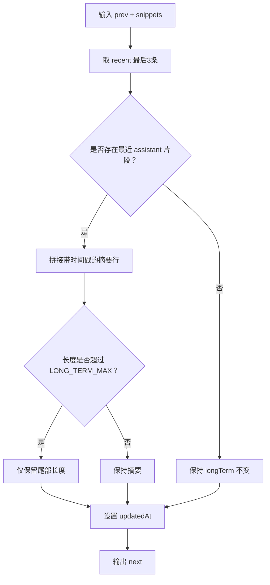
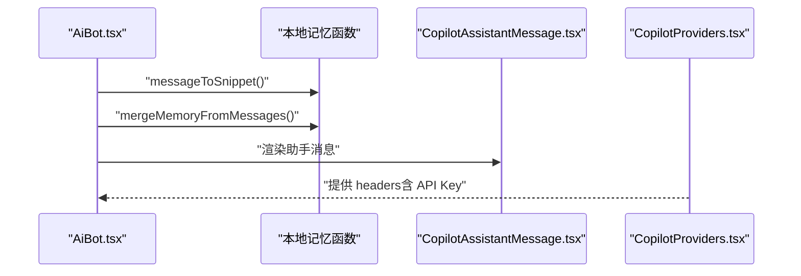
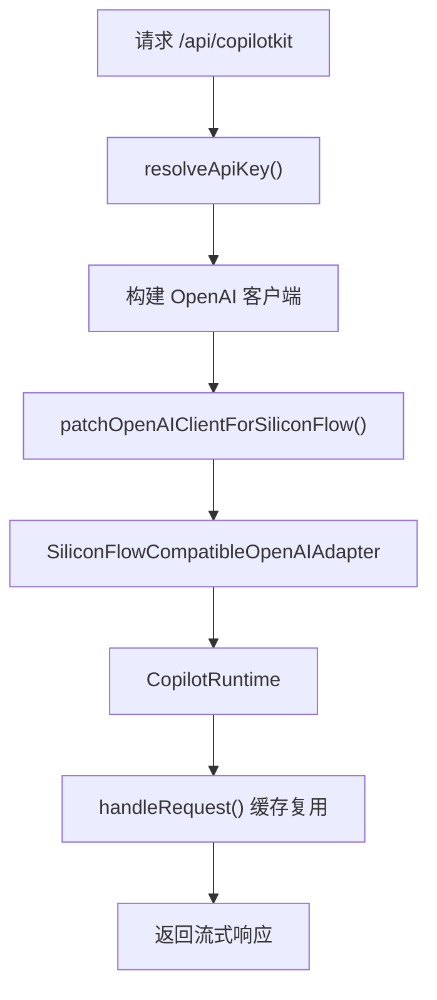
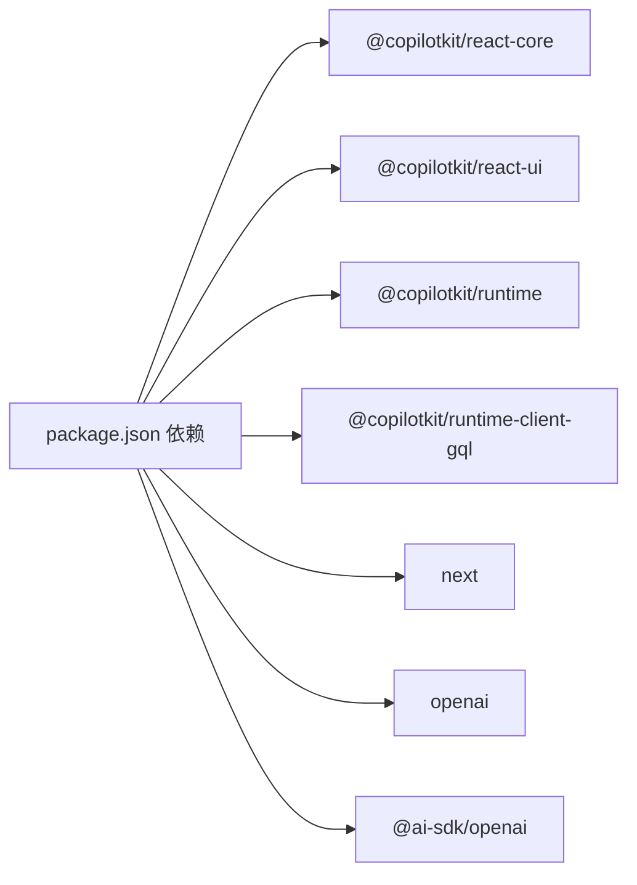

# 本地记忆管理

<cite>
**本文档引用的文件**
- [lib/copilotLocalMemory.ts](file://lib/copilotLocalMemory.ts)
- [components/AiBot.tsx](file://components/AiBot.tsx)
- [components/CopilotProviders.tsx](file://components/CopilotProviders.tsx)
- [app/api/copilotkit/route.ts](file://app/api/copilotkit/route.ts)
- [lib/resumeData.ts](file://lib/resumeData.ts)
- [lib/siliconflow-defaults.ts](file://lib/siliconflow-defaults.ts)
- [lib/siliconFlowOpenAIAdapter.ts](file://lib/siliconFlowOpenAIAdapter.ts)
- [lib/patchOpenAIForSiliconFlow.ts](file://lib/patchOpenAIForSiliconFlow.ts)
- [components/CopilotAssistantMessage.tsx](file://components/CopilotAssistantMessage.tsx)
- [package.json](file://package.json)
</cite>

## 目录
1. [简介](#简介)
2. [项目结构](#项目结构)
3. [核心组件](#核心组件)
4. [架构总览](#架构总览)
5. [详细组件分析](#详细组件分析)
6. [依赖分析](#依赖分析)
7. [性能考量](#性能考量)
8. [故障排查指南](#故障排查指南)
9. [结论](#结论)
10. [附录](#附录)

## 简介
本项目围绕“本地记忆管理”展开，目标是在浏览器端持久化对话历史，使 CopilotKit 的模型上下文具备跨刷新的记忆能力。系统通过本地存储实现短期记忆（recent）与长期记忆（longTerm）的分离与合并，配合消息片段化与长度截断策略，兼顾上下文质量与性能。同时，系统提供 API 层适配与安全策略，确保在不同运行环境下稳定工作。

## 项目结构
- 本地记忆核心逻辑位于 lib/copilotLocalMemory.ts，定义了内存数据结构、加载/保存、消息片段化与合并算法。
- 前端组件 AiBot.tsx 通过 useCopilotReadable 注入上下文时，调用本地记忆函数进行读写与合并。
- API 层 app/api/copilotkit/route.ts 提供服务端运行时与模型适配，保障流式响应与工具调用稳定性。
- 辅助模块包括 SiliconFlow 适配器与补丁，确保与兼容网关的协议一致性。
- 知识库数据（resumeData.ts）作为 CopilotKit 的上下文注入源，增强对话的个性化与一致性。

图表来源
- [lib/copilotLocalMemory.ts:1-77](file://lib/copilotLocalMemory.ts#L1-L77)
- [components/AiBot.tsx:1-22](file://components/AiBot.tsx#L1-L22)
- [components/CopilotProviders.tsx:49-156](file://components/CopilotProviders.tsx#L49-L156)
- [app/api/copilotkit/route.ts:1-131](file://app/api/copilotkit/route.ts#L1-L131)
- [lib/siliconFlowOpenAIAdapter.ts:1-36](file://lib/siliconFlowOpenAIAdapter.ts#L1-L36)
- [lib/patchOpenAIForSiliconFlow.ts:1-22](file://lib/patchOpenAIForSiliconFlow.ts#L1-L22)
- [lib/siliconflow-defaults.ts:1-16](file://lib/siliconflow-defaults.ts#L1-L16)
- [lib/resumeData.ts:1-263](file://lib/resumeData.ts#L1-L263)
- [components/CopilotAssistantMessage.tsx:1-196](file://components/CopilotAssistantMessage.tsx#L1-L196)

章节来源
- [lib/copilotLocalMemory.ts:1-77](file://lib/copilotLocalMemory.ts#L1-L77)
- [components/AiBot.tsx:1-22](file://components/AiBot.tsx#L1-L22)
- [components/CopilotProviders.tsx:49-156](file://components/CopilotProviders.tsx#L49-L156)
- [app/api/copilotkit/route.ts:1-131](file://app/api/copilotkit/route.ts#L1-L131)
- [lib/resumeData.ts:1-263](file://lib/resumeData.ts#L1-L263)

## 核心组件
- 本地记忆数据结构与持久化
  - 存储键名与容量限制：STORAGE_KEY、LONG_TERM_MAX、SNIPPET_MAX。
  - 数据结构 StoredChatMemory：包含 recent（最近3条消息片段）、longTerm（滚动摘要）、updatedAt（更新时间）。
  - 加载与保存：loadChatMemory 从 localStorage 读取并裁剪，saveChatMemory 写入 localStorage，异常时静默处理。
- 消息片段化与合并
  - messageToSnippet：从可见消息中抽取纯文本片段，去除空白，截断至 SNIPPET_MAX。
  - mergeMemoryFromMessages：合并新片段，保留最近3条，追加最近一次 assistant 的回复摘要到 longTerm，并限制长度。
- API 适配与安全
  - SiliconFlow 兼容适配器与补丁，确保流式 chat 协议与网关兼容。
  - API Key 解析优先级：请求头 > 环境变量 > 默认兜底。
  - 健康检查接口返回 serverKeyConfigured，便于前端判断是否可零配置对话。

章节来源
- [lib/copilotLocalMemory.ts:6-14](file://lib/copilotLocalMemory.ts#L6-L14)
- [lib/copilotLocalMemory.ts:21-47](file://lib/copilotLocalMemory.ts#L21-L47)
- [lib/copilotLocalMemory.ts:49-55](file://lib/copilotLocalMemory.ts#L49-L55)
- [lib/copilotLocalMemory.ts:57-76](file://lib/copilotLocalMemory.ts#L57-L76)
- [app/api/copilotkit/route.ts:30-43](file://app/api/copilotkit/route.ts#L30-L43)
- [app/api/copilotkit/route.ts:120-131](file://app/api/copilotkit/route.ts#L120-L131)
- [lib/siliconFlowOpenAIAdapter.ts:17-35](file://lib/siliconFlowOpenAIAdapter.ts#L17-L35)
- [lib/patchOpenAIForSiliconFlow.ts:12-21](file://lib/patchOpenAIForSiliconFlow.ts#L12-L21)

## 架构总览
本地记忆管理贯穿前端组件、本地存储与 API 服务端三层：
- 前端组件 AiBot.tsx 在对话过程中收集 visibleMessages，经 messageToSnippet 转换为片段，再通过 mergeMemoryFromMessages 合并到本地存储。
- 本地存储采用 localStorage，键名为固定字符串，值为 JSON 序列化的 StoredChatMemory。
- API 层通过 CopilotRuntime 与 SiliconFlow 兼容适配器，提供稳定的流式响应与工具调用能力，同时通过健康检查与密钥解析保障可用性。

图表来源
- [components/AiBot.tsx:16-21](file://components/AiBot.tsx#L16-L21)
- [lib/copilotLocalMemory.ts:49-55](file://lib/copilotLocalMemory.ts#L49-L55)
- [lib/copilotLocalMemory.ts:57-76](file://lib/copilotLocalMemory.ts#L57-L76)
- [lib/copilotLocalMemory.ts:40-47](file://lib/copilotLocalMemory.ts#L40-L47)
- [app/api/copilotkit/route.ts:116-117](file://app/api/copilotkit/route.ts#L116-L117)

## 详细组件分析

### 本地记忆数据结构与持久化
- 数据结构
  - recent：数组，最多3条，每条包含 role 与 text（已截断）。
  - longTerm：字符串，滚动摘要，追加最近一次 assistant 回复的时间戳与摘要，长度受 LONG_TERM_MAX 限制。
  - updatedAt：ISO 时间字符串，用于标记最后更新。
- 持久化策略
  - 加载：从 localStorage 读取，若为空或解析失败，返回空结构；仅保留最近3条 recent。
  - 保存：JSON 序列化后写入，异常时忽略（如配额不足、隐私模式）。
- 截断与清洗
  - clip：去除多余空白，按字符数截断，末尾添加省略号。

图表来源
- [lib/copilotLocalMemory.ts:21-38](file://lib/copilotLocalMemory.ts#L21-L38)
- [lib/copilotLocalMemory.ts:40-47](file://lib/copilotLocalMemory.ts#L40-L47)

章节来源
- [lib/copilotLocalMemory.ts:6-14](file://lib/copilotLocalMemory.ts#L6-L14)
- [lib/copilotLocalMemory.ts:16-19](file://lib/copilotLocalMemory.ts#L16-L19)
- [lib/copilotLocalMemory.ts:21-38](file://lib/copilotLocalMemory.ts#L21-L38)
- [lib/copilotLocalMemory.ts:40-47](file://lib/copilotLocalMemory.ts#L40-L47)

### 消息片段化与合并算法
- 片段化
  - 从可见消息中抽取 role 与 content，role 缺失时默认 unknown，content 非字符串时清空。
  - clip 截断至 SNIPPET_MAX，避免过长片段影响 longTerm。
- 合并
  - recent：取片段数组的最后3条。
  - longTerm：若存在最近一次 assistant 片段，则追加一行带本地时间戳的摘要；若超过 LONG_TERM_MAX，仅保留尾部。
  - updatedAt：每次合并更新为当前时间。

图表来源
- [lib/copilotLocalMemory.ts:57-76](file://lib/copilotLocalMemory.ts#L57-L76)

章节来源
- [lib/copilotLocalMemory.ts:49-55](file://lib/copilotLocalMemory.ts#L49-L55)
- [lib/copilotLocalMemory.ts:57-76](file://lib/copilotLocalMemory.ts#L57-L76)

### 前端集成与上下文注入
- AiBot.tsx
  - 导入本地记忆函数，调用 messageToSnippet 与 mergeMemoryFromMessages。
  - 在对话过程中，将新片段合并并保存，确保模型上下文包含 recent 与 longTerm。
  - 通过 CopilotAssistantMessage.tsx 渲染助手消息，支持复制整段回复与操作栏。
- CopilotProviders.tsx
  - 提供 SiliconFlow API Key 的读取与覆盖，决定请求头携带与否。
  - 通过 fetch 包装修复特定网关的响应问题，避免语法错误弹窗。

图表来源
- [components/AiBot.tsx:16-21](file://components/AiBot.tsx#L16-L21)
- [components/CopilotAssistantMessage.tsx:37-195](file://components/CopilotAssistantMessage.tsx#L37-L195)
- [components/CopilotProviders.tsx:115-133](file://components/CopilotProviders.tsx#L115-L133)

章节来源
- [components/AiBot.tsx:16-21](file://components/AiBot.tsx#L16-L21)
- [components/CopilotAssistantMessage.tsx:37-195](file://components/CopilotAssistantMessage.tsx#L37-L195)
- [components/CopilotProviders.tsx:115-133](file://components/CopilotProviders.tsx#L115-L133)

### API 适配与安全策略
- SiliconFlow 适配
  - SiliconFlowCompatibleOpenAIAdapter：将模型适配为 chat 接口，与标准流式协议一致。
  - patchOpenAIClientForSiliconFlow：将 beta.stream 代理到标准流式接口，避免 404。
- 密钥解析与健康检查
  - resolveApiKey：优先使用请求头中的用户 Key，其次环境变量，最后默认兜底。
  - GET /api/copilotkit：返回 serverKeyConfigured，便于前端判断是否可零配置对话。
- 性能与稳定性
  - 缓存按 API Key 的 Hono handler，避免重复创建 CopilotRuntime。
  - 关闭并行工具调用，适配兼容网关行为。

图表来源
- [app/api/copilotkit/route.ts:30-43](file://app/api/copilotkit/route.ts#L30-L43)
- [app/api/copilotkit/route.ts:48-95](file://app/api/copilotkit/route.ts#L48-L95)
- [lib/patchOpenAIForSiliconFlow.ts:12-21](file://lib/patchOpenAIForSiliconFlow.ts#L12-L21)
- [lib/siliconFlowOpenAIAdapter.ts:17-35](file://lib/siliconFlowOpenAIAdapter.ts#L17-L35)

章节来源
- [app/api/copilotkit/route.ts:30-43](file://app/api/copilotkit/route.ts#L30-L43)
- [app/api/copilotkit/route.ts:48-95](file://app/api/copilotkit/route.ts#L48-L95)
- [lib/patchOpenAIForSiliconFlow.ts:12-21](file://lib/patchOpenAIForSiliconFlow.ts#L12-L21)
- [lib/siliconFlowOpenAIAdapter.ts:17-35](file://lib/siliconFlowOpenAIAdapter.ts#L17-L35)
- [lib/siliconflow-defaults.ts:9-16](file://lib/siliconflow-defaults.ts#L9-L16)

## 依赖分析
- 前端依赖
  - @copilotkit/react-core 与 @copilotkit/react-ui：提供聊天 UI 与上下文注入能力。
  - @copilotkit/runtime 与 @copilotkit/runtime-client-gql：运行时与客户端通信。
  - next：框架与构建工具。
- 本地记忆依赖
  - 仅依赖浏览器 localStorage 与 JSON，无第三方存储库。
- API 依赖
  - openai：与兼容网关的适配与补丁。
  - @ai-sdk/openai：提供 chat 模型适配。

图表来源
- [package.json:12-20](file://package.json#L12-L20)

章节来源
- [package.json:12-20](file://package.json#L12-L20)

## 性能考量
- 存储与序列化
  - localStorage 读写为同步操作，建议控制单次写入大小（recent 与 longTerm 的长度限制）。
  - JSON 序列化与解析开销较小，但频繁写入仍可能影响主线程，建议在批处理或空闲时机保存。
- 计算复杂度
  - 片段化与截断为 O(n)（n 为文本长度），合并为 O(k)（k 为新片段数）。
  - longTerm 截断为 O(m)（m 为超出长度），整体线性。
- 网络与流式
  - 流式响应减少首字节延迟，提高交互体验。
  - 并行工具调用关闭可避免兼容网关的并发限制问题。

## 故障排查指南
- 本地存储异常
  - 现象：无法读取或保存记忆。
  - 排查：检查浏览器隐私模式、存储配额、localStorage 是否被禁用；代码中已对异常进行吞没，可通过日志或调试定位。
- API Key 无效
  - 现象：500 错误，提示未配置有效 Key。
  - 排查：确认请求头 x-siliconflow-api-key、环境变量 SILICONFLOW_API_KEY 或默认兜底是否正确设置。
- 兼容网关问题
  - 现象：AI_APICallError: Not Found 或流式异常。
  - 排查：确认网关支持 /v1/chat/completions；补丁已将 beta.stream 代理到标准流式接口。
- 响应为空
  - 现象：urql 解析抛 SyntaxError。
  - 排查：fetch 包装已将 Content-Length: 0 的响应补成合法 JSON，避免弹窗。

章节来源
- [lib/copilotLocalMemory.ts:40-47](file://lib/copilotLocalMemory.ts#L40-L47)
- [app/api/copilotkit/route.ts:100-114](file://app/api/copilotkit/route.ts#L100-L114)
- [lib/patchOpenAIForSiliconFlow.ts:12-21](file://lib/patchOpenAIForSiliconFlow.ts#L12-L21)
- [components/CopilotProviders.tsx:64-87](file://components/CopilotProviders.tsx#L64-L87)

## 结论
本项目通过简洁的本地存储与消息片段化策略，实现了对话历史的短期与长期记忆，既保证了上下文质量，又兼顾了性能与可靠性。配合 API 层的适配与安全策略，系统在不同运行环境下均能稳定工作。建议在生产环境中关注存储配额、批处理保存时机与兼容网关的流式协议一致性。

## 附录
- API 使用示例（概念性说明）
  - 获取健康状态：GET /api/copilotkit，返回 serverKeyConfigured。
  - 发送对话：POST /api/copilotkit，携带 headers（含 API Key）。
  - 片段化与合并：在前端组件中调用 messageToSnippet 与 mergeMemoryFromMessages，随后保存至 localStorage。
- 最佳实践
  - 控制 longTerm 长度，避免超出限制。
  - 在空闲时机批量保存，减少主线程阻塞。
  - 使用 fetch 包装与补丁，确保兼容网关的流式协议。
  - 通过健康检查判断是否可零配置对话，提升用户体验。