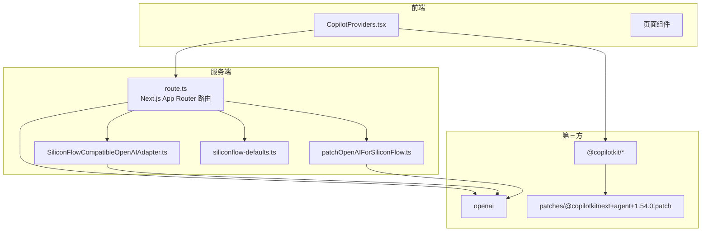
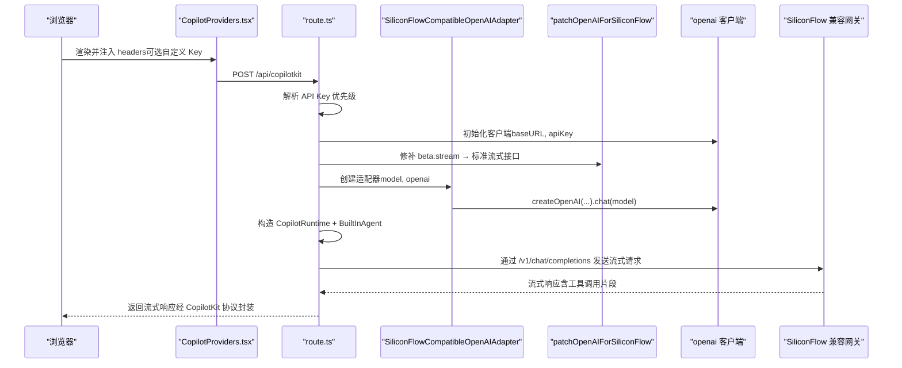
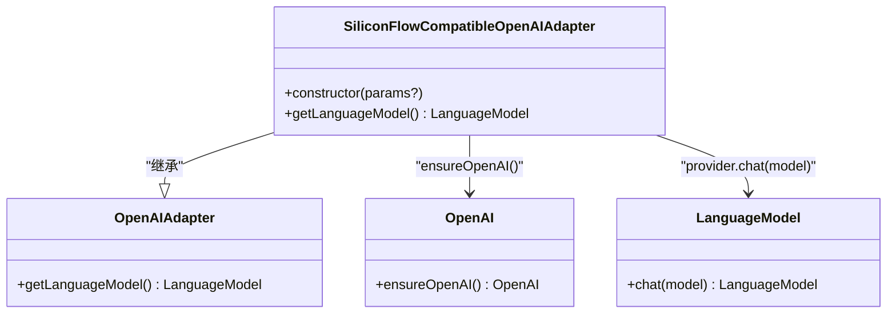
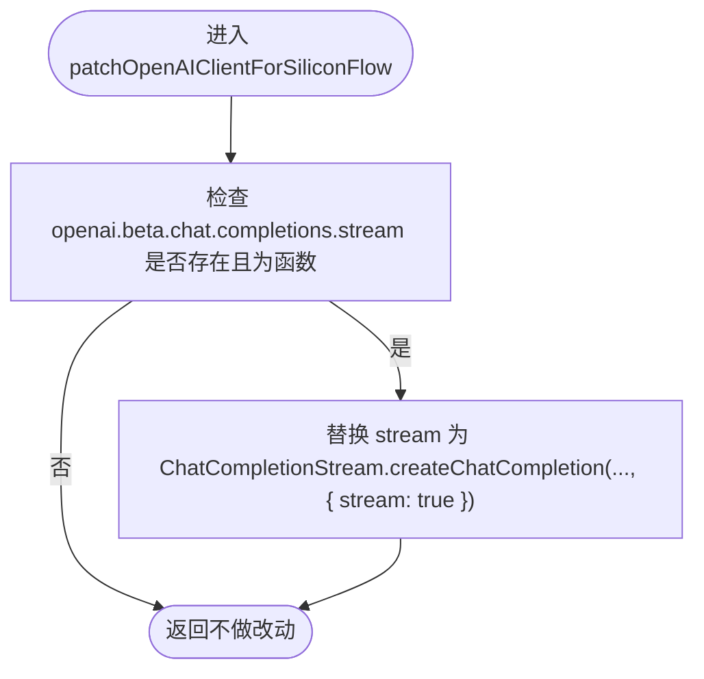
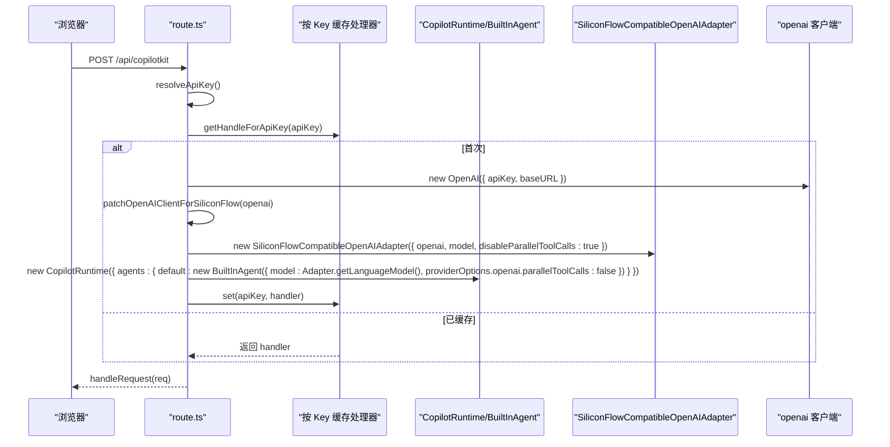
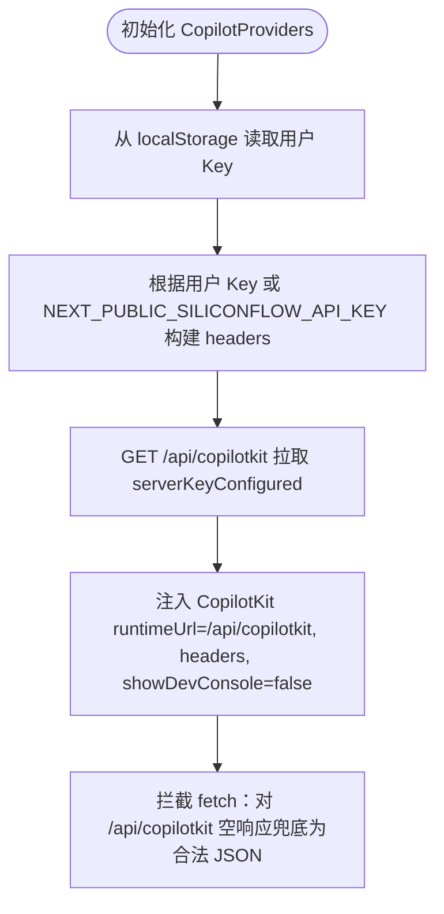
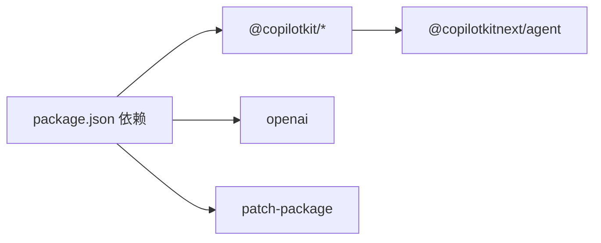

# 硅基流动 API 适配器

<cite>
**本文引用的文件**
- [siliconFlowOpenAIAdapter.ts](file://lib/siliconFlowOpenAIAdapter.ts)
- [patchOpenAIForSiliconFlow.ts](file://lib/patchOpenAIForSiliconFlow.ts)
- [siliconflow-defaults.ts](file://lib/siliconflow-defaults.ts)
- [route.ts](file://app/api/copilotkit/route.ts)
- [CopilotProviders.tsx](file://components/CopilotProviders.tsx)
- [package.json](file://package.json)
- [@copilotkitnext+agent+1.54.0.patch](file://patches/@copilotkitnext+agent+1.54.0.patch)
- [resumeData.ts](file://lib/resumeData.ts)
- [copilotLocalMemory.ts](file://lib/copilotLocalMemory.ts)
</cite>

## 目录
1. [简介](#简介)
2. [项目结构](#项目结构)
3. [核心组件](#核心组件)
4. [架构总览](#架构总览)
5. [详细组件分析](#详细组件分析)
6. [依赖分析](#依赖分析)
7. [性能考虑](#性能考虑)
8. [故障排除指南](#故障排除指南)
9. [结论](#结论)
10. [附录](#附录)

## 简介
本项目为“硅基流动”（SiliconFlow）API 提供 OpenAI 兼容适配器，使基于 CopilotKit 的前端应用能够通过 Next.js App Router 的 API 路由，将 OpenAI 风格的聊天与函数调用（Function Calling）请求转发到 SiliconFlow 的兼容网关，并正确处理其流式响应与工具调用协议差异。项目包含：
- 适配器：将 CopilotKit 的 OpenAI 兼容适配器切换到标准 chat/completions 接口，避免使用 Responses API 或 beta 路径。
- 补丁：将 CopilotKit 的 beta.stream 代理到标准流式接口，适配部分兼容网关不支持 beta 路径的问题。
- 服务端路由：按 API Key 缓存运行时处理器，支持浏览器自定义 Key 与服务端兜底 Key 的优先级解析。
- 前端集成：在 CopilotKit Provider 中注入请求头与兜底行为，确保安全与可用性。

## 项目结构
项目采用按职责分层的组织方式：
- lib：适配器、补丁、默认配置、本地记忆与简历数据
- app/api/copilotkit：Next.js App Router 路由，实现服务端适配与运行时封装
- components：前端 Provider 与页面组件，负责 UI、上下文与兜底 fetch 行为
- patches：第三方库补丁，用于修复兼容网关在工具调用流中的事件顺序问题

图表来源
- [route.ts:1-131](file://app/api/copilotkit/route.ts#L1-L131)
- [siliconFlowOpenAIAdapter.ts:1-36](file://lib/siliconFlowOpenAIAdapter.ts#L1-L36)
- [patchOpenAIForSiliconFlow.ts:1-22](file://lib/patchOpenAIForSiliconFlow.ts#L1-L22)
- [CopilotProviders.tsx:1-157](file://components/CopilotProviders.tsx#L1-L157)
- [@copilotkitnext+agent+1.54.0.patch:1-125](file://patches/@copilotkitnext+agent+1.54.0.patch#L1-L125)

章节来源
- [route.ts:1-131](file://app/api/copilotkit/route.ts#L1-L131)
- [CopilotProviders.tsx:1-157](file://components/CopilotProviders.tsx#L1-L157)
- [package.json:1-29](file://package.json#L1-L29)

## 核心组件
- SiliconFlowCompatibleOpenAIAdapter：继承 CopilotKit 的 OpenAIAdapter，重写 getLanguageModel，使用 createOpenAI(...).chat(...)，确保与标准 chat/completions 流式协议一致。
- patchOpenAIClientForSiliconFlow：检测并替换 openai.beta.chat.completions.stream，将其代理到 ChatCompletionStream.createChatCompletion，从而走标准 /v1/chat/completions 流式接口。
- route.ts：服务端路由，解析 API Key 优先级，缓存按 Key 的运行时处理器，构造 CopilotRuntime 与 BuiltInAgent，导出 POST/OPTIONS。
- CopilotProviders.tsx：前端 Provider，注入请求头（浏览器自定义 Key 或 NEXT_PUBLIC_SILICONFLOW_API_KEY），处理空响应兜底，拉取服务端 Key 配置状态。
- defaults：定义 API Key 头名、默认 Key 与本地存储键名，便于前端与服务端协同。
- patches：对 @copilotkitnext/agent 的补丁，确保在兼容网关只流式 tool-input-* 的情况下，补齐 TOOL_CALL_END 事件，避免 RUN_FINISHED 前仍有活跃工具调用。

章节来源
- [siliconFlowOpenAIAdapter.ts:1-36](file://lib/siliconFlowOpenAIAdapter.ts#L1-L36)
- [patchOpenAIForSiliconFlow.ts:1-22](file://lib/patchOpenAIForSiliconFlow.ts#L1-L22)
- [route.ts:1-131](file://app/api/copilotkit/route.ts#L1-L131)
- [CopilotProviders.tsx:1-157](file://components/CopilotProviders.tsx#L1-L157)
- [siliconflow-defaults.ts:1-16](file://lib/siliconflow-defaults.ts#L1-L16)
- [@copilotkitnext+agent+1.54.0.patch:1-125](file://patches/@copilotkitnext+agent+1.54.0.patch#L1-L125)

## 架构总览
下图展示了从浏览器到服务端、再到 SiliconFlow 兼容网关的整体调用链路与适配策略。

图表来源
- [route.ts:48-95](file://app/api/copilotkit/route.ts#L48-L95)
- [patchOpenAIForSiliconFlow.ts:12-21](file://lib/patchOpenAIForSiliconFlow.ts#L12-L21)
- [siliconFlowOpenAIAdapter.ts:22-34](file://lib/siliconFlowOpenAIAdapter.ts#L22-L34)

## 详细组件分析

### 适配器：SiliconFlowCompatibleOpenAIAdapter
- 目标：避免使用 @ai-sdk/openai v3 的 Responses API（/v1/responses），改用标准 chat/completions（/v1/chat/completions）以适配 SiliconFlow 等兼容网关。
- 关键点：
  - 通过 ensureOpenAI 获取原始客户端，读取 baseURL、apiKey、organization、project、defaultHeaders、fetch 等配置。
  - 使用 createOpenAI(...) 包装后，调用 provider.chat(this.model) 返回 LanguageModel，确保后续流式协议一致。

图表来源
- [siliconFlowOpenAIAdapter.ts:17-35](file://lib/siliconFlowOpenAIAdapter.ts#L17-L35)

章节来源
- [siliconFlowOpenAIAdapter.ts:1-36](file://lib/siliconFlowOpenAIAdapter.ts#L1-L36)

### 补丁：patchOpenAIForSiliconFlow
- 目标：将 CopilotKit 使用的 beta.stream 代理到 SDK 内置的 ChatCompletionStream.createChatCompletion，使其走标准 /v1/chat/completions 流式接口。
- 关键点：
  - 检测 openai.beta.chat.completions.stream 是否存在且为函数。
  - 替换为 ChatCompletionStream.createChatCompletion，内部以 { ...params, stream: true } 调用标准接口。

图表来源
- [patchOpenAIForSiliconFlow.ts:12-21](file://lib/patchOpenAIForSiliconFlow.ts#L12-L21)

章节来源
- [patchOpenAIForSiliconFlow.ts:1-22](file://lib/patchOpenAIForSiliconFlow.ts#L1-L22)

### 服务端路由：route.ts
- API Key 解析优先级：请求头（浏览器自定义 Key） > 环境变量（SILICONFLOW_API_KEY） > 代码默认 Key。
- 按 Key 缓存运行时处理器：Map<string, handler>，避免每请求重建 CopilotRuntime，提高稳定性与性能。
- 适配器与运行时：
  - 使用 SiliconFlowCompatibleOpenAIAdapter，设置 model 与 openai 客户端。
  - 为兼容网关只流式 tool-input-* 的情况，在 CopilotRuntime 的 BuiltInAgent 中显式关闭并行工具调用（parallelToolCalls=false）。
  - 导出 POST 与 OPTIONS，OPTIONS 用于处理浏览器预检请求。
- 健康检查：GET /api/copilotkit 返回服务端 baseURL、model、serverKeyConfigured 与提示信息。

图表来源
- [route.ts:30-95](file://app/api/copilotkit/route.ts#L30-L95)

章节来源
- [route.ts:1-131](file://app/api/copilotkit/route.ts#L1-L131)

### 前端 Provider：CopilotProviders.tsx
- 请求头注入：优先使用浏览器自存的用户 Key（localStorage），其次使用 NEXT_PUBLIC_SILICONFLOW_API_KEY（构建时注入，仅调试）。
- 空响应兜底：拦截 /api/copilotkit 的 fetch，若响应为空且为 OK，则返回合法 JSON，避免 urql 解析 SyntaxError。
- 服务端 Key 状态：首次渲染时拉取 GET /api/copilotkit，读取 serverKeyConfigured，决定是否允许访客“零配置”对话。

图表来源
- [CopilotProviders.tsx:49-157](file://components/CopilotProviders.tsx#L49-L157)

章节来源
- [CopilotProviders.tsx:1-157](file://components/CopilotProviders.tsx#L1-L157)

### 配置与默认值：siliconflow-defaults.ts
- API Key 头名：x-siliconflow-api-key
- 默认 Key：用于兜底（建议生产环境不要硬编码）
- 用户 Key 存储键：siliconflow_api_key（localStorage）

章节来源
- [siliconflow-defaults.ts:1-16](file://lib/siliconflow-defaults.ts#L1-L16)

### 第三方补丁：@copilotkitnext+agent+1.54.0.patch
- 背景：部分兼容网关只流式 tool-input-*，不发送最终 tool-call，导致前端校验要求 TOOL_CALL_END 先于 RUN_FINISHED。
- 补丁策略：在 abort、finish、以及未终止事件时，flushOpenToolCalls，补齐 TOOL_CALL_END，再发送 RUN_FINISHED。

章节来源
- [@copilotkitnext+agent+1.54.0.patch:1-125](file://patches/@copilotkitnext+agent+1.54.0.patch#L1-L125)

## 依赖分析
- 运行时依赖：@copilotkit/react-core、@copilotkit/react-ui、@copilotkit/runtime、@copilotkit/runtime-client-gql、next、react、react-dom
- 开发依赖：patch-package（用于应用补丁）
- 关键第三方交互：
  - @copilotkit/runtime：提供 CopilotRuntime、BuiltInAgent、OpenAIAdapter 等核心能力。
  - openai：SDK 客户端，用于与兼容网关通信。
  - @copilotkitnext/agent：内置 Agent 与流式事件处理，受补丁影响。

图表来源
- [package.json:12-27](file://package.json#L12-L27)

章节来源
- [package.json:1-29](file://package.json#L1-L29)

## 性能考虑
- 按 Key 缓存处理器：route.ts 使用 Map 缓存按 API Key 的处理器，避免每请求重建 CopilotRuntime，显著降低冷启动开销与抖动。
- 并行工具调用关闭：在 providerOptions.openai.parallelToolCalls=false，减少兼容网关压力与事件竞争。
- 流式协议一致性：通过适配器与补丁统一走 /v1/chat/completions，避免多次重定向或路径不一致带来的延迟。
- 前端兜底：拦截空响应并返回合法 JSON，避免前端解析异常导致的重试风暴。

章节来源
- [route.ts:46-95](file://app/api/copilotkit/route.ts#L46-L95)
- [CopilotProviders.tsx:63-87](file://components/CopilotProviders.tsx#L63-L87)

## 故障排除指南
常见问题与排查步骤：
- 404 Not Found（/v1/beta/chat/completions 或 /v1/responses）
  - 现象：前端报 AI_APICallError: Not Found。
  - 原因：兼容网关未实现 beta 路径或 Responses API。
  - 解决：确保使用 SiliconFlowCompatibleOpenAIAdapter 与 patchOpenAIForSiliconFlow，统一走 /v1/chat/completions。
  - 参考：适配器与补丁实现。
- Cannot send RUN_FINISHED while tool calls are still active
  - 现象：前端校验失败。
  - 原因：兼容网关只流式 tool-input-*，未发送最终 tool-call。
  - 解决：应用 @copilotkitnext+agent+1.54.0.patch，补齐 TOOL_CALL_END。
  - 参考：补丁文件。
- 未配置有效 API Key
  - 现象：POST /api/copilotkit 返回 configuration_error。
  - 解决：在请求头（浏览器自定义 Key）或环境变量（SILICONFLOW_API_KEY）中配置 Key；或使用代码兜底 Key。
  - 参考：API Key 解析逻辑。
- 访客无法对话（零配置）
  - 现象：GET /api/copilotkit 返回 serverKeyConfigured=false。
  - 解决：在服务端配置 SILICONFLOW_API_KEY 或在代码中保留默认 Key。
  - 参考：健康检查与默认 Key。
- Content-Length: 0 导致前端解析异常
  - 现象：urql 抛 SyntaxError。
  - 解决：CopilotProviders.tsx 已内置拦截器，将空响应兜底为合法 JSON。
  - 参考：fetch 拦截逻辑。

章节来源
- [route.ts:100-114](file://app/api/copilotkit/route.ts#L100-L114)
- [CopilotProviders.tsx:63-87](file://components/CopilotProviders.tsx#L63-L87)
- [@copilotkitnext+agent+1.54.0.patch:87-125](file://patches/@copilotkitnext+agent+1.54.0.patch#L87-L125)

## 结论
本项目通过适配器与补丁机制，将 CopilotKit 与 openai SDK 的调用路径统一到标准 chat/completions 流式接口，有效规避了兼容网关在 beta 路径与 Responses API 上的限制；配合按 Key 缓存处理器与前端兜底策略，实现了稳定、高性能的 OpenAI 兼容体验。同时，通过补丁修复工具调用事件顺序问题，确保在只流式中间片段的网关环境下也能正确完成一轮对话生命周期。

## 附录

### 配置选项清单
- 环境变量
  - SILICONFLOW_API_KEY：服务端兜底 Key（推荐）
  - SILICONFLOW_BASE_URL：兼容网关基础地址，默认 https://api.siliconflow.cn/v1
  - SILICONFLOW_MODEL：默认模型名称，默认 Qwen/Qwen3-14B
  - NEXT_PUBLIC_SILICONFLOW_API_KEY：前端构建时注入 Key（仅调试）
- 请求头
  - x-siliconflow-api-key：浏览器自定义 Key（localStorage）
- 本地存储
  - siliconflow_api_key：用户在「API」面板保存的 Key

章节来源
- [route.ts:16-25](file://app/api/copilotkit/route.ts#L16-L25)
- [route.ts:30-36](file://app/api/copilotkit/route.ts#L30-L36)
- [siliconflow-defaults.ts:9-16](file://lib/siliconflow-defaults.ts#L9-L16)
- [CopilotProviders.tsx:115-133](file://components/CopilotProviders.tsx#L115-L133)

### 使用示例（集成步骤）
- 前端
  - 在应用根组件包裹 CopilotProviders，注入 runtimeUrl="/api/copilotkit" 与 headers（可选）。
  - 如需访客“零配置”，确保服务端配置 SILICONFLOW_API_KEY 或保留默认 Key。
- 服务端
  - 在 /api/copilotkit 路由中解析 API Key 优先级，初始化 openai 客户端并应用补丁。
  - 使用 SiliconFlowCompatibleOpenAIAdapter 与 CopilotRuntime/BuiltInAgent，导出 POST/OPTIONS。
- 兼容性
  - 若兼容网关不支持 beta 路径或 Responses API，请确保补丁与适配器生效。
  - 若兼容网关只流式 tool-input-*，请应用 @copilotkitnext+agent+1.54.0.patch。

章节来源
- [CopilotProviders.tsx:144-156](file://components/CopilotProviders.tsx#L144-L156)
- [route.ts:48-95](file://app/api/copilotkit/route.ts#L48-L95)
- [siliconFlowOpenAIAdapter.ts:17-35](file://lib/siliconFlowOpenAIAdapter.ts#L17-L35)
- [patchOpenAIForSiliconFlow.ts:12-21](file://lib/patchOpenAIForSiliconFlow.ts#L12-L21)
- [@copilotkitnext+agent+1.54.0.patch:87-125](file://patches/@copilotkitnext+agent+1.54.0.patch#L87-L125)