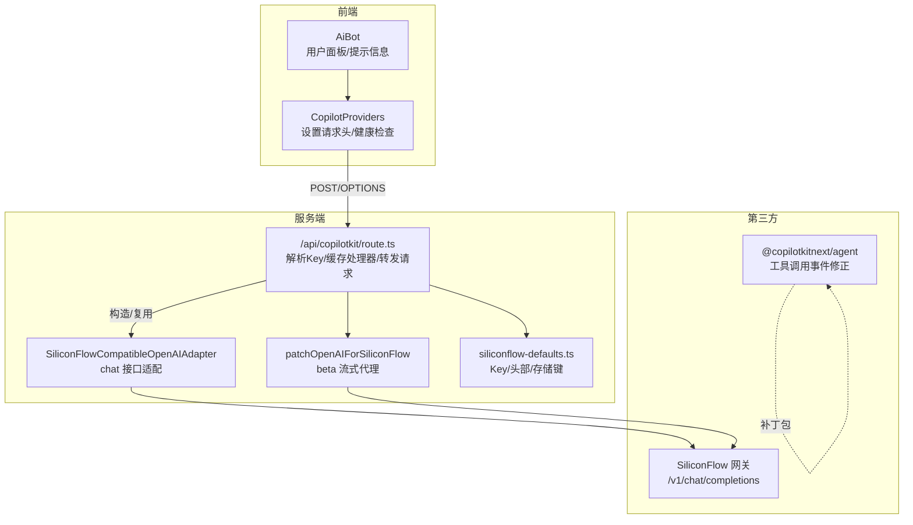
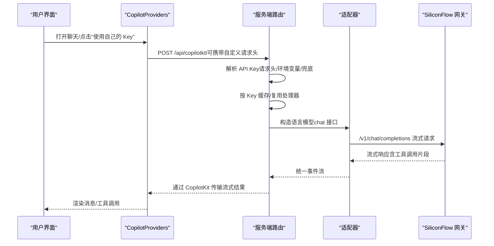
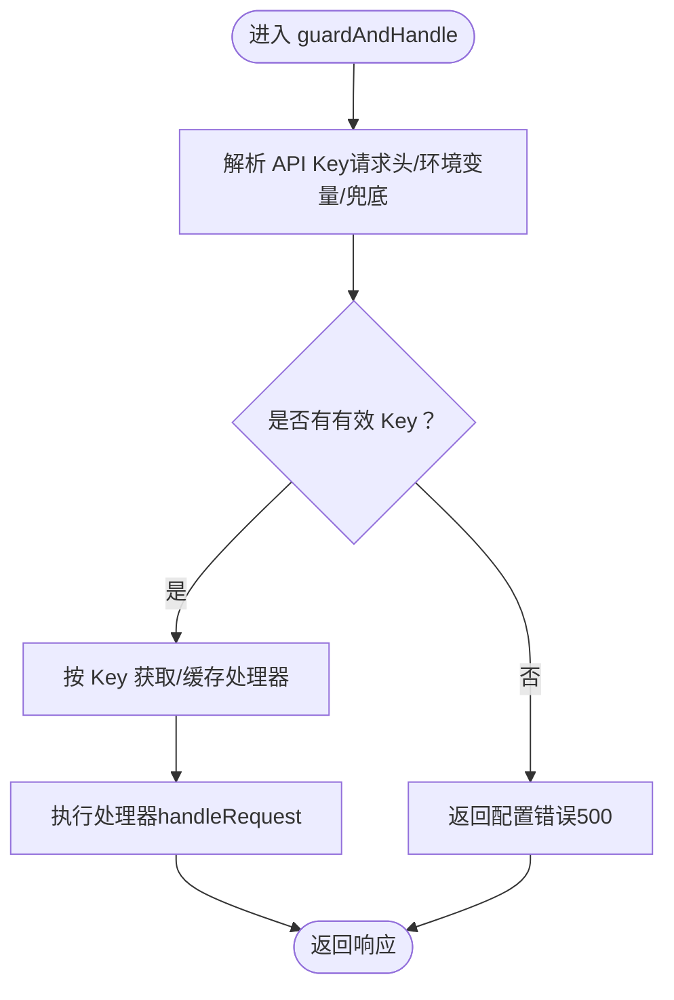
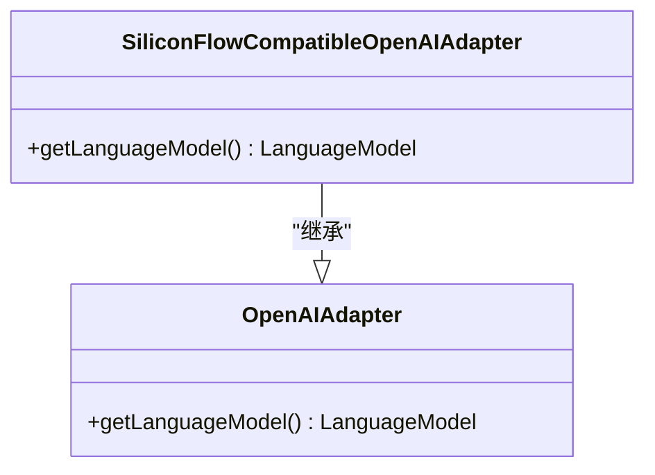
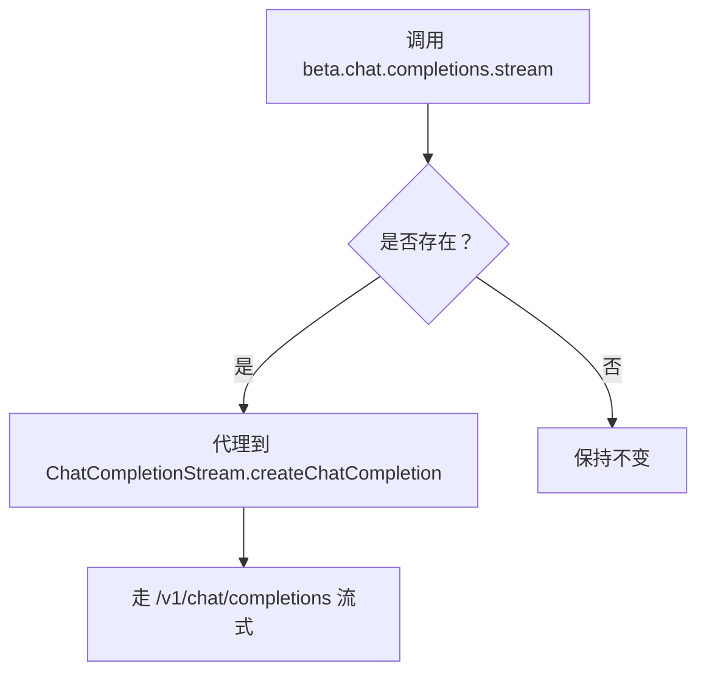
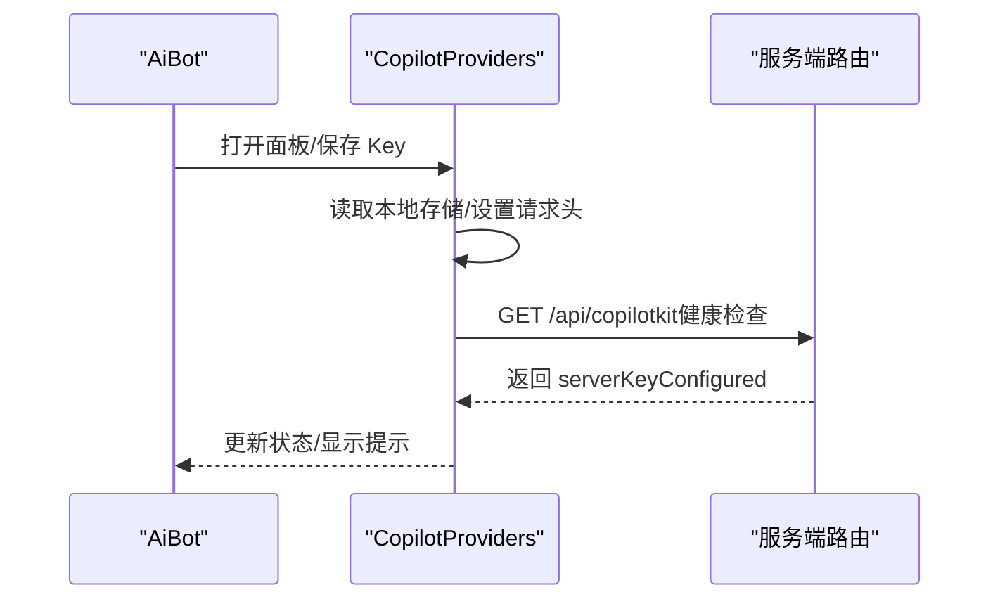
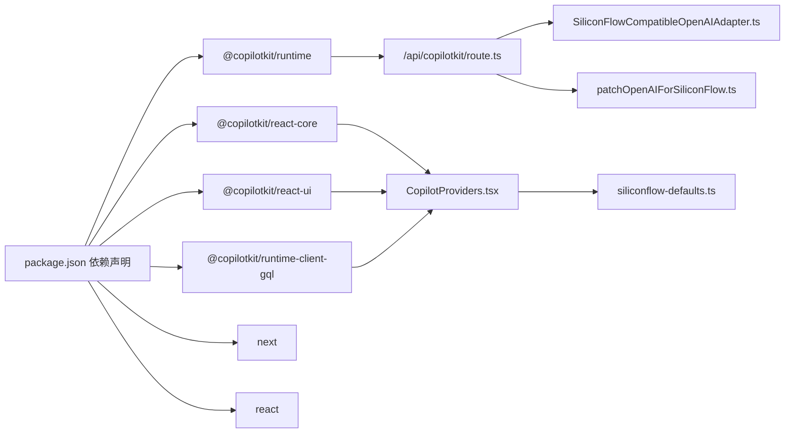

# API 集成

<cite>
**本文引用的文件**
- [route.ts](file://app/api/copilotkit/route.ts)
- [siliconFlowOpenAIAdapter.ts](file://lib/siliconFlowOpenAIAdapter.ts)
- [patchOpenAIForSiliconFlow.ts](file://lib/patchOpenAIForSiliconFlow.ts)
- [siliconflow-defaults.ts](file://lib/siliconflow-defaults.ts)
- [CopilotProviders.tsx](file://components/CopilotProviders.tsx)
- [AiBot.tsx](file://components/AiBot.tsx)
- [@copilotkitnext+agent+1.54.0.patch](file://patches/@copilotkitnext+agent+1.54.0.patch)
- [package.json](file://package.json)
</cite>

## 目录
1. [简介](#简介)
2. [项目结构](#项目结构)
3. [核心组件](#核心组件)
4. [架构总览](#架构总览)
5. [详细组件分析](#详细组件分析)
6. [依赖关系分析](#依赖关系分析)
7. [性能考量](#性能考量)
8. [故障排除指南](#故障排除指南)
9. [结论](#结论)
10. [附录](#附录)

## 简介
本文件面向 Fuqianjiao AI 项目中的 CopilotKit API 集成，系统性说明服务端代理机制、请求处理流程、健康检查、环境配置与安全策略，并提供最佳实践、调试技巧与故障排除指南。重点围绕 Next.js App Router 的 /api/copilotkit 路由，结合前端 CopilotKit 客户端与适配器，实现对 SiliconFlow（以及兼容 OpenAI 协议的网关）的稳定流式调用。

## 项目结构
本项目采用 Next.js App Router 结构，API 路由位于 app/api/copilotkit/route.ts，前端通过 CopilotKit 提供的上下文组件进行集成。关键模块如下：
- 服务端路由：负责解析 API Key、构造 OpenAI 客户端、应用补丁、选择适配器、缓存运行时处理器并处理请求。
- 适配器：将 CopilotKit 的 OpenAI 适配器切换为与 SiliconFlow 兼容的 chat 接口，避免 Responses API 导致的 404。
- 补丁：将 OpenAI 的 beta 流式接口代理到标准 chat.completions 流式接口，适配不支持 beta 路径的网关。
- 前端上下文：负责从本地存储读取用户 Key、向服务端传递自定义请求头、健康检查提示、以及对 fetch 的兜底处理。
- 补丁包：修复 @copilotkitnext/agent 在工具调用流式结束顺序上的校验问题，确保 RUN_FINISHED 前发出 TOOL_CALL_END。

图表来源
- [route.ts:1-131](file://app/api/copilotkit/route.ts#L1-L131)
- [siliconFlowOpenAIAdapter.ts:1-36](file://lib/siliconFlowOpenAIAdapter.ts#L1-L36)
- [patchOpenAIForSiliconFlow.ts:1-22](file://lib/patchOpenAIForSiliconFlow.ts#L1-L22)
- [siliconflow-defaults.ts:1-16](file://lib/siliconflow-defaults.ts#L1-L16)
- [CopilotProviders.tsx:1-157](file://components/CopilotProviders.tsx#L1-L157)
- [@copilotkitnext+agent+1.54.0.patch:1-125](file://patches/@copilotkitnext+agent+1.54.0.patch#L1-L125)

章节来源
- [route.ts:1-131](file://app/api/copilotkit/route.ts#L1-L131)
- [CopilotProviders.tsx:1-157](file://components/CopilotProviders.tsx#L1-L157)

## 核心组件
- 服务端路由（/api/copilotkit/route.ts）
  - 解析 API Key 优先级：请求头 > 环境变量 > 代码兜底
  - 基于 API Key 缓存 Hono 处理器，避免重复初始化 CopilotRuntime
  - 构造 OpenAI 客户端并应用补丁，选择兼容适配器，启用 CopilotKit 运行时
  - 支持 GET 健康检查，返回服务状态与提示
  - 支持 OPTIONS 预检，便于浏览器跨域场景
- 适配器（SiliconFlowCompatibleOpenAIAdapter）
  - 将 OpenAI 适配器的语言模型切换为 chat 接口，避免 Responses API 导致的 404
- 补丁（patchOpenAIForSiliconFlow）
  - 将 OpenAI beta 流式接口代理到标准 chat.completions 流式接口
- 前端上下文（CopilotProviders）
  - 从本地存储读取用户 Key，必要时通过请求头传给服务端
  - 发起健康检查，判断服务端是否已配置可用 Key
  - 对 fetch 进行兜底，避免空响应导致的 JSON 解析异常
- 补丁包（@copilotkitnext/agent）
  - 在工具调用未正确结束时主动发出 TOOL_CALL_END，确保 RUN_FINISHED 校验通过

章节来源
- [route.ts:24-95](file://app/api/copilotkit/route.ts#L24-L95)
- [siliconFlowOpenAIAdapter.ts:17-35](file://lib/siliconFlowOpenAIAdapter.ts#L17-L35)
- [patchOpenAIForSiliconFlow.ts:12-21](file://lib/patchOpenAIForSiliconFlow.ts#L12-L21)
- [CopilotProviders.tsx:49-156](file://components/CopilotProviders.tsx#L49-L156)
- [@copilotkitnext+agent+1.54.0.patch:1-125](file://patches/@copilotkitnext+agent+1.54.0.patch#L1-L125)

## 架构总览
下图展示从浏览器到服务端再到 SiliconFlow 网关的完整调用链路，以及关键的适配与补丁点。

图表来源
- [route.ts:100-114](file://app/api/copilotkit/route.ts#L100-L114)
- [siliconFlowOpenAIAdapter.ts:22-34](file://lib/siliconFlowOpenAIAdapter.ts#L22-L34)
- [patchOpenAIForSiliconFlow.ts:12-21](file://lib/patchOpenAIForSiliconFlow.ts#L12-L21)

## 详细组件分析

### 服务端路由（/api/copilotkit/route.ts）
- API Key 解析优先级
  - 请求头：来自前端 CopilotProviders 设置的自定义请求头
  - 环境变量：SILICONFLOW_API_KEY（推荐用于本地与部署）
  - 代码兜底：内置默认 Key（公开仓库建议留空）
- 健康检查
  - GET /api/copilotkit 返回服务状态、基础地址、模型、是否已配置 Key，以及针对网关与流式的提示
- 处理器缓存
  - 按 API Key 缓存 Hono 处理器，避免每次请求重建 CopilotRuntime，提升稳定性与性能
- 适配与补丁
  - 构造 OpenAI 客户端并应用补丁，将 beta 流式接口代理到标准 chat.completions
  - 使用兼容适配器，确保走 chat 接口而非 Responses API
- 错误处理
  - 当未解析到有效 Key 时返回配置错误，避免泄露敏感信息
  - 导出 OPTIONS 以支持浏览器预检

图表来源
- [route.ts:100-114](file://app/api/copilotkit/route.ts#L100-L114)

章节来源
- [route.ts:24-43](file://app/api/copilotkit/route.ts#L24-L43)
- [route.ts:45-95](file://app/api/copilotkit/route.ts#L45-L95)
- [route.ts:116-130](file://app/api/copilotkit/route.ts#L116-L130)

### 适配器（SiliconFlowCompatibleOpenAIAdapter）
- 问题背景
  - CopilotKit 默认 OpenAI 适配器使用 Responses API，而部分兼容网关仅支持 Chat Completions
  - 导致 404 或协议不匹配
- 解决方案
  - 将语言模型切换为 chat 接口，与流式 chat 协议一致
- 影响范围
  - 适用于 SiliconFlow 以及其它兼容 OpenAI 协议但不支持 Responses API 的网关

图表来源
- [siliconFlowOpenAIAdapter.ts:17-35](file://lib/siliconFlowOpenAIAdapter.ts#L17-L35)

章节来源
- [siliconFlowOpenAIAdapter.ts:10-35](file://lib/siliconFlowOpenAIAdapter.ts#L10-L35)

### 补丁（patchOpenAIForSiliconFlow）
- 问题背景
  - OpenAI Adapter 使用 beta 流式接口，但部分网关仅实现标准 chat.completions
  - 导致 404 或前端报错
- 解决方案
  - 将 beta.stream 代理到 SDK 内置的 ChatCompletionStream.createChatCompletion
  - 实际调用 client.chat.completions.create({ ...params, stream: true })

图表来源
- [patchOpenAIForSiliconFlow.ts:12-21](file://lib/patchOpenAIForSiliconFlow.ts#L12-L21)

章节来源
- [patchOpenAIForSiliconFlow.ts:4-21](file://lib/patchOpenAIForSiliconFlow.ts#L4-L21)

### 前端上下文（CopilotProviders）
- 用户 Key 管理
  - 从本地存储读取用户 Key，必要时通过请求头传给服务端
  - 支持清除 Key，回到服务端默认 Key
- 健康检查
  - 启动时发起 GET /api/copilotkit，根据返回的 serverKeyConfigured 判断是否可零配置对话
- fetch 兜底
  - 对 /api/copilotkit 的空响应进行兜底，避免 JSON 解析异常
- 开发控制
  - 显式关闭 showDevConsole，避免本地开发时因底层语法错误弹窗

图表来源
- [CopilotProviders.tsx:49-156](file://components/CopilotProviders.tsx#L49-L156)
- [AiBot.tsx:1770-1937](file://components/AiBot.tsx#L1770-L1937)

章节来源
- [CopilotProviders.tsx:49-156](file://components/CopilotProviders.tsx#L49-L156)
- [AiBot.tsx:1770-1937](file://components/AiBot.tsx#L1770-L1937)

### 补丁包（@copilotkitnext/agent）
- 问题背景
  - 部分兼容网关仅流式 tool-input-*，不发送最终 tool-call
  - AG-UI 校验要求 TOOL_CALL_END 先于 RUN_FINISHED，否则报错
- 解决方案
  - 在 abort/finish/finalize 等关键节点主动 flush 未结束的工具调用，发出 TOOL_CALL_END

章节来源
- [@copilotkitnext+agent+1.54.0.patch:1-125](file://patches/@copilotkitnext+agent+1.54.0.patch#L1-L125)

## 依赖关系分析
- 依赖版本
  - @copilotkit/react-core、@copilotkit/react-ui、@copilotkit/runtime、@copilotkit/runtime-client-gql
  - next、react、react-dom
- 关键依赖关系
  - 服务端路由依赖 CopilotKit 运行时与 Agent
  - 适配器依赖 @ai-sdk/openai 与 @copilotkit/runtime
  - 补丁依赖 OpenAI SDK 的 ChatCompletionStream
  - 前端上下文依赖 CopilotKit React 核心与本地存储

图表来源
- [package.json:12-28](file://package.json#L12-L28)
- [route.ts:2-14](file://app/api/copilotkit/route.ts#L2-L14)
- [CopilotProviders.tsx:12-13](file://components/CopilotProviders.tsx#L12-L13)

章节来源
- [package.json:12-28](file://package.json#L12-L28)

## 性能考量
- 处理器缓存
  - 按 API Key 缓存 Hono 处理器，避免重复初始化 CopilotRuntime，降低冷启动成本，提升并发稳定性
- 流式协议适配
  - 使用 chat 接口与标准流式路径，减少中间层转换与错误重试
- 本地存储与预检
  - 前端在启动时进行健康检查，避免无效请求
  - OPTIONS 支持跨域场景下的预检，减少不必要的错误重试
- 工具调用优化
  - 显式关闭并行工具调用，避免复杂场景下的资源竞争与死锁

章节来源
- [route.ts:45-95](file://app/api/copilotkit/route.ts#L45-L95)
- [route.ts:73-84](file://app/api/copilotkit/route.ts#L73-L84)

## 故障排除指南
- 健康检查
  - 访问 GET /api/copilotkit，查看 serverKeyConfigured 是否为 true；若为 false，检查服务端是否配置 SILICONFLOW_API_KEY 或代码兜底
- 404 或 Not Found
  - 检查 SILICONFLOW_MODEL 是否仍在兼容网关列表中；确保网关支持 /v1/chat/completions 流式
- 工具调用报错“RUN_FINISHED while tool calls are still active”
  - 确认已应用补丁包，确保在 RUN_FINISHED 前发出 TOOL_CALL_END
- 跨域或预检失败
  - 确保导出了 OPTIONS 方法，浏览器可正常发送自定义请求头
- 空响应导致 JSON 解析异常
  - 前端已对 /api/copilotkit 的空响应进行兜底；如仍出现，请检查网关返回与网络层
- Key 泄露与安全
  - 默认不将 Key 注入前端；仅在用户面板保存后通过请求头发送；请仅在 HTTPS 下使用

章节来源
- [route.ts:119-130](file://app/api/copilotkit/route.ts#L119-L130)
- [route.ts:67-84](file://app/api/copilotkit/route.ts#L67-L84)
- [CopilotProviders.tsx:63-87](file://components/CopilotProviders.tsx#L63-L87)
- [AiBot.tsx:1770-1772](file://components/AiBot.tsx#L1770-L1772)

## 结论
本集成通过服务端路由对 API Key 的灵活解析、适配器与补丁对协议差异的处理、以及前端上下文对用户体验与安全的保障，实现了对 SiliconFlow（及兼容网关）的稳定流式调用。配合处理器缓存与健康检查，整体具备良好的性能与可维护性。建议在生产环境中优先使用环境变量配置 Key，并通过补丁包确保工具调用事件的完整性。

## 附录

### 环境配置与安全策略
- API Key 配置优先级
  - 请求头（用户在前端面板保存的 Key）> 环境变量（SILICONFLOW_API_KEY）> 代码兜底
- 环境变量与部署
  - 本地：.env.local
  - 部署平台（如 Vercel）：在平台环境变量中配置 SILICONFLOW_API_KEY
- 安全注意事项
  - 默认不将 Key 注入前端；仅在用户面板保存后通过请求头发送
  - 仅在 HTTPS 下使用，避免明文传输
  - 公开仓库建议留空代码兜底 Key，统一通过环境变量管理

章节来源
- [route.ts:27-36](file://app/api/copilotkit/route.ts#L27-L36)
- [siliconflow-defaults.ts:1-16](file://lib/siliconflow-defaults.ts#L1-L16)
- [CopilotProviders.tsx:42-48](file://components/CopilotProviders.tsx#L42-L48)

### API 使用最佳实践
- 健康检查先行
  - 启动时访问 GET /api/copilotkit，根据 serverKeyConfigured 决定是否引导用户保存 Key
- 明确模型与网关
  - 确认 SILICONFLOW_MODEL 仍在兼容网关列表中；确保网关支持 /v1/chat/completions 流式
- 工具调用控制
  - 显式关闭并行工具调用，避免复杂场景下的资源竞争
- 跨域与预检
  - 确保 OPTIONS 方法可用，以便浏览器正常发送自定义请求头

章节来源
- [route.ts:119-130](file://app/api/copilotkit/route.ts#L119-L130)
- [route.ts:67-84](file://app/api/copilotkit/route.ts#L67-L84)
- [route.ts:97-114](file://app/api/copilotkit/route.ts#L97-L114)

### 调试技巧
- 本地开发
  - 关闭 showDevConsole，避免因底层语法错误弹窗干扰
  - 使用健康检查接口快速定位配置问题
- 网络层
  - 检查 OPTIONS 预检是否成功，确认自定义请求头是否到达服务端
  - 观察 /api/copilotkit 的响应内容与状态码
- 工具调用
  - 如遇 RUN_FINISHED 校验错误，确认补丁包已应用

章节来源
- [CopilotProviders.tsx:46-48](file://components/CopilotProviders.tsx#L46-L48)
- [CopilotProviders.tsx:89-113](file://components/CopilotProviders.tsx#L89-L113)
- [@copilotkitnext+agent+1.54.0.patch:87-99](file://patches/@copilotkitnext+agent+1.54.0.patch#L87-L99)