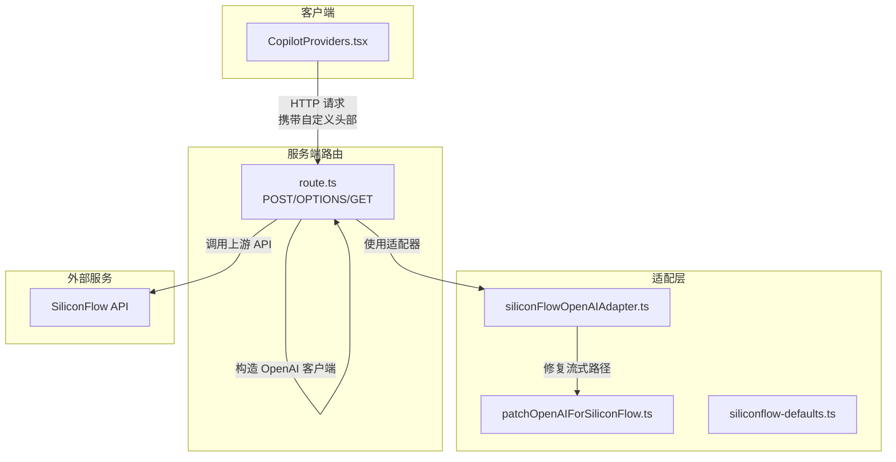
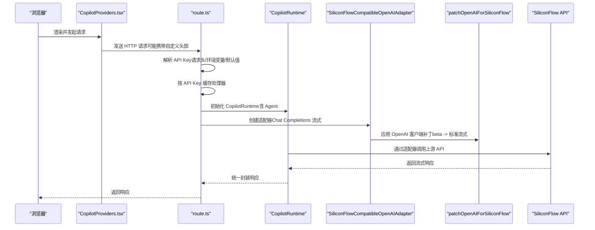
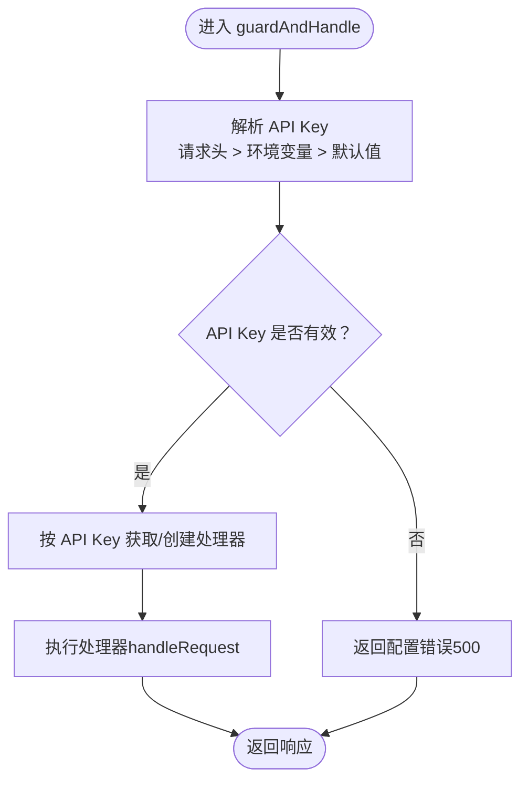
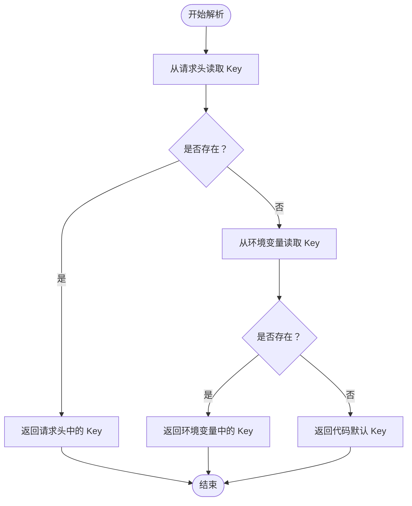
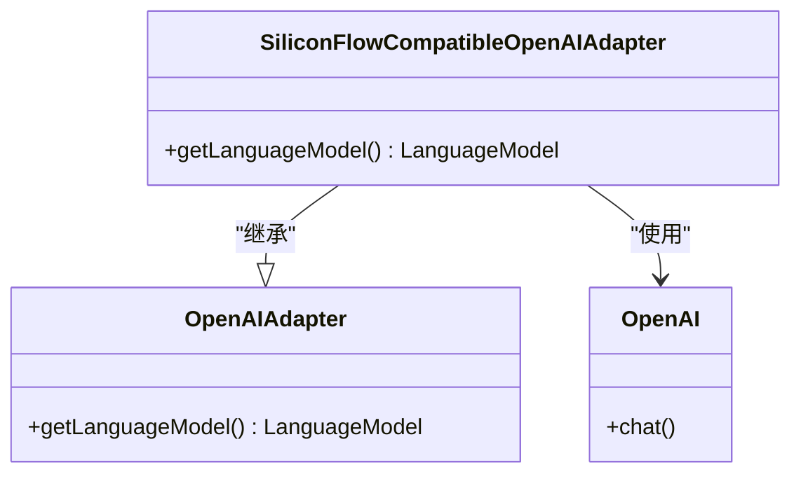
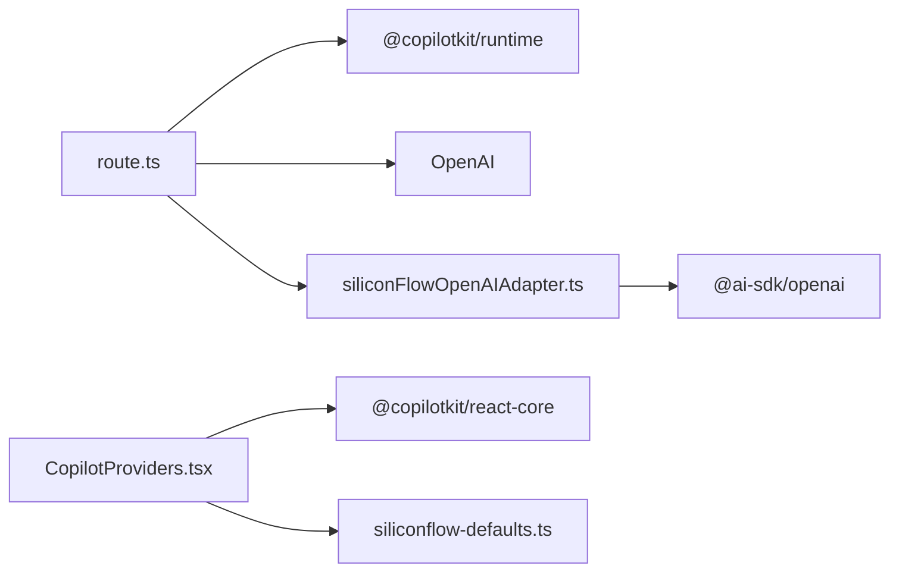

# CopilotKit API 路由

<cite>
**本文引用的文件**
- [route.ts](file://app/api/copilotkit/route.ts)
- [siliconFlowOpenAIAdapter.ts](file://lib/siliconFlowOpenAIAdapter.ts)
- [siliconflow-defaults.ts](file://lib/siliconflow-defaults.ts)
- [patchOpenAIForSiliconFlow.ts](file://lib/patchOpenAIForSiliconFlow.ts)
- [CopilotProviders.tsx](file://components/CopilotProviders.tsx)
- [package.json](file://package.json)
- [next.config.js](file://next.config.js)
</cite>

## 目录
1. [简介](#简介)
2. [项目结构](#项目结构)
3. [核心组件](#核心组件)
4. [架构总览](#架构总览)
5. [详细组件分析](#详细组件分析)
6. [依赖关系分析](#依赖关系分析)
7. [性能考量](#性能考量)
8. [故障排查指南](#故障排查指南)
9. [结论](#结论)
10. [附录](#附录)

## 简介
本文件面向 CopilotKit API 路由的实现与使用，重点阐述以下内容：
- 服务端代理机制设计：CopilotRuntime 初始化、Hono 处理器缓存策略与请求路由处理流程
- API Key 解析机制：优先级顺序（请求头 > 环境变量 > 默认值）与安全验证
- 健康检查端点：GET 请求的配置状态检查与错误处理
- 请求预检处理（OPTIONS 方法）与跨域配置
- 使用示例与调试技巧

## 项目结构
本项目采用 Next.js App Router 结构，核心路由位于 app/api/copilotkit/route.ts，配套的适配器与工具函数位于 lib 目录，前端 CopilotKit 客户端封装位于 components/CopilotProviders.tsx。

图表来源
- [route.ts:1-131](file://app/api/copilotkit/route.ts#L1-L131)
- [siliconFlowOpenAIAdapter.ts:1-36](file://lib/siliconFlowOpenAIAdapter.ts#L1-L36)
- [patchOpenAIForSiliconFlow.ts:1-22](file://lib/patchOpenAIForSiliconFlow.ts#L1-L22)
- [siliconflow-defaults.ts:1-16](file://lib/siliconflow-defaults.ts#L1-L16)
- [CopilotProviders.tsx:1-157](file://components/CopilotProviders.tsx#L1-L157)

章节来源
- [route.ts:1-131](file://app/api/copilotkit/route.ts#L1-L131)
- [CopilotProviders.tsx:1-157](file://components/CopilotProviders.tsx#L1-L157)

## 核心组件
- 服务端路由处理器：负责解析 API Key、按 Key 缓存处理器、执行 CopilotKit 运行时并返回响应
- 适配器：将 CopilotKit 的 OpenAI 适配器切换为 Chat Completions 流式协议，适配 SiliconFlow 网关
- 客户端封装：负责在浏览器侧设置自定义请求头、持久化用户 Key、健康检查状态提示
- OpenAI 客户端补丁：将 beta 流式接口代理到标准流式接口，解决兼容性问题

章节来源
- [route.ts:1-131](file://app/api/copilotkit/route.ts#L1-L131)
- [siliconFlowOpenAIAdapter.ts:1-36](file://lib/siliconFlowOpenAIAdapter.ts#L1-L36)
- [patchOpenAIForSiliconFlow.ts:1-22](file://lib/patchOpenAIForSiliconFlow.ts#L1-L22)
- [CopilotProviders.tsx:1-157](file://components/CopilotProviders.tsx#L1-L157)

## 架构总览
下图展示了从浏览器到服务端再到上游 API 的完整链路，以及关键的适配与补丁逻辑。

图表来源
- [route.ts:1-131](file://app/api/copilotkit/route.ts#L1-L131)
- [siliconFlowOpenAIAdapter.ts:1-36](file://lib/siliconFlowOpenAIAdapter.ts#L1-L36)
- [patchOpenAIForSiliconFlow.ts:1-22](file://lib/patchOpenAIForSiliconFlow.ts#L1-L22)
- [CopilotProviders.tsx:1-157](file://components/CopilotProviders.tsx#L1-L157)

## 详细组件分析

### 服务端代理机制与处理器缓存
- CopilotRuntime 初始化：在每次 API Key 变化时创建新的 CopilotRuntime 实例，并绑定内置 Agent 与适配器
- Hono 处理器缓存策略：以 API Key 为键，缓存对应的请求处理函数，避免重复初始化运行时，提升稳定性与性能
- 请求路由处理流程：统一入口 guardAndHandle，先解析 API Key 并进行有效性校验，再根据 API Key 获取或创建处理器并执行

图表来源
- [route.ts:100-114](file://app/api/copilotkit/route.ts#L100-L114)

章节来源
- [route.ts:45-95](file://app/api/copilotkit/route.ts#L45-L95)

### API Key 解析机制与安全验证
- 优先级顺序：请求头（用户在前端「API」面板保存的 Key） > 环境变量（SILICONFLOW_API_KEY） > 代码内默认值
- 安全验证：若解析不到有效 Key，直接返回配置错误（500），阻止后续处理
- 前端行为：CopilotProviders 默认不向浏览器注入 Key；仅当用户在「API」面板保存 Key 时才通过自定义头部发送

图表来源
- [route.ts:30-36](file://app/api/copilotkit/route.ts#L30-L36)
- [siliconflow-defaults.ts:1-16](file://lib/siliconflow-defaults.ts#L1-L16)
- [CopilotProviders.tsx:126-133](file://components/CopilotProviders.tsx#L126-L133)

章节来源
- [route.ts:27-43](file://app/api/copilotkit/route.ts#L27-L43)
- [siliconflow-defaults.ts:1-16](file://lib/siliconflow-defaults.ts#L1-L16)
- [CopilotProviders.tsx:126-133](file://components/CopilotProviders.tsx#L126-L133)

### 健康检查端点（GET）
- 功能：返回服务端配置状态（是否已配置 Key）、当前使用的 base URL 与模型信息
- 安全性：不暴露任何 Key，仅用于前端判断是否可走「零浏览器配置」
- 错误处理：GET 本身不参与 CopilotKit 协议，仅返回状态信息

章节来源
- [route.ts:119-130](file://app/api/copilotkit/route.ts#L119-L130)

### 请求预检处理（OPTIONS）与跨域配置
- 预检触发：浏览器在发送带自定义头部的请求时会先发送 OPTIONS 预检，服务端必须导出 OPTIONS 处理器
- 跨域配置：本实现未显式设置 CORS 头，但通过 Next.js App Router 的默认行为与前端同源策略满足需求；如需跨域，请在服务端明确设置 CORS 头

章节来源
- [route.ts:97-114](file://app/api/copilotkit/route.ts#L97-L114)

### 适配器与客户端补丁
- 适配器：将 CopilotKit 的 OpenAI 适配器切换为 Chat Completions 流式协议，确保与 SiliconFlow 等网关兼容
- 客户端补丁：将 beta 流式接口代理到标准流式接口，避免上游网关不支持 beta 路径导致的 404

图表来源
- [siliconFlowOpenAIAdapter.ts:1-36](file://lib/siliconFlowOpenAIAdapter.ts#L1-L36)

章节来源
- [siliconFlowOpenAIAdapter.ts:1-36](file://lib/siliconFlowOpenAIAdapter.ts#L1-L36)
- [patchOpenAIForSiliconFlow.ts:1-22](file://lib/patchOpenAIForSiliconFlow.ts#L1-L22)

### 前端集成与调试要点
- 自定义头部：前端通过 CopilotProviders 注入自定义头部，携带用户 Key 或空值（交由服务端处理）
- 健康检查：首次渲染时自动拉取 GET /api/copilotkit，判断服务端是否已配置 Key
- 开发控制台：显式关闭 showDevConsole，避免在本地因底层异常弹出错误横幅
- Fetch 补丁：针对 CopilotKit 运行时可能出现的空响应进行兜底处理，避免 JSON 解析错误

章节来源
- [CopilotProviders.tsx:49-156](file://components/CopilotProviders.tsx#L49-L156)

## 依赖关系分析
- 路由依赖 CopilotKit 运行时与适配器，适配器依赖 OpenAI 客户端与 @ai-sdk/openai
- 客户端依赖 @copilotkit/react-core，通过自定义头部与服务端通信
- 项目使用 Next.js 14.2.5，无额外跨域配置

图表来源
- [route.ts:1-15](file://app/api/copilotkit/route.ts#L1-L15)
- [CopilotProviders.tsx:1-15](file://components/CopilotProviders.tsx#L1-L15)
- [package.json:12-20](file://package.json#L12-L20)

章节来源
- [package.json:12-20](file://package.json#L12-L20)

## 性能考量
- 处理器缓存：按 API Key 缓存处理器，避免重复初始化 CopilotRuntime 与 OpenAI 客户端，显著降低冷启动开销
- 并行工具调用：在 CopilotRuntime 初始化时显式禁用并行工具调用，减少兼容性问题带来的重试与失败
- 流式协议：通过适配器与补丁统一走标准 Chat Completions 流式协议，减少路径差异导致的性能波动

章节来源
- [route.ts:45-95](file://app/api/copilotkit/route.ts#L45-L95)
- [siliconFlowOpenAIAdapter.ts:1-36](file://lib/siliconFlowOpenAIAdapter.ts#L1-L36)
- [patchOpenAIForSiliconFlow.ts:1-22](file://lib/patchOpenAIForSiliconFlow.ts#L1-L22)

## 故障排查指南
- 未配置有效 API Key：解析到空 Key 时直接返回配置错误（500）。请检查请求头、环境变量或默认值是否正确设置
- 模型不可用：若上游返回 404（如旧模型 ID 下线），请检查 SILICONFLOW_MODEL 环境变量，确保使用兼容的模型
- 跨域问题：若浏览器提示跨域错误，请在服务端显式设置 CORS 头
- 流式工具调用异常：若出现「RUN_FINISHED while tool calls are still active」，请确认已应用补丁并禁用并行工具调用
- 健康检查失败：GET /api/copilotkit 返回非 200 或无效 JSON 时，前端会回退到未配置状态；请检查服务端日志与环境变量

章节来源
- [route.ts:100-114](file://app/api/copilotkit/route.ts#L100-L114)
- [route.ts:119-130](file://app/api/copilotkit/route.ts#L119-L130)
- [CopilotProviders.tsx:89-113](file://components/CopilotProviders.tsx#L89-L113)

## 结论
本实现通过“请求头 > 环境变量 > 默认值”的 API Key 解析策略与按 Key 缓存的处理器机制，兼顾了安全性与性能；通过适配器与客户端补丁解决了上游网关的兼容性问题；前端通过健康检查与自定义头部实现了灵活的配置与调试体验。整体架构清晰、扩展性强，适合在 Next.js 生态中稳定运行。

## 附录

### 如何正确配置与使用
- 设置环境变量
  - 在本地或部署平台设置 SILICONFLOW_API_KEY（推荐）
  - 可选：设置 SILICONFLOW_BASE_URL 与 SILICONFLOW_MODEL
- 前端配置
  - 在 CopilotProviders 中使用 runtimeUrl="/api/copilotkit"
  - 通过「API」面板保存 Key，将自动通过自定义头部发送
- 健康检查
  - 访问 GET /api/copilotkit 查看服务端配置状态
- 调试技巧
  - 关闭本地开发控制台：showDevConsole=false
  - 打开浏览器网络面板，观察 OPTIONS 预检与实际请求
  - 检查服务端日志，定位 500 配置错误与上游 404

章节来源
- [route.ts:16-25](file://app/api/copilotkit/route.ts#L16-L25)
- [route.ts:119-130](file://app/api/copilotkit/route.ts#L119-L130)
- [CopilotProviders.tsx:146-156](file://components/CopilotProviders.tsx#L146-L156)