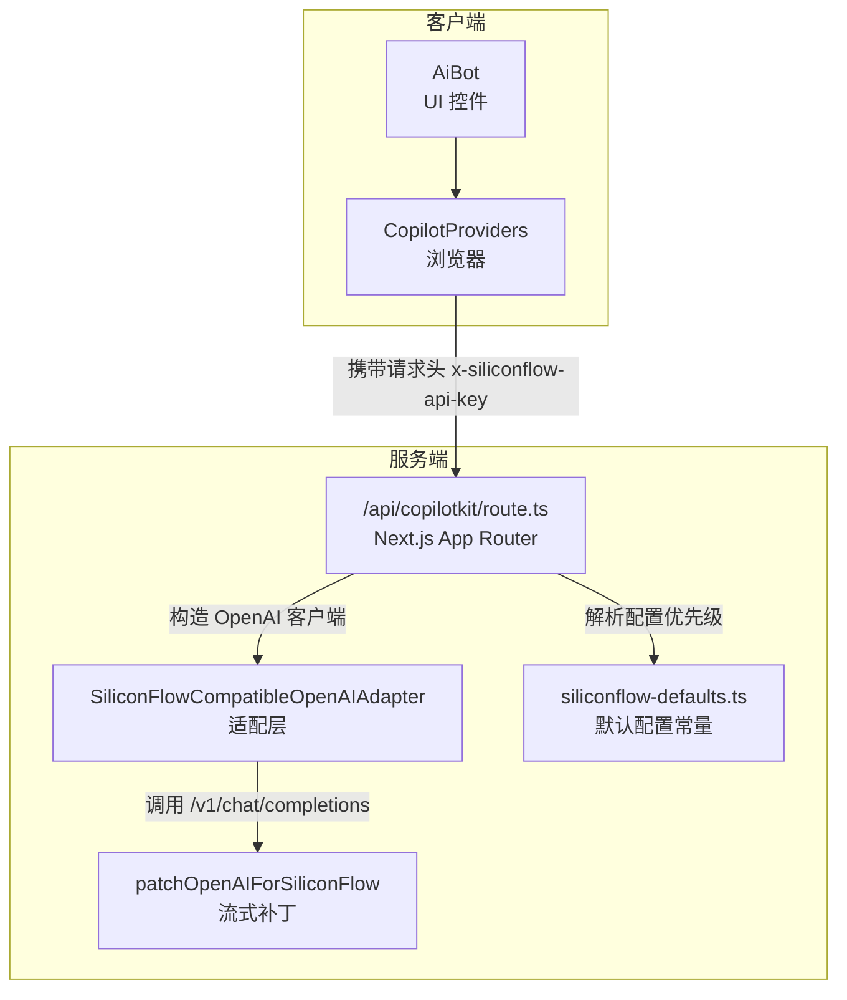
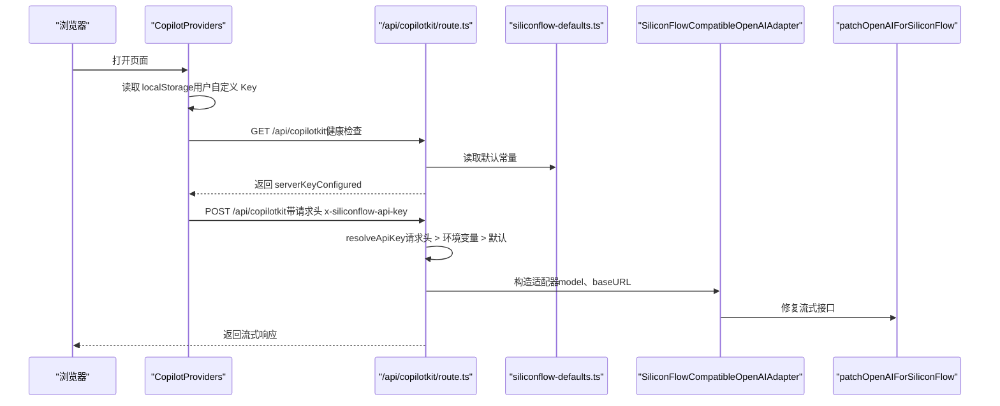
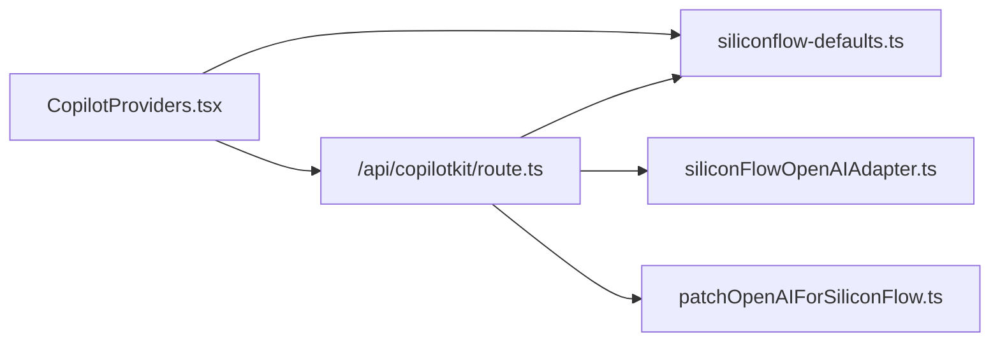

# 环境配置管理

<cite>
**本文档引用的文件**
- [app/api/copilotkit/route.ts](file://app/api/copilotkit/route.ts)
- [lib/siliconflow-defaults.ts](file://lib/siliconflow-defaults.ts)
- [lib/siliconFlowOpenAIAdapter.ts](file://lib/siliconFlowOpenAIAdapter.ts)
- [lib/patchOpenAIForSiliconFlow.ts](file://lib/patchOpenAIForSiliconFlow.ts)
- [components/CopilotProviders.tsx](file://components/CopilotProviders.tsx)
- [README.md](file://README.md)
- [package.json](file://package.json)
</cite>

## 目录
1. [简介](#简介)
2. [项目结构](#项目结构)
3. [核心组件](#核心组件)
4. [架构概览](#架构概览)
5. [详细组件分析](#详细组件分析)
6. [依赖关系分析](#依赖关系分析)
7. [性能考量](#性能考量)
8. [故障排除指南](#故障排除指南)
9. [结论](#结论)
10. [附录](#附录)

## 简介
本文件系统性地文档化了本项目的环境配置管理方案，重点涵盖以下方面：
- SILICONFLOW_API_KEY 的配置方法：环境变量设置、请求头传递、默认值处理机制
- SILICONFLOW_BASE_URL 与 SILICONFLOW_MODEL 的配置选项与默认值
- 配置优先级规则与安全考虑
- 不同部署环境（开发、测试、生产）的配置示例与差异
- 配置验证机制与常见错误排查
- 配置更新最佳实践与热重载机制

## 项目结构
本项目围绕 Next.js App Router 的 API 路由与客户端 Provider 组件，实现了对硅基流动（SiliconFlow）API 的适配与配置管理。关键文件分布如下：
- 服务端 API 路由：负责解析配置、选择 API Key、构造 OpenAI 客户端并转发请求
- 客户端 Provider：负责在浏览器侧决定是否携带用户自定义 Key，并与服务端进行健康检查
- 适配层：针对 SiliconFlow 的 OpenAI 兼容网关特性进行协议适配与流式补丁
- 默认配置常量：定义请求头键名、默认 API Key 与用户 Key 存储键

图表来源
- [app/api/copilotkit/route.ts:1-131](file://app/api/copilotkit/route.ts#L1-L131)
- [components/CopilotProviders.tsx:1-157](file://components/CopilotProviders.tsx#L1-L157)
- [lib/siliconFlowOpenAIAdapter.ts:1-36](file://lib/siliconFlowOpenAIAdapter.ts#L1-L36)
- [lib/patchOpenAIForSiliconFlow.ts:1-22](file://lib/patchOpenAIForSiliconFlow.ts#L1-L22)
- [lib/siliconflow-defaults.ts:1-16](file://lib/siliconflow-defaults.ts#L1-L16)

章节来源
- [README.md:12-30](file://README.md#L12-L30)
- [package.json:1-29](file://package.json#L1-L29)

## 核心组件
本节聚焦于配置相关的三个核心组件及其职责：
- 服务端 API 路由：解析配置优先级、选择 API Key、构造 OpenAI 客户端、缓存处理器、健康检查
- 客户端 Provider：根据用户输入与本地存储决定是否携带请求头、向服务端发起健康检查
- 默认配置常量：统一管理请求头键名、默认 API Key 与用户 Key 存储键

章节来源
- [app/api/copilotkit/route.ts:16-43](file://app/api/copilotkit/route.ts#L16-L43)
- [components/CopilotProviders.tsx:49-156](file://components/CopilotProviders.tsx#L49-L156)
- [lib/siliconflow-defaults.ts:1-16](file://lib/siliconflow-defaults.ts#L1-L16)

## 架构概览
下图展示了从浏览器到服务端的配置传递与解析流程，以及关键的配置优先级决策点。

图表来源
- [components/CopilotProviders.tsx:89-113](file://components/CopilotProviders.tsx#L89-L113)
- [app/api/copilotkit/route.ts:27-43](file://app/api/copilotkit/route.ts#L27-L43)
- [lib/siliconflow-defaults.ts:1-16](file://lib/siliconflow-defaults.ts#L1-L16)
- [lib/siliconFlowOpenAIAdapter.ts:17-35](file://lib/siliconFlowOpenAIAdapter.ts#L17-L35)
- [lib/patchOpenAIForSiliconFlow.ts:12-21](file://lib/patchOpenAIForSiliconFlow.ts#L12-L21)

## 详细组件分析

### 服务端 API 路由（配置解析与优先级）
- 配置来源与默认值
  - SILICONFLOW_BASE_URL：优先读取环境变量，未设置时使用默认值
  - SILICONFLOW_MODEL：优先读取环境变量，未设置时使用默认模型标识
  - SILICONFLOW_API_KEY：优先级为“请求头 > 环境变量 > 代码内默认”
- 关键逻辑
  - resolveApiKey：按优先级解析 API Key
  - serverHasConfiguredSiliconflowKey：用于健康检查，判断服务端是否具备可用 Key
  - getHandleForApiKey：按 API Key 缓存处理器，避免重复初始化
- 错误处理
  - 当 API Key 为空时返回明确的配置错误响应
  - 健康检查接口返回当前 baseURL、model 与 serverKeyConfigured 状态

章节来源
- [app/api/copilotkit/route.ts:16-43](file://app/api/copilotkit/route.ts#L16-L43)
- [app/api/copilotkit/route.ts:48-95](file://app/api/copilotkit/route.ts#L48-L95)
- [app/api/copilotkit/route.ts:100-114](file://app/api/copilotkit/route.ts#L100-L114)
- [app/api/copilotkit/route.ts:120-130](file://app/api/copilotkit/route.ts#L120-L130)

### 客户端 Provider（请求头与本地存储）
- 请求头策略
  - 若用户在「API」面板保存了 Key，则将其作为请求头 x-siliconflow-api-key 发送
  - 若未保存，且存在 NEXT_PUBLIC_SILICONFLOW_API_KEY（构建时注入），则作为请求头发送（不推荐）
  - 否则不携带请求头，由服务端使用环境变量或默认值
- 本地存储
  - 用户 Key 保存在 localStorage 中，键名为 siliconflow_api_key
  - 服务端健康检查接口返回 serverKeyConfigured，用于 UI 提示
- 错误处理
  - 对空响应进行 JSON 包装，避免底层语法错误导致的异常

章节来源
- [components/CopilotProviders.tsx:49-156](file://components/CopilotProviders.tsx#L49-L156)
- [lib/siliconflow-defaults.ts:12-16](file://lib/siliconflow-defaults.ts#L12-L16)

### 默认配置常量（请求头键名与默认值）
- SILICONFLOW_API_KEY_HEADER：请求头键名
- SILICONFLOW_DEFAULT_API_KEY：代码内默认 API Key（可留空）
- SILICONFLOW_USER_KEY_STORAGE：用户 Key 在 localStorage 中的存储键

章节来源
- [lib/siliconflow-defaults.ts:1-16](file://lib/siliconflow-defaults.ts#L1-L16)

### 适配层与流式补丁（协议兼容）
- SiliconFlowCompatibleOpenAIAdapter：强制使用 /v1/chat/completions，而非 /v1/responses
- patchOpenAIForSiliconFlow：将 beta.stream 代理到标准流式接口，解决兼容性问题

章节来源
- [lib/siliconFlowOpenAIAdapter.ts:17-35](file://lib/siliconFlowOpenAIAdapter.ts#L17-L35)
- [lib/patchOpenAIForSiliconFlow.ts:12-21](file://lib/patchOpenAIForSiliconFlow.ts#L12-L21)

## 依赖关系分析
- 组件耦合
  - /api/copilotkit/route.ts 依赖 siliconflow-defaults.ts 获取请求头键名与默认值
  - /api/copilotkit/route.ts 依赖 siliconFlowOpenAIAdapter.ts 与 patchOpenAIForSiliconFlow.ts 实现协议适配
  - CopilotProviders.tsx 依赖 siliconflow-defaults.ts 与服务端健康检查接口
- 外部依赖
  - Next.js App Router、@copilotkit/react-core、@copilotkit/runtime、OpenAI SDK

图表来源
- [app/api/copilotkit/route.ts:1-15](file://app/api/copilotkit/route.ts#L1-L15)
- [components/CopilotProviders.tsx:1-14](file://components/CopilotProviders.tsx#L1-L14)
- [lib/siliconFlowOpenAIAdapter.ts:1-8](file://lib/siliconFlowOpenAIAdapter.ts#L1-L8)
- [lib/patchOpenAIForSiliconFlow.ts:1-3](file://lib/patchOpenAIForSiliconFlow.ts#L1-L3)

章节来源
- [package.json:12-27](file://package.json#L12-L27)

## 性能考量
- 处理器缓存
  - 按 API Key 缓存 Hono 处理器，避免每次请求重建 CopilotRuntime，提升稳定性与性能
- 流式协议优化
  - 通过补丁将 beta.stream 代理到标准流式接口，确保与 SiliconFlow 兼容
- 适配器选择
  - 使用 chat 模型路径，避免 Responses API 导致的 404

章节来源
- [app/api/copilotkit/route.ts:46-95](file://app/api/copilotkit/route.ts#L46-L95)
- [lib/siliconFlowOpenAIAdapter.ts:17-35](file://lib/siliconFlowOpenAIAdapter.ts#L17-L35)
- [lib/patchOpenAIForSiliconFlow.ts:12-21](file://lib/patchOpenAIForSiliconFlow.ts#L12-L21)

## 故障排除指南
- 常见错误与排查
  - AI_APICallError: Not Found
    - 检查 SILICONFLOW_MODEL 是否仍在平台上架且名称正确
    - 确认服务端 baseURL 与 model 设置
  - 404（Responses API）
    - 确保使用 SiliconFlowCompatibleOpenAIAdapter，强制走 /v1/chat/completions
  - 流式工具调用异常
    - 确认已禁用并行工具调用，或应用补丁以补齐工具调用结束信号
- 健康检查
  - GET /api/copilotkit 返回 serverKeyConfigured，用于判断服务端是否已配置有效 Key
- 配置验证
  - 服务端在 resolveApiKey 失败时返回明确的配置错误响应

章节来源
- [README.md:25-30](file://README.md#L25-L30)
- [app/api/copilotkit/route.ts:100-114](file://app/api/copilotkit/route.ts#L100-L114)
- [app/api/copilotkit/route.ts:120-130](file://app/api/copilotkit/route.ts#L120-L130)

## 结论
本项目通过清晰的配置优先级、严格的客户端与服务端分离策略，以及完善的适配层与补丁机制，实现了对 SiliconFlow 的稳定集成。推荐在生产环境中仅配置环境变量，避免将敏感信息打入前端包；同时利用健康检查与错误响应快速定位配置问题。

## 附录

### 配置优先级规则
- API Key 优先级（服务端）：请求头（用户在站内「API」保存的 Key） > 环境变量 SILICONFLOW_API_KEY > 代码内默认
- baseURL 与 model：均优先读取环境变量，未设置时采用默认值

章节来源
- [app/api/copilotkit/route.ts:27-43](file://app/api/copilotkit/route.ts#L27-L43)
- [app/api/copilotkit/route.ts:16-25](file://app/api/copilotkit/route.ts#L16-L25)

### 安全考虑
- 默认不将 API Key 打进前端包，仅在用户主动保存时通过请求头发送
- 建议在公开仓库中仅配置环境变量，避免硬编码默认值
- 仅在 HTTPS 环境下使用浏览器存储的 Key

章节来源
- [README.md:12-16](file://README.md#L12-L16)
- [components/CopilotProviders.tsx:42-48](file://components/CopilotProviders.tsx#L42-L48)
- [lib/siliconflow-defaults.ts:1-8](file://lib/siliconflow-defaults.ts#L1-L8)

### 不同部署环境的配置示例
- 开发环境（本地）
  - 在 .env.local 中配置 SILICONFLOW_API_KEY、SILICONFLOW_MODEL、SILICONFLOW_BASE_URL
- 测试环境
  - 与开发环境类似，但建议使用独立的测试 Key 与模型
- 生产环境（Vercel）
  - 在 Vercel 项目 Settings → Environment Variables 中添加同名变量，部署后访客无需在网页填 Key

章节来源
- [README.md:18-23](file://README.md#L18-L23)
- [README.md:49-54](file://README.md#L49-L54)

### 配置验证机制
- 健康检查接口：GET /api/copilotkit 返回 serverKeyConfigured、baseURL、model 等信息
- 配置错误响应：当 API Key 解析失败时返回明确的配置错误

章节来源
- [app/api/copilotkit/route.ts:120-130](file://app/api/copilotkit/route.ts#L120-L130)
- [app/api/copilotkit/route.ts:100-114](file://app/api/copilotkit/route.ts#L100-L114)

### 配置更新最佳实践与热重载
- 更新环境变量后需重新部署（Vercel）或重启服务（本地）
- 处理器按 API Key 缓存，切换 Key 后会自动重建对应处理器
- 建议在变更模型或 baseURL 后进行冒烟测试（参考 README 中的本地冒烟步骤）

章节来源
- [README.md:30-30](file://README.md#L30-L30)
- [app/api/copilotkit/route.ts:46-95](file://app/api/copilotkit/route.ts#L46-L95)