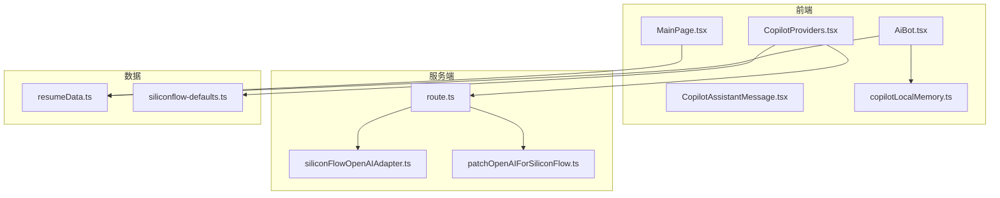
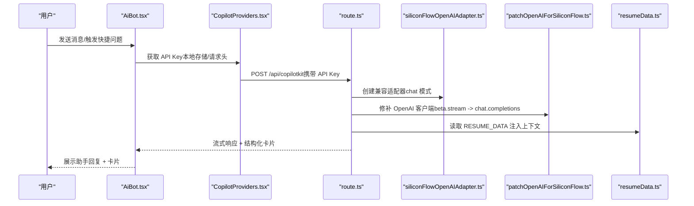
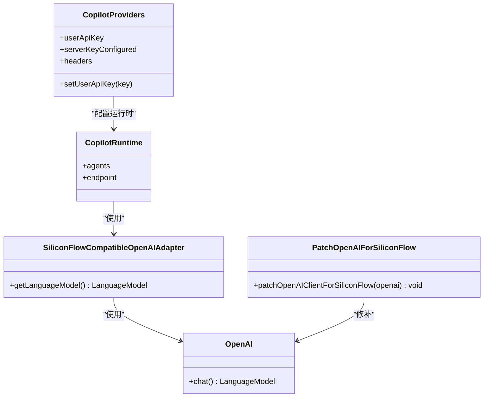
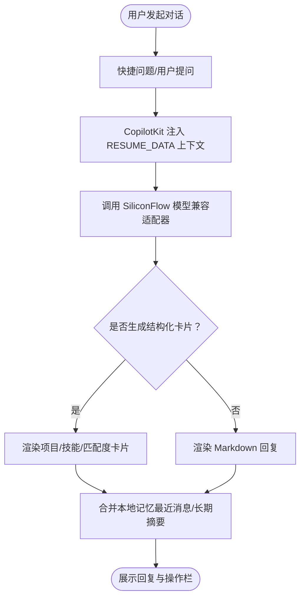
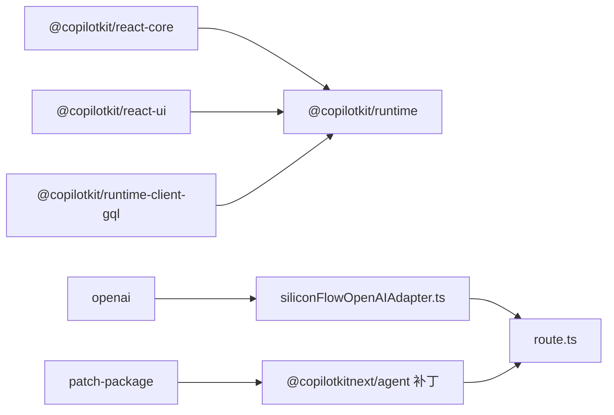

# 个人信息数据管理

<cite>
**本文档引用的文件**
- [resumeData.ts](file://lib/resumeData.ts)
- [route.ts](file://app/api/copilotkit/route.ts)
- [CopilotProviders.tsx](file://components/CopilotProviders.tsx)
- [AiBot.tsx](file://components/AiBot.tsx)
- [copilotLocalMemory.ts](file://lib/copilotLocalMemory.ts)
- [siliconFlowOpenAIAdapter.ts](file://lib/siliconFlowOpenAIAdapter.ts)
- [patchOpenAIForSiliconFlow.ts](file://lib/patchOpenAIForSiliconFlow.ts)
- [siliconflow-defaults.ts](file://lib/siliconflow-defaults.ts)
- [MainPage.tsx](file://components/MainPage.tsx)
- [CopilotAssistantMessage.tsx](file://components/CopilotAssistantMessage.tsx)
- [@copilotkitnext+agent+1.54.0.patch](file://patches/@copilotkitnext+agent+1.54.0.patch)
- [package.json](file://package.json)
</cite>

## 目录
1. [简介](#简介)
2. [项目结构](#项目结构)
3. [核心组件](#核心组件)
4. [架构总览](#架构总览)
5. [详细组件分析](#详细组件分析)
6. [依赖关系分析](#依赖关系分析)
7. [性能考量](#性能考量)
8. [故障排查指南](#故障排查指南)
9. [结论](#结论)
10. [附录](#附录)

## 简介
本项目为“傅倩娇 AI 个人主页”中的“个人信息数据管理系统”，围绕 RESUME_DATA 数据模型构建，提供结构化的个人信息、教育背景、工作经历、项目经历、技能标签、AI 观点与岗位匹配度等数据模块。系统通过 CopilotKit 将这些数据注入到 AI 助手中，使用户在与 AI 对话时能够获得基于真实数据的智能回答与结构化卡片展示。本文档将深入解析数据模型设计理念、字段约束与验证规则，阐述 CopilotKit 的知识库注入机制，说明数据更新流程、版本管理策略与维护最佳实践，并提供扩展与修改数据结构的示例路径与使用方法。

## 项目结构
项目采用 Next.js 14 应用结构，核心数据位于 lib/resumeData.ts，AI 对话集成在 components/AiBot.tsx 中，服务端路由在 app/api/copilotkit/route.ts，前端提供 CopilotKit 的运行时配置与本地记忆持久化。

图表来源
- [AiBot.tsx:1-120](file://components/AiBot.tsx#L1-L120)
- [CopilotProviders.tsx:1-157](file://components/CopilotProviders.tsx#L1-L157)
- [route.ts:1-131](file://app/api/copilotkit/route.ts#L1-L131)
- [siliconFlowOpenAIAdapter.ts:1-36](file://lib/siliconFlowOpenAIAdapter.ts#L1-L36)
- [patchOpenAIForSiliconFlow.ts:1-22](file://lib/patchOpenAIForSiliconFlow.ts#L1-L22)
- [resumeData.ts:1-263](file://lib/resumeData.ts#L1-L263)
- [siliconflow-defaults.ts:1-16](file://lib/siliconflow-defaults.ts#L1-L16)

章节来源
- [package.json:1-29](file://package.json#L1-L29)

## 核心组件
- RESUME_DATA 数据模型：集中定义个人信息、教育背景、工作经历、项目经历、技能标签、AI 观点与岗位匹配度等模块，提供类型安全的数据结构与可扩展的字段。
- CopilotKit 服务端路由：封装 SiliconFlow 兼容适配器与 OpenAI 客户端补丁，确保流式聊天与工具调用的正确性。
- 前端 Copilot 提供者：负责 API Key 的解析、本地存储与请求头注入，以及本地对话记忆的持久化与合并。
- AI Bot 组件：整合结构化卡片渲染（项目亮点、技能栈、岗位匹配度等），并与 RESUME_DATA 数据进行绑定。
- 本地记忆模块：对最近对话与长期摘要进行持久化，提升上下文连贯性。

章节来源
- [resumeData.ts:5-263](file://lib/resumeData.ts#L5-L263)
- [route.ts:1-131](file://app/api/copilotkit/route.ts#L1-L131)
- [CopilotProviders.tsx:1-157](file://components/CopilotProviders.tsx#L1-L157)
- [AiBot.tsx:1-120](file://components/AiBot.tsx#L1-L120)
- [copilotLocalMemory.ts:1-77](file://lib/copilotLocalMemory.ts#L1-L77)

## 架构总览
系统通过前端 CopilotProviders 将 API Key 注入到 CopilotKit 运行时，服务端 route.ts 创建 CopilotRuntime 并使用 SiliconFlow 兼容适配器，将 RESUME_DATA 注入到 AI 的上下文中，从而在对话中提供结构化回答与卡片展示。

图表来源
- [CopilotProviders.tsx:115-156](file://components/CopilotProviders.tsx#L115-L156)
- [route.ts:48-95](file://app/api/copilotkit/route.ts#L48-L95)
- [siliconFlowOpenAIAdapter.ts:17-35](file://lib/siliconFlowOpenAIAdapter.ts#L17-L35)
- [patchOpenAIForSiliconFlow.ts:12-21](file://lib/patchOpenAIForSiliconFlow.ts#L12-L21)
- [resumeData.ts:5-263](file://lib/resumeData.ts#L5-L263)

## 详细组件分析

### RESUME_DATA 数据模型设计
- 数据模块划分
  - 基本信息（basic）：姓名、年龄、所在地、家乡、目标职位、电话、微信、邮箱、简历链接等基础字段。
  - 教育背景（education）：学校、专业、GPA、学习时间段。
  - 工作经历（experience）：公司、角色、时间段、高光成就列表（数组）。
  - 项目经历（projects）：项目 ID、名称、公司、时间段、指标（metrics）、STAR 拆解（star）。
  - 技能标签（skills）：AI 能力、低代码/自动化、产品工具链、证书等分组。
  - AI 观点（aiNotebookOpinions）：观点 ID、标题、副标题、缺口与建议、相关链接。
  - 岗位匹配度（matchScore/jobMatchAliAiNotebookCard）：整体分数、维度分数、最强匹配点、潜在缺口。
  - 技能卡片（skillsChatCard）：交付数据、CTA、分组技能与强调标记。
- 类型安全与扩展性
  - 导出类型 ResumeData，便于在组件中进行类型约束与自动补全。
  - 各模块字段采用明确的键名与数据类型，便于前端渲染与后端校验。
- 数据验证与约束
  - 字符串字段用于描述性内容，数值/百分比字段用于可视化展示。
  - 列表字段（如 experience/highlights、projects/metrics）遵循固定结构，便于组件映射。
  - 关联字段（如 projects.id 与导航跳转）保持一致性，避免运行时错误。

章节来源
- [resumeData.ts:5-263](file://lib/resumeData.ts#L5-L263)

### CopilotKit 知识库注入机制
- 服务端适配与补丁
  - SiliconFlow 兼容适配器：将默认 Responses API 切换为 Chat Completions，确保与流式协议一致。
  - OpenAI 客户端补丁：将 beta.stream 代理到标准 chat.completions.create，解决兼容网关不支持 beta 路径的问题。
- 运行时配置
  - CopilotRuntime 使用 BuiltInAgent + 服务适配器，禁用并行工具调用以适配网关行为。
  - 通过 patch 文件在 AG-UI 层面补齐 TOOL_CALL_END 事件，避免 RUN_FINISHED 前仍有活跃工具调用导致的错误。
- 前端注入
  - CopilotProviders 读取本地存储的 API Key，若存在则通过请求头注入；否则使用服务端环境变量。
  - 本地记忆持久化：对最近消息与长期摘要进行剪裁与合并，提升上下文连贯性。

图表来源
- [siliconFlowOpenAIAdapter.ts:17-35](file://lib/siliconFlowOpenAIAdapter.ts#L17-L35)
- [patchOpenAIForSiliconFlow.ts:12-21](file://lib/patchOpenAIForSiliconFlow.ts#L12-L21)
- [route.ts:73-95](file://app/api/copilotkit/route.ts#L73-L95)
- [CopilotProviders.tsx:144-156](file://components/CopilotProviders.tsx#L144-L156)

章节来源
- [route.ts:48-95](file://app/api/copilotkit/route.ts#L48-L95)
- [siliconFlowOpenAIAdapter.ts:17-35](file://lib/siliconFlowOpenAIAdapter.ts#L17-L35)
- [patchOpenAIForSiliconFlow.ts:12-21](file://lib/patchOpenAIForSiliconFlow.ts#L12-L21)
- [@copilotkitnext+agent+1.54.0.patch:87-99](file://patches/@copilotkitnext+agent+1.54.0.patch#L87-L99)

### AI Bot 组件与结构化卡片
- 快捷问题与引导
  - 首次进入展示“核心项目/AI笔记看法/岗位匹配度/技能库”等快捷问题，引导用户探索。
- 结构化卡片
  - 项目亮点卡片：展示项目指标与跳转到 STAR 拆解。
  - 技能栈卡片：按分组展示技能与强调标记，提供交付数据概览与跳转。
  - 岗位匹配度卡片：展示综合分数与维度对比、最强匹配点与潜在缺口，并提供联系方式。
- 本地记忆与对话状态
  - 通过 copilotLocalMemory 对最近消息与长期摘要进行持久化与合并，提升上下文连贯性。

图表来源
- [AiBot.tsx:34-791](file://components/AiBot.tsx#L34-L791)
- [copilotLocalMemory.ts:57-77](file://lib/copilotLocalMemory.ts#L57-L77)

章节来源
- [AiBot.tsx:34-791](file://components/AiBot.tsx#L34-L791)
- [CopilotAssistantMessage.tsx:37-196](file://components/CopilotAssistantMessage.tsx#L37-L196)
- [copilotLocalMemory.ts:1-77](file://lib/copilotLocalMemory.ts#L1-L77)

### 数据更新流程与版本管理
- 更新流程
  - 修改 lib/resumeData.ts 中对应模块字段，确保类型一致。
  - 在 AiBot.tsx/MainPage.tsx 中引用 RESUME_DATA 的新字段，确保渲染与交互正常。
  - 如涉及 API Key 或运行时行为变更，检查 route.ts 与 CopilotProviders.tsx 的配置。
- 版本管理策略
  - 使用 Git 进行版本控制，对数据结构变更添加提交信息，便于回溯。
  - 对于 CopilotKit 的补丁文件，保留 patches/@copilotkitnext+agent+1.54.0.patch，确保兼容性修复可追溯。
- 维护最佳实践
  - 保持字段命名一致性与语义清晰，避免歧义。
  - 对外暴露的字段尽量使用字符串或数值类型，便于前端渲染与可视化。
  - 对于列表字段（如 experience/highlights、projects/metrics），保持结构稳定，避免破坏组件映射。

章节来源
- [resumeData.ts:5-263](file://lib/resumeData.ts#L5-L263)
- [AiBot.tsx:1-120](file://components/AiBot.tsx#L1-L120)
- [MainPage.tsx:1-691](file://components/MainPage.tsx#L1-L691)
- [@copilotkitnext+agent+1.54.0.patch:1-125](file://patches/@copilotkitnext+agent+1.54.0.patch#L1-L125)

## 依赖关系分析
- 前端依赖
  - @copilotkit/react-core、@copilotkit/react-ui、@copilotkit/runtime、@copilotkit/runtime-client-gql：提供 AI 助手 UI 与运行时框架。
  - react、react-dom、next：前端框架与构建工具。
- 服务端依赖
  - @copilotkit/runtime、@copilotkitnext/agent：运行时与内置 Agent。
  - openai：OpenAI 客户端，配合 SiliconFlow 兼容适配器与补丁。
- 本地依赖
  - patch-package：应用补丁以修复 AG-UI 工具调用事件顺序问题。

图表来源
- [package.json:12-20](file://package.json#L12-L20)
- [route.ts:1-15](file://app/api/copilotkit/route.ts#L1-L15)
- [siliconFlowOpenAIAdapter.ts:1-8](file://lib/siliconFlowOpenAIAdapter.ts#L1-L8)
- [@copilotkitnext+agent+1.54.0.patch:1-125](file://patches/@copilotkitnext+agent+1.54.0.patch#L1-L125)

章节来源
- [package.json:12-20](file://package.json#L12-L20)

## 性能考量
- 流式响应与工具调用
  - 使用 SiliconFlow 兼容适配器与补丁，确保流式 chat 协议与工具调用事件顺序正确，减少前端等待与错误重试。
- 本地记忆剪裁
  - 对最近消息与长期摘要进行长度限制与文本剪裁，避免内存占用过高。
- API Key 解析与缓存
  - 服务端按 API Key 缓存 Hono 处理器，避免重复初始化 CopilotRuntime，提升并发性能与稳定性。

章节来源
- [route.ts:48-95](file://app/api/copilotkit/route.ts#L48-L95)
- [copilotLocalMemory.ts:16-77](file://lib/copilotLocalMemory.ts#L16-L77)

## 故障排查指南
- API Key 相关
  - 未配置有效 API Key：服务端返回配置错误，前端提示“未配置有效的硅基流动 API Key”。
  - 健康检查：GET /api/copilotkit 返回服务端 Key 配置状态与模型信息，便于诊断。
- 兼容网关问题
  - beta 路径 404：通过补丁将 beta.stream 代理到 chat.completions，确保流式协议一致。
  - 工具调用事件缺失：补丁在 RUN_FINISHED 前补齐 TOOL_CALL_END，避免 AG-UI 校验失败。
- 前端 fetch 异常
  - 对空响应进行 JSON 包装，避免 urql 解析 SyntaxError，提升稳定性。

章节来源
- [route.ts:38-131](file://app/api/copilotkit/route.ts#L38-L131)
- [patchOpenAIForSiliconFlow.ts:12-21](file://lib/patchOpenAIForSiliconFlow.ts#L12-L21)
- [@copilotkitnext+agent+1.54.0.patch:87-99](file://patches/@copilotkitnext+agent+1.54.0.patch#L87-L99)
- [CopilotProviders.tsx:64-87](file://components/CopilotProviders.tsx#L64-L87)

## 结论
本项目通过 RESUME_DATA 数据模型与 CopilotKit 的知识库注入机制，实现了以真实个人信息为核心的智能对话系统。数据模型结构清晰、类型安全，前端组件与服务端适配器协同工作，确保了流式响应与工具调用的稳定性。通过本地记忆与结构化卡片，提升了用户体验与信息传达效率。建议在后续维护中继续保持字段命名一致性、关注兼容网关的协议差异，并通过版本控制与补丁管理保障系统的可维护性与稳定性。

## 附录
- 扩展与修改数据结构示例路径
  - 新增字段：在 lib/resumeData.ts 的相应模块中添加新字段，并在 AiBot.tsx/MainPage.tsx 中引用。
  - 修改字段类型：更新类型导出 ResumeData，并在组件中进行类型约束与渲染适配。
  - 新增模块：在 lib/resumeData.ts 中新增模块对象，导出类型并在组件中引入使用。
- 在不同组件中使用数据
  - AiBot.tsx：通过 RESUME_DATA 渲染结构化卡片（项目亮点、技能栈、岗位匹配度）。
  - MainPage.tsx：在主页中展示技能图谱、匹配度雷达与项目佐证。
  - CopilotProviders.tsx：通过请求头注入 API Key，确保 CopilotKit 正常运行。
  - route.ts：通过 SiliconFlow 兼容适配器与补丁，确保与服务端模型的兼容性。

章节来源
- [resumeData.ts:5-263](file://lib/resumeData.ts#L5-L263)
- [AiBot.tsx:1-120](file://components/AiBot.tsx#L1-L120)
- [MainPage.tsx:1-691](file://components/MainPage.tsx#L1-L691)
- [CopilotProviders.tsx:1-157](file://components/CopilotProviders.tsx#L1-L157)
- [route.ts:1-131](file://app/api/copilotkit/route.ts#L1-L131)