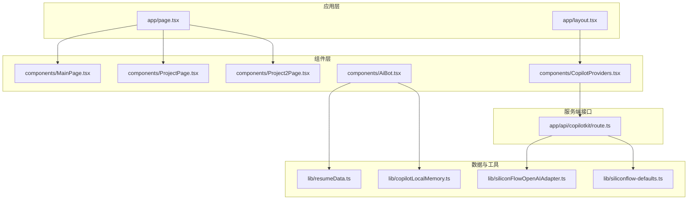
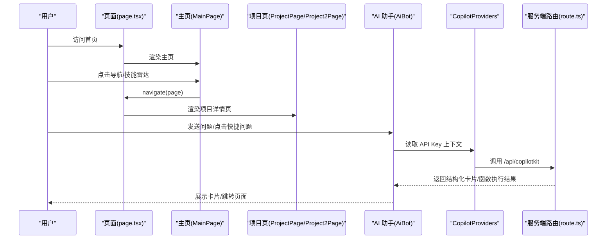
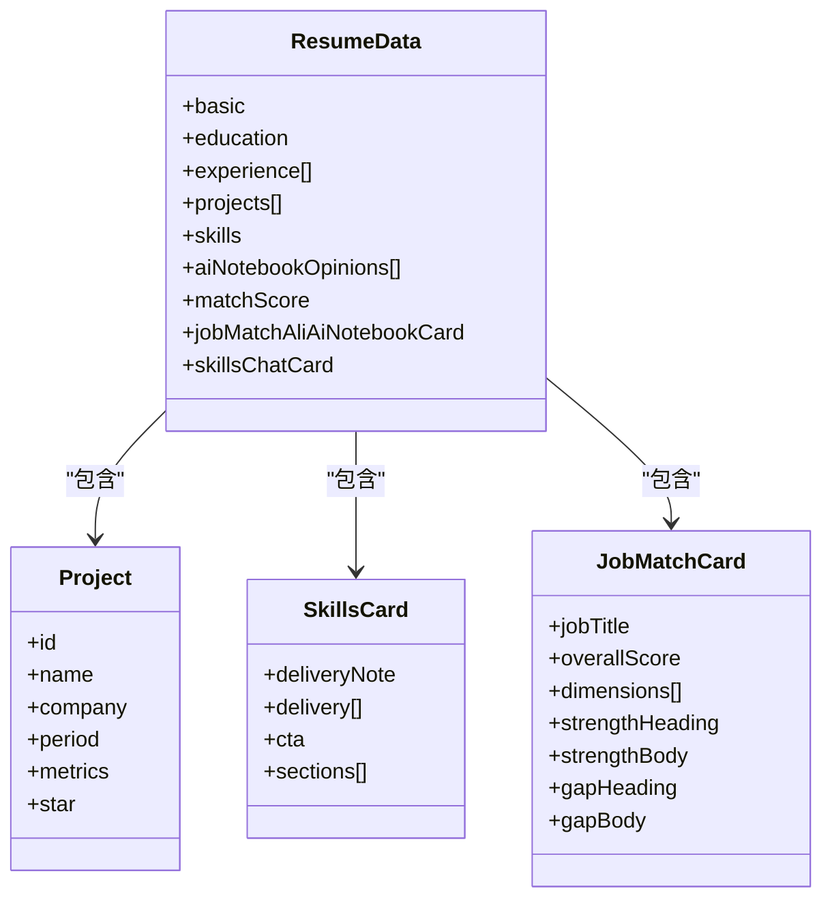
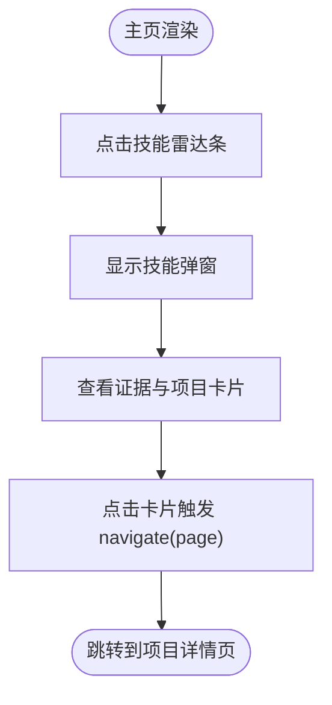
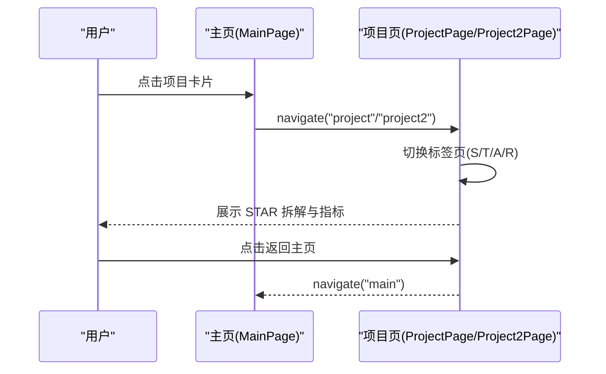
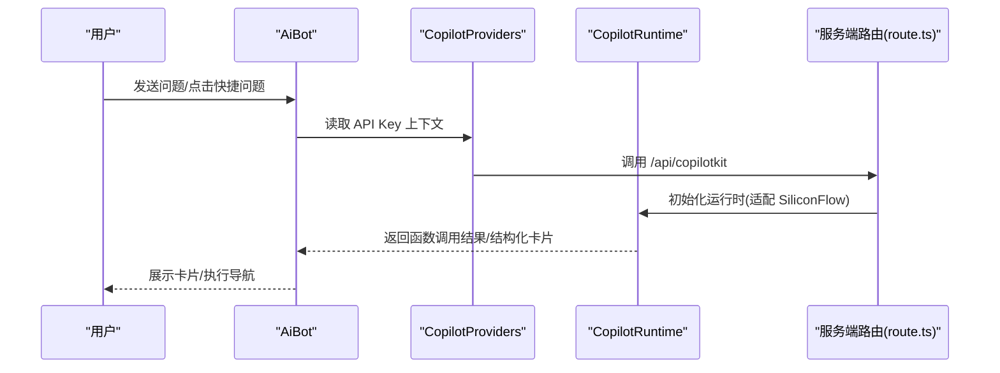
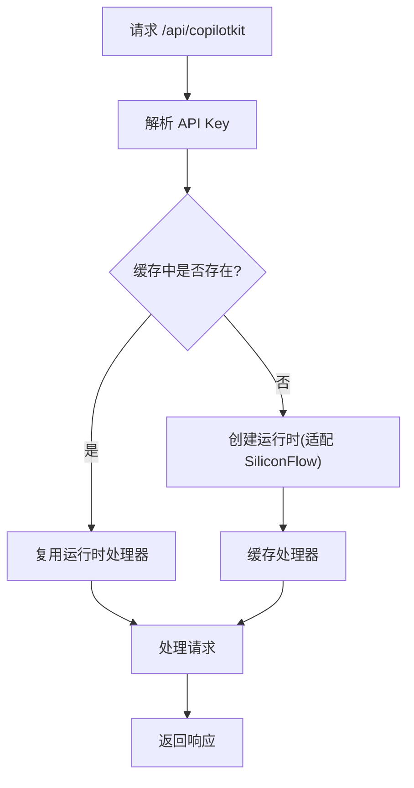
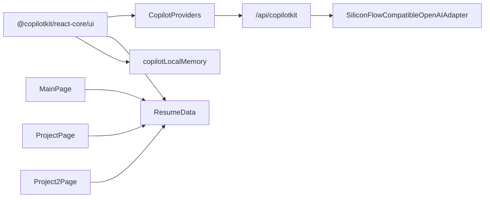

# 内容管理系统

<cite>
**本文档引用的文件**
- [resumeData.ts](file://lib/resumeData.ts)
- [MainPage.tsx](file://components/MainPage.tsx)
- [ProjectPage.tsx](file://components/ProjectPage.tsx)
- [Project2Page.tsx](file://components/Project2Page.tsx)
- [page.tsx](file://app/page.tsx)
- [layout.tsx](file://app/layout.tsx)
- [AiBot.tsx](file://components/AiBot.tsx)
- [CopilotProviders.tsx](file://components/CopilotProviders.tsx)
- [route.ts](file://app/api/copilotkit/route.ts)
- [copilotLocalMemory.ts](file://lib/copilotLocalMemory.ts)
- [siliconFlowOpenAIAdapter.ts](file://lib/siliconFlowOpenAIAdapter.ts)
- [siliconflow-defaults.ts](file://lib/siliconflow-defaults.ts)
- [package.json](file://package.json)
- [next.config.js](file://next.config.js)
</cite>

## 目录
1. [简介](#简介)
2. [项目结构](#项目结构)
3. [核心组件](#核心组件)
4. [架构总览](#架构总览)
5. [详细组件分析](#详细组件分析)
6. [依赖分析](#依赖分析)
7. [性能考虑](#性能考虑)
8. [故障排除指南](#故障排除指南)
9. [结论](#结论)
10. [附录](#附录)

## 简介
本项目是一个基于 ResumeData 的内容管理系统，围绕“傅倩娇”的个人信息、教育背景、工作经历、项目案例、技能图谱、AI 笔记观点与岗位匹配度进行结构化管理与呈现。系统采用 Next.js + React 客户端渲染，配合 CopilotKit 提供的 AI 助手能力，将 ResumeData 注入到 AI 上下文中，实现“结构化卡片 + 导航跳转”的交互体验。

系统核心目标：
- 以 ResumeData 为唯一数据源，统一管理与展示个人信息与项目数据
- 通过多页面组件架构（主页、项目详情页）实现内容的层级化浏览
- 通过 AI 助手（CopilotKit）提供“函数调用 + 结构化卡片”的智能交互
- 通过本地持久化记忆与服务端 API 管理，保障对话体验与可维护性

## 项目结构
项目采用按功能分层的目录组织方式：
- app：页面入口与布局，包含路由与全局样式
- components：页面组件与 AI 助手组件
- lib：数据模型与工具库（ResumeData、Copilot 本地记忆、适配器等）
- patches：第三方依赖补丁（用于适配特定运行时行为）

图表来源
- [page.tsx:11-29](file://app/page.tsx#L11-L29)
- [layout.tsx:19-47](file://app/layout.tsx#L19-L47)
- [MainPage.tsx:127-690](file://components/MainPage.tsx#L127-L690)
- [ProjectPage.tsx:12-86](file://components/ProjectPage.tsx#L12-L86)
- [Project2Page.tsx:13-70](file://components/Project2Page.tsx#L13-L70)
- [AiBot.tsx:941-1599](file://components/AiBot.tsx#L941-L1599)
- [CopilotProviders.tsx:49-156](file://components/CopilotProviders.tsx#L49-L156)
- [resumeData.ts:5-263](file://lib/resumeData.ts#L5-L263)
- [copilotLocalMemory.ts:21-77](file://lib/copilotLocalMemory.ts#L21-L77)
- [siliconFlowOpenAIAdapter.ts:17-35](file://lib/siliconFlowOpenAIAdapter.ts#L17-L35)
- [siliconflow-defaults.ts:9-16](file://lib/siliconflow-defaults.ts#L9-L16)
- [route.ts:16-95](file://app/api/copilotkit/route.ts#L16-L95)

章节来源
- [page.tsx:11-29](file://app/page.tsx#L11-L29)
- [layout.tsx:19-47](file://app/layout.tsx#L19-L47)

## 核心组件
- ResumeData 数据模型：集中定义基本信息、教育背景、工作经历、项目案例、技能图谱、AI 笔记观点、岗位匹配度等结构化数据，类型安全导出为 ResumeData
- 主页组件 MainPage：承载首页内容、技能雷达、JD 理解、AI 笔记观点、技能图谱与联系入口
- 项目详情组件 ProjectPage / Project2Page：以 STAR 法则呈现两个核心项目，支持标签页切换与返回主页
- AI 助手组件 AiBot：集成 CopilotKit，提供函数调用、结构化卡片、本地记忆与服务端 API 配置
- CopilotProviders：提供 API Key 上下文、服务端 Key 探测、fetch 修复与运行时配置
- 本地记忆 copilotLocalMemory：持久化最近对话摘要与长期摘要，支持滚动截断与片段裁剪
- 服务端路由 route：解析 API Key、缓存运行时处理器、适配 SiliconFlow 兼容性

章节来源
- [resumeData.ts:5-263](file://lib/resumeData.ts#L5-L263)
- [MainPage.tsx:127-690](file://components/MainPage.tsx#L127-L690)
- [ProjectPage.tsx:12-86](file://components/ProjectPage.tsx#L12-L86)
- [Project2Page.tsx:13-70](file://components/Project2Page.tsx#L13-L70)
- [AiBot.tsx:941-1599](file://components/AiBot.tsx#L941-L1599)
- [CopilotProviders.tsx:49-156](file://components/CopilotProviders.tsx#L49-L156)
- [copilotLocalMemory.ts:21-77](file://lib/copilotLocalMemory.ts#L21-L77)
- [route.ts:30-95](file://app/api/copilotkit/route.ts#L30-L95)

## 架构总览
系统采用“数据模型 + 多页面组件 + AI 助手 + 服务端 API”的分层架构：
- 数据层：ResumeData 作为单一事实来源，被主页与 AI 助手共享
- 展示层：主页与两个项目详情页负责内容结构化展示
- 交互层：AI 助手通过函数调用触发结构化卡片与页面导航
- 服务层：服务端路由负责 API Key 解析、运行时初始化与兼容性适配

图表来源
- [page.tsx:14-28](file://app/page.tsx#L14-L28)
- [MainPage.tsx:354-373](file://components/MainPage.tsx#L354-L373)
- [ProjectPage.tsx:52-84](file://components/ProjectPage.tsx#L52-L84)
- [Project2Page.tsx:37-68](file://components/Project2Page.tsx#L37-L68)
- [AiBot.tsx:1526-1541](file://components/AiBot.tsx#L1526-L1541)
- [CopilotProviders.tsx:144-156](file://components/CopilotProviders.tsx#L144-L156)
- [route.ts:100-114](file://app/api/copilotkit/route.ts#L100-L114)

## 详细组件分析

### 数据模型与内容结构（ResumeData）
- 数据模型设计
  - 基本信息：姓名、年龄、地点、目标职位、联系方式、简历链接
  - 教育背景：学校、专业、GPA、学习时间段
  - 工作经历：公司、角色、时间段、亮点清单
  - 项目案例：id、名称、公司、时间段、指标、STAR 拆解
  - 技能图谱：AI 能力、低代码/自动化、产品工具链、证书
  - AI 笔记观点：三类洞察（资源边界、知识管理、交互模式），含缺口与建议及站内跳转
  - 岗位匹配度：综合分与维度分，含“最强匹配点”“潜在缺口”
  - 技能卡片：交付数据与跳转到项目案例
- 数据复杂度与访问模式
  - 项目案例与技能卡片通过 id 关联主页与项目详情页
  - AI 笔记观点中的站内跳转通过 page/hash 定位到主页特定区域
- 更新流程
  - 修改 lib/resumeData.ts 中对应字段
  - 主页与项目页组件自动读取最新数据
  - AI 助手通过 useCopilotReadable 注入上下文，函数调用返回结构化卡片

图表来源
- [resumeData.ts:5-263](file://lib/resumeData.ts#L5-L263)

章节来源
- [resumeData.ts:5-263](file://lib/resumeData.ts#L5-L263)

### 主页组件（MainPage）
- 功能要点
  - 技能雷达与匹配度展示：点击维度弹出证据与项目卡片
  - JD 理解：三块卡片阐述岗位理解与难点
  - AI 笔记观点：折叠面板展示三类洞察与站内跳转
  - 技能图谱：网格展示四大板块与标签
  - 联系入口：悬浮按钮提供简历、微信、邮箱
- 组件间通信
  - navigate(page) 由父组件 page.tsx 提供，主页通过按钮与卡片触发
  - 技能弹窗与项目卡片联动，点击卡片跳转到对应项目详情页
- 状态管理
  - 技能弹窗、JD 折叠面板、联系入口开关均为组件内部状态

图表来源
- [MainPage.tsx:127-690](file://components/MainPage.tsx#L127-L690)
- [page.tsx:14-17](file://app/page.tsx#L14-L17)

章节来源
- [MainPage.tsx:127-690](file://components/MainPage.tsx#L127-L690)
- [page.tsx:14-17](file://app/page.tsx#L14-L17)

### 项目详情页（ProjectPage / Project2Page）
- 功能要点
  - STAR 标签页：S/T/A/R 四个维度深度拆解
  - 核心指标展示：卡片化呈现关键结果
  - 方法论与架构：三层架构与降级策略
  - AB 测试与结论：数据验证与方法论总结
- 组件间通信
  - 返回主页：点击返回按钮触发 navigate("main")
  - 项目卡片跳转：主页技能弹窗中的卡片触发 navigate(page)
- 状态管理
  - 当前激活标签页为组件内部状态

图表来源
- [MainPage.tsx:354-373](file://components/MainPage.tsx#L354-L373)
- [ProjectPage.tsx:52-84](file://components/ProjectPage.tsx#L52-L84)
- [Project2Page.tsx:37-68](file://components/Project2Page.tsx#L37-L68)

章节来源
- [ProjectPage.tsx:12-86](file://components/ProjectPage.tsx#L12-L86)
- [Project2Page.tsx:13-70](file://components/Project2Page.tsx#L13-L70)

### AI 助手（AiBot）与 CopilotKit 集成
- 能力与函数调用
  - 导航：navigateToPage(page)
  - 项目：showProjectHighlights(projectId)、showCoreProjectsOverview()
  - 观点：showAiNotebookOpinionsAll()、showAiNotebookOpinion(opinionId)
  - 技能：showSkillsStackCard()
  - 岗位匹配：showJobMatchCard()
  - 联系：getContactInfo()
- 上下文注入
  - useCopilotReadable 注入 ResumeData、当前页面、本地对话记忆
- 本地记忆
  - copilotLocalMemory：最近 3 条摘要 + 滚动长期摘要，支持片段裁剪与截断
- 服务端 API
  - CopilotProviders：解析用户 Key、服务端 Key 配置、fetch 修复
  - route：解析 API Key、缓存运行时、适配 SiliconFlow 兼容性

图表来源
- [AiBot.tsx:987-1036](file://components/AiBot.tsx#L987-L1036)
- [CopilotProviders.tsx:144-156](file://components/CopilotProviders.tsx#L144-L156)
- [route.ts:48-95](file://app/api/copilotkit/route.ts#L48-L95)

章节来源
- [AiBot.tsx:987-1036](file://components/AiBot.tsx#L987-L1036)
- [CopilotProviders.tsx:49-156](file://components/CopilotProviders.tsx#L49-L156)
- [route.ts:30-95](file://app/api/copilotkit/route.ts#L30-L95)
- [copilotLocalMemory.ts:21-77](file://lib/copilotLocalMemory.ts#L21-L77)

### 服务端 API 与运行时适配
- API Key 解析优先级：请求头 > 环境变量 > 代码兜底
- 运行时缓存：按 API Key 缓存 Hono 处理器，避免重复初始化
- 兼容性适配：SiliconFlowCompatibleOpenAIAdapter 使用 chat 路径，适配流式协议
- 健康检查：GET /api/copilotkit 返回服务端 Key 配置状态与提示

图表来源
- [route.ts:30-95](file://app/api/copilotkit/route.ts#L30-L95)
- [siliconFlowOpenAIAdapter.ts:17-35](file://lib/siliconFlowOpenAIAdapter.ts#L17-L35)
- [siliconflow-defaults.ts:9-16](file://lib/siliconflow-defaults.ts#L9-L16)

章节来源
- [route.ts:30-95](file://app/api/copilotkit/route.ts#L30-L95)
- [siliconFlowOpenAIAdapter.ts:17-35](file://lib/siliconFlowOpenAIAdapter.ts#L17-L35)
- [siliconflow-defaults.ts:9-16](file://lib/siliconflow-defaults.ts#L9-L16)

## 依赖分析
- 前端依赖
  - @copilotkit/react-core / react-ui：AI 助手核心与 UI 组件
  - @copilotkit/runtime / runtime-client-gql：运行时与客户端 GQL
  - next / react / react-dom：框架与运行时
- 开发依赖
  - patch-package：应用补丁（适配第三方 agent 行为）
  - typescript：类型系统
- 关键耦合点
  - AiBot 依赖 CopilotProviders 提供的 API Key 上下文
  - route 依赖 siliconFlowOpenAIAdapter 与 defaults
  - MainPage/ProjectPage/Project2Page 依赖 ResumeData
  - copilotLocalMemory 与 AiBot 的 useCopilotReadable 共同维护上下文一致性

图表来源
- [package.json:12-28](file://package.json#L12-L28)
- [AiBot.tsx:941-1599](file://components/AiBot.tsx#L941-L1599)
- [CopilotProviders.tsx:144-156](file://components/CopilotProviders.tsx#L144-L156)
- [route.ts:58-84](file://app/api/copilotkit/route.ts#L58-L84)
- [siliconFlowOpenAIAdapter.ts:17-35](file://lib/siliconFlowOpenAIAdapter.ts#L17-L35)
- [resumeData.ts:5-263](file://lib/resumeData.ts#L5-L263)
- [copilotLocalMemory.ts:21-77](file://lib/copilotLocalMemory.ts#L21-L77)

章节来源
- [package.json:12-28](file://package.json#L12-L28)

## 性能考虑
- 运行时缓存：按 API Key 缓存 CopilotRuntime，减少重复初始化开销
- 本地记忆截断：长期摘要限制长度，避免内存膨胀
- 组件状态收敛：主页与项目页内部状态仅限 UI 切换，不引入全局状态
- 服务端 Key 探测：首次打开面板自动展开配置区，减少无效请求

## 故障排除指南
- API Key 未配置
  - 现象：状态栏显示“请先完成 API 配置”，快捷问题无法发送
  - 处理：在 CopilotProviders 面板保存 Key 或在服务端设置环境变量
- SiliconFlow 兼容性问题
  - 现象：404 或“RUN_FINISHED while tool calls are still active”
  - 处理：确认模型 ID 与流式路径，使用 SiliconFlowCompatibleOpenAIAdapter
- 本地存储异常
  - 现象：刷新后对话记忆丢失
  - 处理：检查 localStorage 可用性与配额限制
- 页面跳转失效
  - 现象：点击卡片或按钮无反应
  - 处理：确认 navigate(page) 传参与页面名称一致

章节来源
- [CopilotProviders.tsx:89-113](file://components/CopilotProviders.tsx#L89-L113)
- [route.ts:100-114](file://app/api/copilotkit/route.ts#L100-L114)
- [siliconFlowOpenAIAdapter.ts:17-35](file://lib/siliconFlowOpenAIAdapter.ts#L17-L35)
- [copilotLocalMemory.ts:21-47](file://lib/copilotLocalMemory.ts#L21-L47)

## 结论
本内容管理系统以 ResumeData 为核心数据源，结合多页面组件与 AI 助手，实现了“结构化数据 + 智能交互 + 无缝导航”的一体化体验。通过本地记忆与服务端 API 的协同，系统在可维护性与用户体验之间取得良好平衡。建议在后续迭代中进一步完善数据校验与版本管理策略，以增强系统的健壮性与可演进性。

## 附录
- 使用指南
  - 修改数据：编辑 lib/resumeData.ts，确保字段命名与类型一致
  - 新增页面：在 app/page.tsx 中注册新页面并提供 navigate(page)
  - 扩展 AI 能力：在 AiBot 中新增函数调用与结构化卡片渲染
  - 部署 API Key：在服务端配置环境变量或在前端面板保存 Key
- 最佳实践
  - 数据更新遵循“先改数据源，再验证展示”的流程
  - 函数调用优先使用结构化卡片，避免长文本复述
  - 本地记忆与服务端 API 配置分离，确保隐私与可用性
  - 项目案例与主页指标保持一致，避免信息割裂