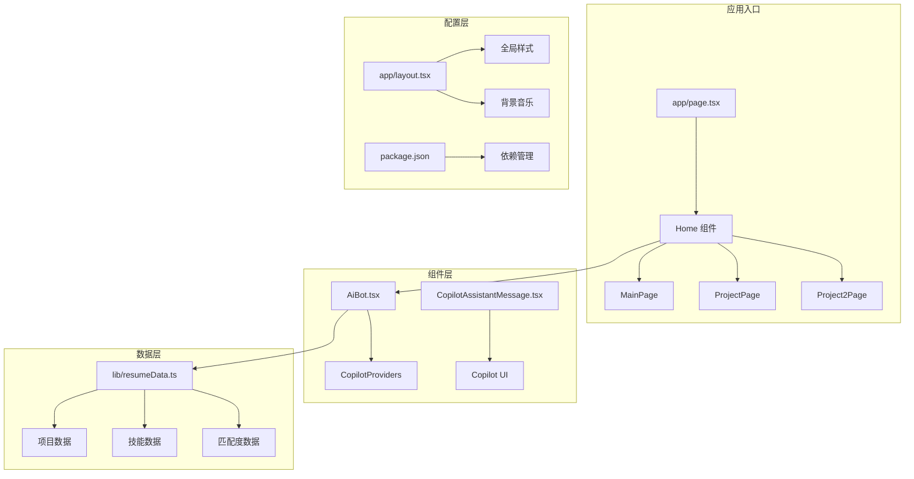
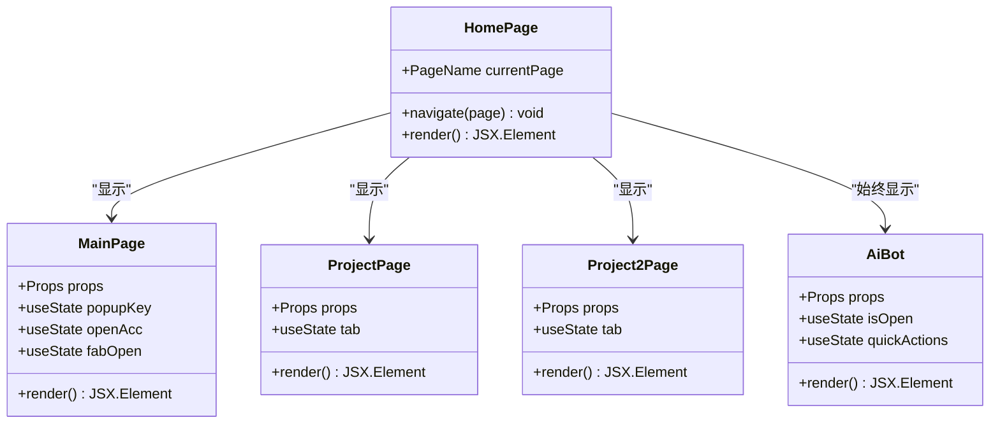
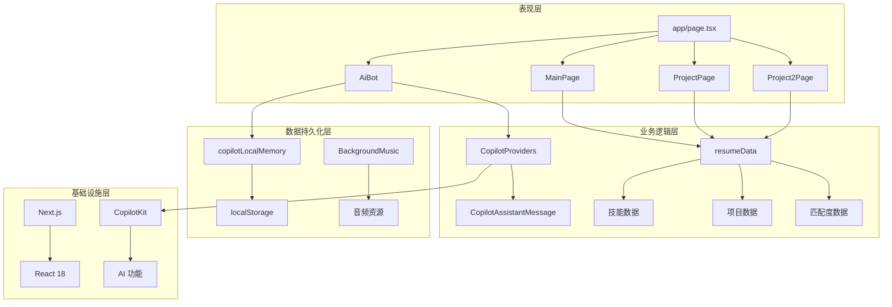
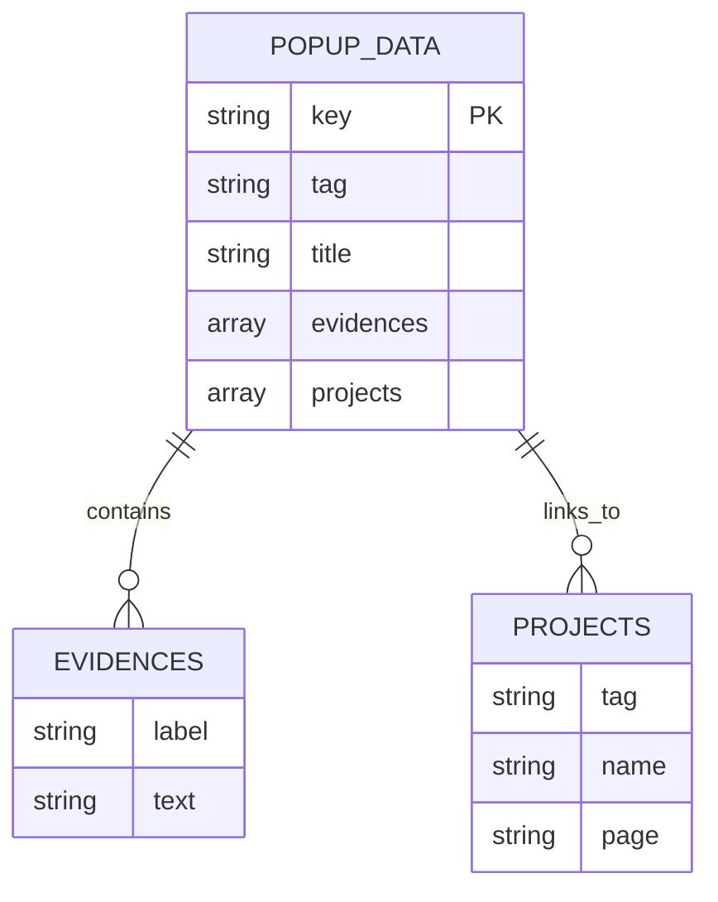
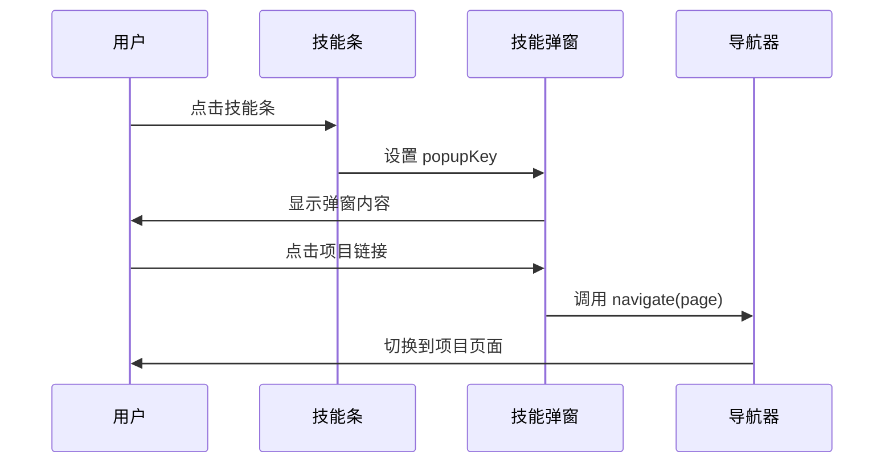
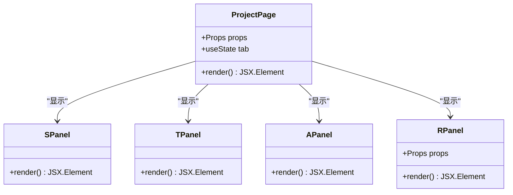
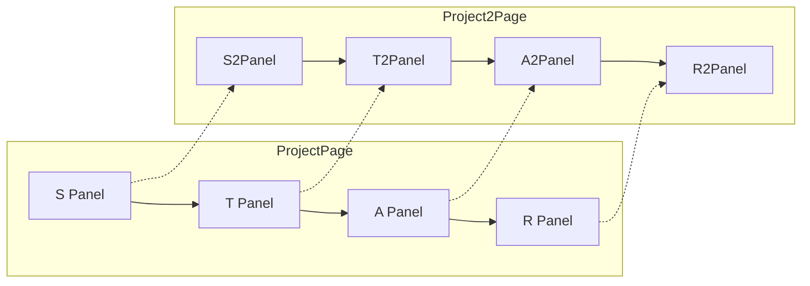
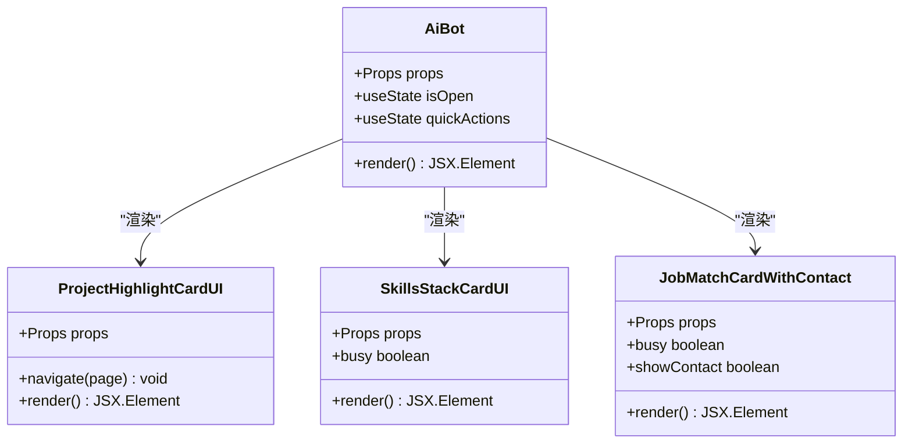
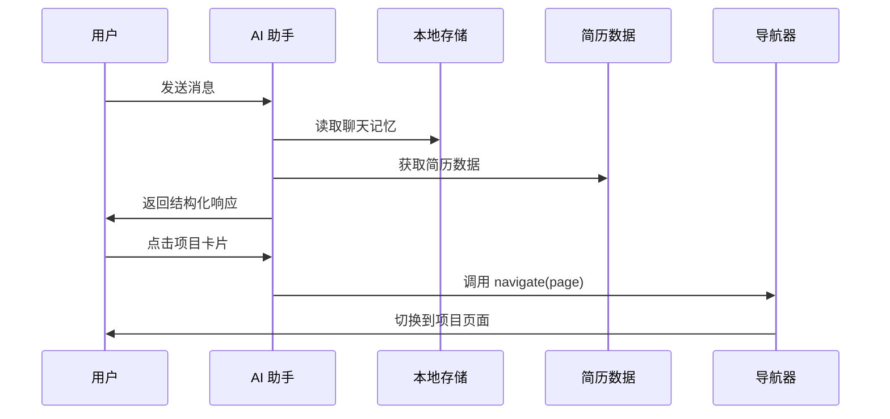
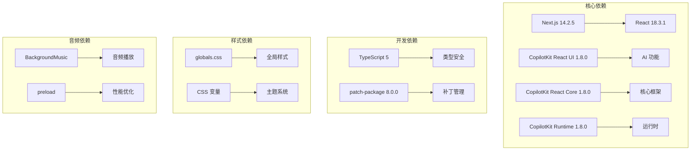

# 页面组件架构

<cite>
**本文档引用的文件**
- [app/page.tsx](file://app/page.tsx)
- [components/MainPage.tsx](file://components/MainPage.tsx)
- [components/ProjectPage.tsx](file://components/ProjectPage.tsx)
- [components/Project2Page.tsx](file://components/Project2Page.tsx)
- [components/AiBot.tsx](file://components/AiBot.tsx)
- [components/CopilotAssistantMessage.tsx](file://components/CopilotAssistantMessage.tsx)
- [components/CopilotProviders.tsx](file://components/CopilotProviders.tsx)
- [lib/resumeData.ts](file://lib/resumeData.ts)
- [lib/copilotLocalMemory.ts](file://lib/copilotLocalMemory.ts)
- [app/layout.tsx](file://app/layout.tsx)
- [package.json](file://package.json)
</cite>

## 目录
1. [简介](#简介)
2. [项目结构](#项目结构)
3. [核心组件](#核心组件)
4. [架构概览](#架构概览)
5. [详细组件分析](#详细组件分析)
6. [依赖分析](#依赖分析)
7. [性能考虑](#性能考虑)
8. [故障排除指南](#故障排除指南)
9. [结论](#结论)

## 简介

Fuqianjiao AI 项目是一个基于 Next.js 的现代 React 应用，采用多页面组件架构设计。该项目展示了如何构建一个专业的个人品牌网站，集成了 AI 助手功能、项目展示页面和交互式导航系统。项目的核心特色包括：

- **多页面组件架构**：通过单一入口组件管理多个页面组件的切换
- **AI 助手集成**：深度集成 CopilotKit 提供的 AI 对话功能
- **响应式设计**：采用现代化的 CSS 变量和内联样式系统
- **状态管理**：使用 React Hooks 实现组件间状态共享
- **数据驱动**：通过集中化的数据文件管理所有内容

## 项目结构

项目采用清晰的分层结构，每个目录都有明确的职责分工：

**图表来源**
- [app/page.tsx:1-30](file://app/page.tsx#L1-L30)
- [components/AiBot.tsx:1-50](file://components/AiBot.tsx#L1-L50)
- [lib/resumeData.ts:1-50](file://lib/resumeData.ts#L1-L50)

**章节来源**
- [app/page.tsx:1-30](file://app/page.tsx#L1-L30)
- [app/layout.tsx:1-48](file://app/layout.tsx#L1-L48)
- [package.json:1-29](file://package.json#L1-L29)

## 核心组件

### 主页面组件架构

项目采用"单一入口 + 多页面组件"的设计模式，通过状态管理实现页面切换：

**图表来源**
- [app/page.tsx:11-29](file://app/page.tsx#L11-L29)
- [components/MainPage.tsx:127-690](file://components/MainPage.tsx#L127-L690)
- [components/ProjectPage.tsx:12-86](file://components/ProjectPage.tsx#L12-L86)
- [components/Project2Page.tsx:13-70](file://components/Project2Page.tsx#L13-L70)

### 页面切换机制

页面切换通过简单的状态管理实现，具有以下特点：

- **状态驱动**：使用 React useState 管理当前页面状态
- **导航函数**：统一的导航函数处理页面切换和滚动行为
- **条件渲染**：根据当前状态渲染对应的页面组件
- **性能优化**：仅渲染当前激活的页面组件

**章节来源**
- [app/page.tsx:11-29](file://app/page.tsx#L11-L29)

## 架构概览

项目采用分层架构设计，确保各组件职责清晰分离：

**图表来源**
- [components/CopilotProviders.tsx:49-156](file://components/CopilotProviders.tsx#L49-L156)
- [lib/resumeData.ts:5-263](file://lib/resumeData.ts#L5-L263)
- [lib/copilotLocalMemory.ts:21-77](file://lib/copilotLocalMemory.ts#L21-L77)

## 详细组件分析

### MainPage 组件分析

MainPage 是项目的核心组件，承担着主页的所有功能：

#### 组件职责
- **内容展示**：展示个人介绍、技能图谱、项目经验
- **交互控制**：管理技能弹窗、折叠面板、悬浮按钮
- **导航触发**：提供跳转到具体项目页面的功能

#### 数据结构设计

**图表来源**
- [components/MainPage.tsx:13-77](file://components/MainPage.tsx#L13-L77)

#### 状态管理机制

MainPage 使用多个 useState hooks 管理不同的交互状态：

- `popupKey`: 控制技能弹窗的显示和内容
- `openAcc`: 管理折叠面板的展开状态
- `fabOpen`: 控制联系按钮的展开动画

#### 事件处理模式

组件实现了多种事件处理模式：

**图表来源**
- [components/MainPage.tsx:127-690](file://components/MainPage.tsx#L127-L690)

**章节来源**
- [components/MainPage.tsx:127-690](file://components/MainPage.tsx#L127-L690)

### ProjectPage 组件分析

ProjectPage 实现了 STAR 法则的详细展示功能：

#### 组件设计模式

**图表来源**
- [components/ProjectPage.tsx:12-86](file://components/ProjectPage.tsx#L12-L86)

#### TAB 切换机制

项目实现了基于 TAB 的内容组织方式：

- **S Panel**: Situation（背景）- 展示项目背景和痛点
- **T Panel**: Task（任务）- 展示目标和指标
- **A Panel**: Action（行动）- 展示技术架构和解决方案
- **R Panel**: Result（结果）- 展示量化成果和 AB 测试结果

**章节来源**
- [components/ProjectPage.tsx:12-275](file://components/ProjectPage.tsx#L12-L275)

### Project2Page 组件分析

Project2Page 与 ProjectPage 具有相同的架构模式，但针对不同的项目内容：

#### 设计差异

- **主题色彩**：使用紫色主题（#a898ff）区别于 ProjectPage 的蓝色主题
- **内容结构**：针对飞棋 RPA 项目的特定技术栈和业务场景
- **数据映射**：使用不同的项目 ID 和数据结构

#### 技术架构对比

**图表来源**
- [components/ProjectPage.tsx:88-153](file://components/ProjectPage.tsx#L88-L153)
- [components/Project2Page.tsx:72-206](file://components/Project2Page.tsx#L72-L206)

**章节来源**
- [components/Project2Page.tsx:13-247](file://components/Project2Page.tsx#L13-L247)

### AiBot 组件分析

AiBot 是项目的核心 AI 助手组件，提供了丰富的交互功能：

#### 组件架构

**图表来源**
- [components/AiBot.tsx:28-31](file://components/AiBot.tsx#L28-L31)

#### 功能特性

1. **快捷问题**：提供预设的快速问题模板
2. **结构化卡片**：展示项目亮点、技能栈、岗位匹配度
3. **本地存储**：持久化聊天记忆和用户偏好
4. **导航集成**：与主页面组件无缝集成

#### 数据流管理

**图表来源**
- [components/AiBot.tsx:1-800](file://components/AiBot.tsx#L1-L800)
- [lib/copilotLocalMemory.ts:21-77](file://lib/copilotLocalMemory.ts#L21-L77)
- [lib/resumeData.ts:5-263](file://lib/resumeData.ts#L5-L263)

**章节来源**
- [components/AiBot.tsx:1-800](file://components/AiBot.tsx#L1-L800)

## 依赖分析

项目使用了现代化的依赖管理策略，确保功能完整性和性能优化：

**图表来源**
- [package.json:12-20](file://package.json#L12-L20)

### 外部依赖集成

项目集成了多个外部服务和库：

1. **CopilotKit**: 提供 AI 助手功能和对话管理
2. **SiliconFlow**: AI 模型服务提供商
3. **Next.js**: Web 框架和构建工具
4. **React**: 用户界面库

**章节来源**
- [package.json:12-29](file://package.json#L12-L29)

## 性能考虑

项目在多个层面实现了性能优化：

### 渲染优化

- **条件渲染**: 仅渲染当前激活的页面组件
- **状态隔离**: 各组件独立管理自己的状态
- **事件委托**: 使用事件委托减少内存占用

### 数据优化

- **本地缓存**: 使用 localStorage 缓存聊天记忆
- **数据压缩**: 对存储的数据进行压缩处理
- **懒加载**: 音频资源使用预加载优化

### 网络优化

- **请求合并**: 合并多个 API 请求
- **错误处理**: 实现优雅的错误降级
- **超时控制**: 设置合理的请求超时时间

## 故障排除指南

### 常见问题及解决方案

#### AI 助手功能异常

**问题**: CopilotKit 无法正常工作
**解决方案**:
1. 检查 API 密钥配置
2. 验证网络连接
3. 查看浏览器控制台错误信息

#### 页面切换问题

**问题**: 页面切换不生效或出现闪烁
**解决方案**:
1. 检查 navigate 函数的实现
2. 验证状态更新逻辑
3. 确认组件重新渲染条件

#### 性能问题

**问题**: 页面加载缓慢或内存占用过高
**解决方案**:
1. 使用 React DevTools 分析组件性能
2. 实施代码分割和懒加载
3. 优化大型数据结构的处理

**章节来源**
- [components/CopilotProviders.tsx:49-156](file://components/CopilotProviders.tsx#L49-L156)
- [lib/copilotLocalMemory.ts:21-77](file://lib/copilotLocalMemory.ts#L21-L77)

## 结论

Fuqianjiao AI 项目展现了现代 React 应用的最佳实践，通过精心设计的多页面组件架构实现了以下目标：

### 架构优势

1. **清晰的职责分离**: 每个组件都有明确的功能边界
2. **可扩展的设计**: 易于添加新的页面组件和功能
3. **良好的用户体验**: 流畅的页面切换和交互反馈
4. **高性能实现**: 优化的渲染策略和数据管理

### 技术亮点

- **AI 集成**: 成功整合了 CopilotKit 提供的 AI 功能
- **响应式设计**: 适应不同设备和屏幕尺寸
- **数据驱动**: 通过集中化数据管理确保内容一致性
- **状态管理**: 使用 React Hooks 实现简洁的状态管理

### 未来发展方向

1. **组件复用**: 进一步抽象可复用的组件模式
2. **国际化支持**: 添加多语言支持功能
3. **SEO 优化**: 改进搜索引擎优化策略
4. **PWA 功能**: 添加渐进式 Web 应用特性

该项目为类似的人才展示网站提供了优秀的参考架构，展示了如何在保持技术先进性的同时确保用户体验的流畅性和一致性。