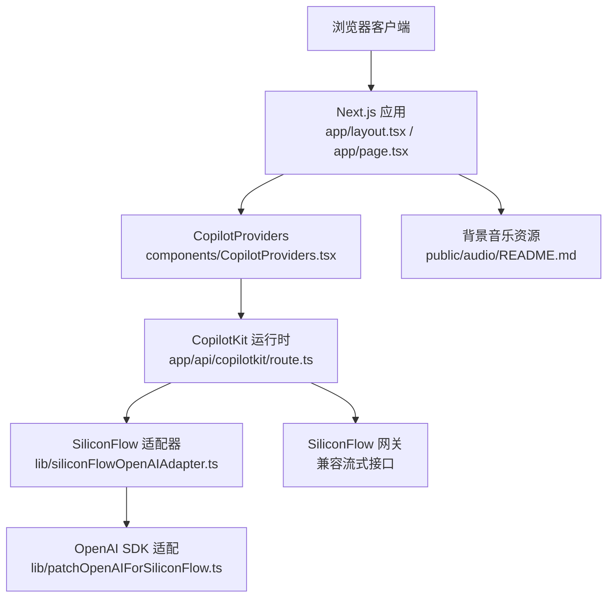
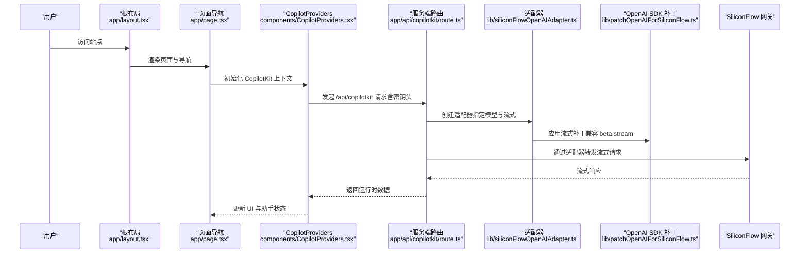
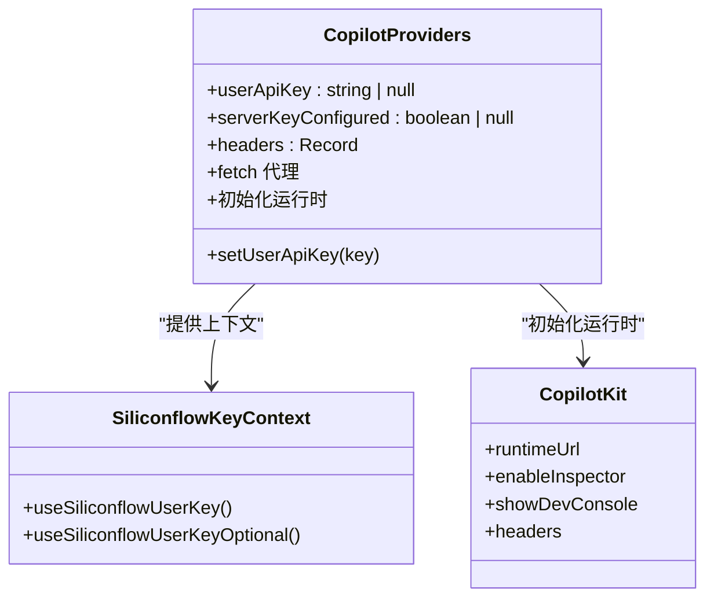
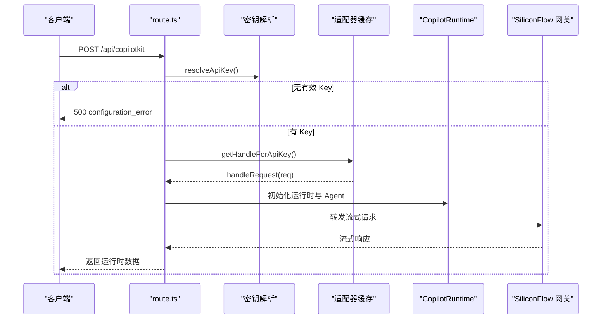
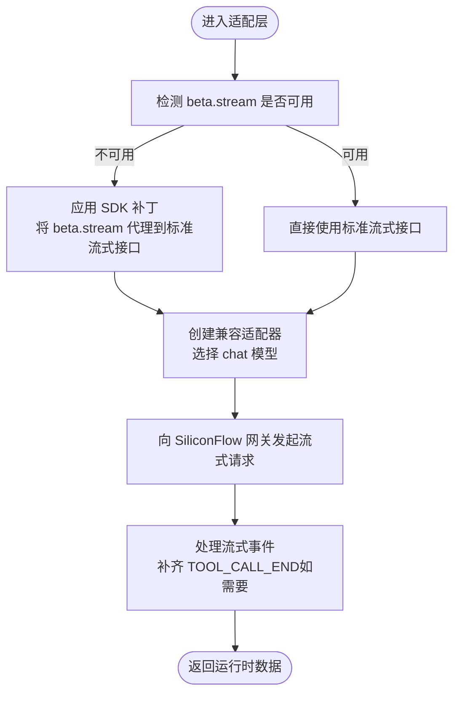
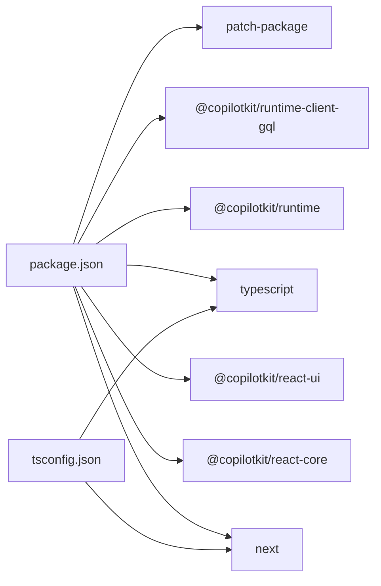

# 开发与部署

<cite>
**本文引用的文件**
- [package.json](file://package.json)
- [next.config.js](file://next.config.js)
- [tsconfig.json](file://tsconfig.json)
- [next-env.d.ts](file://next-env.d.ts)
- [app/layout.tsx](file://app/layout.tsx)
- [app/page.tsx](file://app/page.tsx)
- [app/api/copilotkit/route.ts](file://app/api/copilotkit/route.ts)
- [components/CopilotProviders.tsx](file://components/CopilotProviders.tsx)
- [components/MainPage.tsx](file://components/MainPage.tsx)
- [lib/siliconFlowOpenAIAdapter.ts](file://lib/siliconFlowOpenAIAdapter.ts)
- [lib/patchOpenAIForSiliconFlow.ts](file://lib/patchOpenAIForSiliconFlow.ts)
- [lib/siliconflow-defaults.ts](file://lib/siliconflow-defaults.ts)
- [patches/@copilotkitnext+agent+1.54.0.patch](file://patches/@copilotkitnext+agent+1.54.0.patch)
- [public/audio/README.md](file://public/audio/README.md)
</cite>

## 目录
1. [简介](#简介)
2. [项目结构](#项目结构)
3. [核心组件](#核心组件)
4. [架构总览](#架构总览)
5. [详细组件分析](#详细组件分析)
6. [依赖分析](#依赖分析)
7. [性能考虑](#性能考虑)
8. [故障排查指南](#故障排查指南)
9. [结论](#结论)
10. [附录](#附录)

## 简介
本指南面向 Fuqianjiao AI 项目，提供从开发环境设置、本地调试、热重载、生产构建与性能优化，到部署到 Vercel/Netlify 等平台的完整流程。文档还涵盖 TypeScript 与 Next.js 配置、依赖管理策略、CI/CD 建议、监控与维护策略，帮助开发者高效完成项目全生命周期管理。

## 项目结构
项目采用 Next.js App Router 结构，核心入口为 app 目录下的布局与页面，配合组件化 UI 与运行时集成的 AI 助手能力。关键特性包括：
- 全局布局与字体、音频预加载
- 多页面导航与 AI 助手始终可见
- CopilotKit 运行时与 SiliconFlow 适配层
- 服务端 API 路由封装与密钥解析策略
- 本地音频资源与跨域播放说明

图表来源
- [app/layout.tsx:1-48](file://app/layout.tsx#L1-L48)
- [app/page.tsx:1-30](file://app/page.tsx#L1-L30)
- [components/CopilotProviders.tsx:1-157](file://components/CopilotProviders.tsx#L1-L157)
- [app/api/copilotkit/route.ts:1-131](file://app/api/copilotkit/route.ts#L1-L131)
- [lib/siliconFlowOpenAIAdapter.ts:1-36](file://lib/siliconFlowOpenAIAdapter.ts#L1-L36)
- [lib/patchOpenAIForSiliconFlow.ts:1-22](file://lib/patchOpenAIForSiliconFlow.ts#L1-L22)
- [public/audio/README.md:1-13](file://public/audio/README.md#L1-L13)

章节来源
- [package.json:1-29](file://package.json#L1-L29)
- [next.config.js:1-4](file://next.config.js#L1-L4)
- [tsconfig.json:1-21](file://tsconfig.json#L1-L21)
- [next-env.d.ts:1-6](file://next-env.d.ts#L1-L6)

## 核心组件
- 全局布局与资源预加载：在根布局中预加载音频资源与字体，确保首屏体验与一致性。
- 页面导航：Home 组件通过状态切换主页面与项目页面，并始终显示 AI 助手。
- Copilot 集成：通过 CopilotProviders 提供运行时上下文、密钥解析与请求头注入，屏蔽底层网关差异。
- 服务端 API：/api/copilotkit 路由统一处理密钥解析、适配器初始化与运行时端点转发。
- SiliconFlow 适配：OpenAI 兼容适配器与流式补丁，确保与 SiliconFlow 网关的流式协议兼容。

章节来源
- [app/layout.tsx:1-48](file://app/layout.tsx#L1-L48)
- [app/page.tsx:1-30](file://app/page.tsx#L1-L30)
- [components/CopilotProviders.tsx:1-157](file://components/CopilotProviders.tsx#L1-L157)
- [app/api/copilotkit/route.ts:1-131](file://app/api/copilotkit/route.ts#L1-L131)

## 架构总览
整体架构围绕“前端 UI + CopilotKit 运行时 + 服务端 API + 第三方模型网关”的组合展开。前端负责渲染与交互，运行时负责与模型网关通信，服务端负责密钥解析与适配器初始化，确保在不同网关环境下的一致行为。

图表来源
- [app/layout.tsx:1-48](file://app/layout.tsx#L1-L48)
- [app/page.tsx:1-30](file://app/page.tsx#L1-L30)
- [components/CopilotProviders.tsx:1-157](file://components/CopilotProviders.tsx#L1-L157)
- [app/api/copilotkit/route.ts:1-131](file://app/api/copilotkit/route.ts#L1-L131)
- [lib/siliconFlowOpenAIAdapter.ts:1-36](file://lib/siliconFlowOpenAIAdapter.ts#L1-L36)
- [lib/patchOpenAIForSiliconFlow.ts:1-22](file://lib/patchOpenAIForSiliconFlow.ts#L1-L22)

## 详细组件分析

### 组件：CopilotProviders
职责与行为
- 提供 SiliconFlow API Key 的上下文，支持浏览器存储覆盖与服务端兜底。
- 注入 fetch 代理，对特定端点进行响应修复，避免空响应导致的解析错误。
- 启动时拉取服务端密钥配置状态，用于 UI 展示与引导。
- 构造请求头，优先使用用户面板保存的 Key，其次使用公共环境变量，最后为空。
- 初始化 CopilotKit 运行时，禁用 Inspector 与开发控制台，确保生产环境稳定性。

图表来源
- [components/CopilotProviders.tsx:1-157](file://components/CopilotProviders.tsx#L1-L157)

章节来源
- [components/CopilotProviders.tsx:1-157](file://components/CopilotProviders.tsx#L1-L157)

### 组件：服务端 API 路由（/api/copilotkit）
职责与行为
- 解析请求头与环境变量，确定有效 API Key。
- 基于 API Key 缓存 Hono 处理函数，避免重复初始化运行时。
- 创建 OpenAI 客户端与 SiliconFlow 兼容适配器，关闭并行工具调用。
- 初始化 CopilotRuntime 与内置 Agent，配置 providerOptions。
- 导出 POST/OPTIONS，提供健康检查 GET 接口，返回服务端密钥配置状态与提示信息。

图表来源
- [app/api/copilotkit/route.ts:1-131](file://app/api/copilotkit/route.ts#L1-L131)

章节来源
- [app/api/copilotkit/route.ts:1-131](file://app/api/copilotkit/route.ts#L1-L131)

### 组件：SiliconFlow 适配层
职责与行为
- OpenAI 兼容适配器：将默认 Responses API 切换为 Chat Completions，确保与 SiliconFlow 网关的流式协议一致。
- OpenAI SDK 补丁：将 beta.stream 代理到标准流式接口，解决兼容网关不支持 beta 路径的问题。
- 适配补丁：针对部分兼容网关仅流式 tool-input-* 而不发送最终 tool-call 的情况，在 RUN_FINISHED 前补齐 TOOL_CALL_END 事件，避免校验失败。

图表来源
- [lib/siliconFlowOpenAIAdapter.ts:1-36](file://lib/siliconFlowOpenAIAdapter.ts#L1-L36)
- [lib/patchOpenAIForSiliconFlow.ts:1-22](file://lib/patchOpenAIForSiliconFlow.ts#L1-L22)
- [patches/@copilotkitnext+agent+1.54.0.patch:1-125](file://patches/@copilotkitnext+agent+1.54.0.patch#L1-L125)

章节来源
- [lib/siliconFlowOpenAIAdapter.ts:1-36](file://lib/siliconFlowOpenAIAdapter.ts#L1-L36)
- [lib/patchOpenAIForSiliconFlow.ts:1-22](file://lib/patchOpenAIForSiliconFlow.ts#L1-L22)
- [patches/@copilotkitnext+agent+1.54.0.patch:1-125](file://patches/@copilotkitnext+agent+1.54.0.patch#L1-L125)

### 组件：全局布局与页面导航
职责与行为
- 根布局负责预加载音频与字体，设置站点元数据，挂载背景音乐与 CopilotProviders。
- Home 页面负责多页面切换与滚动行为，始终显示 AI 助手，便于交互。

章节来源
- [app/layout.tsx:1-48](file://app/layout.tsx#L1-L48)
- [app/page.tsx:1-30](file://app/page.tsx#L1-L30)

## 依赖分析
- 运行时依赖
  - @copilotkit/react-core / react-ui / runtime / runtime-client-gql：提供 AI 助手 UI 与运行时能力。
  - next / react / react-dom：Next.js 与 React 生态。
- 开发时依赖
  - @types/*：类型声明。
  - patch-package：应用补丁以修复第三方包行为。
  - typescript：类型检查与编译。
- 关键配置
  - next.config.js：基础 Next.js 配置。
  - tsconfig.json：严格模式关闭、增量编译、路径别名等。
  - next-env.d.ts：类型声明引用。

图表来源
- [package.json:1-29](file://package.json#L1-L29)
- [tsconfig.json:1-21](file://tsconfig.json#L1-L21)

章节来源
- [package.json:1-29](file://package.json#L1-L29)
- [tsconfig.json:1-21](file://tsconfig.json#L1-L21)

## 性能考虑
- 构建与运行
  - 使用 Next.js 内置的增量编译与隔离模块，提升开发体验与构建速度。
  - 严格模式关闭与 noEmit 配置，减少类型检查开销。
- 资源加载
  - 根布局预加载音频与字体，减少首屏闪烁与等待。
  - 音频资源建议仅使用单一格式并提交至仓库，降低跨域与格式切换带来的卡顿风险。
- 运行时优化
  - 服务端按 API Key 缓存 Hono 处理函数，避免重复初始化运行时。
  - 关闭并行工具调用，减少并发开销与兼容性问题。
- 网络与流式
  - 通过适配器与补丁确保流式协议一致，避免不必要的重试与错误处理成本。

章节来源
- [tsconfig.json:1-21](file://tsconfig.json#L1-L21)
- [app/layout.tsx:1-48](file://app/layout.tsx#L1-L48)
- [app/api/copilotkit/route.ts:1-131](file://app/api/copilotkit/route.ts#L1-L131)
- [lib/siliconFlowOpenAIAdapter.ts:1-36](file://lib/siliconFlowOpenAIAdapter.ts#L1-L36)
- [lib/patchOpenAIForSiliconFlow.ts:1-22](file://lib/patchOpenAIForSiliconFlow.ts#L1-L22)

## 故障排查指南
常见问题与定位
- AI_APICallError: Not Found
  - 可能原因：模型 ID 下线或兼容网关不支持旧路径。
  - 处理建议：检查服务端模型配置与兼容网关文档，确保使用支持的流式接口。
- Cannot send RUN_FINISHED while tool calls are still active
  - 可能原因：部分兼容网关仅流式 tool-input-* 而不发送最终 tool-call。
  - 处理建议：确认已应用补丁并在 RUN_FINISHED 前补齐 TOOL_CALL_END 事件。
- 跨域音频播放失败
  - 可能原因：外部资源未正确设置跨域。
  - 处理建议：使用同源资源或确保外部地址允许跨域播放。

章节来源
- [app/api/copilotkit/route.ts:19-25](file://app/api/copilotkit/route.ts#L19-L25)
- [patches/@copilotkitnext+agent+1.54.0.patch:87-99](file://patches/@copilotkitnext+agent+1.54.0.patch#L87-L99)
- [public/audio/README.md:1-13](file://public/audio/README.md#L1-L13)

## 结论
本项目通过 Next.js App Router 与 CopilotKit 的结合，实现了简洁稳定的 AI 助手集成方案。通过服务端密钥解析、适配器与补丁策略，确保在 SiliconFlow 等兼容网关下的稳定运行。遵循本文的开发与部署建议，可在本地与生产环境中获得一致的体验与性能表现。

## 附录

### 开发环境设置与本地启动
- 安装依赖
  - 使用包管理器安装依赖，安装完成后自动应用补丁。
- 启动开发服务器
  - 执行开发脚本，启动 Next.js 开发服务器与热重载。
- 环境变量
  - 服务端密钥可通过环境变量配置，推荐在平台（如 Vercel）中设置。
  - 可选：在本地设置公共音频资源地址，确保跨域播放。

章节来源
- [package.json:5-10](file://package.json#L5-L10)
- [lib/siliconflow-defaults.ts:1-16](file://lib/siliconflow-defaults.ts#L1-L16)
- [public/audio/README.md:1-13](file://public/audio/README.md#L1-L13)

### TypeScript 与 Next.js 配置要点
- TypeScript
  - 关闭严格模式与 noEmit，启用增量编译与路径别名。
- Next.js
  - 默认配置，按需扩展。

章节来源
- [tsconfig.json:1-21](file://tsconfig.json#L1-L21)
- [next.config.js:1-4](file://next.config.js#L1-L4)
- [next-env.d.ts:1-6](file://next-env.d.ts#L1-L6)

### 生产构建与性能优化
- 构建命令
  - 使用 Next.js 构建命令生成静态产物。
- 运行时优化
  - 服务端按 API Key 缓存处理函数，减少初始化成本。
  - 关闭并行工具调用，提升稳定性与性能。

章节来源
- [package.json:7-7](file://package.json#L7-L7)
- [app/api/copilotkit/route.ts:45-95](file://app/api/copilotkit/route.ts#L45-L95)

### 部署到 Vercel/Netlify
- Vercel
  - 配置环境变量（如 SiliconFlow API Key），平台自动识别 Next.js 项目并部署。
- Netlify
  - 配置构建命令与发布目录，确保 Next.js 构建产物正确生成与部署。

[本节为通用部署建议，不直接分析具体文件，故不附加章节来源]

### CI/CD 流程建议
- 代码变更触发构建与测试
  - 使用平台提供的 CI/CD 能力，自动执行构建、类型检查与部署。
- 环境变量管理
  - 在 CI/CD 中安全地注入敏感变量，避免硬编码。

[本节为通用流程建议，不直接分析具体文件，故不附加章节来源]

### 监控与维护策略
- 运行时监控
  - 关注服务端 API 的健康检查与错误日志，及时发现密钥与网关问题。
- 用户体验监控
  - 关注音频加载与字体加载的首屏表现，必要时调整资源策略。

章节来源
- [app/api/copilotkit/route.ts:120-130](file://app/api/copilotkit/route.ts#L120-L130)
- [app/layout.tsx:13-40](file://app/layout.tsx#L13-L40)