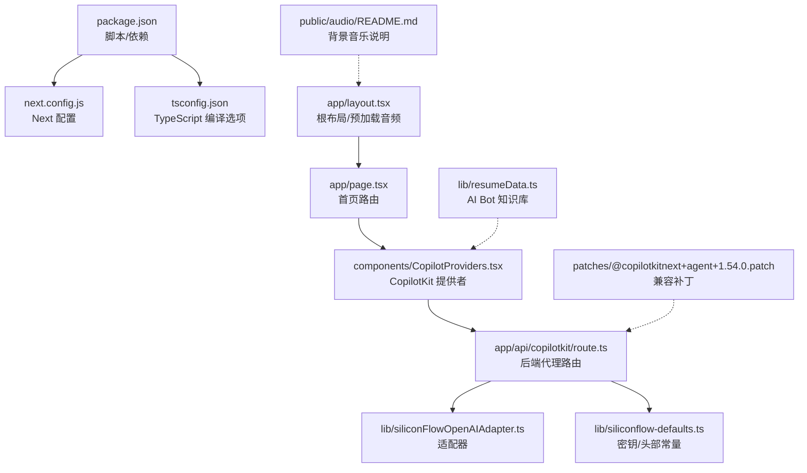
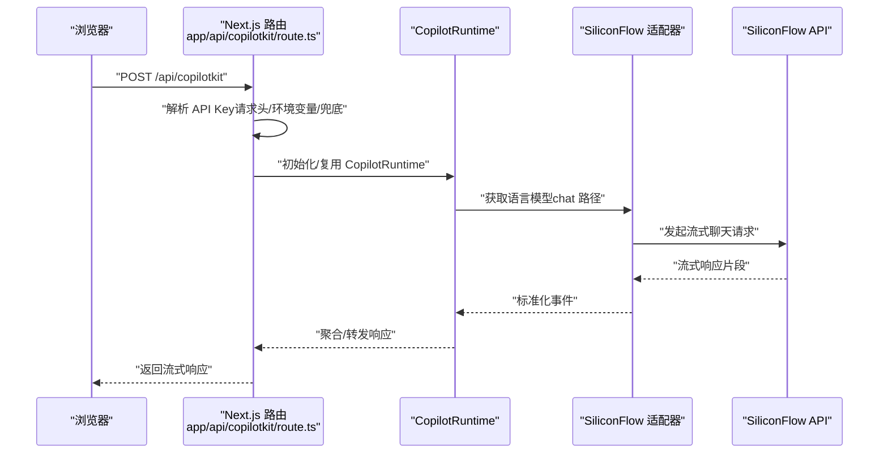
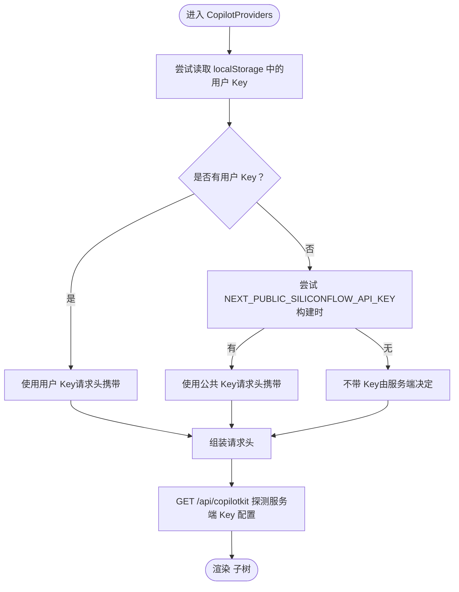
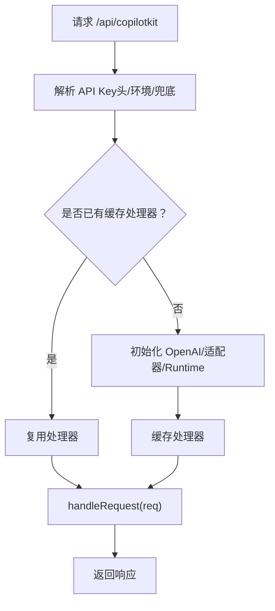
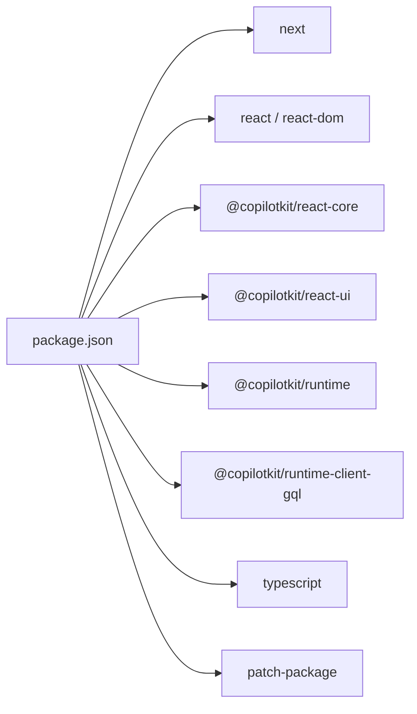

# 开发环境设置

<cite>
**本文引用的文件**
- [package.json](file://package.json)
- [tsconfig.json](file://tsconfig.json)
- [next.config.js](file://next.config.js)
- [next-env.d.ts](file://next-env.d.ts)
- [app/layout.tsx](file://app/layout.tsx)
- [app/page.tsx](file://app/page.tsx)
- [components/CopilotProviders.tsx](file://components/CopilotProviders.tsx)
- [app/api/copilotkit/route.ts](file://app/api/copilotkit/route.ts)
- [lib/siliconFlowOpenAIAdapter.ts](file://lib/siliconFlowOpenAIAdapter.ts)
- [lib/siliconflow-defaults.ts](file://lib/siliconflow-defaults.ts)
- [public/audio/README.md](file://public/audio/README.md)
- [patches/@copilotkitnext+agent+1.54.0.patch](file://patches/@copilotkitnext+agent+1.54.0.patch)
- [lib/resumeData.ts](file://lib/resumeData.ts)
</cite>

## 目录
1. [简介](#简介)
2. [项目结构](#项目结构)
3. [核心组件](#核心组件)
4. [架构总览](#架构总览)
5. [详细组件分析](#详细组件分析)
6. [依赖分析](#依赖分析)
7. [性能考虑](#性能考虑)
8. [故障排查指南](#故障排查指南)
9. [结论](#结论)
10. [附录：环境搭建清单](#附录环境搭建清单)

## 简介
本指南面向新加入的开发者，提供 Fuqianjiao AI 项目的完整开发环境设置说明。内容涵盖 Node.js 版本要求、包管理器选择、依赖安装、TypeScript 配置、编辑器与开发工具推荐、本地开发服务器启动流程、热重载机制、调试技巧、环境变量与 API 密钥管理、安全注意事项、常见问题与性能优化建议，以及完整的环境搭建清单。

## 项目结构
该项目基于 Next.js 14 应用，采用 App Router 结构，核心目录包括：
- app：页面与 API 路由
- components：可复用 UI 组件
- lib：运行时适配器、默认配置与知识库数据
- patches：第三方依赖的补丁
- public：公共资源（音频）

图表来源
- [package.json:1-29](file://package.json#L1-L29)
- [next.config.js:1-4](file://next.config.js#L1-L4)
- [tsconfig.json:1-21](file://tsconfig.json#L1-L21)
- [app/layout.tsx:1-48](file://app/layout.tsx#L1-L48)
- [app/page.tsx:1-30](file://app/page.tsx#L1-L30)
- [components/CopilotProviders.tsx:1-157](file://components/CopilotProviders.tsx#L1-L157)
- [app/api/copilotkit/route.ts:1-131](file://app/api/copilotkit/route.ts#L1-L131)
- [lib/siliconFlowOpenAIAdapter.ts:1-36](file://lib/siliconFlowOpenAIAdapter.ts#L1-L36)
- [lib/siliconflow-defaults.ts:1-16](file://lib/siliconflow-defaults.ts#L1-L16)
- [public/audio/README.md:1-13](file://public/audio/README.md#L1-L13)
- [patches/@copilotkitnext+agent+1.54.0.patch:1-125](file://patches/@copilotkitnext+agent+1.54.0.patch#L1-L125)
- [lib/resumeData.ts:1-263](file://lib/resumeData.ts#L1-L263)

章节来源
- [package.json:1-29](file://package.json#L1-L29)
- [next.config.js:1-4](file://next.config.js#L1-L4)
- [tsconfig.json:1-21](file://tsconfig.json#L1-L21)

## 核心组件
- Next.js 应用与脚本：通过 package.json 的 scripts 字段提供 dev/build/start/lint/postinstall 等命令。
- TypeScript 配置：tsconfig.json 控制严格性、模块解析、增量编译、插件与路径别名。
- 根布局与预加载：app/layout.tsx 负责字体与音频预加载，并注入 CopilotProviders。
- CopilotKit 提供者：封装 API Key 解析、fetch 包装与服务端 Key 探测。
- API 路由：app/api/copilotkit/route.ts 作为后端代理，整合 SiliconFlow 服务与适配器。
- 适配器与默认值：siliconFlowOpenAIAdapter.ts 修正模型调用路径，siliconflow-defaults.ts 定义头部与兜底 Key。
- 补丁：patches/@copilotkitnext+agent+1.54.0.patch 修复特定网关的流式事件顺序问题。
- 音频资源：public/audio/README.md 说明背景音乐放置与跨域播放要求。
- 知识库数据：lib/resumeData.ts 为 AI Bot 提供结构化知识。

章节来源
- [package.json:5-11](file://package.json#L5-L11)
- [tsconfig.json:2-17](file://tsconfig.json#L2-L17)
- [app/layout.tsx:13-47](file://app/layout.tsx#L13-L47)
- [components/CopilotProviders.tsx:49-156](file://components/CopilotProviders.tsx#L49-L156)
- [app/api/copilotkit/route.ts:24-131](file://app/api/copilotkit/route.ts#L24-L131)
- [lib/siliconFlowOpenAIAdapter.ts:17-35](file://lib/siliconFlowOpenAIAdapter.ts#L17-L35)
- [lib/siliconflow-defaults.ts:9-16](file://lib/siliconflow-defaults.ts#L9-L16)
- [patches/@copilotkitnext+agent+1.54.0.patch:1-125](file://patches/@copilotkitnext+agent+1.54.0.patch#L1-L125)
- [public/audio/README.md:1-13](file://public/audio/README.md#L1-L13)
- [lib/resumeData.ts:5-263](file://lib/resumeData.ts#L5-L263)

## 架构总览
下图展示了前端与后端的关键交互：浏览器发起请求到 /api/copilotkit，Next.js App Router 路由将其转发到 CopilotRuntime，后者通过适配器调用 SiliconFlow API，并在必要时进行流式事件兼容处理。

图表来源
- [app/api/copilotkit/route.ts:24-131](file://app/api/copilotkit/route.ts#L24-L131)
- [lib/siliconFlowOpenAIAdapter.ts:17-35](file://lib/siliconFlowOpenAIAdapter.ts#L17-L35)
- [lib/siliconflow-defaults.ts:9-16](file://lib/siliconflow-defaults.ts#L9-L16)

## 详细组件分析

### TypeScript 配置与编辑器设置
- 编译选项要点
  - lib：启用 dom/dom.iterable/esnext
  - strict：关闭严格模式（便于迁移）
  - noEmit：仅类型检查，不输出 JS
  - module/moduleResolution：esnext + bundler
  - isolatedModules：与 Next.js 构建配合
  - jsx：preserve（交由 Next/编译器处理）
  - incremental：增量编译
  - plugins：包含 next 插件
  - paths：@/* 映射到项目根
- 建议的编辑器设置
  - VSCode：启用 TypeScript/JavaScript 支持、ESLint/Prettier 插件
  - 启用“在保存时自动格式化”和“TS/JS 文件自动导入”
  - 关闭“严格模式”以匹配 tsconfig（或在 IDE 中单独针对项目启用）

章节来源
- [tsconfig.json:2-17](file://tsconfig.json#L2-L17)

### CopilotProviders：API Key 管理与安全
- 关键行为
  - 优先使用用户在前端面板保存的 Key（localStorage），否则使用服务端 Key 或构建时注入的公共 Key
  - 通过 fetch 包装处理空响应，避免底层解析错误
  - 启动时探测服务端 Key 是否可用，用于前端 UI 提示
- 安全要点
  - 默认不将 Key 注入浏览器，避免泄露
  - 用户自填 Key 仅在本地存储，不上传至服务端
  - 服务端通过环境变量或兜底 Key 处理请求

图表来源
- [components/CopilotProviders.tsx:49-156](file://components/CopilotProviders.tsx#L49-L156)
- [lib/siliconflow-defaults.ts:9-16](file://lib/siliconflow-defaults.ts#L9-L16)

章节来源
- [components/CopilotProviders.tsx:49-156](file://components/CopilotProviders.tsx#L49-L156)
- [lib/siliconflow-defaults.ts:9-16](file://lib/siliconflow-defaults.ts#L9-L16)

### API 路由：后端代理与适配器
- 关键流程
  - 解析 API Key 优先级：请求头 > 环境变量 > 代码兜底
  - 按 Key 缓存 Hono 处理函数，避免重复初始化
  - 初始化 SiliconFlow 兼容适配器与 CopilotRuntime
  - 代理到 /api/copilotkit，支持 OPTIONS 预检
- 兼容性
  - 适配器将模型调用从 Responses API 切换到 Chat Completions，适配 SiliconFlow 网关
  - 补丁确保在特定网关下 RUN_FINISHED 前发送 TOOL_CALL_END，避免校验错误

图表来源
- [app/api/copilotkit/route.ts:24-131](file://app/api/copilotkit/route.ts#L24-L131)
- [lib/siliconFlowOpenAIAdapter.ts:17-35](file://lib/siliconFlowOpenAIAdapter.ts#L17-L35)
- [patches/@copilotkitnext+agent+1.54.0.patch:1-125](file://patches/@copilotkitnext+agent+1.54.0.patch#L1-L125)

章节来源
- [app/api/copilotkit/route.ts:24-131](file://app/api/copilotkit/route.ts#L24-L131)
- [lib/siliconFlowOpenAIAdapter.ts:17-35](file://lib/siliconFlowOpenAIAdapter.ts#L17-L35)
- [patches/@copilotkitnext+agent+1.54.0.patch:1-125](file://patches/@copilotkitnext+agent+1.54.0.patch#L1-L125)

### 音频资源与预加载
- 背景音乐默认请求同源 /audio/prosecco.mp3，避免多格式切换导致卡顿
- 可选通过 .env.local 设置 NEXT_PUBLIC_AUDIO_SRC 为绝对地址（需允许跨域播放）
- 本地可使用 ffmpeg 将 FLAC 转换为 MP3

章节来源
- [public/audio/README.md:1-13](file://public/audio/README.md#L1-L13)
- [app/layout.tsx:13-17](file://app/layout.tsx#L13-L17)

## 依赖分析
- 运行时依赖
  - next、react、react-dom：框架基础
  - @copilotkit/*：AI 助手与运行时
- 开发依赖
  - typescript、@types/*：类型支持
  - patch-package：应用补丁
- 脚本
  - dev：next dev
  - build/start：next build/next start
  - lint：next lint
  - postinstall：patch-package

图表来源
- [package.json:12-27](file://package.json#L12-L27)

章节来源
- [package.json:12-27](file://package.json#L12-L27)

## 性能考虑
- 增量编译与隔离模块：tsconfig.json 的 incremental 与 isolatedModules 有助于快速类型检查与构建稳定性
- 适配器与流式调用：SiliconFlow 适配器使用 chat 路径，减少不必要的 API 调用开销
- 缓存处理器：按 API Key 缓存 Hono 处理函数，避免重复初始化
- 预加载策略：根布局预加载音频资源，改善首屏体验
- 体积控制：避免在前端注入敏感 Key，减少打包体积与泄露风险

章节来源
- [tsconfig.json:12-14](file://tsconfig.json#L12-L14)
- [app/api/copilotkit/route.ts:46-95](file://app/api/copilotkit/route.ts#L46-L95)
- [app/layout.tsx:13-17](file://app/layout.tsx#L13-L17)

## 故障排查指南
- “未配置有效的硅基流动 API Key”
  - 检查请求头是否正确传递（x-siliconflow-api-key）
  - 确认服务端环境变量或兜底 Key 是否可用
  - 参考：[app/api/copilotkit/route.ts:28-43](file://app/api/copilotkit/route.ts#L28-L43)
- “RUN_FINISHED while tool calls are still active”
  - 确认补丁已应用，确保在终止前发送 TOOL_CALL_END
  - 参考：[patches/@copilotkitnext+agent+1.54.0.patch:1-125](file://patches/@copilotkitnext+agent+1.54.0.patch#L1-L125)
- “Content-Length: 0 导致 SyntaxError”
  - 前端 fetch 包装已处理空响应，确认未被覆盖
  - 参考：[components/CopilotProviders.tsx:64-87](file://components/CopilotProviders.tsx#L64-L87)
- “404 Not Found（模型 ID 下线）”
  - 更换 SILICONFLOW_MODEL 或使用默认模型
  - 参考：[app/api/copilotkit/route.ts:19-25](file://app/api/copilotkit/route.ts#L19-L25)
- “跨域音频无法播放”
  - 确认自定义音频地址允许跨域播放
  - 参考：[public/audio/README.md:6](file://public/audio/README.md#L6)

章节来源
- [app/api/copilotkit/route.ts:28-43](file://app/api/copilotkit/route.ts#L28-L43)
- [patches/@copilotkitnext+agent+1.54.0.patch:1-125](file://patches/@copilotkitnext+agent+1.54.0.patch#L1-L125)
- [components/CopilotProviders.tsx:64-87](file://components/CopilotProviders.tsx#L64-L87)
- [app/api/copilotkit/route.ts:19-25](file://app/api/copilotkit/route.ts#L19-L25)
- [public/audio/README.md:6](file://public/audio/README.md#L6)

## 结论
本项目通过 Next.js App Router、CopilotKit 与 SiliconFlow 适配器，构建了一个可扩展的 AI 助手前端与后端代理。开发环境设置的关键在于：正确的 Node.js 与包管理器版本、TypeScript 配置、API Key 的安全管理、以及补丁与兼容性处理。遵循本文档的步骤与最佳实践，可快速搭建并稳定开发。

## 附录：环境搭建清单
- 环境要求
  - Node.js：与 Next.js 14 兼容的 LTS 版本（建议使用 nvm 管理）
  - 包管理器：npm 或 pnpm（推荐 pnpm 以获得更快安装与更小体积）
- 安装依赖
  - 执行安装命令（如 npm install 或 pnpm install）
  - 安装完成后执行 postinstall（patch-package 自动应用补丁）
- 配置环境变量
  - 服务端 API Key：SILICONFLOW_API_KEY（推荐）
  - 可选：SILICONFLOW_MODEL、SILICONFLOW_BASE_URL
  - 可选：NEXT_PUBLIC_SILICONFLOW_API_KEY（构建时注入，仅调试）
  - 可选：NEXT_PUBLIC_AUDIO_SRC（自定义音频地址）
- 启动开发服务器
  - 执行 npm run dev 或 pnpm dev
  - 访问 http://localhost:3000
- API 密钥与安全
  - 默认不将 Key 注入浏览器；用户可在前端面板保存 Key（仅本地存储）
  - 服务端优先使用环境变量，其次使用兜底 Key
- 调试技巧
  - 使用浏览器开发者工具观察网络请求与流式响应
  - 在 CopilotProviders 中检查 fetch 包装与服务端 Key 探测
  - 如遇兼容性问题，检查补丁是否生效
- 性能优化建议
  - 启用增量编译与隔离模块
  - 使用适配器的 chat 路径与处理器缓存
  - 预加载关键资源，避免多格式切换
- 常见问题
  - 404 模型不存在：更换模型或使用默认模型
  - 跨域音频播放失败：确保自定义地址允许跨域
  - RUN_FINISHED 错误：确认补丁已应用

章节来源
- [package.json:5-11](file://package.json#L5-L11)
- [app/api/copilotkit/route.ts:28-43](file://app/api/copilotkit/route.ts#L28-L43)
- [components/CopilotProviders.tsx:49-156](file://components/CopilotProviders.tsx#L49-L156)
- [public/audio/README.md:6](file://public/audio/README.md#L6)
- [patches/@copilotkitnext+agent+1.54.0.patch:1-125](file://patches/@copilotkitnext+agent+1.54.0.patch#L1-L125)