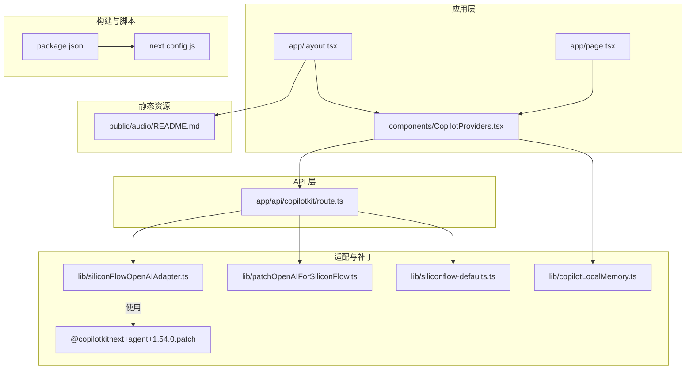
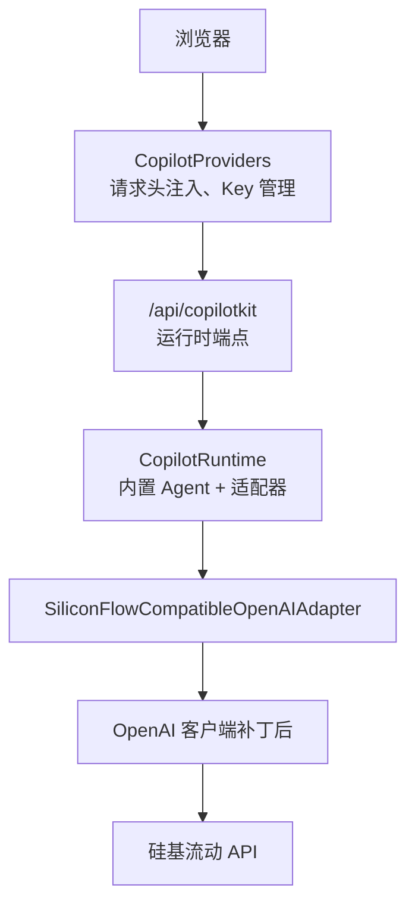
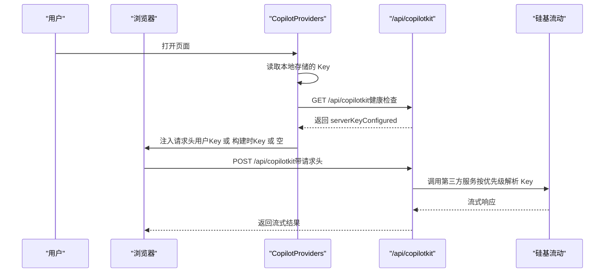
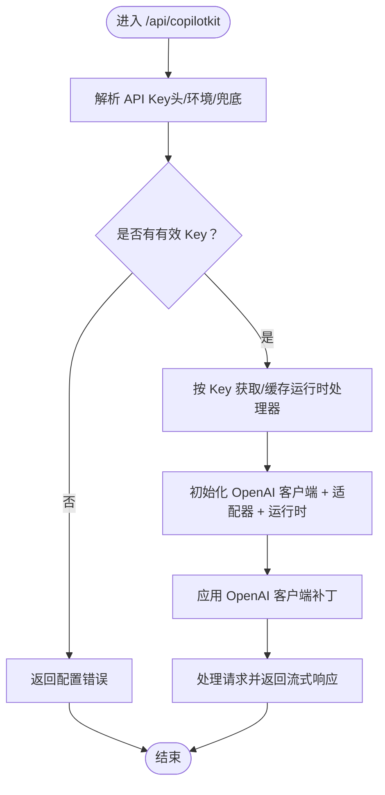
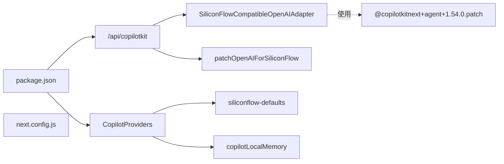

# 构建与部署

<cite>
**本文引用的文件**
- [package.json](file://package.json)
- [next.config.js](file://next.config.js)
- [app/layout.tsx](file://app/layout.tsx)
- [app/page.tsx](file://app/page.tsx)
- [app/api/copilotkit/route.ts](file://app/api/copilotkit/route.ts)
- [components/CopilotProviders.tsx](file://components/CopilotProviders.tsx)
- [lib/siliconFlowOpenAIAdapter.ts](file://lib/siliconFlowOpenAIAdapter.ts)
- [lib/patchOpenAIForSiliconFlow.ts](file://lib/patchOpenAIForSiliconFlow.ts)
- [lib/copilotLocalMemory.ts](file://lib/copilotLocalMemory.ts)
- [lib/siliconflow-defaults.ts](file://lib/siliconflow-defaults.ts)
- [public/audio/README.md](file://public/audio/README.md)
- [patches/@copilotkitnext+agent+1.54.0.patch](file://patches/@copilotkitnext+agent+1.54.0.patch)
</cite>

## 目录
1. [简介](#简介)
2. [项目结构](#项目结构)
3. [核心组件](#核心组件)
4. [架构总览](#架构总览)
5. [详细组件分析](#详细组件分析)
6. [依赖关系分析](#依赖关系分析)
7. [性能考虑](#性能考虑)
8. [故障排查指南](#故障排查指南)
9. [结论](#结论)
10. [附录](#附录)

## 简介
本指南面向 Fuqianjiao AI 项目，提供从本地开发到生产构建与部署的完整流程，涵盖 Next.js 构建配置优化、静态资源处理、环境变量与密钥安全、第三方服务（硅基流动）集成、CI/CD 流水线建议、自动化测试与部署验证、性能优化与缓存策略、CDN 设置以及监控与日志最佳实践。文档同时给出与代码实际对应的架构图与流程图，帮助读者快速理解并落地。

## 项目结构
项目采用 Next.js App Router 结构，核心入口为应用布局与首页页面，AI 助手能力通过 CopilotKit 提供，运行时接口位于应用路由 API 中。静态资源（背景音乐）放置于 public 目录，并通过环境变量控制预加载行为。第三方适配器与补丁用于适配硅基流动的兼容性问题。

图表来源
- [app/layout.tsx:1-48](file://app/layout.tsx#L1-L48)
- [app/page.tsx:1-30](file://app/page.tsx#L1-L30)
- [components/CopilotProviders.tsx:1-157](file://components/CopilotProviders.tsx#L1-L157)
- [app/api/copilotkit/route.ts:1-131](file://app/api/copilotkit/route.ts#L1-L131)
- [lib/siliconFlowOpenAIAdapter.ts:1-36](file://lib/siliconFlowOpenAIAdapter.ts#L1-L36)
- [lib/patchOpenAIForSiliconFlow.ts:1-22](file://lib/patchOpenAIForSiliconFlow.ts#L1-L22)
- [lib/siliconflow-defaults.ts:1-16](file://lib/siliconflow-defaults.ts#L1-L16)
- [lib/copilotLocalMemory.ts:1-77](file://lib/copilotLocalMemory.ts#L1-L77)
- [public/audio/README.md:1-13](file://public/audio/README.md#L1-L13)
- [package.json:1-29](file://package.json#L1-L29)
- [next.config.js:1-4](file://next.config.js#L1-L4)
- [patches/@copilotkitnext+agent+1.54.0.patch:1-125](file://patches/@copilotkitnext+agent+1.54.0.patch#L1-L125)

章节来源
- [package.json:1-29](file://package.json#L1-L29)
- [next.config.js:1-4](file://next.config.js#L1-L4)
- [app/layout.tsx:1-48](file://app/layout.tsx#L1-L48)
- [app/page.tsx:1-30](file://app/page.tsx#L1-L30)
- [public/audio/README.md:1-13](file://public/audio/README.md#L1-L13)

## 核心组件
- 应用布局与元数据：负责全局样式、字体与音频预加载策略，支持通过环境变量切换音频源。
- 首页页面：多页面导航容器，始终展示 AI Bot。
- Copilot 提供者：封装 CopilotKit 运行时配置，处理用户自定义 API Key、服务端 Key 状态检测与请求头注入。
- API 路由：统一处理 CopilotKit 运行时请求，按优先级解析硅基流动 API Key，缓存运行时处理器，适配兼容网关。
- 适配与补丁：OpenAI 兼容适配器、OpenAI 客户端补丁、本地记忆持久化、默认密钥与头部常量、UI Agent 补丁。
- 静态资源：背景音乐文件与预加载说明。

章节来源
- [app/layout.tsx:1-48](file://app/layout.tsx#L1-L48)
- [app/page.tsx:1-30](file://app/page.tsx#L1-L30)
- [components/CopilotProviders.tsx:1-157](file://components/CopilotProviders.tsx#L1-L157)
- [app/api/copilotkit/route.ts:1-131](file://app/api/copilotkit/route.ts#L1-L131)
- [lib/siliconFlowOpenAIAdapter.ts:1-36](file://lib/siliconFlowOpenAIAdapter.ts#L1-L36)
- [lib/patchOpenAIForSiliconFlow.ts:1-22](file://lib/patchOpenAIForSiliconFlow.ts#L1-L22)
- [lib/copilotLocalMemory.ts:1-77](file://lib/copilotLocalMemory.ts#L1-L77)
- [lib/siliconflow-defaults.ts:1-16](file://lib/siliconflow-defaults.ts#L1-L16)
- [public/audio/README.md:1-13](file://public/audio/README.md#L1-L13)

## 架构总览
下图展示了客户端、Copilot 提供者、API 路由与第三方服务之间的交互关系，以及关键的配置项与安全策略。

图表来源
- [components/CopilotProviders.tsx:49-156](file://components/CopilotProviders.tsx#L49-L156)
- [app/api/copilotkit/route.ts:45-95](file://app/api/copilotkit/route.ts#L45-L95)
- [lib/siliconFlowOpenAIAdapter.ts:17-35](file://lib/siliconFlowOpenAIAdapter.ts#L17-L35)
- [lib/patchOpenAIForSiliconFlow.ts:12-21](file://lib/patchOpenAIForSiliconFlow.ts#L12-L21)

## 详细组件分析

### 组件一：Copilot 提供者与 API Key 管理
- 用户自定义 Key：通过本地存储读取与写入，支持在面板中保存；保存后通过自定义请求头传递至 /api/copilotkit。
- 服务端 Key 状态：首次渲染后异步检测服务端是否已配置有效 Key，用于提示前端“零浏览器配置”体验。
- 请求拦截：对 /api/copilotkit 的响应进行内容长度校验，必要时返回合法 JSON，避免解析异常。
- 头部注入：优先使用用户自定义 Key，其次尝试构建时注入的公共 Key，最后为空对象（交由服务端）。

图表来源
- [components/CopilotProviders.tsx:54-133](file://components/CopilotProviders.tsx#L54-L133)
- [app/api/copilotkit/route.ts:30-43](file://app/api/copilotkit/route.ts#L30-L43)

章节来源
- [components/CopilotProviders.tsx:1-157](file://components/CopilotProviders.tsx#L1-L157)
- [lib/siliconflow-defaults.ts:1-16](file://lib/siliconflow-defaults.ts#L1-L16)
- [app/api/copilotkit/route.ts:1-131](file://app/api/copilotkit/route.ts#L1-L131)

### 组件二：API 路由与运行时
- Key 解析优先级：请求头 > 环境变量 > 代码兜底。
- 运行时缓存：按 API Key 缓存 Hono 处理器，避免重复初始化，提升稳定性与性能。
- 适配器与客户端补丁：确保使用标准 chat/completions 流式接口，兼容硅基流动等网关。
- 并行工具调用：显式禁用并行工具调用，配合 UI Agent 补丁，保证事件顺序正确。

图表来源
- [app/api/copilotkit/route.ts:30-95](file://app/api/copilotkit/route.ts#L30-L95)
- [lib/patchOpenAIForSiliconFlow.ts:12-21](file://lib/patchOpenAIForSiliconFlow.ts#L12-L21)
- [lib/siliconFlowOpenAIAdapter.ts:17-35](file://lib/siliconFlowOpenAIAdapter.ts#L17-L35)

章节来源
- [app/api/copilotkit/route.ts:1-131](file://app/api/copilotkit/route.ts#L1-L131)
- [lib/patchOpenAIForSiliconFlow.ts:1-22](file://lib/patchOpenAIForSiliconFlow.ts#L1-L22)
- [lib/siliconFlowOpenAIAdapter.ts:1-36](file://lib/siliconFlowOpenAIAdapter.ts#L1-L36)
- [patches/@copilotkitnext+agent+1.54.0.patch:1-125](file://patches/@copilotkitnext+agent+1.54.0.patch#L1-L125)

### 组件三：静态资源与音频预加载
- 默认同源音频文件，减少格式切换带来的卡顿。
- 可通过环境变量指向外部可跨域播放的地址，满足 CDN 或外部托管需求。
- 布局中根据环境变量动态设置 preload 链接与跨域属性。

章节来源
- [public/audio/README.md:1-13](file://public/audio/README.md#L1-L13)
- [app/layout.tsx:13-35](file://app/layout.tsx#L13-L35)

### 组件四：本地记忆与 UI 交互
- 本地持久化：最近对话与长期摘要，限制长度，避免无限增长。
- 从可见消息提取片段，合并生成新的记忆对象。
- 与 Copilot 可视化状态联动，保持上下文连贯。

章节来源
- [lib/copilotLocalMemory.ts:1-77](file://lib/copilotLocalMemory.ts#L1-L77)

## 依赖关系分析
- 构建与脚本：通过 package.json 定义开发、构建、启动与补丁安装脚本。
- Next.js 配置：next.config.js 当前为空配置，适合默认行为；如需优化可扩展。
- 第三方依赖：@copilotkit/*、next、react、openai 及其适配器与补丁。
- 补丁：对 @copilotkitnext/agent 的事件顺序修复，确保工具调用生命周期完整。

图表来源
- [package.json:1-29](file://package.json#L1-L29)
- [next.config.js:1-4](file://next.config.js#L1-L4)
- [components/CopilotProviders.tsx:1-157](file://components/CopilotProviders.tsx#L1-L157)
- [app/api/copilotkit/route.ts:1-131](file://app/api/copilotkit/route.ts#L1-L131)
- [lib/siliconFlowOpenAIAdapter.ts:1-36](file://lib/siliconFlowOpenAIAdapter.ts#L1-L36)
- [lib/patchOpenAIForSiliconFlow.ts:1-22](file://lib/patchOpenAIForSiliconFlow.ts#L1-L22)
- [lib/siliconflow-defaults.ts:1-16](file://lib/siliconflow-defaults.ts#L1-L16)
- [lib/copilotLocalMemory.ts:1-77](file://lib/copilotLocalMemory.ts#L1-L77)
- [patches/@copilotkitnext+agent+1.54.0.patch:1-125](file://patches/@copilotkitnext+agent+1.54.0.patch#L1-L125)

章节来源
- [package.json:1-29](file://package.json#L1-L29)
- [next.config.js:1-4](file://next.config.js#L1-L4)

## 性能考虑
- 构建优化
  - 使用默认 Next.js 构建配置，结合生产模式下的自动优化（Tree Shaking、代码分割、资源压缩）。如需进一步优化，可在 next.config.js 中启用实验性功能或自定义 webpack/ESLint 规则。
  - 静态资源：将常用音频置于 public 目录，减少网络往返与格式切换成本。
- 运行时性能
  - API 路由按 Key 缓存运行时处理器，降低重复初始化开销。
  - 禁用并行工具调用，避免复杂并发状态带来的额外开销。
- 缓存与 CDN
  - public 目录静态资源天然支持 CDN 加速；可结合平台 CDN（如 Vercel、Netlify）自动缓存策略。
  - 对 API 响应与中间件结果进行合理缓存（需在服务端实现，不在当前代码范围内）。
- 日志与监控
  - 建议在服务端记录关键链路日志（请求头解析、Key 切换、错误码统计），并接入平台日志聚合与告警系统。

[本节为通用性能建议，不直接分析具体文件]

## 故障排查指南
- “未配置有效的 API Key”
  - 现象：服务端返回配置错误。
  - 排查：确认请求头、环境变量与兜底值是否正确设置；检查 API Key 是否有效。
  - 参考
    - [app/api/copilotkit/route.ts:30-43](file://app/api/copilotkit/route.ts#L30-L43)
    - [lib/siliconflow-defaults.ts:9-11](file://lib/siliconflow-defaults.ts#L9-L11)
- “Content-Length: 0 导致解析异常”
  - 现象：前端出现 JSON 解析错误。
  - 处理：CopilotProviders 已对 /api/copilotkit 响应进行拦截与修复。
  - 参考
    - [components/CopilotProviders.tsx:64-87](file://components/CopilotProviders.tsx#L64-L87)
- “工具调用未结束导致 RUN_FINISHED 报错”
  - 现象：运行时提示仍有活动的工具调用。
  - 处理：UI Agent 补丁在终止与完成事件前补发 TOOL_CALL_END。
  - 参考
    - [patches/@copilotkitnext+agent+1.54.0.patch:87-99](file://patches/@copilotkitnext+agent+1.54.0.patch#L87-L99)
- “兼容网关不支持 beta 路径”
  - 现象：404 错误。
  - 处理：OpenAI 客户端补丁将 beta.stream 代理到标准 chat/completions。
  - 参考
    - [lib/patchOpenAIForSiliconFlow.ts:12-21](file://lib/patchOpenAIForSiliconFlow.ts#L12-L21)
- “模型 ID 下线导致 404”
  - 现象：AI 调用失败。
  - 处理：更换为兼容网关仍支持的模型；默认模型已在路由中设定。
  - 参考
    - [app/api/copilotkit/route.ts:24-25](file://app/api/copilotkit/route.ts#L24-L25)

章节来源
- [app/api/copilotkit/route.ts:1-131](file://app/api/copilotkit/route.ts#L1-L131)
- [components/CopilotProviders.tsx:1-157](file://components/CopilotProviders.tsx#L1-L157)
- [lib/patchOpenAIForSiliconFlow.ts:1-22](file://lib/patchOpenAIForSiliconFlow.ts#L1-L22)
- [patches/@copilotkitnext+agent+1.54.0.patch:1-125](file://patches/@copilotkitnext+agent+1.54.0.patch#L1-L125)

## 结论
本项目基于 Next.js 与 CopilotKit 实现了可插拔的 AI 助手能力，通过 API 路由与适配器实现对硅基流动的兼容，辅以本地记忆与请求拦截增强用户体验。生产部署建议遵循环境变量与密钥安全策略，结合平台 CDN 与日志监控体系，确保稳定性与可观测性。

[本节为总结性内容，不直接分析具体文件]

## 附录

### A. 生产构建与部署流程
- 本地构建
  - 步骤：安装依赖、执行构建脚本、启动生产服务器。
  - 参考
    - [package.json:5-11](file://package.json#L5-L11)
- Next.js 配置
  - 当前为空配置，适合默认行为；如需优化可扩展。
  - 参考
    - [next.config.js:1-4](file://next.config.js#L1-L4)
- 静态资源处理
  - 将音频文件放入 public/audio 并提交版本库；可通过环境变量指向外部地址。
  - 参考
    - [public/audio/README.md:1-13](file://public/audio/README.md#L1-L13)
    - [app/layout.tsx:13-35](file://app/layout.tsx#L13-L35)

章节来源
- [package.json:1-29](file://package.json#L1-L29)
- [next.config.js:1-4](file://next.config.js#L1-L4)
- [public/audio/README.md:1-13](file://public/audio/README.md#L1-L13)
- [app/layout.tsx:1-48](file://app/layout.tsx#L1-L48)

### B. 环境变量与密钥安全
- 服务端密钥
  - 推荐在平台（如 Vercel）配置环境变量，避免暴露在前端。
  - 参考
    - [lib/siliconflow-defaults.ts:9-11](file://lib/siliconflow-defaults.ts#L9-L11)
    - [app/api/copilotkit/route.ts:30-43](file://app/api/copilotkit/route.ts#L30-L43)
- 用户自定义密钥
  - 仅在浏览器保存，通过自定义请求头传递，不打入前端包。
  - 参考
    - [components/CopilotProviders.tsx:115-133](file://components/CopilotProviders.tsx#L115-L133)
    - [lib/siliconflow-defaults.ts:12-13](file://lib/siliconflow-defaults.ts#L12-L13)

章节来源
- [lib/siliconflow-defaults.ts:1-16](file://lib/siliconflow-defaults.ts#L1-L16)
- [components/CopilotProviders.tsx:1-157](file://components/CopilotProviders.tsx#L1-L157)
- [app/api/copilotkit/route.ts:1-131](file://app/api/copilotkit/route.ts#L1-L131)

### C. 第三方服务集成（硅基流动）
- 适配器与补丁
  - 使用兼容适配器与客户端补丁，确保流式 chat/completions 协议一致。
  - 参考
    - [lib/siliconFlowOpenAIAdapter.ts:17-35](file://lib/siliconFlowOpenAIAdapter.ts#L17-L35)
    - [lib/patchOpenAIForSiliconFlow.ts:12-21](file://lib/patchOpenAIForSiliconFlow.ts#L12-L21)
    - [patches/@copilotkitnext+agent+1.54.0.patch:87-99](file://patches/@copilotkitnext+agent+1.54.0.patch#L87-L99)
- 模型与网关
  - 默认模型与基础 URL 已在路由中设定；如模型下线需更新。
  - 参考
    - [app/api/copilotkit/route.ts:16-25](file://app/api/copilotkit/route.ts#L16-L25)

章节来源
- [lib/siliconFlowOpenAIAdapter.ts:1-36](file://lib/siliconFlowOpenAIAdapter.ts#L1-L36)
- [lib/patchOpenAIForSiliconFlow.ts:1-22](file://lib/patchOpenAIForSiliconFlow.ts#L1-L22)
- [patches/@copilotkitnext+agent+1.54.0.patch:1-125](file://patches/@copilotkitnext+agent+1.54.0.patch#L1-L125)
- [app/api/copilotkit/route.ts:1-131](file://app/api/copilotkit/route.ts#L1-L131)

### D. CI/CD 流水线与自动化
- 建议流程
  - 代码提交 → 自动化测试（单元/集成）→ 构建与打包 → 部署到目标平台 → 健康检查与部署验证。
- 关键节点
  - 环境变量注入：在 CI 中配置服务端密钥与公共变量。
  - 部署验证：调用 /api/copilotkit 健康检查端点，确认 Key 解析与运行时可用。
- 参考
  - [app/api/copilotkit/route.ts:120-130](file://app/api/copilotkit/route.ts#L120-L130)

章节来源
- [app/api/copilotkit/route.ts:1-131](file://app/api/copilotkit/route.ts#L1-L131)

### E. 监控、错误追踪与日志
- 建议措施
  - 服务端：记录请求头解析、Key 切换、错误码分布与耗时指标。
  - 前端：保留最小化错误信息，避免泄露敏感数据；对流式响应异常进行捕获与上报。
  - 平台：利用平台日志聚合与告警，设置阈值与通知规则。
- 参考
  - [components/CopilotProviders.tsx:64-87](file://components/CopilotProviders.tsx#L64-L87)

章节来源
- [components/CopilotProviders.tsx:1-157](file://components/CopilotProviders.tsx#L1-L157)