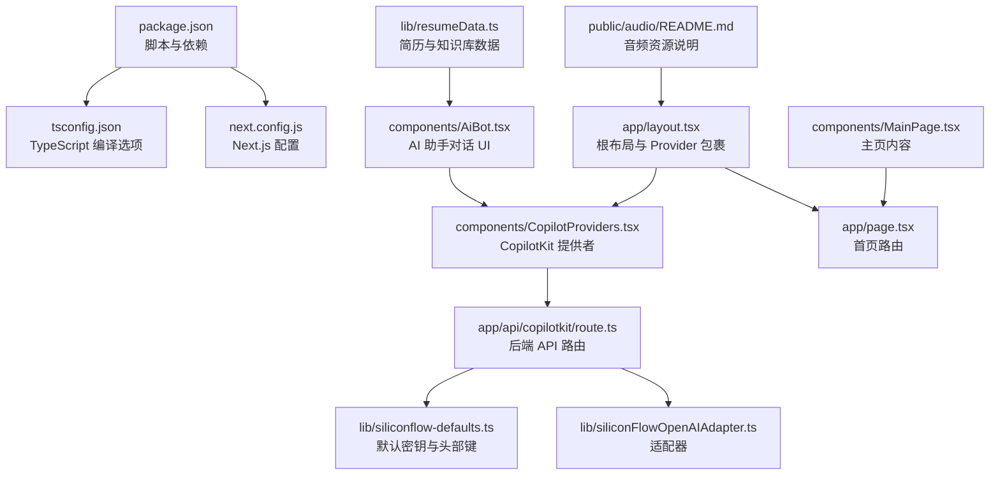
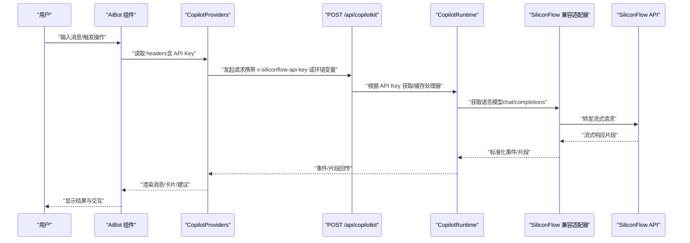
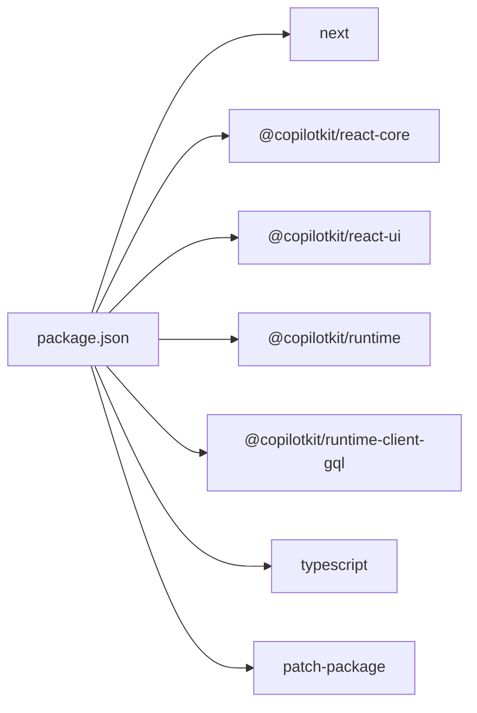

# 快速开始

<cite>
**本文档引用的文件**
- [package.json](file://package.json)
- [next.config.js](file://next.config.js)
- [tsconfig.json](file://tsconfig.json)
- [next-env.d.ts](file://next-env.d.ts)
- [.gitignore](file://.gitignore)
- [app/layout.tsx](file://app/layout.tsx)
- [app/page.tsx](file://app/page.tsx)
- [app/api/copilotkit/route.ts](file://app/api/copilotkit/route.ts)
- [components/CopilotProviders.tsx](file://components/CopilotProviders.tsx)
- [components/AiBot.tsx](file://components/AiBot.tsx)
- [components/MainPage.tsx](file://components/MainPage.tsx)
- [lib/siliconflow-defaults.ts](file://lib/siliconflow-defaults.ts)
- [lib/siliconFlowOpenAIAdapter.ts](file://lib/siliconFlowOpenAIAdapter.ts)
- [lib/resumeData.ts](file://lib/resumeData.ts)
- [patches/@copilotkitnext+agent+1.54.0.patch](file://patches/@copilotkitnext+agent+1.54.0.patch)
- [public/audio/README.md](file://public/audio/README.md)
</cite>

## 目录
1. [简介](#简介)
2. [项目结构](#项目结构)
3. [核心组件](#核心组件)
4. [架构总览](#架构总览)
5. [详细组件分析](#详细组件分析)
6. [依赖分析](#依赖分析)
7. [性能考虑](#性能考虑)
8. [故障排查指南](#故障排查指南)
9. [结论](#结论)
10. [附录](#附录)

## 简介
本指南面向初学者，帮助你在本地快速搭建并运行 Fuqianjiao AI 项目。项目基于 Next.js 14，采用 TypeScript，并集成了 CopilotKit 与 SiliconFlow（兼容 OpenAI 协议）的聊天能力。你将学会：
- 环境要求与安装步骤
- 本地开发环境配置（含环境变量）
- 首次运行与常见初始化问题处理
- 核心命令（dev/build/start/lint）的用途与最佳实践
- 开发工作流程建议

## 项目结构
项目采用 Next.js App Router 结构，核心目录与职责如下：
- app：页面与 API 路由（App Router）
- components：可复用 UI 组件与 Copilot 集成层
- lib：运行时适配器、默认配置与简历数据
- patches：第三方依赖的补丁（用于修复特定版本的兼容性）
- public：公共资源（背景音乐等）

图表来源
- [package.json:1-29](file://package.json#L1-L29)
- [next.config.js:1-4](file://next.config.js#L1-L4)
- [tsconfig.json:1-21](file://tsconfig.json#L1-L21)
- [app/layout.tsx:1-48](file://app/layout.tsx#L1-L48)
- [app/page.tsx:1-30](file://app/page.tsx#L1-L30)
- [components/CopilotProviders.tsx:1-157](file://components/CopilotProviders.tsx#L1-L157)
- [app/api/copilotkit/route.ts:1-131](file://app/api/copilotkit/route.ts#L1-L131)
- [lib/siliconFlowOpenAIAdapter.ts:1-36](file://lib/siliconFlowOpenAIAdapter.ts#L1-L36)
- [lib/siliconflow-defaults.ts:1-16](file://lib/siliconflow-defaults.ts#L1-L16)
- [components/AiBot.tsx:1-800](file://components/AiBot.tsx#L1-L800)
- [components/MainPage.tsx:1-200](file://components/MainPage.tsx#L1-L200)
- [lib/resumeData.ts:1-200](file://lib/resumeData.ts#L1-L200)
- [public/audio/README.md:1-13](file://public/audio/README.md#L1-L13)

章节来源
- [package.json:1-29](file://package.json#L1-L29)
- [next.config.js:1-4](file://next.config.js#L1-L4)
- [tsconfig.json:1-21](file://tsconfig.json#L1-L21)
- [app/layout.tsx:1-48](file://app/layout.tsx#L1-L48)
- [app/page.tsx:1-30](file://app/page.tsx#L1-L30)

## 核心组件
- Next.js 与 TypeScript：通过 next.config.js 与 tsconfig.json 定义编译与运行行为。
- CopilotKit 集成：通过 CopilotProviders 包裹应用，提供运行时与 UI 组件，并在客户端发起与后端 API 的通信。
- 后端 API：/api/copilotkit 路由负责解析 API Key、选择模型、桥接 SiliconFlow/OpenAI 兼容服务，并返回流式响应。
- 适配器：SiliconFlowCompatibleOpenAIAdapter 将 CopilotKit 的模型调用映射到 /v1/chat/completions，适配 SiliconFlow 的流式协议。
- 简历数据：resumeData.ts 作为 AI Bot 的知识库，贯穿对话与卡片渲染。

章节来源
- [components/CopilotProviders.tsx:1-157](file://components/CopilotProviders.tsx#L1-L157)
- [app/api/copilotkit/route.ts:1-131](file://app/api/copilotkit/route.ts#L1-L131)
- [lib/siliconFlowOpenAIAdapter.ts:1-36](file://lib/siliconFlowOpenAIAdapter.ts#L1-L36)
- [lib/resumeData.ts:1-200](file://lib/resumeData.ts#L1-L200)

## 架构总览
下面的时序图展示了从浏览器到后端 API 再到 SiliconFlow 的完整调用链，以及前端如何通过 CopilotKit 与 UI 组件进行交互。

图表来源
- [components/AiBot.tsx:1-800](file://components/AiBot.tsx#L1-L800)
- [components/CopilotProviders.tsx:1-157](file://components/CopilotProviders.tsx#L1-L157)
- [app/api/copilotkit/route.ts:1-131](file://app/api/copilotkit/route.ts#L1-L131)
- [lib/siliconFlowOpenAIAdapter.ts:1-36](file://lib/siliconFlowOpenAIAdapter.ts#L1-L36)

## 详细组件分析

### 环境与依赖准备
- Node.js 与包管理器
  - 推荐使用 Node.js 18+（LTS），确保与 Next.js 14 兼容。
  - 支持 npm 与 yarn；本项目使用 npm scripts。
- 依赖安装
  - 执行安装命令后，将自动运行 patch-package，应用 @copilotkitnext/agent 的补丁以修复特定版本的兼容性问题。
- TypeScript 与 Next 配置
  - tsconfig.json 已启用严格模式下的宽松设置与 bundler 模块解析，便于 App Router 与 Next 内置类型集成。
  - next.config.js 为空配置，使用默认行为即可。

章节来源
- [package.json:1-29](file://package.json#L1-L29)
- [tsconfig.json:1-21](file://tsconfig.json#L1-L21)
- [next.config.js:1-4](file://next.config.js#L1-L4)
- [patches/@copilotkitnext+agent+1.54.0.patch:1-125](file://patches/@copilotkitnext+agent+1.54.0.patch#L1-L125)

### 根布局与 Provider 包裹
- 根布局负责预加载音频资源、引入字体与全局样式，并通过 CopilotProviders 注入 CopilotKit 运行时与 UI。
- NEXT_PUBLIC_AUDIO_SRC 可用于指定音频资源的公共路径或 CDN 地址（需允许跨域）。

章节来源
- [app/layout.tsx:1-48](file://app/layout.tsx#L1-L48)
- [public/audio/README.md:1-13](file://public/audio/README.md#L1-L13)

### CopilotKit 提供者与 API Key 解析
- CopilotProviders 负责：
  - 从 localStorage 读取用户自定义 API Key（若存在），否则使用环境变量或内置默认值。
  - 通过 /api/copilotkit 健康检查，判断服务端是否已配置有效 Key。
  - 为 CopilotKit 注入 headers（x-siliconflow-api-key），并禁用开发台弹窗以避免误报。
- API Key 解析顺序（后端）：请求头 > 环境变量 > 代码默认值。

章节来源
- [components/CopilotProviders.tsx:1-157](file://components/CopilotProviders.tsx#L1-L157)
- [app/api/copilotkit/route.ts:27-43](file://app/api/copilotkit/route.ts#L27-L43)
- [lib/siliconflow-defaults.ts:1-16](file://lib/siliconflow-defaults.ts#L1-L16)

### 后端 API 路由与适配器
- /api/copilotkit 路由：
  - 解析 API Key，缓存处理器以提升性能。
  - 使用 SiliconFlowCompatibleOpenAIAdapter 将模型调用映射到 chat/completions，适配 SiliconFlow 的流式协议。
  - 支持 OPTIONS 预检，便于浏览器跨域请求。
- 适配器：
  - 将 CopilotKit 默认 Responses API 切换为 Chat Completions，确保与 SiliconFlow 兼容。

章节来源
- [app/api/copilotkit/route.ts:1-131](file://app/api/copilotkit/route.ts#L1-L131)
- [lib/siliconFlowOpenAIAdapter.ts:1-36](file://lib/siliconFlowOpenAIAdapter.ts#L1-L36)

### AI 助手与主页内容
- AiBot：负责渲染对话 UI、快捷问题、结构化卡片（项目亮点、技能栈、岗位匹配度）与函数调用状态提示。
- MainPage：承载主页内容与导航，配合 AiBot 展示简历与观点。

章节来源
- [components/AiBot.tsx:1-800](file://components/AiBot.tsx#L1-L800)
- [components/MainPage.tsx:1-200](file://components/MainPage.tsx#L1-L200)
- [lib/resumeData.ts:1-200](file://lib/resumeData.ts#L1-L200)

## 依赖分析
- 运行时依赖
  - @copilotkit/react-core / react-ui / runtime / runtime-client-gql：提供 AI 助手核心能力与 UI。
  - next / react / react-dom：框架与渲染基础。
- 开发依赖
  - @types/*：类型声明。
  - patch-package：应用补丁以修复第三方兼容性问题。
  - typescript：类型检查与编译。

图表来源
- [package.json:1-29](file://package.json#L1-L29)

章节来源
- [package.json:1-29](file://package.json#L1-L29)

## 性能考虑
- 处理器缓存：后端按 API Key 缓存 CopilotRuntime 处理器，避免重复初始化，提升并发稳定性与响应速度。
- 并行工具调用：显式关闭并行工具调用，适配部分网关仅流式 tool-input-* 的限制，减少校验错误。
- 流式响应：使用 SiliconFlow 兼容适配器，确保流式 chat/completions 协议，降低首字延迟。

章节来源
- [app/api/copilotkit/route.ts:45-95](file://app/api/copilotkit/route.ts#L45-L95)
- [lib/siliconFlowOpenAIAdapter.ts:1-36](file://lib/siliconFlowOpenAIAdapter.ts#L1-L36)

## 故障排查指南
- 未配置有效 API Key
  - 现象：后端返回配置错误提示。
  - 处理：在 .env.local 中设置 SILICONFLOW_API_KEY，或在前端「API」面板保存 Key（仅浏览器可见）。
- 模型不可用或 404
  - 现象：前端出现 AI 调用错误。
  - 处理：检查 SILICONFLOW_MODEL 是否为当前可用模型；必要时切换为 Qwen/Qwen3-14B。
- 跨域或预检失败
  - 现象：OPTIONS 预检被拒绝。
  - 处理：确保后端导出 OPTIONS 方法；前端请求头携带 x-siliconflow-api-key。
- 浏览器开发台弹窗干扰
  - 现象：localhost 下出现开发台弹窗。
  - 处理：CopilotProviders 已禁用 showDevConsole，确保未被覆盖。
- 音频资源无法播放
  - 现象：页面无法加载背景音乐。
  - 处理：将 prosecco.mp3 放入 public/audio 并提交；或在 .env.local 设置 NEXT_PUBLIC_AUDIO_SRC 为允许跨域的 CDN 地址。

章节来源
- [app/api/copilotkit/route.ts:97-114](file://app/api/copilotkit/route.ts#L97-L114)
- [app/api/copilotkit/route.ts:19-26](file://app/api/copilotkit/route.ts#L19-L26)
- [components/CopilotProviders.tsx:46-48](file://components/CopilotProviders.tsx#L46-L48)
- [public/audio/README.md:1-13](file://public/audio/README.md#L1-L13)

## 结论
通过以上步骤，你可以完成 Fuqianjiao AI 项目的本地环境搭建与首次运行。建议在开发过程中：
- 优先使用环境变量配置 API Key，避免将密钥提交到仓库。
- 关注模型兼容性与流式协议，确保与 SiliconFlow 的适配器正确工作。
- 利用 CopilotKit 的 Provider 与 UI 组件，快速构建对话与卡片交互。

## 附录

### 环境要求与安装步骤
- 环境要求
  - Node.js：18+（LTS）
  - 包管理器：npm 或 yarn
- 安装步骤
  - 克隆仓库后，在项目根目录执行安装命令（将自动应用补丁）。
  - 准备 .env.local（见“环境变量配置”）。
  - 准备 public/audio 目录中的背景音乐文件（见“音频资源说明”）。
- 首次运行
  - 执行开发服务器命令，访问本地地址查看效果。
  - 如需构建生产包，先执行构建命令，再启动生产服务器。

章节来源
- [package.json:5-10](file://package.json#L5-L10)
- [public/audio/README.md:1-13](file://public/audio/README.md#L1-L13)

### 环境变量配置
- 必填
  - SILICONFLOW_API_KEY：SiliconFlow API 密钥（推荐放置于 .env.local）
- 可选
  - SILICONFLOW_MODEL：模型名称，默认 Qwen/Qwen3-14B
  - SILICONFLOW_BASE_URL：SiliconFlow 基础地址，默认 https://api.siliconflow.cn/v1
  - NEXT_PUBLIC_AUDIO_SRC：音频资源公共路径或 CDN（需允许跨域）
  - NEXT_PUBLIC_SILICONFLOW_API_KEY：前端可读的 API Key（不推荐在生产暴露）

章节来源
- [app/api/copilotkit/route.ts:16-26](file://app/api/copilotkit/route.ts#L16-L26)
- [lib/siliconflow-defaults.ts:1-16](file://lib/siliconflow-defaults.ts#L1-L16)
- [app/layout.tsx:13-17](file://app/layout.tsx#L13-L17)

### 核心命令说明
- dev：启动 Next.js 开发服务器，热更新与调试友好
- build：构建生产包
- start：启动生产服务器
- lint：运行 Next.js 内置 Lint 检查
- postinstall：安装后自动应用补丁

章节来源
- [package.json:5-10](file://package.json#L5-L10)

### 开发工作流程建议
- 本地开发
  - 使用 dev 命令进行迭代；在 CopilotProviders 中保存临时 Key 以便快速测试。
- 环境变量
  - 在 .env.local 中配置 SILICONFLOW_API_KEY；.env.local 已加入 .gitignore，避免泄露。
- 资源与样式
  - 将音频文件放入 public/audio 并提交；字体与样式在根布局中统一引入。
- 兼容性
  - 如遇工具调用校验错误，确认已应用补丁；必要时关闭并行工具调用。

章节来源
- [.gitignore:1-5](file://.gitignore#L1-L5)
- [patches/@copilotkitnext+agent+1.54.0.patch:1-125](file://patches/@copilotkitnext+agent+1.54.0.patch#L1-L125)