# Function Calling 功能扩展

<cite>
**本文档引用的文件**
- [resumeData.ts](file://lib/resumeData.ts)
- [route.ts](file://app/api/copilotkit/route.ts)
- [AiBot.tsx](file://components/AiBot.tsx)
- [CopilotAssistantMessage.tsx](file://components/CopilotAssistantMessage.tsx)
- [CopilotProviders.tsx](file://components/CopilotProviders.tsx)
- [siliconFlowOpenAIAdapter.ts](file://lib/siliconFlowOpenAIAdapter.ts)
- [patchOpenAIForSiliconFlow.ts](file://lib/patchOpenAIForSiliconFlow.ts)
- [copilotLocalMemory.ts](file://lib/copilotLocalMemory.ts)
</cite>

## 目录
1. [简介](#简介)
2. [项目结构](#项目结构)
3. [核心组件](#核心组件)
4. [架构概览](#架构概览)
5. [详细组件分析](#详细组件分析)
6. [依赖分析](#依赖分析)
7. [性能考虑](#性能考虑)
8. [故障排除指南](#故障排除指南)
9. [结论](#结论)

## 简介

本文档为 Fuqianjiao AI 项目创建 Function Calling 功能扩展的详细指南。项目基于 CopilotKit 构建，实现了 AI 助手的 Function Calling 能力，能够通过结构化卡片和交互式界面为用户提供丰富的信息展示。

项目的核心功能包括：
- 基于 resumeData 的知识库注入
- 多种 Function Calling 函数的实现
- 结构化卡片渲染
- 本地对话记忆管理
- 与硅基流动服务的集成

## 项目结构

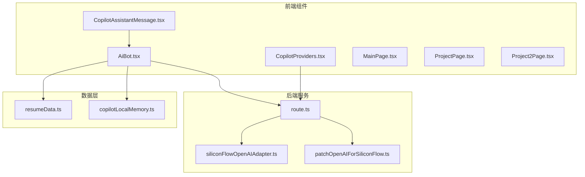

**图表来源**
- [AiBot.tsx:1-50](file://components/AiBot.tsx#L1-L50)
- [route.ts:1-50](file://app/api/copilotkit/route.ts#L1-L50)

**章节来源**
- [AiBot.tsx:1-100](file://components/AiBot.tsx#L1-L100)
- [route.ts:1-50](file://app/api/copilotkit/route.ts#L1-L50)

## 核心组件

### Function Calling 函数定义

项目实现了多个 Function Calling 函数，每个函数都包含以下结构：

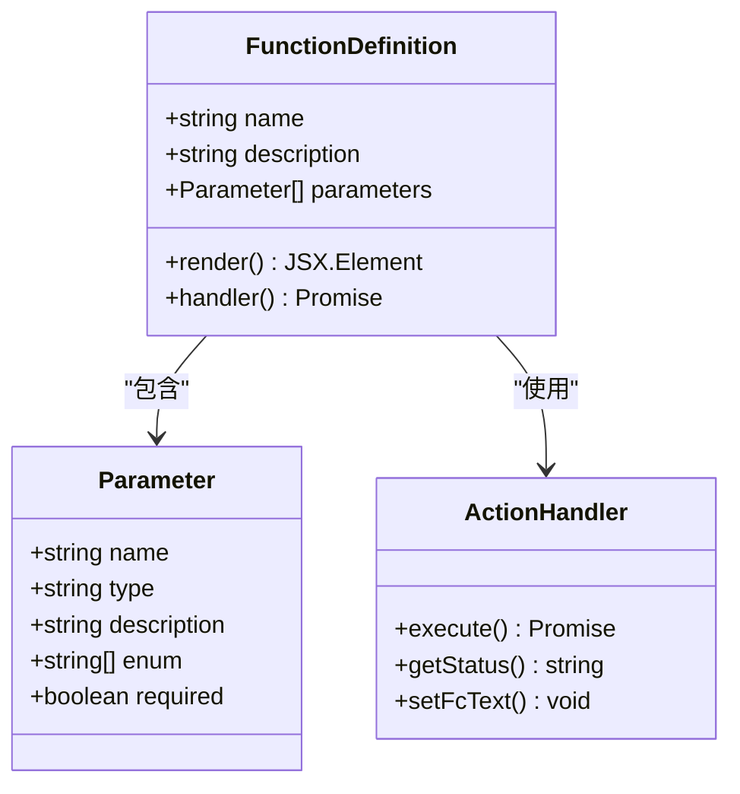

**图表来源**
- [AiBot.tsx:1105-1180](file://components/AiBot.tsx#L1105-L1180)
- [AiBot.tsx:1285-1394](file://components/AiBot.tsx#L1285-L1394)

### 现有函数分类

项目中的 Function Calling 函数主要分为以下几类：

1. **项目展示函数**
   - `showCoreProjectsOverview`: 展示核心项目总览
   - `showProjectHighlights`: 展示单个项目亮点
   - `navigateToPage`: 导航到指定页面

2. **技能展示函数**
   - `showSkillsStackCard`: 展示技术栈卡片
   - `showJobMatchCard`: 展示岗位匹配度卡片

3. **AI 笔记函数**
   - `showAiNotebookOpinionsAll`: 展示所有 AI 笔记洞察
   - `showAiNotebookOpinion`: 展示单条 AI 笔记洞察

4. **联系信息函数**
   - `getContactInfo`: 获取联系方式

**章节来源**
- [AiBot.tsx:1105-1491](file://components/AiBot.tsx#L1105-L1491)

## 架构概览

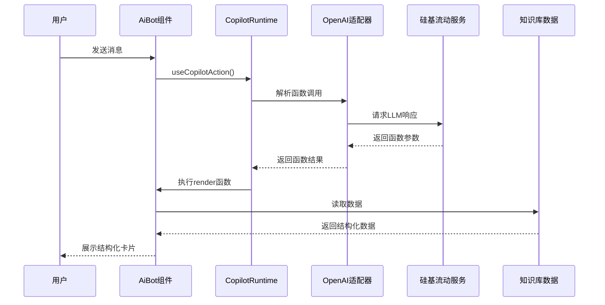

**图表来源**
- [route.ts:73-95](file://app/api/copilotkit/route.ts#L73-L95)
- [AiBot.tsx:1526-1541](file://components/AiBot.tsx#L1526-L1541)

## 详细组件分析

### Function Calling 实现机制

#### 函数注册流程

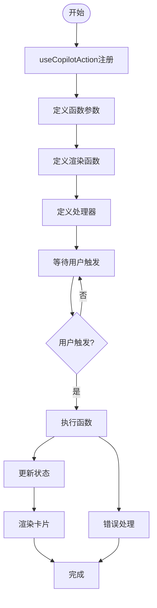

**图表来源**
- [AiBot.tsx:1105-1180](file://components/AiBot.tsx#L1105-L1180)
- [AiBot.tsx:1436-1491](file://components/AiBot.tsx#L1436-L1491)

#### 参数验证机制

每个函数都包含严格的参数验证：

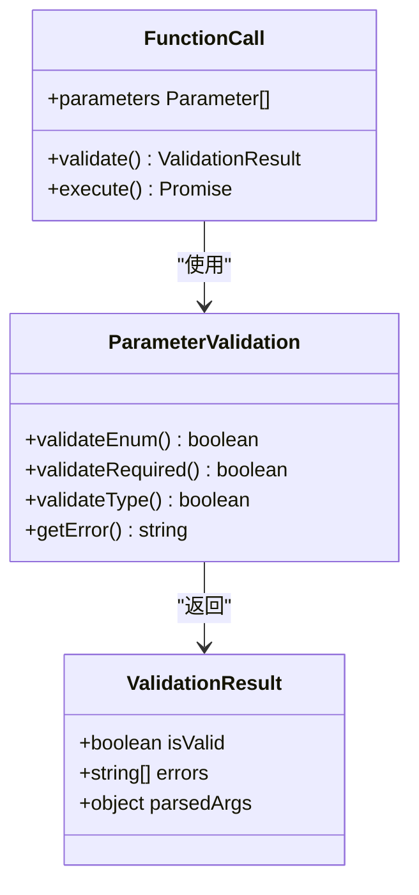

**图表来源**
- [AiBot.tsx:1110-1118](file://components/AiBot.tsx#L1110-L1118)
- [AiBot.tsx:1289-1296](file://components/AiBot.tsx#L1289-L1296)

### 数据流处理

#### 结构化数据处理

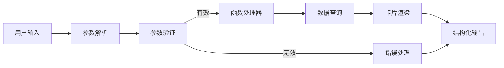

**图表来源**
- [resumeData.ts:5-263](file://lib/resumeData.ts#L5-L263)
- [AiBot.tsx:1120-1138](file://components/AiBot.tsx#L1120-L1138)

### 状态管理机制

#### Function Calling 状态跟踪

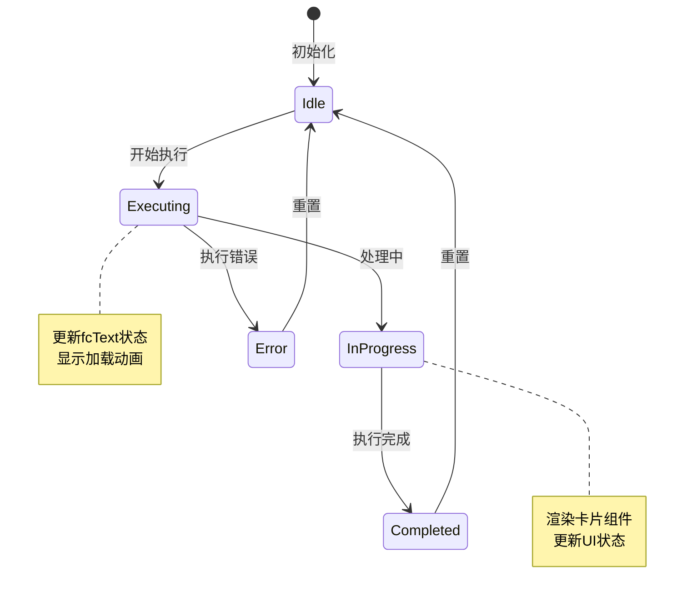

**图表来源**
- [AiBot.tsx:713-757](file://components/AiBot.tsx#L713-L757)
- [AiBot.tsx:1132-1138](file://components/AiBot.tsx#L1132-L1138)

**章节来源**
- [AiBot.tsx:713-757](file://components/AiBot.tsx#L713-L757)
- [AiBot.tsx:1132-1138](file://components/AiBot.tsx#L1132-L1138)

## 依赖分析

### 组件间依赖关系

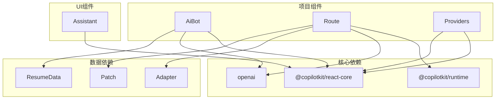

**图表来源**
- [route.ts:2-15](file://app/api/copilotkit/route.ts#L2-L15)
- [AiBot.tsx:1-25](file://components/AiBot.tsx#L1-L25)

### 外部服务集成

#### 硅基流动服务集成

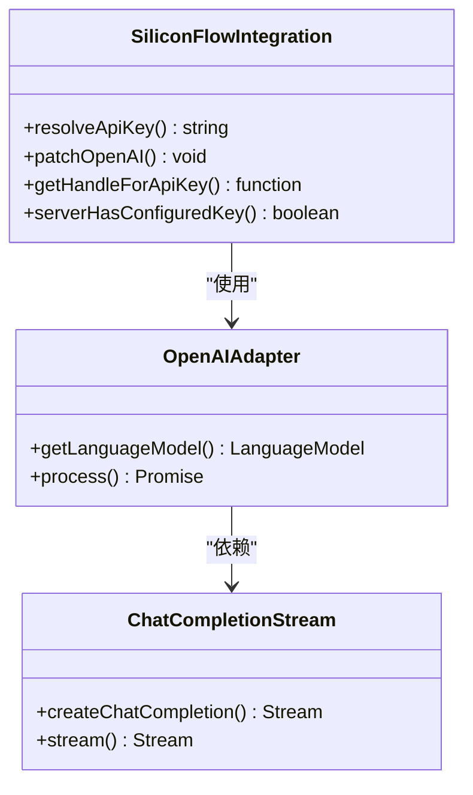

**图表来源**
- [route.ts:30-95](file://app/api/copilotkit/route.ts#L30-L95)
- [siliconFlowOpenAIAdapter.ts:17-35](file://lib/siliconFlowOpenAIAdapter.ts#L17-L35)

**章节来源**
- [route.ts:30-95](file://app/api/copilotkit/route.ts#L30-L95)
- [siliconFlowOpenAIAdapter.ts:17-35](file://lib/siliconFlowOpenAIAdapter.ts#L17-L35)

## 性能考虑

### 优化策略

1. **缓存机制**
   - API Key 缓存避免重复初始化
   - 本地存储对话记忆
   - 组件状态缓存

2. **异步处理**
   - 函数执行使用 Promise
   - 防抖处理用户输入
   - 并行处理多个请求

3. **内存管理**
   - 限制对话记忆长度
   - 及时清理临时状态
   - 合理的组件卸载

### 性能监控

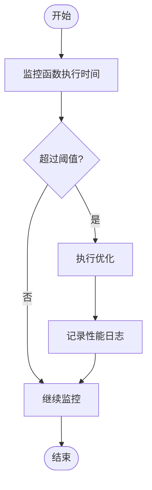

## 故障排除指南

### 常见问题及解决方案

#### API 配置问题

| 问题 | 症状 | 解决方案 |
|------|------|----------|
| API Key 未配置 | 服务端返回配置错误 | 在环境变量中设置 SILICONFLOW_API_KEY |
| 网关不支持 | 返回 404 错误 | 使用 SiliconFlowCompatibleOpenAIAdapter |
| 流式传输问题 | 无法接收工具调用 | 应用 patchOpenAIForSiliconFlow |

#### Function Calling 错误

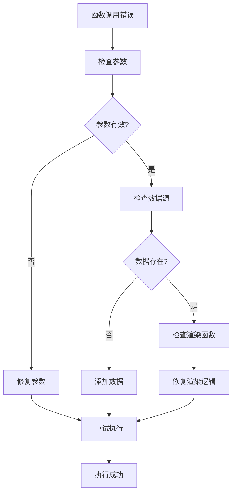

**图表来源**
- [route.ts:100-114](file://app/api/copilotkit/route.ts#L100-L114)
- [AiBot.tsx:1132-1138](file://components/AiBot.tsx#L1132-L1138)

**章节来源**
- [route.ts:100-114](file://app/api/copilotkit/route.ts#L100-L114)
- [AiBot.tsx:1132-1138](file://components/AiBot.tsx#L1132-L1138)

## 结论

Fuqianjiao AI 项目的 Function Calling 功能扩展展现了现代 AI 助手系统的最佳实践。通过合理的架构设计、严格的参数验证和优雅的状态管理，实现了功能丰富且用户体验优秀的 AI 助手。

### 关键优势

1. **模块化设计**: 每个 Function Calling 函数都是独立的模块，便于维护和扩展
2. **类型安全**: TypeScript 提供完整的类型检查和智能提示
3. **用户体验**: 结构化卡片和流畅的交互提升了用户满意度
4. **性能优化**: 缓存机制和异步处理确保了良好的响应速度

### 扩展建议

1. **新增函数类型**: 可以添加更多业务相关的 Function Calling 函数
2. **增强错误处理**: 实现更完善的错误恢复机制
3. **性能监控**: 添加详细的性能指标收集和分析
4. **测试覆盖**: 增加单元测试和集成测试的覆盖率

这个项目为 Function Calling 功能的实现提供了完整的参考模板，开发者可以根据具体需求进行定制和扩展。