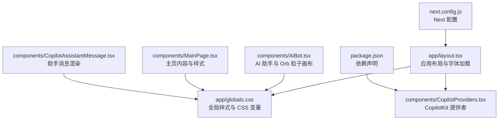
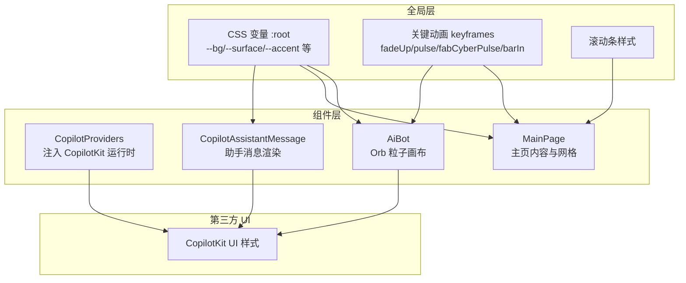
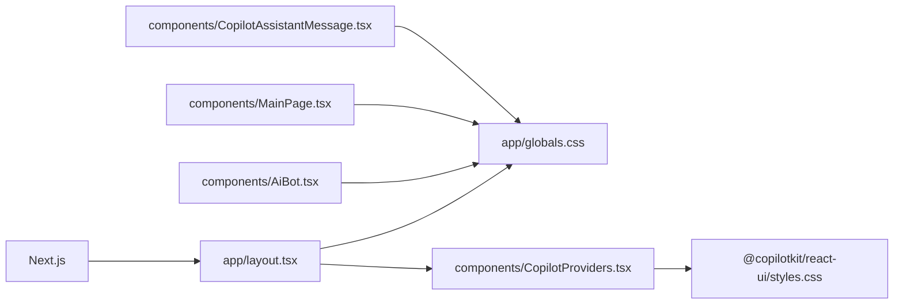

# 主题定制与样式扩展

<cite>
**本文引用的文件**
- [app/globals.css](file://app/globals.css)
- [app/layout.tsx](file://app/layout.tsx)
- [components/CopilotProviders.tsx](file://components/CopilotProviders.tsx)
- [components/AiBot.tsx](file://components/AiBot.tsx)
- [components/MainPage.tsx](file://components/MainPage.tsx)
- [components/CopilotAssistantMessage.tsx](file://components/CopilotAssistantMessage.tsx)
- [package.json](file://package.json)
- [next.config.js](file://next.config.js)
</cite>

## 目录
1. [简介](#简介)
2. [项目结构](#项目结构)
3. [核心组件](#核心组件)
4. [架构总览](#架构总览)
5. [详细组件分析](#详细组件分析)
6. [依赖分析](#依赖分析)
7. [性能考虑](#性能考虑)
8. [故障排查指南](#故障排查指南)
9. [结论](#结论)
10. [附录](#附录)

## 简介
本指南面向 Fuqianjiao AI 项目，聚焦“主题定制与样式扩展”。项目采用赛博朋克风格，通过 CSS 变量、动画与渐变、以及对第三方 UI 组件的覆盖，构建统一的视觉语言。本文将系统讲解：
- 如何修改赛博朋克主题的视觉效果（CSS 变量、颜色方案、动画）
- 如何覆盖默认样式（组件局部定制与全局主题变更）
- 如何添加新的视觉效果（自定义动画、渐变背景、粒子效果）
- 响应式设计的定制方法
- 主题切换的实现方案与最佳实践

## 项目结构
项目采用 Next.js 结构，样式集中在全局样式文件中，并通过布局文件引入；AI 助手与页面内容通过组件实现，部分样式通过内联样式与 CSS 变量结合。

图表来源
- [app/layout.tsx:1-48](file://app/layout.tsx#L1-L48)
- [app/globals.css:1-550](file://app/globals.css#L1-L550)
- [components/CopilotProviders.tsx:1-157](file://components/CopilotProviders.tsx#L1-L157)
- [components/AiBot.tsx:1-850](file://components/AiBot.tsx#L1-L850)
- [components/MainPage.tsx:1-691](file://components/MainPage.tsx#L1-L691)
- [components/CopilotAssistantMessage.tsx:1-196](file://components/CopilotAssistantMessage.tsx#L1-L196)
- [package.json:1-29](file://package.json#L1-L29)
- [next.config.js:1-4](file://next.config.js#L1-L4)

章节来源
- [app/layout.tsx:1-48](file://app/layout.tsx#L1-L48)
- [app/globals.css:1-550](file://app/globals.css#L1-L550)
- [package.json:1-29](file://package.json#L1-L29)
- [next.config.js:1-4](file://next.config.js#L1-L4)

## 核心组件
- 全局样式与变量：通过 :root 定义主题变量，统一背景、表面、强调色、文本、边框与发光效果。
- CopilotKit 样式覆盖：针对聊天气泡、输入区、操作栏、建议胶囊等进行定制，确保与赛博朋克风格一致。
- 动画与渐变：定义了多种 keyframes（如上升、脉冲、呼吸、条形填充）与渐变背景，用于页面与组件的动态效果。
- 响应式网格：主页数字团队卡片网格在窄屏单列、中等屏双列，体现响应式设计。
- 主题切换：当前未实现深色/浅色主题切换，可通过 CSS 变量与媒体查询实现。

章节来源
- [app/globals.css:1-550](file://app/globals.css#L1-L550)
- [components/MainPage.tsx:493-508](file://components/MainPage.tsx#L493-L508)

## 架构总览
整体样式架构围绕“全局变量 + 组件覆盖 + 动画渐变”的思路展开，确保一致性与可扩展性。

图表来源
- [app/globals.css:1-550](file://app/globals.css#L1-L550)
- [components/CopilotProviders.tsx:144-156](file://components/CopilotProviders.tsx#L144-L156)
- [components/AiBot.tsx:794-850](file://components/AiBot.tsx#L794-L850)
- [components/MainPage.tsx:141-254](file://components/MainPage.tsx#L141-L254)
- [components/CopilotAssistantMessage.tsx:37-196](file://components/CopilotAssistantMessage.tsx#L37-L196)

## 详细组件分析

### 全局样式与 CSS 变量
- 变量定义：背景、表面、强调色、文本、边框、发光等，均通过 CSS 变量集中管理，便于主题切换与局部覆盖。
- 覆盖 CopilotKit 默认样式：通过特定类名覆盖聊天气泡、输入区、操作栏、建议胶囊等，确保与赛博朋克风格一致。
- 动画与渐变：定义了多种 keyframes 与渐变背景，用于页面与组件的动态效果。
- 响应式网格：主页数字团队卡片网格在窄屏单列、中等屏双列，体现响应式设计。

章节来源
- [app/globals.css:1-550](file://app/globals.css#L1-L550)

### CopilotProviders（主题注入与运行时）
- 作用：提供 CopilotKit 运行时配置，注入运行时 URL、禁用 Inspector 与开发控制台、设置请求头（API Key）。
- 与主题的关系：通过全局样式文件引入 CopilotKit UI 样式，配合 CSS 变量与覆盖规则，实现统一的赛博朋克风格。

章节来源
- [components/CopilotProviders.tsx:144-156](file://components/CopilotProviders.tsx#L144-L156)
- [app/layout.tsx:5-6](file://app/layout.tsx#L5-L6)

### AiBot（Orb 粒子画布与动画）
- Orb 粒子画布：使用 Canvas 实时绘制椭圆渐变，模拟赛博朋克风格的脉动与流动感。
- 动画：内部使用 keyframes 控制闪烁与脉冲，增强视觉层次。
- 与全局样式：依赖全局 CSS 变量与动画，确保与整体风格一致。

章节来源
- [components/AiBot.tsx:794-850](file://components/AiBot.tsx#L794-L850)
- [app/globals.css:92-101](file://app/globals.css#L92-L101)

### MainPage（主页内容与样式）
- 样式策略：大量使用内联样式与 CSS 变量，确保与全局主题一致。
- 响应式网格：数字团队卡片网格在窄屏单列、中等屏双列，体现响应式设计。
- 渐变与阴影：使用径向渐变与阴影，营造赛博朋克氛围。

章节来源
- [components/MainPage.tsx:141-254](file://components/MainPage.tsx#L141-L254)
- [components/MainPage.tsx:493-508](file://components/MainPage.tsx#L493-L508)

### CopilotAssistantMessage（助手消息渲染）
- 作用：渲染助手消息，支持结构化卡片与 Markdown 气泡，控制操作栏显示逻辑。
- 与主题的关系：通过全局样式覆盖，确保消息气泡、操作栏与输入区符合赛博朋克风格。

章节来源
- [components/CopilotAssistantMessage.tsx:37-196](file://components/CopilotAssistantMessage.tsx#L37-L196)
- [app/globals.css:115-189](file://app/globals.css#L115-L189)

## 依赖分析
- Next.js：基础框架，负责页面与路由。
- @copilotkit/react-core/react-ui/runtime：AI 助手与 UI 组件，需通过全局样式覆盖实现主题一致。
- 依赖安装：通过 postinstall 执行 patch-package，确保第三方依赖的兼容性。

图表来源
- [app/layout.tsx:1-48](file://app/layout.tsx#L1-L48)
- [package.json:12-20](file://package.json#L12-L20)

章节来源
- [package.json:12-20](file://package.json#L12-L20)
- [app/layout.tsx:1-48](file://app/layout.tsx#L1-L48)

## 性能考虑
- CSS 变量：集中管理颜色与尺寸，减少重复定义，提升维护效率。
- 动画：使用 CSS keyframes 与 Canvas 动画相结合，注意帧率与设备性能。
- 响应式：媒体查询与网格布局，确保在不同设备上的良好体验。
- 第三方样式：通过覆盖而非重写，减少样式冲突与重绘。

[本节为通用指导，无需特定文件来源]

## 故障排查指南
- CopilotKit 样式未生效：检查全局样式是否正确引入，确认覆盖选择器的优先级。
- 动画不流畅：检查 keyframes 的性能影响，必要时降低动画频率或简化效果。
- 响应式布局异常：检查媒体查询与网格布局的断点设置，确保在目标设备上正常显示。
- 主题切换无效：若实现深色/浅色切换，需确保 CSS 变量在切换时被正确更新。

[本节为通用指导，无需特定文件来源]

## 结论
本项目通过 CSS 变量、动画与渐变、以及对第三方 UI 的覆盖，构建了统一的赛博朋克主题。建议在现有基础上：
- 明确主题变量命名规范，便于扩展与维护
- 逐步引入主题切换（深色/浅色），通过 CSS 变量与媒体查询实现
- 将常用动画与渐变抽象为可复用的样式模块，提升一致性
- 在组件层增加主题开关与持久化存储，提升用户体验

[本节为总结性内容，无需特定文件来源]

## 附录

### CSS 变量修改示例（路径指引）
- 修改背景与表面：[app/globals.css:2-12](file://app/globals.css#L2-L12)
- 修改强调色与文本：[app/globals.css:2-12](file://app/globals.css#L2-L12)
- 修改边框与发光：[app/globals.css:2-12](file://app/globals.css#L2-L12)

章节来源
- [app/globals.css:1-12](file://app/globals.css#L1-L12)

### 覆盖默认样式的步骤（路径指引）
- 覆盖 CopilotKit 按钮与弹窗：[app/globals.css:25-32](file://app/globals.css#L25-L32)
- 覆盖聊天气泡与输入区：[app/globals.css:38-91](file://app/globals.css#L38-L91)
- 覆盖消息与操作栏：[app/globals.css:115-314](file://app/globals.css#L115-L314)
- 覆盖建议胶囊：[app/globals.css:324-382](file://app/globals.css#L324-L382)
- 覆盖输入控件与发送按钮：[app/globals.css:384-474](file://app/globals.css#L384-L474)

章节来源
- [app/globals.css:25-474](file://app/globals.css#L25-L474)

### 添加新的视觉效果（路径指引）
- 自定义动画：在全局样式中新增 keyframes，例如 [app/globals.css:516-542](file://app/globals.css#L516-L542)
- 渐变背景：在组件内联样式或全局样式中使用线性/径向渐变，例如 [components/MainPage.tsx:146-146](file://components/MainPage.tsx#L146-L146)、[components/MainPage.tsx:218-228](file://components/MainPage.tsx#L218-L228)
- 粒子效果：使用 Canvas 实时绘制，例如 [components/AiBot.tsx:794-850](file://components/AiBot.tsx#L794-L850)

章节来源
- [app/globals.css:516-542](file://app/globals.css#L516-L542)
- [components/MainPage.tsx:146-146](file://components/MainPage.tsx#L146-L146)
- [components/MainPage.tsx:218-228](file://components/MainPage.tsx#L218-L228)
- [components/AiBot.tsx:794-850](file://components/AiBot.tsx#L794-L850)

### 响应式设计定制（路径指引）
- 网格布局断点：[app/globals.css:493-508](file://app/globals.css#L493-L508)
- 页面元素动画延迟：[app/globals.css:544-549](file://app/globals.css#L544-L549)
- 主页 Hero 渐变与阴影：[components/MainPage.tsx:146-146](file://components/MainPage.tsx#L146-L146)

章节来源
- [app/globals.css:493-508](file://app/globals.css#L493-L508)
- [app/globals.css:544-549](file://app/globals.css#L544-L549)
- [components/MainPage.tsx:146-146](file://components/MainPage.tsx#L146-L146)

### 主题切换实现方案与最佳实践（概念性说明）
- 方案一：CSS 变量 + 媒体查询
  - 使用 prefers-color-scheme 或自定义主题类名切换变量值
  - 优点：性能好、易于维护
  - 缺点：需确保所有颜色与阴影使用变量
- 方案二：CSS Modules + 动态类名
  - 为深色与浅色主题分别定义样式模块
  - 优点：隔离性强
  - 缺点：样式体积可能增大
- 最佳实践
  - 统一命名规范：--theme-*
  - 优先使用 CSS 变量，避免硬编码颜色
  - 在组件层提供主题开关与持久化存储
  - 为动画与过渡设置合理的性能阈值

[本节为概念性内容，无需特定文件来源]