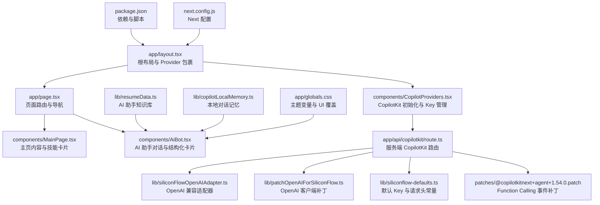
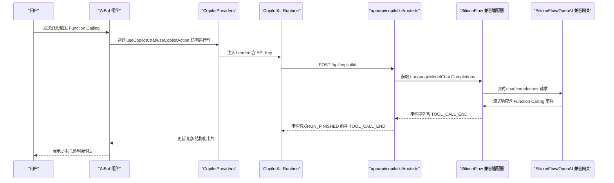
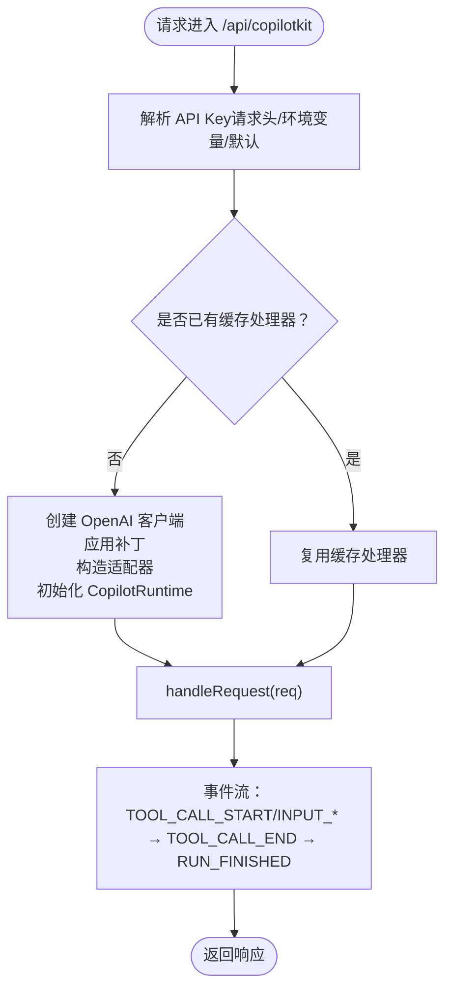
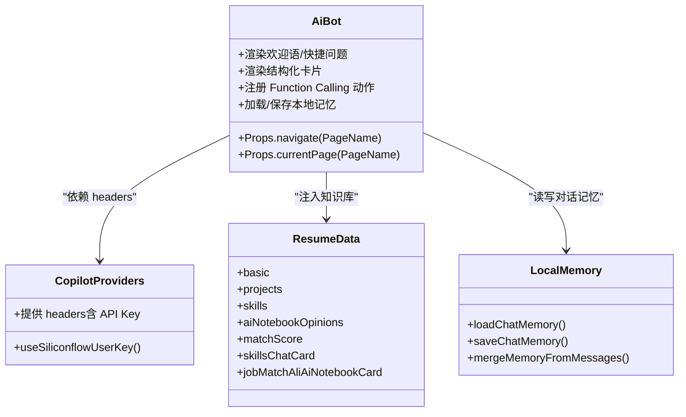
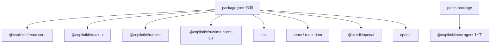

# 扩展与定制

<cite>
**本文档引用的文件**
- [package.json](file://package.json)
- [next.config.js](file://next.config.js)
- [app/layout.tsx](file://app/layout.tsx)
- [app/page.tsx](file://app/page.tsx)
- [app/api/copilotkit/route.ts](file://app/api/copilotkit/route.ts)
- [components/CopilotProviders.tsx](file://components/CopilotProviders.tsx)
- [components/AiBot.tsx](file://components/AiBot.tsx)
- [components/MainPage.tsx](file://components/MainPage.tsx)
- [lib/resumeData.ts](file://lib/resumeData.ts)
- [lib/copilotLocalMemory.ts](file://lib/copilotLocalMemory.ts)
- [lib/siliconFlowOpenAIAdapter.ts](file://lib/siliconFlowOpenAIAdapter.ts)
- [lib/patchOpenAIForSiliconFlow.ts](file://lib/patchOpenAIForSiliconFlow.ts)
- [lib/siliconflow-defaults.ts](file://lib/siliconflow-defaults.ts)
- [patches/@copilotkitnext+agent+1.54.0.patch](file://patches/@copilotkitnext+agent+1.54.0.patch)
- [app/globals.css](file://app/globals.css)
</cite>

## 目录
1. [简介](#简介)
2. [项目结构](#项目结构)
3. [核心组件](#核心组件)
4. [架构总览](#架构总览)
5. [详细组件分析](#详细组件分析)
6. [依赖分析](#依赖分析)
7. [性能考量](#性能考量)
8. [故障排查指南](#故障排查指南)
9. [结论](#结论)
10. [附录](#附录)

## 简介
本指南面向希望对 Fuqianjiao AI 项目进行“扩展与定制”的开发者，围绕以下目标展开：
- 新增 Function Calling 函数与自定义对话流程
- 集成新的 AI 模型与适配兼容网关
- 主题定制：CSS 变量、组件样式覆盖与新主题开发
- 第三方服务集成策略：新的 API 集成、插件系统与依赖管理
- 代码扩展最佳实践、版本兼容性与向后兼容性保障
- 提供可直接落地的扩展示例与定制案例

## 项目结构
该项目采用 Next.js 应用结构，前端与 CopilotKit 服务端路由位于 app 目录，核心 AI 会话与模型适配位于 lib 与 components 目录，样式通过全局 CSS 变量与覆盖实现主题化。

图表来源
- [app/layout.tsx:1-48](file://app/layout.tsx#L1-L48)
- [components/CopilotProviders.tsx:1-157](file://components/CopilotProviders.tsx#L1-L157)
- [app/page.tsx:1-30](file://app/page.tsx#L1-L30)
- [components/MainPage.tsx:1-691](file://components/MainPage.tsx#L1-L691)
- [components/AiBot.tsx:1-800](file://components/AiBot.tsx#L1-L800)
- [app/api/copilotkit/route.ts:1-131](file://app/api/copilotkit/route.ts#L1-L131)
- [lib/siliconFlowOpenAIAdapter.ts:1-36](file://lib/siliconFlowOpenAIAdapter.ts#L1-L36)
- [lib/patchOpenAIForSiliconFlow.ts:1-22](file://lib/patchOpenAIForSiliconFlow.ts#L1-L22)
- [lib/siliconflow-defaults.ts:1-16](file://lib/siliconflow-defaults.ts#L1-L16)
- [patches/@copilotkitnext+agent+1.54.0.patch:1-125](file://patches/@copilotkitnext+agent+1.54.0.patch#L1-L125)
- [lib/resumeData.ts:1-263](file://lib/resumeData.ts#L1-L263)
- [lib/copilotLocalMemory.ts:1-77](file://lib/copilotLocalMemory.ts#L1-L77)
- [app/globals.css:1-550](file://app/globals.css#L1-L550)
- [package.json:1-29](file://package.json#L1-L29)
- [next.config.js:1-4](file://next.config.js#L1-L4)

章节来源
- [app/layout.tsx:1-48](file://app/layout.tsx#L1-L48)
- [app/page.tsx:1-30](file://app/page.tsx#L1-L30)
- [package.json:1-29](file://package.json#L1-L29)
- [next.config.js:1-4](file://next.config.js#L1-L4)

## 核心组件
- 根布局与 Provider
  - 根布局引入全局样式与背景音乐，并通过 CopilotProviders 包裹子树，注入 CopilotKit 运行时与 SiliconFlow Key 管理。
- 页面路由与导航
  - 主页、项目页与 AI Bot 组件在单一页面内切换，AiBot 始终可见，便于随时交互。
- CopilotKit 服务端路由
  - 负责解析 API Key、缓存 Hono 处理器、初始化 CopilotRuntime 与 Agent，并将请求代理到兼容网关。
- 适配器与补丁
  - OpenAI 兼容适配器将默认 Responses API 改为 Chat Completions；OpenAI 客户端补丁将 beta.stream 代理到标准流式接口；补丁修复 Function Calling 事件顺序问题。
- 主题与样式
  - 通过 CSS 变量统一主题色板，覆盖 CopilotKit 默认 UI 样式，确保与赛博朋克风格一致。
- AI 助手知识库与记忆
  - resumeData.ts 提供结构化知识；copilotLocalMemory.ts 提供本地持久化对话记忆，增强上下文连贯性。

章节来源
- [components/CopilotProviders.tsx:1-157](file://components/CopilotProviders.tsx#L1-L157)
- [app/api/copilotkit/route.ts:1-131](file://app/api/copilotkit/route.ts#L1-L131)
- [lib/siliconFlowOpenAIAdapter.ts:1-36](file://lib/siliconFlowOpenAIAdapter.ts#L1-L36)
- [lib/patchOpenAIForSiliconFlow.ts:1-22](file://lib/patchOpenAIForSiliconFlow.ts#L1-L22)
- [patches/@copilotkitnext+agent+1.54.0.patch:1-125](file://patches/@copilotkitnext+agent+1.54.0.patch#L1-L125)
- [app/globals.css:1-550](file://app/globals.css#L1-L550)
- [lib/resumeData.ts:1-263](file://lib/resumeData.ts#L1-L263)
- [lib/copilotLocalMemory.ts:1-77](file://lib/copilotLocalMemory.ts#L1-L77)

## 架构总览
下图展示了从前端到服务端、再到 AI 模型的完整调用链路与关键扩展点。

图表来源
- [components/AiBot.tsx:1-800](file://components/AiBot.tsx#L1-L800)
- [components/CopilotProviders.tsx:1-157](file://components/CopilotProviders.tsx#L1-L157)
- [app/api/copilotkit/route.ts:1-131](file://app/api/copilotkit/route.ts#L1-L131)
- [lib/siliconFlowOpenAIAdapter.ts:1-36](file://lib/siliconFlowOpenAIAdapter.ts#L1-L36)
- [lib/patchOpenAIForSiliconFlow.ts:1-22](file://lib/patchOpenAIForSiliconFlow.ts#L1-L22)
- [patches/@copilotkitnext+agent+1.54.0.patch:1-125](file://patches/@copilotkitnext+agent+1.54.0.patch#L1-L125)

## 详细组件分析

### 组件 A：CopilotKit 服务端路由与适配层
- 关键职责
  - 解析 API Key（请求头 > 环境变量 > 默认值）
  - 缓存按 Key 构建的 Hono 处理器，避免重复初始化
  - 使用兼容适配器与补丁，确保与 SiliconFlow 等兼容网关的流式协议一致
  - 启用 BuiltInAgent 并禁用并行 Tool 调用，配合补丁保证事件顺序正确
- 扩展点
  - 新增模型：在路由中设置默认模型与 base URL，或通过环境变量覆盖
  - 新增服务适配器：替换或扩展适配器以支持新的模型供应商
  - 新增 Function Calling：在 Agent 中注册函数，配合 UI 结构化卡片展示结果

图表来源
- [app/api/copilotkit/route.ts:1-131](file://app/api/copilotkit/route.ts#L1-L131)
- [lib/siliconFlowOpenAIAdapter.ts:1-36](file://lib/siliconFlowOpenAIAdapter.ts#L1-L36)
- [lib/patchOpenAIForSiliconFlow.ts:1-22](file://lib/patchOpenAIForSiliconFlow.ts#L1-L22)
- [patches/@copilotkitnext+agent+1.54.0.patch:1-125](file://patches/@copilotkitnext+agent+1.54.0.patch#L1-L125)

章节来源
- [app/api/copilotkit/route.ts:1-131](file://app/api/copilotkit/route.ts#L1-L131)
- [lib/siliconFlowOpenAIAdapter.ts:1-36](file://lib/siliconFlowOpenAIAdapter.ts#L1-L36)
- [lib/patchOpenAIForSiliconFlow.ts:1-22](file://lib/patchOpenAIForSiliconFlow.ts#L1-L22)
- [patches/@copilotkitnext+agent+1.54.0.patch:1-125](file://patches/@copilotkitnext+agent+1.54.0.patch#L1-L125)

### 组件 B：AI 助手与 Function Calling 展示
- 关键职责
  - 提供欢迎语、快捷问题与结构化卡片（项目亮点、技能栈、岗位匹配度）
  - 通过 useCopilotReadable/useCopilotAction/useCopilotChat 与 CopilotKit 交互
  - 本地持久化记忆，增强上下文连贯性
- 扩展点
  - 新增 Function Calling：在 AiBot 中注册动作，渲染对应结构化卡片
  - 自定义对话流程：通过 suggestions 与 onboarding 控制首次引导与后续推荐
  - 新增结构化卡片：参考现有卡片组件风格，复用样式变量与交互行为

图表来源
- [components/AiBot.tsx:1-800](file://components/AiBot.tsx#L1-L800)
- [components/CopilotProviders.tsx:1-157](file://components/CopilotProviders.tsx#L1-L157)
- [lib/resumeData.ts:1-263](file://lib/resumeData.ts#L1-L263)
- [lib/copilotLocalMemory.ts:1-77](file://lib/copilotLocalMemory.ts#L1-L77)

章节来源
- [components/AiBot.tsx:1-800](file://components/AiBot.tsx#L1-L800)
- [lib/resumeData.ts:1-263](file://lib/resumeData.ts#L1-L263)
- [lib/copilotLocalMemory.ts:1-77](file://lib/copilotLocalMemory.ts#L1-L77)

### 组件 C：主页与技能卡片
- 关键职责
  - 展示个人经历、匹配度雷达、技能图谱与用户视角
  - 通过结构化卡片与交互控件引导用户深入项目细节
- 扩展点
  - 新增维度：在匹配度雷达与技能图谱中添加新类别
  - 新增卡片：参考现有卡片组件风格，复用样式变量与交互行为

章节来源
- [components/MainPage.tsx:1-691](file://components/MainPage.tsx#L1-L691)

### 组件 D：主题与样式覆盖
- 关键职责
  - 通过 CSS 变量统一主题色板（背景、表面、强调色、文本、边框、光晕）
  - 覆盖 CopilotKit 默认 UI 样式，确保与赛博朋克风格一致
- 扩展点
  - 新主题：新增一组 CSS 变量，覆盖全局样式；或通过主题切换逻辑动态切换
  - 组件样式覆盖：在组件内部使用内联样式或 CSS Modules，避免与全局样式冲突

章节来源
- [app/globals.css:1-550](file://app/globals.css#L1-L550)

## 依赖分析
- 核心依赖
  - @copilotkit/react-core / @copilotkit/react-ui / @copilotkit/runtime / @copilotkit/runtime-client-gql：提供 AI 助手 UI、运行时与客户端
  - next / react / react-dom：框架与运行时
  - @ai-sdk/openai / openai：AI SDK 与 OpenAI 客户端
- 开发依赖
  - patch-package：用于应用补丁（如 Function Calling 事件修复）

图表来源
- [package.json:1-29](file://package.json#L1-L29)
- [patches/@copilotkitnext+agent+1.54.0.patch:1-125](file://patches/@copilotkitnext+agent+1.54.0.patch#L1-L125)

章节来源
- [package.json:1-29](file://package.json#L1-L29)

## 性能考量
- 服务端缓存
  - 按 API Key 缓存 Hono 处理器，避免重复初始化 CopilotRuntime，提升并发稳定性与响应速度
- 流式协议
  - 使用标准 chat/completions 流式接口，减少延迟与内存占用
- 本地记忆
  - 限制长期记忆长度，避免超长上下文影响性能
- 样式覆盖
  - 通过 CSS 变量集中管理主题，减少重复计算与重绘

## 故障排查指南
- Function Calling 事件异常
  - 现象：RUN_FINISHED 前仍有未结束的 tool-call
  - 处理：确认补丁已应用，确保在 abort/finish/stop 时补发 TOOL_CALL_END
- 网关 404（/v1/beta/chat/completions）
  - 现象：AI_APICallError: Not Found
  - 处理：确认已应用 OpenAI 客户端补丁，将 beta.stream 代理到标准流式接口
- API Key 未生效
  - 现象：前端显示“未配置有效 Key”
  - 处理：检查请求头、环境变量与默认 Key 设置；确认 CopilotProviders 与服务端解析逻辑一致
- 前端 fetch 异常
  - 现象：Content-Length: 0 导致 SyntaxError
  - 处理：确认已注入 fetch 包装，对空响应返回合法 JSON

章节来源
- [patches/@copilotkitnext+agent+1.54.0.patch:1-125](file://patches/@copilotkitnext+agent+1.54.0.patch#L1-L125)
- [lib/patchOpenAIForSiliconFlow.ts:1-22](file://lib/patchOpenAIForSiliconFlow.ts#L1-L22)
- [components/CopilotProviders.tsx:64-87](file://components/CopilotProviders.tsx#L64-L87)
- [app/api/copilotkit/route.ts:100-114](file://app/api/copilotkit/route.ts#L100-L114)

## 结论
本项目通过 CopilotKit 与兼容适配层，实现了与 SiliconFlow 等兼容网关的稳定集成，并提供了可扩展的 Function Calling 与对话流程。通过 CSS 变量与样式覆盖，项目具备良好的主题定制能力。开发者可在不破坏现有架构的前提下，按本文档的扩展点与最佳实践进行二次开发与定制。

## 附录

### 扩展清单与最佳实践
- 新增 Function Calling 函数
  - 在服务端 Agent 中注册函数，确保禁用并行 Tool 调用并在事件流中补发 TOOL_CALL_END
  - 在 AiBot 中注册对应动作，渲染结构化卡片，复用现有样式与交互
  - 参考路径：[app/api/copilotkit/route.ts:73-84](file://app/api/copilotkit/route.ts#L73-L84)，[components/AiBot.tsx:1-800](file://components/AiBot.tsx#L1-L800)，[patches/@copilotkitnext+agent+1.54.0.patch:1-125](file://patches/@copilotkitnext+agent+1.54.0.patch#L1-L125)
- 自定义对话流程
  - 通过 suggestions 与 onboarding 控制首次引导与后续推荐；在 AiBot 中新增快捷问题与欢迎语
  - 参考路径：[components/AiBot.tsx:34-51](file://components/AiBot.tsx#L34-L51)，[components/AiBot.tsx:760-792](file://components/AiBot.tsx#L760-L792)
- 集成新的 AI 模型
  - 在路由中设置默认模型与 base URL；必要时新增适配器或补丁
  - 参考路径：[app/api/copilotkit/route.ts:16-25](file://app/api/copilotkit/route.ts#L16-L25)，[lib/siliconFlowOpenAIAdapter.ts:1-36](file://lib/siliconFlowOpenAIAdapter.ts#L1-L36)，[lib/patchOpenAIForSiliconFlow.ts:1-22](file://lib/patchOpenAIForSiliconFlow.ts#L1-L22)
- 主题定制
  - 修改 CSS 变量统一主题色板；覆盖 CopilotKit 默认 UI 样式
  - 参考路径：[app/globals.css:1-12](file://app/globals.css#L1-L12)，[app/globals.css:25-550](file://app/globals.css#L25-L550)
- 第三方服务集成
  - 新增 API 集成：在服务端路由中新增端点，复用 CopilotKit 运行时与适配器
  - 插件系统：通过 Function Calling 将外部服务封装为工具函数
  - 依赖管理：通过 patch-package 管理第三方补丁，确保版本一致性
  - 参考路径：[package.json:1-29](file://package.json#L1-L29)，[patches/@copilotkitnext+agent+1.54.0.patch:1-125](file://patches/@copilotkitnext+agent+1.54.0.patch#L1-L125)
- 版本兼容性与向后兼容
  - 固定 CopilotKit 版本范围，避免重大变更；通过补丁与适配器隔离底层差异
  - 参考路径：[package.json:12-20](file://package.json#L12-L20)，[lib/siliconflow-defaults.ts:1-16](file://lib/siliconflow-defaults.ts#L1-L16)