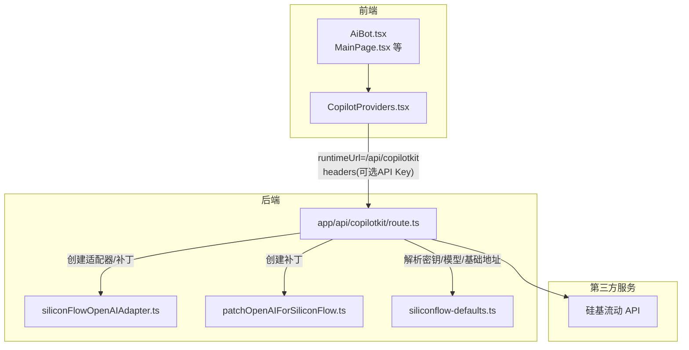
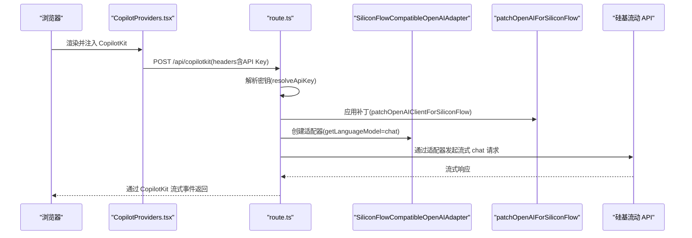
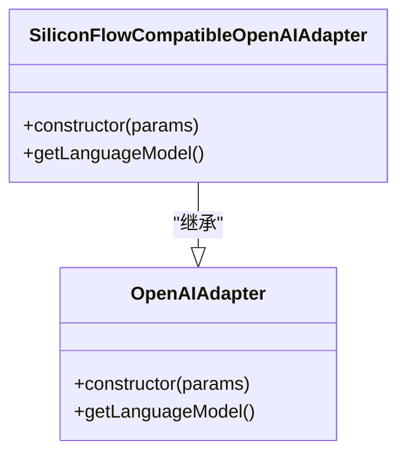
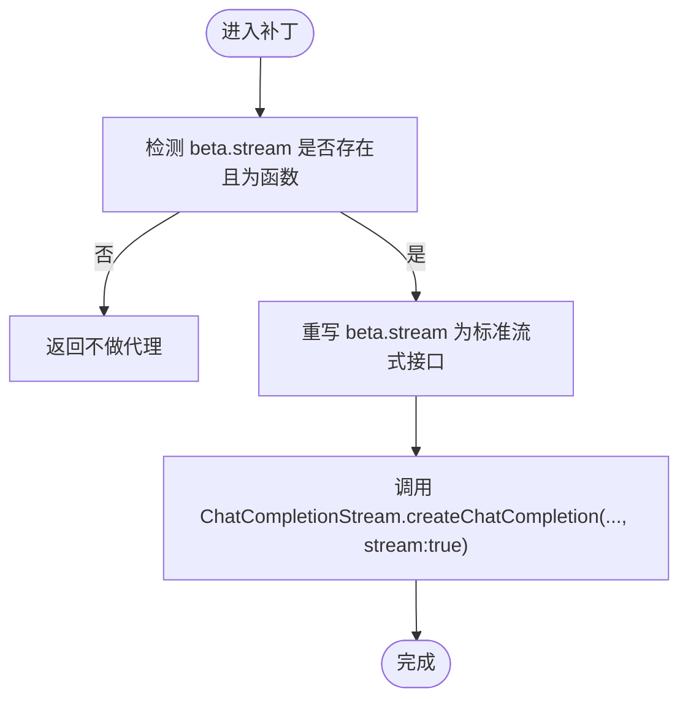
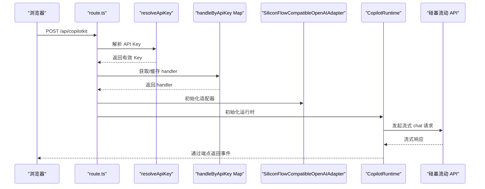
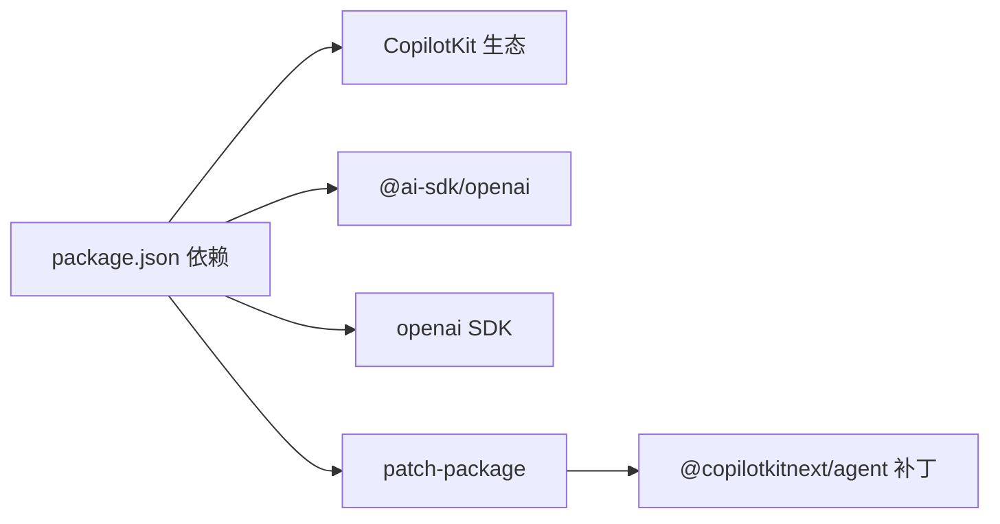

# 第三方服务集成

<cite>
**本文引用的文件列表**
- [README.md](file://README.md)
- [package.json](file://package.json)
- [app/api/copilotkit/route.ts](file://app/api/copilotkit/route.ts)
- [lib/siliconFlowOpenAIAdapter.ts](file://lib/siliconFlowOpenAIAdapter.ts)
- [lib/patchOpenAIForSiliconFlow.ts](file://lib/patchOpenAIForSiliconFlow.ts)
- [lib/siliconflow-defaults.ts](file://lib/siliconflow-defaults.ts)
- [components/CopilotProviders.tsx](file://components/CopilotProviders.tsx)
- [patches/@copilotkitnext+agent+1.54.0.patch](file://patches/@copilotkitnext+agent+1.54.0.patch)
- [lib/resumeData.ts](file://lib/resumeData.ts)
- [lib/copilotLocalMemory.ts](file://lib/copilotLocalMemory.ts)
</cite>

## 目录
1. [简介](#简介)
2. [项目结构](#项目结构)
3. [核心组件](#核心组件)
4. [架构总览](#架构总览)
5. [详细组件分析](#详细组件分析)
6. [依赖分析](#依赖分析)
7. [性能考量](#性能考量)
8. [故障排除指南](#故障排除指南)
9. [结论](#结论)
10. [附录](#附录)

## 简介
本指南面向希望在 Fuqianjiao AI 项目中集成新的第三方 AI 服务提供商的开发者。项目以 Next.js 14 + CopilotKit 为基础，通过适配器模式将不同服务提供商的 API 统一到一致的接口，当前以“硅基流动”为例，展示了如何处理 API 差异（如路径差异、流式协议差异、工具调用校验差异），并通过适配器与补丁确保与 CopilotKit 的流式协议兼容。

本指南将从架构设计、适配器实现、参数与错误处理、集成步骤、依赖管理与版本兼容、故障排除等方面进行系统讲解，并提供可复用的集成模板与最佳实践。

## 项目结构
项目采用“前端 UI + Next.js App Router API 路由 + 适配器/补丁”的分层组织方式：
- 前端：组件层负责 UI 与交互，Provider 负责注入 CopilotKit 与密钥上下文。
- 后端：App Router API 路由作为 CopilotKit 的运行时端点，负责路由选择、密钥解析、适配器初始化与运行时封装。
- 适配层：适配器与补丁用于桥接第三方服务的 API 差异，确保与 CopilotKit 的流式协议一致。
- 数据与工具：简历知识库、本地记忆持久化、补丁文件等。

图表来源
- [app/api/copilotkit/route.ts:1-131](file://app/api/copilotkit/route.ts#L1-L131)
- [lib/siliconFlowOpenAIAdapter.ts:1-36](file://lib/siliconFlowOpenAIAdapter.ts#L1-L36)
- [lib/patchOpenAIForSiliconFlow.ts:1-22](file://lib/patchOpenAIForSiliconFlow.ts#L1-L22)
- [lib/siliconflow-defaults.ts:1-16](file://lib/siliconflow-defaults.ts#L1-L16)
- [components/CopilotProviders.tsx:1-157](file://components/CopilotProviders.tsx#L1-L157)

章节来源
- [README.md:68-90](file://README.md#L68-L90)
- [package.json:1-29](file://package.json#L1-L29)

## 核心组件
- 适配器：将 CopilotKit 的 OpenAI 兼容接口映射到特定服务（如硅基流动）的 Chat Completions 接口，避免默认 Responses 路径导致的 404。
- 补丁：将 CopilotKit 使用的 beta 流式接口代理到标准流式 chat 接口，解决兼容网关不支持 beta 路径的问题。
- 密钥与默认值：集中管理 API Key 的来源优先级与兜底策略，支持浏览器自填与服务端环境变量。
- 运行时路由：负责密钥解析、适配器与补丁装配、运行时初始化与端点处理。
- Provider：在客户端注入 CopilotKit，设置运行时 URL、请求头（含 API Key）、禁用开发台等。

章节来源
- [lib/siliconFlowOpenAIAdapter.ts:10-36](file://lib/siliconFlowOpenAIAdapter.ts#L10-L36)
- [lib/patchOpenAIForSiliconFlow.ts:4-22](file://lib/patchOpenAIForSiliconFlow.ts#L4-L22)
- [lib/siliconflow-defaults.ts:1-16](file://lib/siliconflow-defaults.ts#L1-L16)
- [app/api/copilotkit/route.ts:24-95](file://app/api/copilotkit/route.ts#L24-L95)
- [components/CopilotProviders.tsx:49-157](file://components/CopilotProviders.tsx#L49-L157)

## 架构总览
本项目采用“适配器 + 补丁 + 运行时路由”的架构，将第三方服务的差异隐藏在适配层，使前端与运行时协议保持稳定。

图表来源
- [components/CopilotProviders.tsx:126-151](file://components/CopilotProviders.tsx#L126-L151)
- [app/api/copilotkit/route.ts:30-95](file://app/api/copilotkit/route.ts#L30-L95)
- [lib/patchOpenAIForSiliconFlow.ts:12-21](file://lib/patchOpenAIForSiliconFlow.ts#L12-L21)
- [lib/siliconFlowOpenAIAdapter.ts:22-34](file://lib/siliconFlowOpenAIAdapter.ts#L22-L34)

## 详细组件分析

### 适配器：SiliconFlowCompatibleOpenAIAdapter
- 设计目的：解决 @ai-sdk/openai v3 默认走 Responses API（/v1/responses）与硅基流动兼容网关仅支持 Chat Completions（/v1/chat/completions）的差异。
- 关键实现：
  - 复用 OpenAIAdapter 的构造与参数，通过 createOpenAI(...) 包装 client，确保 baseURL、apiKey、headers、fetch 等一致。
  - 将 getLanguageModel() 返回 provider.chat(model) 而非默认的 responses，从而与流式 chat 协议一致。
- 适用范围：所有兼容 OpenAI 协议的服务，只要其不支持 responses 路径或需要强制 chat 路径。

图表来源
- [lib/siliconFlowOpenAIAdapter.ts:17-35](file://lib/siliconFlowOpenAIAdapter.ts#L17-L35)

章节来源
- [lib/siliconFlowOpenAIAdapter.ts:10-36](file://lib/siliconFlowOpenAIAdapter.ts#L10-L36)

### 补丁：patchOpenAIClientForSiliconFlow
- 设计目的：将 CopilotKit 使用的 beta.stream 代理到 SDK 自带的标准流式接口，解决兼容网关不支持 /v1/beta/chat/completions 的问题。
- 关键实现：
  - 检测 openai.beta.chat.completions.stream 是否存在并为函数。
  - 将其重写为调用 ChatCompletionStream.createChatCompletion(..., { stream: true })，内部走 /v1/chat/completions。
- 适用范围：所有不支持 beta 路径的 OpenAI 兼容网关。

图表来源
- [lib/patchOpenAIForSiliconFlow.ts:12-21](file://lib/patchOpenAIForSiliconFlow.ts#L12-L21)

章节来源
- [lib/patchOpenAIForSiliconFlow.ts:4-22](file://lib/patchOpenAIForSiliconFlow.ts#L4-L22)

### 密钥与默认值：siliconflow-defaults
- 设计目的：集中管理 API Key 的来源优先级与兜底策略，避免将密钥打入前端包，保障安全。
- 关键实现：
  - 支持来源优先级：请求头（浏览器自填）> 环境变量 > 代码兜底。
  - 提供请求头键名与浏览器存储键名，便于前端与后端一致。
- 适用范围：所有基于 OpenAI 兼容接口的第三方服务，均可复用该模式。

章节来源
- [lib/siliconflow-defaults.ts:1-16](file://lib/siliconflow-defaults.ts#L1-L16)

### 运行时路由：app/api/copilotkit/route.ts
- 设计目的：作为 CopilotKit 的运行时端点，负责密钥解析、适配器与补丁装配、运行时初始化与端点处理。
- 关键实现：
  - 解析密钥：优先用户自填（请求头），其次环境变量，最后兜底。
  - 按密钥缓存 Hono handler，避免每请求重建 Runtime，提高稳定性与性能。
  - 创建 OpenAI 客户端与补丁，创建适配器，初始化 CopilotRuntime 与 BuiltInAgent，绑定端点。
  - 提供 GET 健康检查，返回服务状态与模型信息。
- 适用范围：所有 CopilotKit + OpenAI 兼容服务的统一接入点。

图表来源
- [app/api/copilotkit/route.ts:30-95](file://app/api/copilotkit/route.ts#L30-L95)

章节来源
- [app/api/copilotkit/route.ts:16-131](file://app/api/copilotkit/route.ts#L16-L131)

### Provider：CopilotProviders
- 设计目的：在客户端注入 CopilotKit，设置运行时 URL、请求头（含 API Key）、禁用开发台等。
- 关键实现：
  - 从 localStorage 读取用户自填 Key，或使用环境变量兜底。
  - 通过 headers 将 API Key 传递给后端路由。
  - 通过 window.fetch 代理，处理 Content-Length: 0 的异常响应，避免 JSON 解析错误。
  - 拉取后端健康检查，判断服务端是否已配置 Key。
- 适用范围：所有前端 CopilotKit 集成场景。

章节来源
- [components/CopilotProviders.tsx:49-157](file://components/CopilotProviders.tsx#L49-L157)

### 补丁：@copilotkitnext/agent 流式工具调用校验
- 设计目的：部分兼容网关只流式 tool-input-* 而不发最终 tool-call，导致前端 AG-UI 校验要求 TOOL_CALL_END 先于 RUN_FINISHED，从而报错。
- 关键实现：在 agent 的 fullStream 处理中，增加 flushOpenToolCalls，在 abort/finish/未终止场景下补齐 TOOL_CALL_END，再发送 RUN_FINISHED。
- 适用范围：所有兼容网关存在工具调用流式不完整的情况。

章节来源
- [patches/@copilotkitnext+agent+1.54.0.patch:87-125](file://patches/@copilotkitnext+agent+1.54.0.patch#L87-L125)

## 依赖分析
- 前端依赖：@copilotkit/react-core、@copilotkit/react-ui、@copilotkit/runtime、@copilotkit/runtime-client-gql、next、react、react-dom。
- 运行时依赖：@copilotkit/runtime、@copilotkitnext/agent（通过补丁增强）、@ai-sdk/openai、openai。
- 开发依赖：patch-package、typescript、@types/*。
- 版本与兼容性：项目通过 postinstall 执行 patch-package，确保 agent 的工具调用校验补丁生效；同时通过适配器与补丁规避 OpenAI SDK 的路径差异问题。

图表来源
- [package.json:12-28](file://package.json#L12-L28)
- [patches/@copilotkitnext+agent+1.54.0.patch:1-125](file://patches/@copilotkitnext+agent+1.54.0.patch#L1-L125)

章节来源
- [package.json:1-29](file://package.json#L1-L29)

## 性能考量
- 适配器与补丁缓存：按 API Key 缓存 Hono handler，避免每请求重建 CopilotRuntime，提升稳定性与吞吐。
- 流式协议：统一走 /v1/chat/completions 流式接口，减少中间层转换与错误重试。
- 前端 fetch 代理：在 Content-Length: 0 的情况下返回合法 JSON，避免解析异常与重试风暴。
- 本地记忆：本地持久化对话记忆，减少重复传输与上下文开销。

章节来源
- [app/api/copilotkit/route.ts:46-95](file://app/api/copilotkit/route.ts#L46-L95)
- [components/CopilotProviders.tsx:64-87](file://components/CopilotProviders.tsx#L64-L87)
- [lib/copilotLocalMemory.ts:1-77](file://lib/copilotLocalMemory.ts#L1-L77)

## 故障排除指南
- 访客出现 “AI_APICallError: Not Found”
  - 可能原因：默认 responses 路径不被支持或模型 ID 已下线。
  - 解决方案：使用 SiliconFlowCompatibleOpenAIAdapter 强制走 chat/completions；核对 SILICONFLOW_MODEL 是否仍在服务端可用。
  - 参考：README 中的常见问题说明与路由注释。
- 兼容网关不支持 beta 路径
  - 可能原因：/v1/beta/chat/completions 404。
  - 解决方案：应用 patchOpenAIClientForSiliconFlow 将 beta.stream 代理到标准流式接口。
- 工具调用校验失败
  - 可能原因：兼容网关只流式 tool-input-* 而不发最终 tool-call。
  - 解决方案：应用 @copilotkitnext/agent 补丁，在 abort/finish/未终止场景补齐 TOOL_CALL_END。
- 健康检查失败
  - 可能原因：未配置有效 API Key。
  - 解决方案：在服务端配置 SILICONFLOW_API_KEY 或在前端「API」面板保存 Key 并随请求头携带。
- 本地开发卡顿
  - 可能原因：dev 模式主线程繁忙。
  - 解决方案：使用生产构建（build + start）测试音频与交互流畅度。

章节来源
- [README.md:25-30](file://README.md#L25-L30)
- [app/api/copilotkit/route.ts:19-43](file://app/api/copilotkit/route.ts#L19-L43)
- [lib/patchOpenAIForSiliconFlow.ts:4-11](file://lib/patchOpenAIForSiliconFlow.ts#L4-L11)
- [patches/@copilotkitnext+agent+1.54.0.patch:87-125](file://patches/@copilotkitnext+agent+1.54.0.patch#L87-L125)
- [components/CopilotProviders.tsx:89-113](file://components/CopilotProviders.tsx#L89-L113)

## 结论
本项目通过“适配器 + 补丁 + 运行时路由 + Provider”的架构，将第三方服务的 API 差异（路径、流式协议、工具调用校验）统一到 CopilotKit 的一致接口之上。该模式具备良好的可扩展性，适用于集成其他兼容 OpenAI 协议的第三方服务提供商。建议在新集成时遵循本文档的步骤与最佳实践，确保安全性、兼容性与性能。

## 附录

### 集成新服务提供商的步骤（以适配器模式为例）
- 步骤 1：准备密钥与默认值
  - 在 defaults 中定义请求头键名、环境变量键名与兜底值。
  - 在 Provider 中读取用户自填 Key 或环境变量，通过 headers 传递给后端。
- 步骤 2：实现适配器
  - 继承 OpenAIAdapter，重写 getLanguageModel()，确保返回 provider.chat(model)。
  - 传递 baseURL、apiKey、headers、fetch 等参数，与服务端一致。
- 步骤 3：应用补丁
  - 如服务端不支持 beta 路径，使用补丁将 beta.stream 代理到标准流式接口。
  - 如存在工具调用流式不完整问题，应用 agent 补丁补齐 TOOL_CALL_END。
- 步骤 4：在路由中装配
  - 解析密钥，按密钥缓存 Hono handler，避免每请求重建 Runtime。
  - 创建 OpenAI 客户端与补丁，创建适配器，初始化 CopilotRuntime 与 BuiltInAgent，绑定端点。
- 步骤 5：服务测试
  - 使用 GET /api/copilotkit 健康检查，确认服务端已配置 Key。
  - 使用 curl 或前端发起 agent/run，观察 TEXT_MESSAGE_CONTENT 事件与工具调用事件。
- 步骤 6：依赖与版本兼容
  - 通过 postinstall 执行 patch-package，确保补丁生效。
  - 在 package.json 中声明依赖版本，必要时锁定版本以保证兼容性。

章节来源
- [lib/siliconflow-defaults.ts:1-16](file://lib/siliconflow-defaults.ts#L1-L16)
- [components/CopilotProviders.tsx:115-133](file://components/CopilotProviders.tsx#L115-L133)
- [lib/siliconFlowOpenAIAdapter.ts:17-35](file://lib/siliconFlowOpenAIAdapter.ts#L17-L35)
- [lib/patchOpenAIForSiliconFlow.ts:12-21](file://lib/patchOpenAIForSiliconFlow.ts#L12-L21)
- [patches/@copilotkitnext+agent+1.54.0.patch:87-125](file://patches/@copilotkitnext+agent+1.54.0.patch#L87-L125)
- [app/api/copilotkit/route.ts:30-95](file://app/api/copilotkit/route.ts#L30-L95)
- [README.md:30-36](file://README.md#L30-L36)