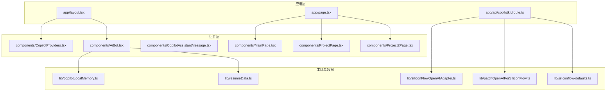
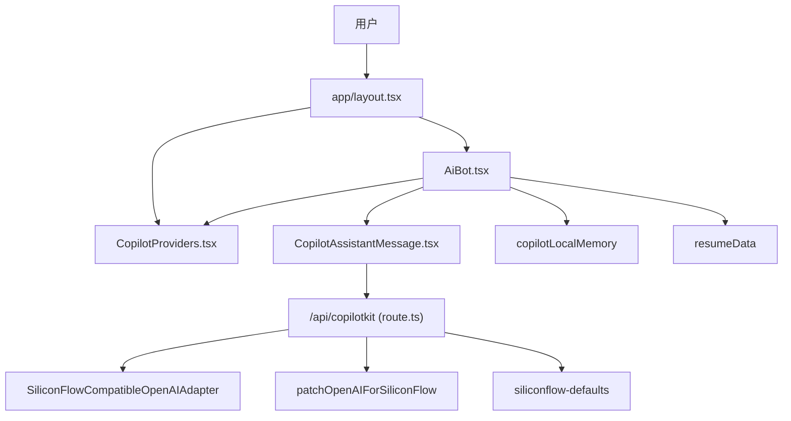
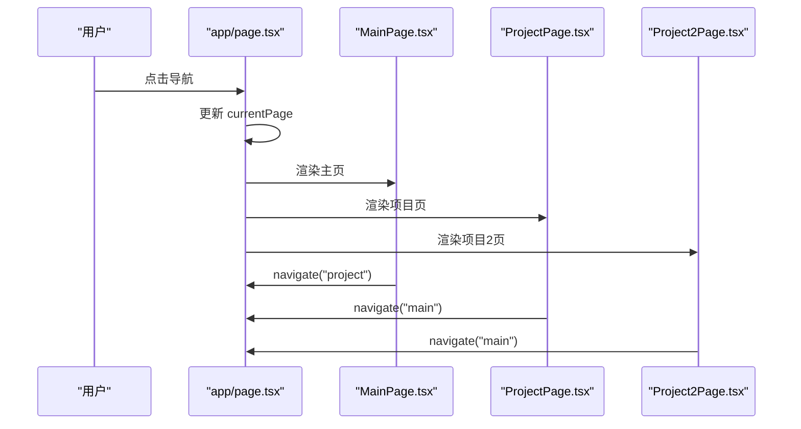
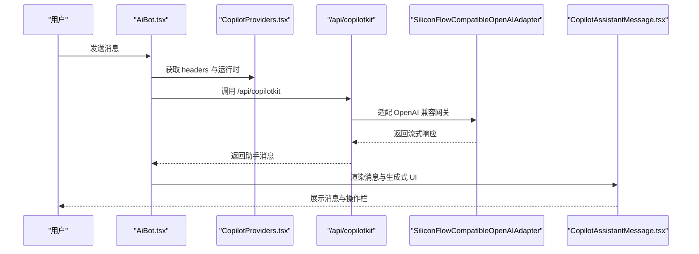
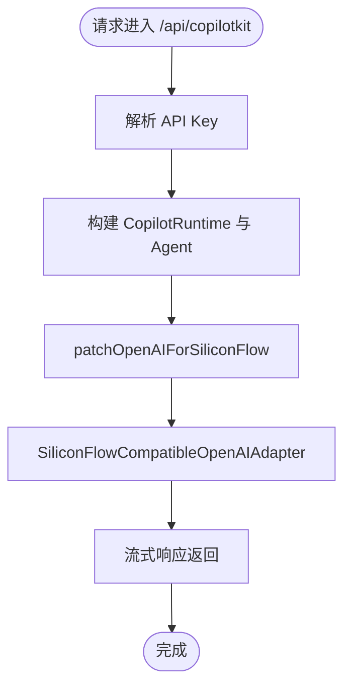
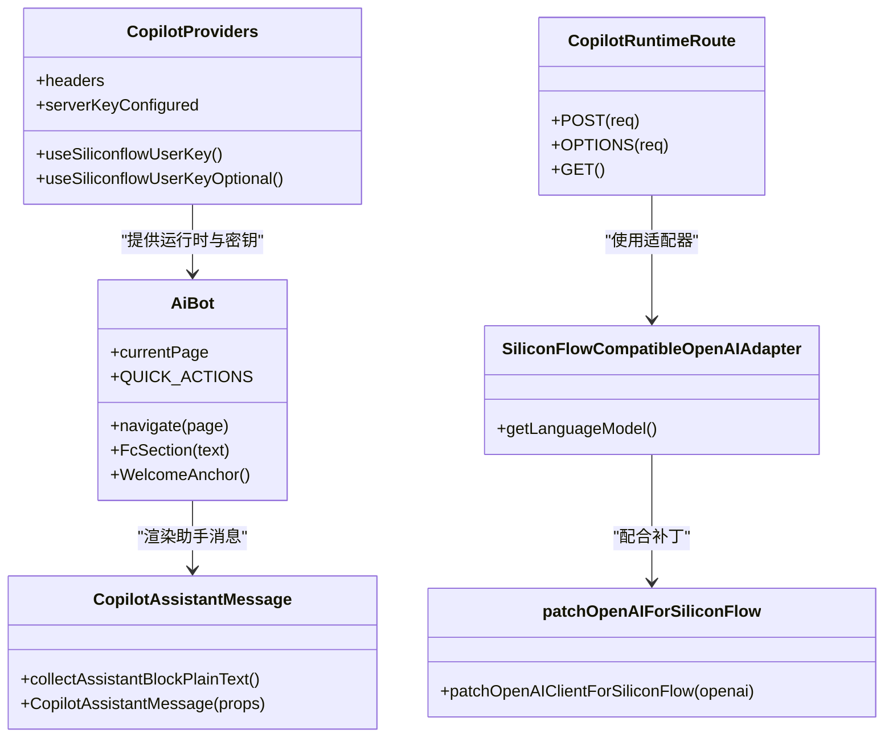
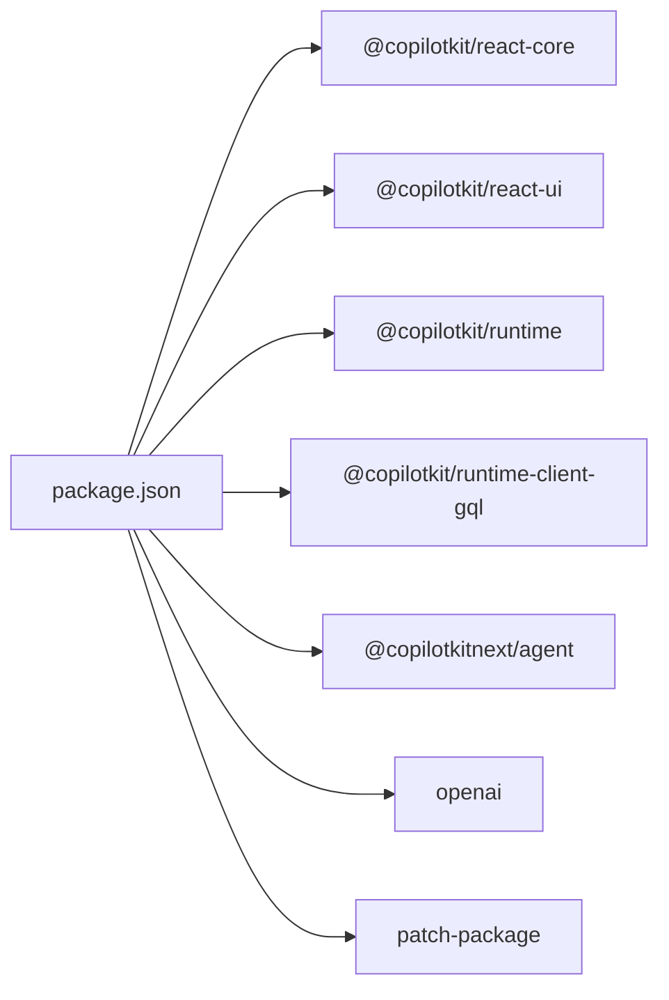

# 组件扩展与新功能开发

<cite>
**本文档引用的文件**
- [app/layout.tsx](file://app/layout.tsx)
- [app/page.tsx](file://app/page.tsx)
- [components/CopilotProviders.tsx](file://components/CopilotProviders.tsx)
- [components/AiBot.tsx](file://components/AiBot.tsx)
- [components/CopilotAssistantMessage.tsx](file://components/CopilotAssistantMessage.tsx)
- [components/MainPage.tsx](file://components/MainPage.tsx)
- [components/ProjectPage.tsx](file://components/ProjectPage.tsx)
- [components/Project2Page.tsx](file://components/Project2Page.tsx)
- [lib/copilotLocalMemory.ts](file://lib/copilotLocalMemory.ts)
- [lib/resumeData.ts](file://lib/resumeData.ts)
- [app/api/copilotkit/route.ts](file://app/api/copilotkit/route.ts)
- [lib/siliconFlowOpenAIAdapter.ts](file://lib/siliconFlowOpenAIAdapter.ts)
- [lib/patchOpenAIForSiliconFlow.ts](file://lib/patchOpenAIForSiliconFlow.ts)
- [lib/siliconflow-defaults.ts](file://lib/siliconflow-defaults.ts)
- [package.json](file://package.json)
</cite>

## 目录
1. [简介](#简介)
2. [项目结构](#项目结构)
3. [核心组件](#核心组件)
4. [架构总览](#架构总览)
5. [详细组件分析](#详细组件分析)
6. [依赖分析](#依赖分析)
7. [性能考虑](#性能考虑)
8. [故障排除指南](#故障排除指南)
9. [结论](#结论)
10. [附录](#附录)

## 简介
本指南面向希望在 Fuqianjiao AI 项目中进行组件扩展与新功能开发的开发者。文档围绕现有组件架构，系统讲解如何：
- 基于现有页面布局与状态管理模式开发新页面组件
- 扩展 AI 助手功能（新增消息类型、改进对话流程、增强用户体验）
- 利用 CopilotKit 集成模式，确保新功能与 AI 系统无缝连接
- 设计接口与 React 组件实现、样式集成
- 进行组件测试、性能优化与可访问性考虑
- 提升代码复用，降低重复开发与维护成本

## 项目结构
项目采用 Next.js App Router 结构，核心目录与职责如下：
- app：应用入口与页面路由
  - app/layout.tsx：根布局，注入背景音乐与 CopilotKit Provider
  - app/page.tsx：首页路由，负责页面切换与状态管理
  - app/api/copilotkit/route.ts：AI 服务端路由，封装 CopilotKit 运行时与模型适配
- components：UI 组件
  - CopilotProviders.tsx：CopilotKit Provider 与 SiliconFlow 密钥管理
  - AiBot.tsx：AI 助手对话框与结构化卡片
  - CopilotAssistantMessage.tsx：自定义助手消息渲染
  - MainPage.tsx、ProjectPage.tsx、Project2Page.tsx：页面组件
- lib：工具与数据
  - copilotLocalMemory.ts：本地聊天记忆持久化
  - resumeData.ts：简历与 AI 知识库数据
  - siliconFlowOpenAIAdapter.ts、patchOpenAIForSiliconFlow.ts、siliconflow-defaults.ts：与 SiliconFlow 的适配与密钥管理
- public/audio：公共资源
- patches：第三方补丁

图表来源
- [app/layout.tsx:1-48](file://app/layout.tsx#L1-L48)
- [app/page.tsx:1-30](file://app/page.tsx#L1-L30)
- [components/CopilotProviders.tsx:1-157](file://components/CopilotProviders.tsx#L1-L157)
- [components/AiBot.tsx:1-1937](file://components/AiBot.tsx#L1-L1937)
- [components/CopilotAssistantMessage.tsx:1-196](file://components/CopilotAssistantMessage.tsx#L1-L196)
- [components/MainPage.tsx:1-691](file://components/MainPage.tsx#L1-L691)
- [components/ProjectPage.tsx:1-275](file://components/ProjectPage.tsx#L1-L275)
- [components/Project2Page.tsx:1-247](file://components/Project2Page.tsx#L1-L247)
- [lib/copilotLocalMemory.ts:1-77](file://lib/copilotLocalMemory.ts#L1-L77)
- [lib/resumeData.ts:1-263](file://lib/resumeData.ts#L1-L263)
- [app/api/copilotkit/route.ts:1-131](file://app/api/copilotkit/route.ts#L1-L131)
- [lib/siliconFlowOpenAIAdapter.ts:1-36](file://lib/siliconFlowOpenAIAdapter.ts#L1-L36)
- [lib/patchOpenAIForSiliconFlow.ts:1-22](file://lib/patchOpenAIForSiliconFlow.ts#L1-L22)
- [lib/siliconflow-defaults.ts:1-16](file://lib/siliconflow-defaults.ts#L1-L16)

章节来源
- [app/layout.tsx:1-48](file://app/layout.tsx#L1-L48)
- [app/page.tsx:1-30](file://app/page.tsx#L1-L30)
- [package.json:1-29](file://package.json#L1-L29)

## 核心组件
- 根布局与 Provider
  - app/layout.tsx：注入背景音乐与 CopilotProviders，确保全局 UI 与 AI 能力可用
  - components/CopilotProviders.tsx：提供 CopilotKit 运行时、SiliconFlow API Key 管理、fetch 修复与上下文提供
- 页面与导航
  - app/page.tsx：集中管理页面状态与导航，支持“主页/项目页”切换
  - components/MainPage.tsx、ProjectPage.tsx、Project2Page.tsx：页面级组件，承载内容与交互
- AI 助手与消息渲染
  - components/AiBot.tsx：AI 对话框、结构化卡片、函数调用状态、欢迎语与快捷问题
  - components/CopilotAssistantMessage.tsx：自定义助手消息渲染，支持生成式 UI 与操作栏
- AI 知识库与本地记忆
  - lib/resumeData.ts：简历与 AI 知识库数据
  - lib/copilotLocalMemory.ts：本地聊天记忆持久化与合并
- 服务端 AI 路由与适配
  - app/api/copilotkit/route.ts：CopilotKit 运行时、SiliconFlow 适配与模型选择
  - lib/siliconFlowOpenAIAdapter.ts、lib/patchOpenAIForSiliconFlow.ts、lib/siliconflow-defaults.ts：适配 OpenAI 兼容网关与密钥传递

章节来源
- [app/layout.tsx:1-48](file://app/layout.tsx#L1-L48)
- [components/CopilotProviders.tsx:1-157](file://components/CopilotProviders.tsx#L1-L157)
- [app/page.tsx:1-30](file://app/page.tsx#L1-L30)
- [components/AiBot.tsx:1-1937](file://components/AiBot.tsx#L1-L1937)
- [components/CopilotAssistantMessage.tsx:1-196](file://components/CopilotAssistantMessage.tsx#L1-L196)
- [lib/resumeData.ts:1-263](file://lib/resumeData.ts#L1-L263)
- [lib/copilotLocalMemory.ts:1-77](file://lib/copilotLocalMemory.ts#L1-L77)
- [app/api/copilotkit/route.ts:1-131](file://app/api/copilotkit/route.ts#L1-L131)
- [lib/siliconFlowOpenAIAdapter.ts:1-36](file://lib/siliconFlowOpenAIAdapter.ts#L1-L36)
- [lib/patchOpenAIForSiliconFlow.ts:1-22](file://lib/patchOpenAIForSiliconFlow.ts#L1-L22)
- [lib/siliconflow-defaults.ts:1-16](file://lib/siliconflow-defaults.ts#L1-L16)

## 架构总览
整体架构围绕“页面组件 + AI 助手 + 服务端 AI 路由”的模式展开，AI 助手通过 CopilotKit 与 SiliconFlow 兼容网关进行对话与函数调用。

图表来源
- [app/layout.tsx:1-48](file://app/layout.tsx#L1-L48)
- [components/CopilotProviders.tsx:1-157](file://components/CopilotProviders.tsx#L1-L157)
- [components/AiBot.tsx:1-1937](file://components/AiBot.tsx#L1-L1937)
- [components/CopilotAssistantMessage.tsx:1-196](file://components/CopilotAssistantMessage.tsx#L1-L196)
- [app/api/copilotkit/route.ts:1-131](file://app/api/copilotkit/route.ts#L1-L131)
- [lib/siliconFlowOpenAIAdapter.ts:1-36](file://lib/siliconFlowOpenAIAdapter.ts#L1-L36)
- [lib/patchOpenAIForSiliconFlow.ts:1-22](file://lib/patchOpenAIForSiliconFlow.ts#L1-L22)
- [lib/siliconflow-defaults.ts:1-16](file://lib/siliconflow-defaults.ts#L1-L16)
- [lib/copilotLocalMemory.ts:1-77](file://lib/copilotLocalMemory.ts#L1-L77)
- [lib/resumeData.ts:1-263](file://lib/resumeData.ts#L1-L263)

## 详细组件分析

### 页面组件开发指南
- 页面布局与状态管理
  - app/page.tsx 使用 useState 管理 currentPage，通过 navigate 切换页面并滚动到顶部
  - 页面组件通过 props 接收 navigate，实现页面内跳转与卡片点击跳转
- 新页面组件开发步骤
  1) 创建页面组件（如 NewPage.tsx），遵循现有样式与主题变量
  2) 在 app/page.tsx 中引入并注册新页面类型与组件
  3) 在 AiBot.tsx 中扩展快捷问题与结构化卡片，必要时新增卡片 UI 组件
  4) 如需 AI 知识库扩展，在 lib/resumeData.ts 中补充数据
  5) 如需本地记忆扩展，在 lib/copilotLocalMemory.ts 中扩展消息合并逻辑

图表来源
- [app/page.tsx:1-30](file://app/page.tsx#L1-L30)
- [components/MainPage.tsx:1-691](file://components/MainPage.tsx#L1-L691)
- [components/ProjectPage.tsx:1-275](file://components/ProjectPage.tsx#L1-L275)
- [components/Project2Page.tsx:1-247](file://components/Project2Page.tsx#L1-L247)

章节来源
- [app/page.tsx:1-30](file://app/page.tsx#L1-L30)
- [components/MainPage.tsx:1-691](file://components/MainPage.tsx#L1-L691)
- [components/ProjectPage.tsx:1-275](file://components/ProjectPage.tsx#L1-L275)
- [components/Project2Page.tsx:1-247](file://components/Project2Page.tsx#L1-L247)

### AI 助手扩展指南
- 新增消息类型与结构化卡片
  - 在 AiBot.tsx 中新增卡片 UI 组件（参考 ProjectHighlightCardUI、SkillsStackCardUI、JobMatchCardWithContact）
  - 在 lib/resumeData.ts 中扩展数据结构，用于卡片渲染
  - 在 AiBot.tsx 中扩展函数调用分支，根据上下文注入卡片
- 改进对话流程
  - 使用 useCopilotReadable 注入本地记忆（lib/copilotLocalMemory.ts）
  - 使用 useCopilotAction 与 useCopilotChat 扩展交互
  - 在 CopilotAssistantMessage.tsx 中定制消息渲染与操作栏
- 增强用户体验
  - 快捷问题与欢迎语：在 AiBot.tsx 中扩展 QUICK_ACTIONS 与欢迎语
  - 函数调用状态：在 AiBot.tsx 中扩展 FcSection 展示执行状态
  - 本地记忆：在 AiBot.tsx 中读取与保存聊天记忆

图表来源
- [components/AiBot.tsx:1-1937](file://components/AiBot.tsx#L1-L1937)
- [components/CopilotProviders.tsx:1-157](file://components/CopilotProviders.tsx#L1-L157)
- [app/api/copilotkit/route.ts:1-131](file://app/api/copilotkit/route.ts#L1-L131)
- [lib/siliconFlowOpenAIAdapter.ts:1-36](file://lib/siliconFlowOpenAIAdapter.ts#L1-L36)
- [components/CopilotAssistantMessage.tsx:1-196](file://components/CopilotAssistantMessage.tsx#L1-L196)

章节来源
- [components/AiBot.tsx:1-1937](file://components/AiBot.tsx#L1-L1937)
- [components/CopilotAssistantMessage.tsx:1-196](file://components/CopilotAssistantMessage.tsx#L1-L196)
- [lib/copilotLocalMemory.ts:1-77](file://lib/copilotLocalMemory.ts#L1-L77)
- [lib/resumeData.ts:1-263](file://lib/resumeData.ts#L1-L263)
- [app/api/copilotkit/route.ts:1-131](file://app/api/copilotkit/route.ts#L1-L131)
- [lib/siliconFlowOpenAIAdapter.ts:1-36](file://lib/siliconFlowOpenAIAdapter.ts#L1-L36)
- [lib/patchOpenAIForSiliconFlow.ts:1-22](file://lib/patchOpenAIForSiliconFlow.ts#L1-L22)
- [lib/siliconflow-defaults.ts:1-16](file://lib/siliconflow-defaults.ts#L1-L16)

### 服务端 AI 路由与适配
- 路由配置
  - app/api/copilotkit/route.ts：封装 CopilotRuntime、BuiltInAgent、SiliconFlow 兼容适配器
  - 支持 GET 健康检查与 POST/OPTIONS 请求处理
- 适配与补丁
  - SiliconFlowCompatibleOpenAIAdapter：将语言模型适配为 chat/completions
  - patchOpenAIForSiliconFlow：将 beta.stream 代理到标准流式接口
  - siliconflow-defaults：密钥头与存储键名

图表来源
- [app/api/copilotkit/route.ts:1-131](file://app/api/copilotkit/route.ts#L1-L131)
- [lib/siliconFlowOpenAIAdapter.ts:1-36](file://lib/siliconFlowOpenAIAdapter.ts#L1-L36)
- [lib/patchOpenAIForSiliconFlow.ts:1-22](file://lib/patchOpenAIForSiliconFlow.ts#L1-L22)
- [lib/siliconflow-defaults.ts:1-16](file://lib/siliconflow-defaults.ts#L1-L16)

章节来源
- [app/api/copilotkit/route.ts:1-131](file://app/api/copilotkit/route.ts#L1-L131)
- [lib/siliconFlowOpenAIAdapter.ts:1-36](file://lib/siliconFlowOpenAIAdapter.ts#L1-L36)
- [lib/patchOpenAIForSiliconFlow.ts:1-22](file://lib/patchOpenAIForSiliconFlow.ts#L1-L22)
- [lib/siliconflow-defaults.ts:1-16](file://lib/siliconflow-defaults.ts#L1-L16)

### 类与关系图（代码级）

图表来源
- [components/CopilotProviders.tsx:1-157](file://components/CopilotProviders.tsx#L1-L157)
- [components/AiBot.tsx:1-1937](file://components/AiBot.tsx#L1-L1937)
- [components/CopilotAssistantMessage.tsx:1-196](file://components/CopilotAssistantMessage.tsx#L1-L196)
- [app/api/copilotkit/route.ts:1-131](file://app/api/copilotkit/route.ts#L1-L131)
- [lib/siliconFlowOpenAIAdapter.ts:1-36](file://lib/siliconFlowOpenAIAdapter.ts#L1-L36)
- [lib/patchOpenAIForSiliconFlow.ts:1-22](file://lib/patchOpenAIForSiliconFlow.ts#L1-L22)

## 依赖分析
- 前端依赖
  - @copilotkit/react-core、@copilotkit/react-ui、@copilotkit/runtime、@copilotkit/runtime-client-gql：AI 助手与运行时
  - next、react、react-dom：框架与运行时
- 服务端依赖
  - @copilotkitnext/agent：内置 Agent
  - openai：OpenAI 兼容客户端
  - patch-package：应用补丁

图表来源
- [package.json:1-29](file://package.json#L1-L29)

章节来源
- [package.json:1-29](file://package.json#L1-L29)

## 性能考虑
- 本地记忆缓存
  - 使用 localStorage 存储聊天记忆，减少重复请求与上下文注入开销
  - 合理截断 longTerm 记忆长度，避免内存膨胀
- 适配器与流式响应
  - 使用 SiliconFlowCompatibleOpenAIAdapter 与 patchOpenAIForSiliconFlow，确保流式响应与兼容网关一致
- 组件渲染优化
  - 使用 useMemo/useCallback 缓存 headers 与上下文
  - 合理拆分卡片组件，避免不必要的重渲染
- 网络与安全
  - 优先使用服务端环境变量密钥，避免在浏览器暴露敏感信息
  - fetch 修复避免空响应导致的解析错误

## 故障排除指南
- “未收到文字回复”
  - CopilotAssistantMessage.tsx 中对空终端回复提供提示文案，可引导用户重新生成或换种问法
- “AI_APICallError: Not Found”
  - 检查 SILICONFLOW_MODEL 是否正确，确认兼容网关支持 /v1/chat/completions
  - 确认 patchOpenAIForSiliconFlow 已应用，将 beta.stream 代理到标准流式接口
- “Content-Length: 0”
  - CopilotProviders.tsx 中对空响应进行包装，避免 SyntaxError
- “未配置有效的硅基流动 API Key”
  - app/api/copilotkit/route.ts 中进行健康检查，确认环境变量或默认密钥配置

章节来源
- [components/CopilotAssistantMessage.tsx:1-196](file://components/CopilotAssistantMessage.tsx#L1-L196)
- [components/CopilotProviders.tsx:1-157](file://components/CopilotProviders.tsx#L1-L157)
- [app/api/copilotkit/route.ts:1-131](file://app/api/copilotkit/route.ts#L1-L131)
- [lib/patchOpenAIForSiliconFlow.ts:1-22](file://lib/patchOpenAIForSiliconFlow.ts#L1-L22)

## 结论
通过遵循现有组件架构与 CopilotKit 集成模式，开发者可以高效扩展页面组件与 AI 助手功能。建议：
- 复用现有 Provider 与适配器，确保与 AI 系统无缝连接
- 基于 resumeData 与 copilotLocalMemory 扩展知识库与上下文
- 使用结构化卡片与自定义消息渲染提升用户体验
- 关注性能与可访问性，确保新功能稳定可靠

## 附录
- 开发最佳实践
  - 接口定义：在 lib/resumeData.ts 中集中管理 AI 知识库，便于扩展与维护
  - 组件实现：在 components/AiBot.tsx 中扩展卡片与交互，保持与现有主题一致
  - 样式集成：使用内联样式与 CSS 变量，确保主题一致性
  - 测试方法：单元测试关注状态流转与消息渲染；集成测试关注 AI 调用与适配器行为
  - 可访问性：为按钮与交互元素提供 aria-label 与键盘导航支持
  - 代码复用：将通用逻辑抽象为 hooks 或工具函数，减少重复开发