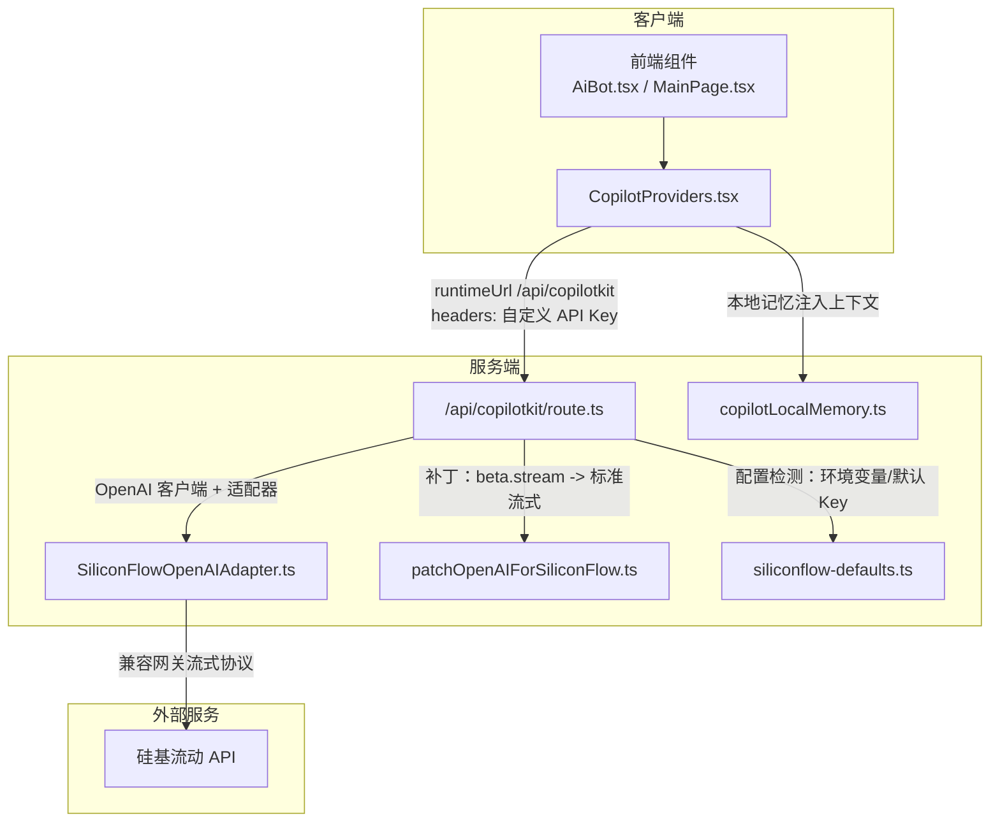
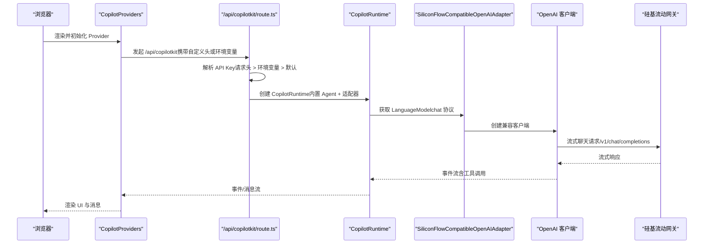
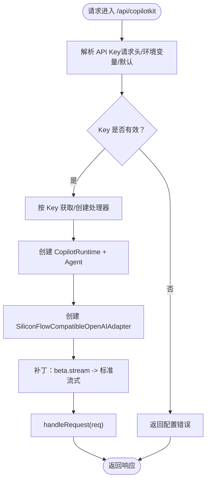
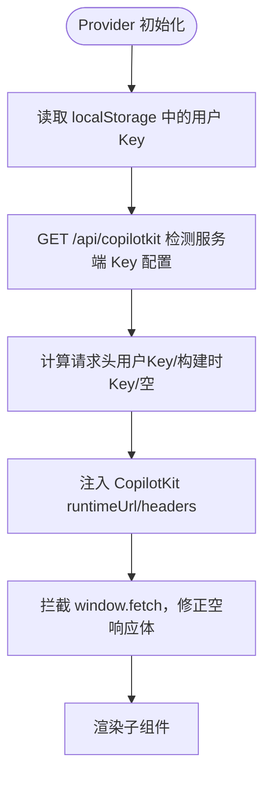
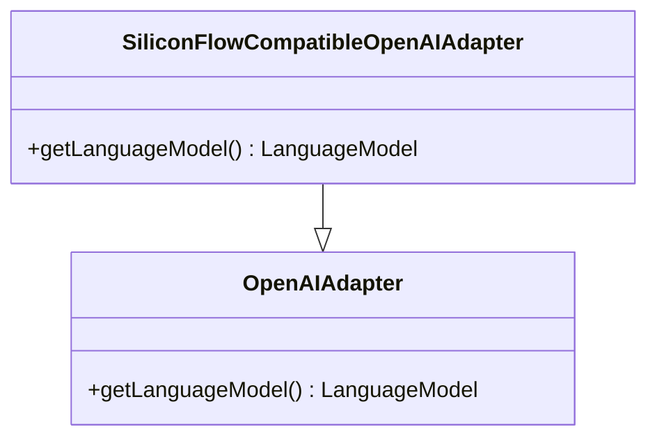
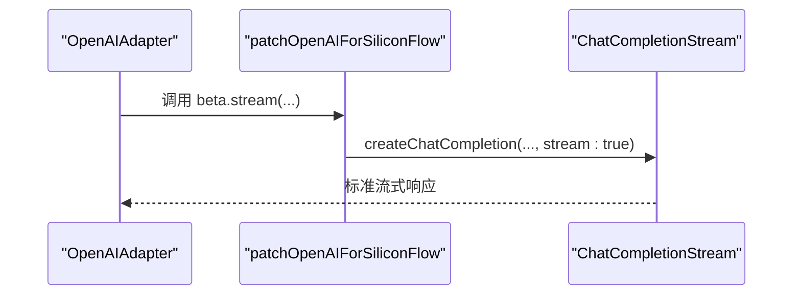
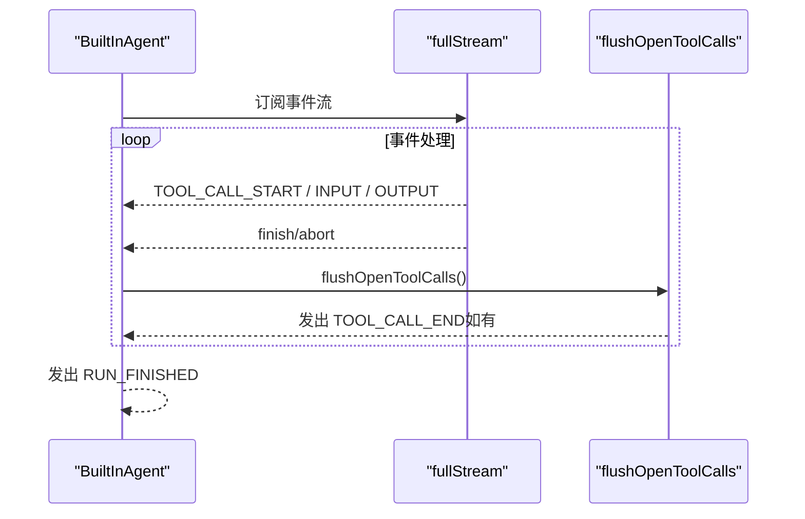
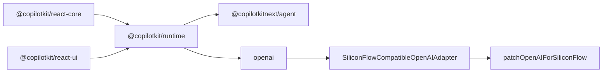

# CopilotKit 集成架构

<cite>
**本文档引用的文件**
- [route.ts](file://app/api/copilotkit/route.ts)
- [CopilotProviders.tsx](file://components/CopilotProviders.tsx)
- [siliconFlowOpenAIAdapter.ts](file://lib/siliconFlowOpenAIAdapter.ts)
- [patchOpenAIForSiliconFlow.ts](file://lib/patchOpenAIForSiliconFlow.ts)
- [siliconflow-defaults.ts](file://lib/siliconflow-defaults.ts)
- [AiBot.tsx](file://components/AiBot.tsx)
- [MainPage.tsx](file://components/MainPage.tsx)
- [copilotLocalMemory.ts](file://lib/copilotLocalMemory.ts)
- [resumeData.ts](file://lib/resumeData.ts)
- [layout.tsx](file://app/layout.tsx)
- [package.json](file://package.json)
- [@copilotkitnext+agent+1.54.0.patch](file://patches/@copilotkitnext+agent+1.54.0.patch)
</cite>

## 目录
1. [简介](#简介)
2. [项目结构](#项目结构)
3. [核心组件](#核心组件)
4. [架构总览](#架构总览)
5. [详细组件分析](#详细组件分析)
6. [依赖分析](#依赖分析)
7. [性能考虑](#性能考虑)
8. [故障排查指南](#故障排查指南)
9. [结论](#结论)
10. [附录](#附录)

## 简介
本项目基于 CopilotKit 构建了一个面向“AI 助手”的集成架构，重点围绕以下目标展开：
- 提供稳定的 Provider 模式，实现全局状态管理、API Key 管理与服务器配置检测。
- 实现服务端代理 API，负责请求转发、响应处理与错误处理策略。
- 设计硅基流动 API 适配器，解决兼容性问题与性能优化。
- 解释 Function Calling 机制，涵盖函数定义、参数传递与执行结果处理。
- 提供可操作的配置指南与扩展方法，帮助开发者快速集成与二次开发。

## 项目结构
项目采用 Next.js 应用结构，核心目录与职责如下：
- app/api/copilotkit：服务端代理 API，统一处理 CopilotKit 请求与响应。
- components：前端 UI 组件与 CopilotKit Provider。
- lib：适配器、补丁、默认配置与本地记忆持久化。
- patches：第三方依赖的补丁文件，用于修复特定兼容性问题。
- app/layout.tsx：根布局，挂载 CopilotKit Provider。

图表来源
- [route.ts:1-131](file://app/api/copilotkit/route.ts#L1-L131)
- [CopilotProviders.tsx:1-157](file://components/CopilotProviders.tsx#L1-L157)
- [siliconFlowOpenAIAdapter.ts:1-36](file://lib/siliconFlowOpenAIAdapter.ts#L1-L36)
- [patchOpenAIForSiliconFlow.ts:1-22](file://lib/patchOpenAIForSiliconFlow.ts#L1-L22)
- [siliconflow-defaults.ts:1-16](file://lib/siliconflow-defaults.ts#L1-L16)
- [copilotLocalMemory.ts:1-77](file://lib/copilotLocalMemory.ts#L1-L77)

章节来源
- [layout.tsx:1-48](file://app/layout.tsx#L1-L48)
- [package.json:1-29](file://package.json#L1-L29)

## 核心组件
- 服务端代理 API（/api/copilotkit）：负责 API Key 解析、运行时缓存、请求转发与错误处理。
- CopilotKit Provider（CopilotProviders）：负责用户 API Key 的存储与传递、服务器配置检测、fetch 补丁与全局状态管理。
- 硅基流动适配器（SiliconFlowCompatibleOpenAIAdapter）：将 OpenAI 适配器切换到兼容网关的流式聊天协议。
- OpenAI 补丁（patchOpenAIForSiliconFlow）：将 beta 流式接口代理到标准流式接口。
- 默认配置（siliconflow-defaults）：定义请求头、默认 Key 与用户 Key 存储键。
- 本地记忆（copilotLocalMemory）：持久化对话记忆，注入模型上下文。
- 项目数据（resumeData）：作为 CopilotKit 的知识库注入 AI。

章节来源
- [route.ts:1-131](file://app/api/copilotkit/route.ts#L1-L131)
- [CopilotProviders.tsx:1-157](file://components/CopilotProviders.tsx#L1-L157)
- [siliconFlowOpenAIAdapter.ts:1-36](file://lib/siliconFlowOpenAIAdapter.ts#L1-L36)
- [patchOpenAIForSiliconFlow.ts:1-22](file://lib/patchOpenAIForSiliconFlow.ts#L1-L22)
- [siliconflow-defaults.ts:1-16](file://lib/siliconflow-defaults.ts#L1-L16)
- [copilotLocalMemory.ts:1-77](file://lib/copilotLocalMemory.ts#L1-L77)
- [resumeData.ts:1-263](file://lib/resumeData.ts#L1-L263)

## 架构总览
整体架构采用“前端 Provider + 服务端代理 + 适配器 + 补丁”的模式，确保与硅基流动等兼容网关的稳定对接，并提供灵活的 API Key 管理与配置检测。

图表来源
- [route.ts:1-131](file://app/api/copilotkit/route.ts#L1-L131)
- [CopilotProviders.tsx:1-157](file://components/CopilotProviders.tsx#L1-L157)
- [siliconFlowOpenAIAdapter.ts:1-36](file://lib/siliconFlowOpenAIAdapter.ts#L1-L36)
- [patchOpenAIForSiliconFlow.ts:1-22](file://lib/patchOpenAIForSiliconFlow.ts#L1-L22)

## 详细组件分析

### 服务端代理 API（/api/copilotkit）
- API Key 解析优先级：请求头 > 环境变量 > 默认 Key。
- 运行时缓存：按 API Key 缓存 Hono 处理器，避免重复创建 CopilotRuntime，提升稳定性与性能。
- 适配器与 Agent：使用 SiliconFlowCompatibleOpenAIAdapter，禁用并行工具调用，确保兼容网关正确处理工具调用生命周期。
- 错误处理：当未配置有效 Key 时，返回明确的错误信息；GET 健康检查返回服务端 Key 配置状态与提示信息。

图表来源
- [route.ts:1-131](file://app/api/copilotkit/route.ts#L1-L131)

章节来源
- [route.ts:1-131](file://app/api/copilotkit/route.ts#L1-L131)

### CopilotKit Provider（CopilotProviders）
- 全局状态：管理用户 API Key（localStorage 覆盖）、服务器 Key 配置检测（GET /api/copilotkit）。
- 请求头注入：优先使用用户自填 Key，其次使用构建时注入的公共 Key，最后为空（交由服务端环境变量）。
- fetch 补丁：针对 CopilotKit 的底层 fetch，拦截空响应体并返回合法 JSON，避免解析异常。
- UI 初始化：通过 CopilotKit 组件设置 runtimeUrl、禁用 Inspector 与开发台，避免本地开发时的干扰。

图表来源
- [CopilotProviders.tsx:1-157](file://components/CopilotProviders.tsx#L1-L157)

章节来源
- [CopilotProviders.tsx:1-157](file://components/CopilotProviders.tsx#L1-L157)

### 硅基流动适配器（SiliconFlowCompatibleOpenAIAdapter）
- 问题背景：@ai-sdk/openai v3 默认使用 Responses API（/v1/responses），而部分兼容网关仅支持 Chat Completions（/v1/chat/completions）。
- 解决方案：重写 getLanguageModel，使用 createOpenAI(...).chat(model)，与流式聊天协议一致，避免 404。

图表来源
- [siliconFlowOpenAIAdapter.ts:1-36](file://lib/siliconFlowOpenAIAdapter.ts#L1-L36)

章节来源
- [siliconFlowOpenAIAdapter.ts:1-36](file://lib/siliconFlowOpenAIAdapter.ts#L1-L36)

### OpenAI 补丁（patchOpenAIForSiliconFlow）
- 问题背景：CopilotKit 的 OpenAIAdapter 使用 client.beta.chat.completions.stream()，对应 /v1/beta/chat/completions，而兼容网关通常只实现 /v1/chat/completions。
- 解决方案：将 beta.stream 代理到 SDK 自带的 ChatCompletionStream.createChatCompletion，内部走标准流式接口。

图表来源
- [patchOpenAIForSiliconFlow.ts:1-22](file://lib/patchOpenAIForSiliconFlow.ts#L1-L22)

章节来源
- [patchOpenAIForSiliconFlow.ts:1-22](file://lib/patchOpenAIForSiliconFlow.ts#L1-L22)

### 默认配置（siliconflow-defaults）
- 定义请求头名称、默认 Key 与用户 Key 存储键，确保前后端一致。
- 服务端健康检查：返回服务端是否已配置 Key，便于前端决定是否显示“零浏览器配置”提示。

章节来源
- [siliconflow-defaults.ts:1-16](file://lib/siliconflow-defaults.ts#L1-L16)
- [route.ts:1-131](file://app/api/copilotkit/route.ts#L1-L131)

### 本地记忆（copilotLocalMemory）
- 持久化最近消息与滚动摘要，注入到 CopilotKit 的可见消息中，增强上下文连续性。
- 支持片段裁剪与长度限制，避免过度占用存储空间。

章节来源
- [copilotLocalMemory.ts:1-77](file://lib/copilotLocalMemory.ts#L1-L77)

### Function Calling 机制
- 适配器层面：SiliconFlowCompatibleOpenAIAdapter 使用 chat 协议，确保工具调用与流式响应一致。
- Agent 层面：内置 Agent 在流式过程中发出 TOOL_CALL_START/TOOL_CALL_END 事件，配合补丁在 RUN_FINISHED 前补齐未结束的工具调用，避免校验失败。
- 补丁逻辑：在 abort/finish/未终止场景下，遍历未结束的工具调用并发出 TOOL_CALL_END，确保事件顺序正确。

图表来源
- [@copilotkitnext+agent+1.54.0.patch:1-125](file://patches/@copilotkitnext+agent+1.54.0.patch#L1-L125)

章节来源
- [@copilotkitnext+agent+1.54.0.patch:1-125](file://patches/@copilotkitnext+agent+1.54.0.patch#L1-L125)

## 依赖分析
- 前端依赖：@copilotkit/react-core、@copilotkit/react-ui、@copilotkit/runtime、@copilotkit/runtime-client-gql、next、react、react-dom。
- 服务端：Next.js App Router Endpoint、CopilotKit Runtime、OpenAI 客户端。
- 补丁：patch-package，用于修复 @copilotkitnext/agent 的工具调用事件顺序问题。

图表来源
- [package.json:1-29](file://package.json#L1-L29)
- [route.ts:1-131](file://app/api/copilotkit/route.ts#L1-L131)

章节来源
- [package.json:1-29](file://package.json#L1-L29)

## 性能考虑
- 运行时缓存：按 API Key 缓存 Hono 处理器，避免重复初始化 CopilotRuntime，显著降低冷启动开销。
- 流式协议：统一使用标准流式聊天接口，减少中间层转换与错误重试。
- 本地记忆：限制滚动摘要长度，避免内存膨胀；仅持久化必要片段。
- 开发体验：禁用 Inspector 与开发台，减少本地调试时的 UI 干扰与错误弹窗。

[本节为通用性能讨论，无需具体文件来源]

## 故障排查指南
- 未配置有效 API Key：服务端返回配置错误，前端根据 GET /api/copilotkit 的 serverKeyConfigured 字段决定是否提示“零浏览器配置”。
- 硅基流动 404（Not Found）：确认兼容网关支持 /v1/chat/completions；确保使用 SiliconFlowCompatibleOpenAIAdapter 与补丁。
- 工具调用校验失败（Cannot send RUN_FINISHED while tool calls are still active）：确认已应用补丁，确保在 RUN_FINISHED 前发出 TOOL_CALL_END。
- 空响应体导致解析错误：前端 fetch 补丁会将空响应体包装为合法 JSON，避免 SyntaxError。

章节来源
- [route.ts:1-131](file://app/api/copilotkit/route.ts#L1-L131)
- [CopilotProviders.tsx:1-157](file://components/CopilotProviders.tsx#L1-L157)
- [@copilotkitnext+agent+1.54.0.patch:1-125](file://patches/@copilotkitnext+agent+1.54.0.patch#L1-L125)

## 结论
本项目通过 Provider 模式、服务端代理 API、适配器与补丁的协同，实现了与硅基流动等兼容网关的稳定对接。其设计兼顾了安全性（Key 管理与配置检测）、性能（运行时缓存与流式协议）与可扩展性（Function Calling 事件顺序修复）。开发者可在此基础上快速集成 AI 助手，并按需扩展知识库与交互能力。

[本节为总结性内容，无需具体文件来源]

## 附录

### 配置指南
- 服务端 Key 设置
  - 推荐在环境变量中设置 SILICONFLOW_API_KEY（如 .env.local 或 Vercel 环境变量）。
  - 如需兜底，可在代码中设置默认 Key（生产环境建议留空并仅使用环境变量）。
- 前端 Key 设置
  - 用户可在“API”面板保存自定义 Key，保存后将通过请求头 x-siliconflow-api-key 传给服务端。
  - 构建时可通过 NEXT_PUBLIC_SILICONFLOW_API_KEY 注入公共 Key（仅调试用途）。
- 模型选择
  - 默认模型为 Qwen/Qwen3-14B，可通过 SILICONFLOW_MODEL 覆盖。
- 健康检查
  - GET /api/copilotkit 返回服务端 Key 配置状态与提示信息，便于前端判断是否可零配置使用。

章节来源
- [route.ts:1-131](file://app/api/copilotkit/route.ts#L1-L131)
- [siliconflow-defaults.ts:1-16](file://lib/siliconflow-defaults.ts#L1-L16)

### 扩展建议
- 知识库注入：将 resumeData 作为 CopilotKit 的知识库，结合本地记忆实现上下文增强。
- 工具调用：在 Agent 中注册自定义工具，结合补丁确保事件顺序正确。
- 监控与日志：在服务端代理中增加请求/响应日志与错误统计，便于定位兼容性问题。

[本节为通用扩展建议，无需具体文件来源]