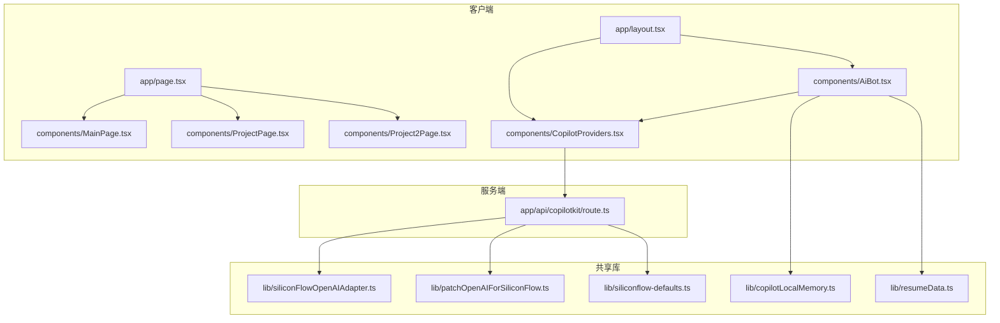
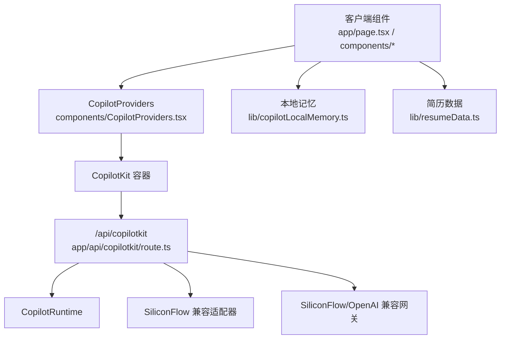
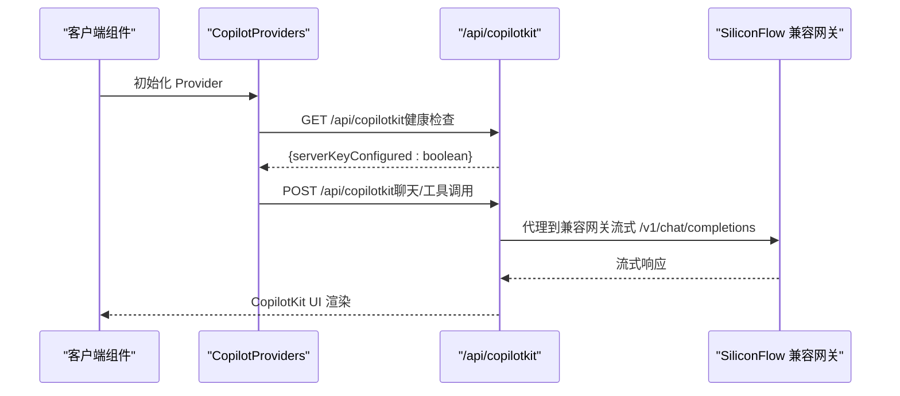
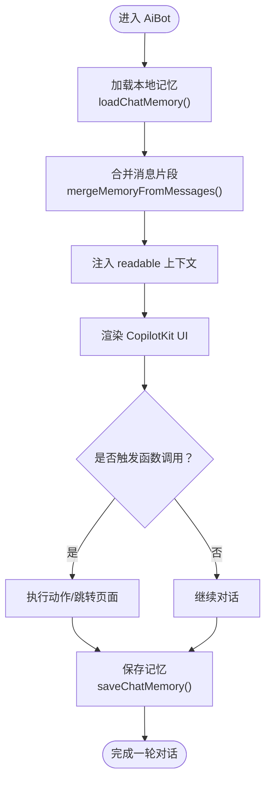
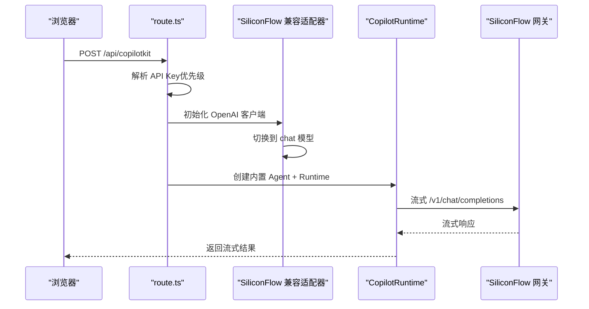
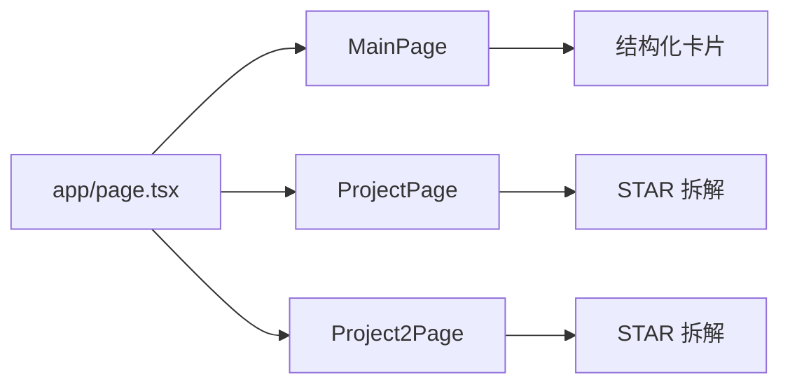
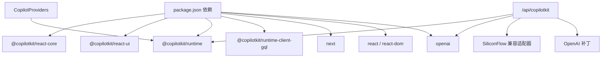

# 技术架构

<cite>
**本文档引用的文件**
- [package.json](file://package.json)
- [next.config.js](file://next.config.js)
- [app/layout.tsx](file://app/layout.tsx)
- [app/page.tsx](file://app/page.tsx)
- [app/api/copilotkit/route.ts](file://app/api/copilotkit/route.ts)
- [components/CopilotProviders.tsx](file://components/CopilotProviders.tsx)
- [components/AiBot.tsx](file://components/AiBot.tsx)
- [components/MainPage.tsx](file://components/MainPage.tsx)
- [components/ProjectPage.tsx](file://components/ProjectPage.tsx)
- [components/Project2Page.tsx](file://components/Project2Page.tsx)
- [lib/copilotLocalMemory.ts](file://lib/copilotLocalMemory.ts)
- [lib/resumeData.ts](file://lib/resumeData.ts)
- [lib/siliconFlowOpenAIAdapter.ts](file://lib/siliconFlowOpenAIAdapter.ts)
- [lib/patchOpenAIForSiliconFlow.ts](file://lib/patchOpenAIForSiliconFlow.ts)
- [lib/siliconflow-defaults.ts](file://lib/siliconflow-defaults.ts)
</cite>

## 目录
1. [引言](#引言)
2. [项目结构](#项目结构)
3. [核心组件](#核心组件)
4. [架构总览](#架构总览)
5. [详细组件分析](#详细组件分析)
6. [依赖分析](#依赖分析)
7. [性能考量](#性能考量)
8. [故障排查指南](#故障排查指南)
9. [结论](#结论)
10. [附录](#附录)

## 引言
本项目是一个基于 Next.js 14 App Router 的全栈应用，集成了 CopilotKit AI 助手，提供“傅倩娇 · AI产品经理”的个人展示与智能问答体验。系统采用服务端组件与客户端组件混合架构，通过 CopilotKit Provider 模式实现 AI 助手的全局状态管理与组件间通信；通过自定义适配器与补丁适配 SiliconFlow/OpenAI 兼容网关，确保流式对话与 Function Calling 的稳定性。

## 项目结构
项目遵循 Next.js 14 App Router 的目录约定，核心目录与职责如下：
- app：应用入口与路由层，包含全局布局、首页与 CopilotKit API 路由
- components：可复用 UI 组件与业务组件（AI 助手、页面容器等）
- lib：第三方服务适配、本地记忆与简历数据等共享逻辑
- public：公共资源（音频）

**图表来源**
- [app/layout.tsx:1-48](file://app/layout.tsx#L1-L48)
- [app/page.tsx:1-30](file://app/page.tsx#L1-L30)
- [components/CopilotProviders.tsx:1-157](file://components/CopilotProviders.tsx#L1-L157)
- [components/AiBot.tsx:1-800](file://components/AiBot.tsx#L1-L800)
- [components/MainPage.tsx:1-691](file://components/MainPage.tsx#L1-L691)
- [components/ProjectPage.tsx:1-275](file://components/ProjectPage.tsx#L1-L275)
- [components/Project2Page.tsx:1-247](file://components/Project2Page.tsx#L1-L247)
- [app/api/copilotkit/route.ts:1-131](file://app/api/copilotkit/route.ts#L1-L131)
- [lib/copilotLocalMemory.ts:1-77](file://lib/copilotLocalMemory.ts#L1-L77)
- [lib/resumeData.ts:1-263](file://lib/resumeData.ts#L1-L263)
- [lib/siliconFlowOpenAIAdapter.ts:1-36](file://lib/siliconFlowOpenAIAdapter.ts#L1-L36)
- [lib/patchOpenAIForSiliconFlow.ts:1-22](file://lib/patchOpenAIForSiliconFlow.ts#L1-L22)
- [lib/siliconflow-defaults.ts:1-16](file://lib/siliconflow-defaults.ts#L1-L16)

**章节来源**
- [package.json:1-29](file://package.json#L1-L29)
- [next.config.js:1-4](file://next.config.js#L1-L4)
- [app/layout.tsx:1-48](file://app/layout.tsx#L1-L48)
- [app/page.tsx:1-30](file://app/page.tsx#L1-L30)

## 核心组件
- 全局布局与 Provider
  - app/layout.tsx：设置站点元数据、预加载背景音乐、注入 CopilotProviders 与全局样式
  - components/CopilotProviders.tsx：Provider 根组件，封装 CopilotKit 与 SiliconFlow Key 管理、fetch 补丁与健康检查
- 页面与导航
  - app/page.tsx：客户端页面容器，维护当前页签与滚动行为
  - components/MainPage.tsx、components/ProjectPage.tsx、components/Project2Page.tsx：各业务页面组件
- AI 助手
  - components/AiBot.tsx：CopilotKit UI 容器，集成结构化卡片、函数调用、本地记忆与简历数据
- CopilotKit 服务端路由
  - app/api/copilotkit/route.ts：Next.js App Router API 路由，对接 CopilotRuntime 与 SiliconFlow 兼容网关
- 共享逻辑
  - lib/copilotLocalMemory.ts：本地持久化对话记忆（recent/longTerm）
  - lib/resumeData.ts：简历与知识库数据
  - lib/siliconFlowOpenAIAdapter.ts、lib/patchOpenAIForSiliconFlow.ts：适配 OpenAI 兼容网关
  - lib/siliconflow-defaults.ts：SiliconFlow Key 与存储键名常量

**章节来源**
- [app/layout.tsx:1-48](file://app/layout.tsx#L1-L48)
- [components/CopilotProviders.tsx:1-157](file://components/CopilotProviders.tsx#L1-L157)
- [app/page.tsx:1-30](file://app/page.tsx#L1-L30)
- [components/AiBot.tsx:1-800](file://components/AiBot.tsx#L1-L800)
- [app/api/copilotkit/route.ts:1-131](file://app/api/copilotkit/route.ts#L1-L131)
- [lib/copilotLocalMemory.ts:1-77](file://lib/copilotLocalMemory.ts#L1-L77)
- [lib/resumeData.ts:1-263](file://lib/resumeData.ts#L1-L263)
- [lib/siliconFlowOpenAIAdapter.ts:1-36](file://lib/siliconFlowOpenAIAdapter.ts#L1-L36)
- [lib/patchOpenAIForSiliconFlow.ts:1-22](file://lib/patchOpenAIForSiliconFlow.ts#L1-L22)
- [lib/siliconflow-defaults.ts:1-16](file://lib/siliconflow-defaults.ts#L1-L16)

## 架构总览
系统采用“客户端 UI + 服务端 CopilotKit 路由 + 第三方兼容网关”的三层架构：
- 客户端层：Next.js App Router 客户端组件，负责页面导航与 AI 助手 UI
- Provider 层：CopilotProviders 提供全局状态（SiliconFlow Key、服务端 Key 配置状态）与 CopilotKit 容器
- 服务端层：/api/copilotkit 路由，封装 CopilotRuntime、适配器与缓存的 Hono 处理器
- 适配层：SiliconFlow 兼容网关适配器与 OpenAI 补丁，解决流式路径与工具调用兼容性

**图表来源**
- [app/page.tsx:1-30](file://app/page.tsx#L1-L30)
- [components/CopilotProviders.tsx:1-157](file://components/CopilotProviders.tsx#L1-L157)
- [app/api/copilotkit/route.ts:1-131](file://app/api/copilotkit/route.ts#L1-L131)
- [lib/copilotLocalMemory.ts:1-77](file://lib/copilotLocalMemory.ts#L1-L77)
- [lib/resumeData.ts:1-263](file://lib/resumeData.ts#L1-L263)
- [lib/siliconFlowOpenAIAdapter.ts:1-36](file://lib/siliconFlowOpenAIAdapter.ts#L1-L36)

## 详细组件分析

### CopilotKit Provider 与全局状态管理
- 职责
  - 管理 SiliconFlow API Key（浏览器覆盖/公共构建变量/服务端兜底）
  - 拉取服务端 Key 配置状态，用于 UI 提示
  - 注入 CopilotKit runtimeUrl、禁用 Inspector 与开发台，减少生产环境噪音
  - 修复兼容性：拦截 /api/copilotkit 的 fetch，对空响应体进行安全包装
- 关键点
  - Key 解析优先级：请求头 > 环境变量 > 代码兜底
  - 本地存储键名与请求头一致，便于用户在面板保存 Key
  - 健康检查接口 GET /api/copilotkit 返回服务端 Key 配置状态

**图表来源**
- [components/CopilotProviders.tsx:49-156](file://components/CopilotProviders.tsx#L49-L156)
- [app/api/copilotkit/route.ts:120-131](file://app/api/copilotkit/route.ts#L120-L131)
- [app/api/copilotkit/route.ts:100-114](file://app/api/copilotkit/route.ts#L100-L114)

**章节来源**
- [components/CopilotProviders.tsx:1-157](file://components/CopilotProviders.tsx#L1-L157)
- [app/api/copilotkit/route.ts:1-131](file://app/api/copilotkit/route.ts#L1-L131)

### AI 助手组件与 Function Calling
- 职责
  - 基于 CopilotKit UI 组件呈现聊天界面
  - 注入简历数据与本地记忆，增强上下文
  - 提供结构化卡片（技能图谱、岗位匹配度、项目亮点）与快捷问题
  - 与 CopilotKit 的 readable/action/chat hooks 协作，实现函数调用与状态联动
- 本地记忆
  - 本地持久化 recent 与 longTerm，限制长度，定期追加助手回复摘要
  - 与 CopilotKit readable 合并，作为模型上下文

**图表来源**
- [components/AiBot.tsx:1-800](file://components/AiBot.tsx#L1-L800)
- [lib/copilotLocalMemory.ts:21-77](file://lib/copilotLocalMemory.ts#L21-L77)
- [lib/resumeData.ts:1-263](file://lib/resumeData.ts#L1-L263)

**章节来源**
- [components/AiBot.tsx:1-800](file://components/AiBot.tsx#L1-L800)
- [lib/copilotLocalMemory.ts:1-77](file://lib/copilotLocalMemory.ts#L1-L77)
- [lib/resumeData.ts:1-263](file://lib/resumeData.ts#L1-L263)

### 服务端 CopilotKit 路由与适配
- 路由职责
  - 解析 API Key 优先级，缓存 Hono 处理器，避免重复初始化
  - 代理到 CopilotRuntime 与 SiliconFlow 兼容适配器
  - 提供 OPTIONS 预检与健康检查 GET
- 兼容性处理
  - SiliconFlow 兼容适配器：强制使用 chat 模型以适配 /v1/chat/completions
  - OpenAI 补丁：将 beta.stream 代理到标准 SDK 创建流式对话
  - 并行工具调用：在 providerOptions 与适配器中显式关闭并行工具调用

**图表来源**
- [app/api/copilotkit/route.ts:30-95](file://app/api/copilotkit/route.ts#L30-L95)
- [lib/siliconFlowOpenAIAdapter.ts:17-35](file://lib/siliconFlowOpenAIAdapter.ts#L17-L35)
- [lib/patchOpenAIForSiliconFlow.ts:12-21](file://lib/patchOpenAIForSiliconFlow.ts#L12-L21)

**章节来源**
- [app/api/copilotkit/route.ts:1-131](file://app/api/copilotkit/route.ts#L1-L131)
- [lib/siliconFlowOpenAIAdapter.ts:1-36](file://lib/siliconFlowOpenAIAdapter.ts#L1-L36)
- [lib/patchOpenAIForSiliconFlow.ts:1-22](file://lib/patchOpenAIForSiliconFlow.ts#L1-L22)

### 页面导航与组件化设计
- 页面容器
  - app/page.tsx：维护当前页签（main/project/project2），统一滚动行为
- 页面组件
  - components/MainPage.tsx：主页内容与交互（技能雷达、JD理解、用户视角、产品观点）
  - components/ProjectPage.tsx、components/Project2Page.tsx：STAR 法则项目详解
- 设计原则
  - 可复用：页面组件按功能拆分，结构化卡片与工具链复用
  - 可维护：数据与 UI 分离（resumeData 与页面组件）
  - 可扩展：新增页面只需在导航中注册并实现对应组件

**图表来源**
- [app/page.tsx:11-29](file://app/page.tsx#L11-L29)
- [components/MainPage.tsx:127-691](file://components/MainPage.tsx#L127-L691)
- [components/ProjectPage.tsx:12-275](file://components/ProjectPage.tsx#L12-L275)
- [components/Project2Page.tsx:13-247](file://components/Project2Page.tsx#L13-L247)

**章节来源**
- [app/page.tsx:1-30](file://app/page.tsx#L1-L30)
- [components/MainPage.tsx:1-691](file://components/MainPage.tsx#L1-L691)
- [components/ProjectPage.tsx:1-275](file://components/ProjectPage.tsx#L1-L275)
- [components/Project2Page.tsx:1-247](file://components/Project2Page.tsx#L1-L247)

## 依赖分析
- 运行时依赖
  - @copilotkit/react-core/react-ui/runtime/runtime-client-gql：AI 助手 UI 与运行时
  - next/react/react-dom：框架与渲染
  - openai：与兼容网关交互
- 开发依赖
  - patch-package：应用补丁（适配 CopilotKitNext Agent）
- 关键耦合
  - 客户端 Provider 与服务端路由通过 runtimeUrl 与 headers 协作
  - 适配器与补丁与第三方网关耦合，需关注上游变更

**图表来源**
- [package.json:12-27](file://package.json#L12-L27)
- [components/CopilotProviders.tsx:12-12](file://components/CopilotProviders.tsx#L12-L12)
- [app/api/copilotkit/route.ts:2-14](file://app/api/copilotkit/route.ts#L2-L14)
- [lib/siliconFlowOpenAIAdapter.ts:1-8](file://lib/siliconFlowOpenAIAdapter.ts#L1-L8)
- [lib/patchOpenAIForSiliconFlow.ts:1-2](file://lib/patchOpenAIForSiliconFlow.ts#L1-L2)

**章节来源**
- [package.json:1-29](file://package.json#L1-L29)

## 性能考量
- 服务端缓存
  - 按 API Key 缓存 Hono 处理器，避免重复初始化 CopilotRuntime 与 OpenAI 客户端
- 客户端优化
  - Provider 中对 fetch 的拦截仅在 /api/copilotkit 生效，避免全局副作用
  - 本地记忆截断与滚动摘要，控制内存占用
- 网关适配
  - chat 模型与流式路径适配，减少 404 与重试开销
  - 关闭并行工具调用，避免兼容网关的工具调用尾声缺失问题

[本节为通用性能讨论，不直接分析具体文件]

## 故障排查指南
- 健康检查
  - 访问 GET /api/copilotkit，确认服务端 Key 配置状态与网关信息
- Key 配置
  - 浏览器面板保存 Key 后，确认请求头携带 x-siliconflow-api-key
  - 环境变量 SILICONFLOW_API_KEY 与代码兜底键名一致
- 兼容性问题
  - 若出现 AI_APICallError: Not Found，检查是否使用了 /v1/beta/chat/completions
  - 确认补丁已应用，beta.stream 已代理到标准流式路径
- 工具调用异常
  - 确认 providerOptions 与适配器中已关闭并行工具调用
  - 检查补丁 @copilotkitnext/agent 的 patch 是否生效

**章节来源**
- [app/api/copilotkit/route.ts:120-131](file://app/api/copilotkit/route.ts#L120-L131)
- [components/CopilotProviders.tsx:64-87](file://components/CopilotProviders.tsx#L64-L87)
- [lib/patchOpenAIForSiliconFlow.ts:12-21](file://lib/patchOpenAIForSiliconFlow.ts#L12-L21)
- [lib/siliconFlowOpenAIAdapter.ts:17-35](file://lib/siliconFlowOpenAIAdapter.ts#L17-L35)

## 结论
本项目以 Next.js 14 App Router 为基础，通过 CopilotKit Provider 模式实现了稳定的 AI 助手集成。服务端路由对 SiliconFlow 兼容网关进行了深度适配，保障了流式对话与工具调用的可靠性。组件化设计提升了可复用性与可维护性，配合本地记忆与简历数据注入，形成了高质量的对话体验。未来可在以下方面进一步演进：引入更细粒度的错误隔离与监控、增强本地记忆的上下文压缩策略、以及对更多第三方网关的适配抽象。

## 附录
- 配置与环境
  - NEXT_PUBLIC_AUDIO_SRC：背景音乐预加载地址
  - NEXT_PUBLIC_SILICONFLOW_API_KEY：可选的前端构建时 Key（调试用途）
  - SILICONFLOW_API_KEY：服务端环境变量 Key
  - SILICONFLOW_BASE_URL：网关基础地址
  - SILICONFLOW_MODEL：默认模型名称
- 存储与请求头
  - localStorage 键名：siliconflow_api_key
  - 请求头：x-siliconflow-api-key

**章节来源**
- [app/layout.tsx:13-17](file://app/layout.tsx#L13-L17)
- [lib/siliconflow-defaults.ts:9-16](file://lib/siliconflow-defaults.ts#L9-L16)
- [app/api/copilotkit/route.ts:16-25](file://app/api/copilotkit/route.ts#L16-L25)
- [components/CopilotProviders.tsx:115-133](file://components/CopilotProviders.tsx#L115-L133)