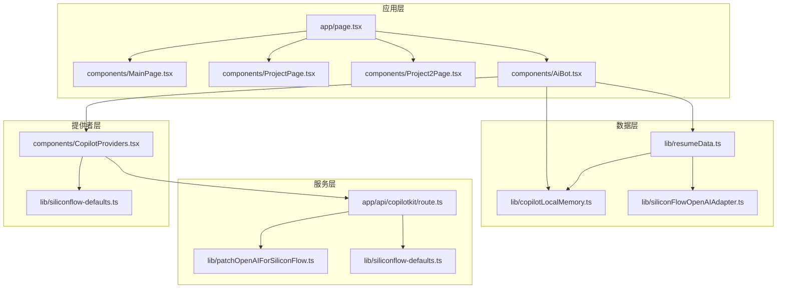
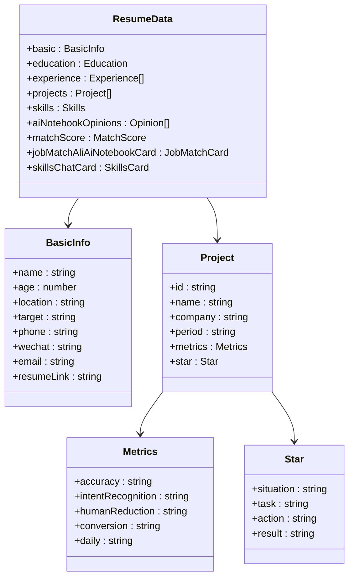
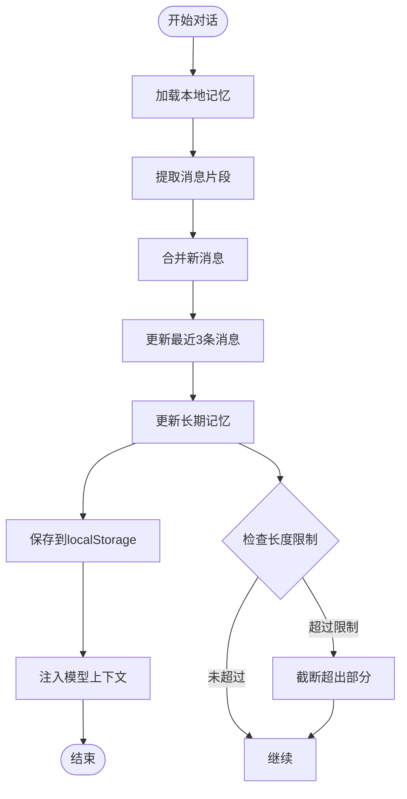
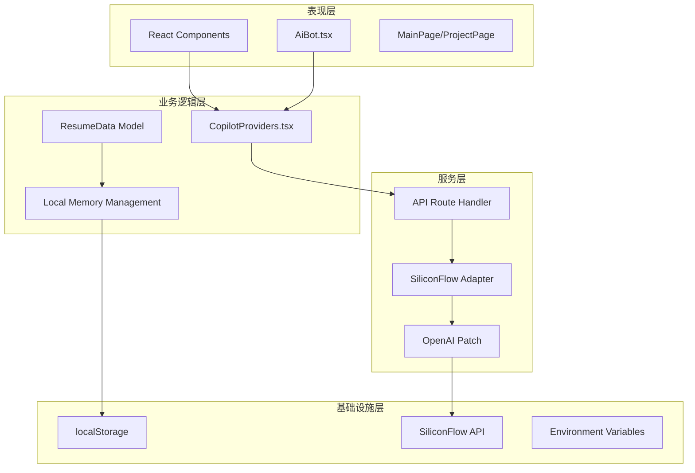
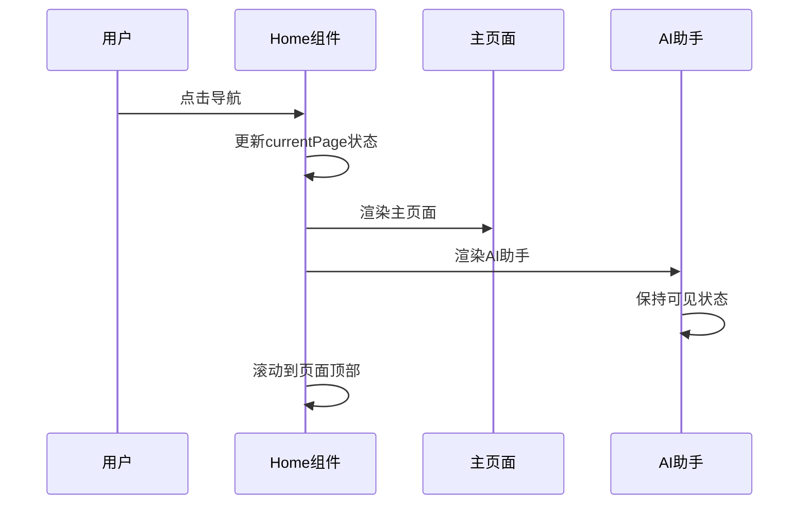
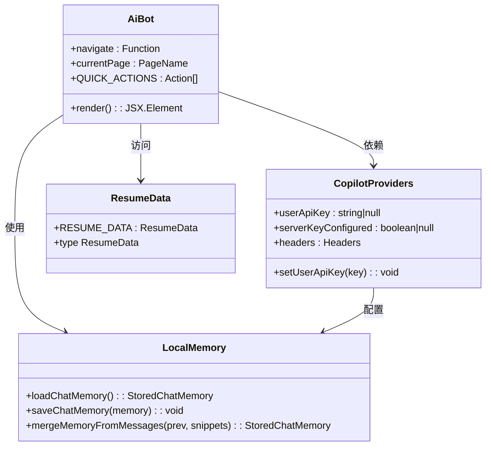
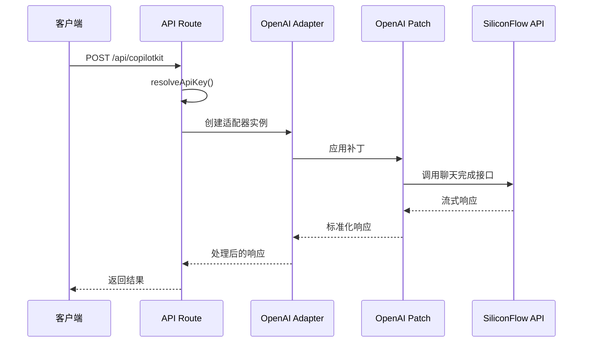

# 数据流设计模式

<cite>
**本文档引用的文件**
- [app/page.tsx](file://app/page.tsx)
- [lib/resumeData.ts](file://lib/resumeData.ts)
- [lib/copilotLocalMemory.ts](file://lib/copilotLocalMemory.ts)
- [components/CopilotProviders.tsx](file://components/CopilotProviders.tsx)
- [components/AiBot.tsx](file://components/AiBot.tsx)
- [components/MainPage.tsx](file://components/MainPage.tsx)
- [components/ProjectPage.tsx](file://components/ProjectPage.tsx)
- [components/Project2Page.tsx](file://components/Project2Page.tsx)
- [app/api/copilotkit/route.ts](file://app/api/copilotkit/route.ts)
- [lib/siliconFlowOpenAIAdapter.ts](file://lib/siliconFlowOpenAIAdapter.ts)
- [lib/patchOpenAIForSiliconFlow.ts](file://lib/patchOpenAIForSiliconFlow.ts)
- [lib/siliconflow-defaults.ts](file://lib/siliconflow-defaults.ts)
- [package.json](file://package.json)
</cite>

## 目录
1. [引言](#引言)
2. [项目结构](#项目结构)
3. [核心组件](#核心组件)
4. [架构概览](#架构概览)
5. [详细组件分析](#详细组件分析)
6. [依赖关系分析](#依赖关系分析)
7. [性能考虑](#性能考虑)
8. [故障排除指南](#故障排除指南)
9. [结论](#结论)

## 引言

本项目是一个基于 Next.js 和 CopilotKit 的 AI 助手应用，展示了现代前端应用中的数据流设计模式。该系统通过精心设计的数据流向、本地记忆管理和状态同步策略，为用户提供了一个智能化的交互体验。

系统的核心特点包括：
- **数据驱动的 AI 助手**：通过 ResumeData 模型提供结构化的知识库
- **本地持久化记忆**：实现跨会话的记忆保持和上下文管理
- **多页面导航系统**：支持主页、项目详情页的无缝切换
- **安全的 API 集成**：通过服务端代理保护 API 密钥

## 项目结构

该项目采用模块化的文件组织结构，按照功能和层次进行分离：



**图表来源**
- [app/page.tsx:1-30](file://app/page.tsx#L1-L30)
- [lib/resumeData.ts:1-263](file://lib/resumeData.ts#L1-L263)
- [components/CopilotProviders.tsx:1-157](file://components/CopilotProviders.tsx#L1-L157)

**章节来源**
- [app/page.tsx:1-30](file://app/page.tsx#L1-L30)
- [package.json:1-29](file://package.json#L1-L29)

## 核心组件

### 数据模型设计

ResumeData 是整个系统的核心数据模型，采用了分层结构设计：



**图表来源**
- [lib/resumeData.ts:5-263](file://lib/resumeData.ts#L5-L263)

### 本地记忆系统

本地记忆系统实现了智能的上下文管理：



**图表来源**
- [lib/copilotLocalMemory.ts:57-77](file://lib/copilotLocalMemory.ts#L57-L77)

**章节来源**
- [lib/resumeData.ts:1-263](file://lib/resumeData.ts#L1-L263)
- [lib/copilotLocalMemory.ts:1-77](file://lib/copilotLocalMemory.ts#L1-L77)

## 架构概览

系统采用分层架构设计，确保了良好的关注点分离和可维护性：



**图表来源**
- [components/CopilotProviders.tsx:49-157](file://components/CopilotProviders.tsx#L49-L157)
- [app/api/copilotkit/route.ts:16-95](file://app/api/copilotkit/route.ts#L16-L95)

## 详细组件分析

### 页面导航系统

应用采用客户端状态管理实现页面切换：



**图表来源**
- [app/page.tsx:11-29](file://app/page.tsx#L11-L29)

### AI 助手集成

AI 助手通过 CopilotKit 提供完整的对话体验：



**图表来源**
- [components/AiBot.tsx:28-31](file://components/AiBot.tsx#L28-L31)
- [components/CopilotProviders.tsx:15-26](file://components/CopilotProviders.tsx#L15-L26)

### API 集成架构

服务端 API 处理器实现了安全的密钥管理和模型适配：



**图表来源**
- [app/api/copilotkit/route.ts:30-95](file://app/api/copilotkit/route.ts#L30-L95)
- [lib/patchOpenAIForSiliconFlow.ts:12-22](file://lib/patchOpenAIForSiliconFlow.ts#L12-L22)

**章节来源**
- [app/page.tsx:1-30](file://app/page.tsx#L1-L30)
- [components/AiBot.tsx:1-800](file://components/AiBot.tsx#L1-L800)
- [app/api/copilotkit/route.ts:1-131](file://app/api/copilotkit/route.ts#L1-L131)

### 数据传递模式

系统实现了多种数据传递模式：

#### Props 传递模式
- 父组件向子组件传递导航函数和当前页面状态
- 项目页面接收导航函数用于页面跳转
- 组件间通过 props 进行单向数据流传递

#### Context API 使用
- CopilotProviders 提供用户 API 密钥上下文
- SiliconflowKeyContext 管理 SiliconFlow 配置状态
- 全局状态通过 React Context 实现共享

#### 状态提升策略
- 页面状态在 Home 组件中集中管理
- 通过回调函数向下传递状态更新逻辑
- 实现了从子组件到父组件的状态提升

**章节来源**
- [components/CopilotProviders.tsx:15-40](file://components/CopilotProviders.tsx#L15-L40)
- [app/page.tsx:12-17](file://app/page.tsx#L12-L17)

## 依赖关系分析

系统依赖关系展现了清晰的模块化设计：

```mermaid
graph TD
subgraph "外部依赖"
A[Next.js 14.2.5]
B[@copilotkit/react-core]
C[React 18.3.1]
D[OpenAI SDK]
end
subgraph "内部模块"
E[lib/resumeData.ts]
F[lib/copilotLocalMemory.ts]
G[lib/siliconFlowOpenAIAdapter.ts]
H[lib/patchOpenAIForSiliconFlow.ts]
I[lib/siliconflow-defaults.ts]
end
subgraph "组件层"
J[components/AiBot.tsx]
K[components/CopilotProviders.tsx]
L[components/MainPage.tsx]
end
subgraph "API层"
M[app/api/copilotkit/route.ts]
end
A --> J
B --> J
C --> J
D --> G
E --> J
F --> J
G --> M
H --> M
I --> K
I --> M
J --> K
K --> M
L --> J
```

**图表来源**
- [package.json:12-20](file://package.json#L12-L20)
- [components/AiBot.tsx:10-21](file://components/AiBot.tsx#L10-L21)

**章节来源**
- [package.json:1-29](file://package.json#L1-L29)

## 性能考虑

系统在多个层面实现了性能优化：

### 内存管理
- 本地记忆系统限制长期记忆长度（2000字符）
- 最近消息片段限制为3条
- 消息文本截断防止内存溢出

### API 调用优化
- API Key 缓存避免重复初始化
- 流式响应处理提高用户体验
- 错误处理和重试机制

### 渲染优化
- React.memo 和 useMemo 优化组件渲染
- 条件渲染减少不必要的 DOM 更新
- 懒加载和代码分割

## 故障排除指南

### 常见问题及解决方案

#### API 密钥配置问题
- **症状**：访问 /api/copilotkit 返回配置错误
- **原因**：缺少有效的 SILICONFLOW_API_KEY
- **解决方案**：在环境变量中设置 API Key 或使用默认值

#### 流式响应问题
- **症状**：AI 助手响应缓慢或无响应
- **原因**：SiliconFlow 兼容性问题
- **解决方案**：检查补丁包应用情况，确认流式 API 支持

#### 本地存储问题
- **症状**：对话历史丢失或无法加载
- **原因**：浏览器隐私模式或存储配额不足
- **解决方案**：检查浏览器设置，清理存储空间

**章节来源**
- [app/api/copilotkit/route.ts:100-114](file://app/api/copilotkit/route.ts#L100-L114)
- [lib/copilotLocalMemory.ts:21-47](file://lib/copilotLocalMemory.ts#L21-L47)

## 结论

本项目展示了现代前端应用中数据流设计的最佳实践。通过精心设计的数据模型、本地记忆系统和状态管理策略，实现了高效、可维护的 AI 助手应用。

关键设计要点包括：
- **模块化架构**：清晰的分层设计便于维护和扩展
- **数据驱动**：以 ResumeData 为核心的结构化数据管理
- **本地持久化**：智能的上下文管理和记忆保持
- **安全集成**：通过服务端代理保护敏感信息
- **性能优化**：多层面的性能考虑和优化策略

这些设计模式为类似项目的开发提供了宝贵的参考和指导。