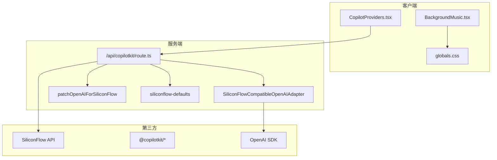
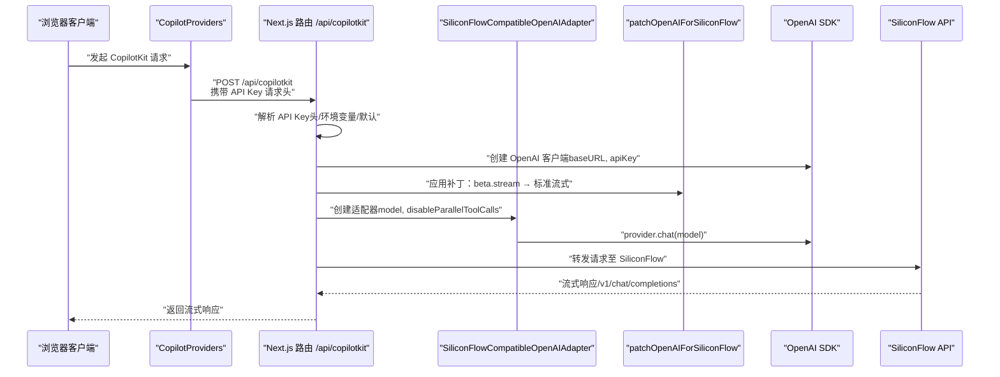
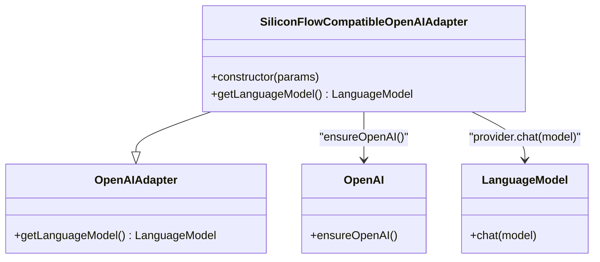
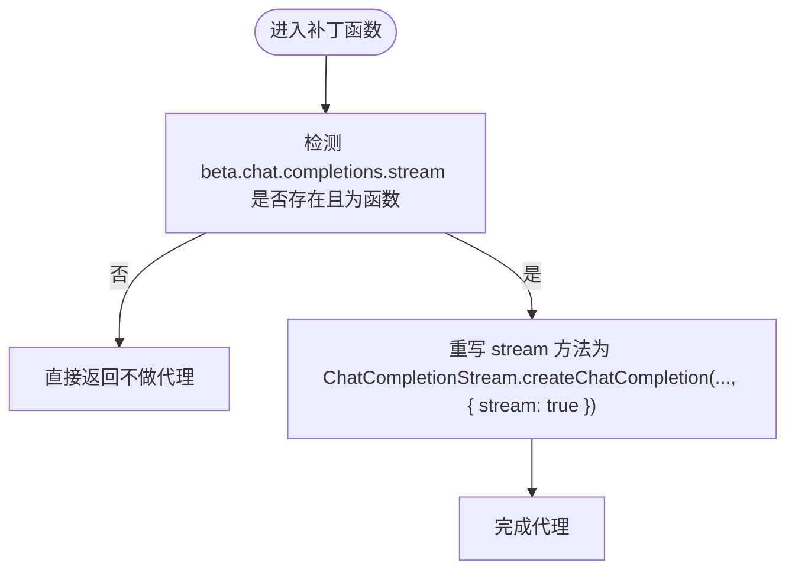
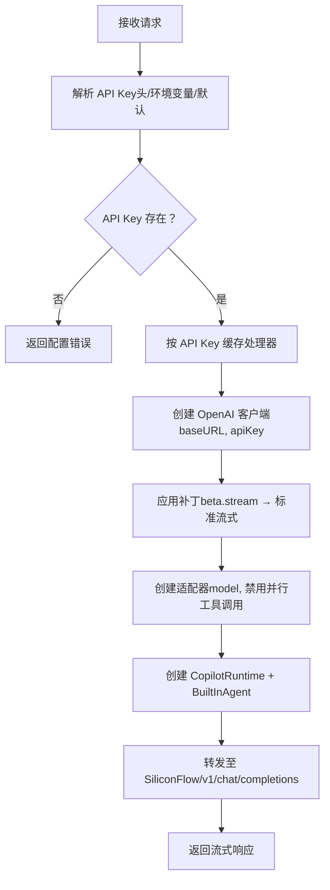
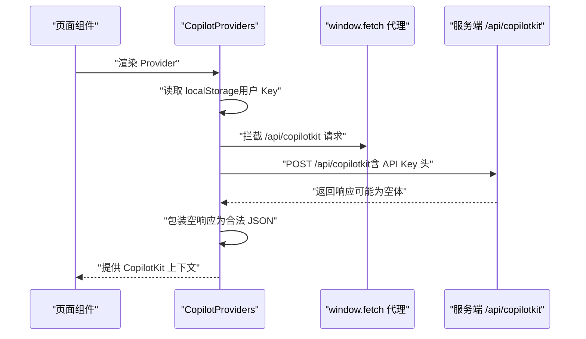
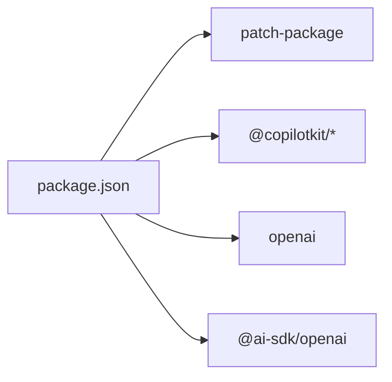

# 第三方服务集成

<cite>
**本文档引用的文件**
- [siliconFlowOpenAIAdapter.ts](file://lib/siliconFlowOpenAIAdapter.ts)
- [patchOpenAIForSiliconFlow.ts](file://lib/patchOpenAIForSiliconFlow.ts)
- [siliconflow-defaults.ts](file://lib/siliconflow-defaults.ts)
- [@copilotkitnext+agent+1.54.0.patch](file://patches/@copilotkitnext+agent+1.54.0.patch)
- [CopilotProviders.tsx](file://components/CopilotProviders.tsx)
- [route.ts](file://app/api/copilotkit/route.ts)
- [package.json](file://package.json)
- [next.config.js](file://next.config.js)
- [globals.css](file://app/globals.css)
- [BackgroundMusic.tsx](file://components/BackgroundMusic.tsx)
- [README.md](file://public/audio/README.md)
</cite>

## 目录
1. [简介](#简介)
2. [项目结构](#项目结构)
3. [核心组件](#核心组件)
4. [架构总览](#架构总览)
5. [详细组件分析](#详细组件分析)
6. [依赖分析](#依赖分析)
7. [性能考量](#性能考量)
8. [故障排除指南](#故障排除指南)
9. [结论](#结论)
10. [附录](#附录)

## 简介
本项目为一个集成了 CopilotKit AI 助手与硅基流动（SiliconFlow）服务的 Next.js 应用。文档聚焦于第三方服务集成的技术细节，包括：
- 硅基流动 API 的适配器设计与 OpenAI 兼容性处理
- API 参数映射与错误处理机制
- 补丁文件的作用与实现原理（依赖版本兼容性与功能增强）
- 默认配置管理（API Key 管理、环境变量处理与安全考虑）
- 其他第三方服务的集成方式（音频服务、字体服务与 CDN 资源管理）
- 集成测试方法与故障排除指南
- 版本兼容性矩阵与升级迁移指南

## 项目结构
项目采用 Next.js 14 结构，核心第三方服务集成集中在以下位置：
- 服务端 API：`app/api/copilotkit/route.ts`
- 客户端 Provider：`components/CopilotProviders.tsx`
- 适配器与补丁：`lib/siliconFlowOpenAIAdapter.ts`、`lib/patchOpenAIForSiliconFlow.ts`、`lib/siliconflow-defaults.ts`
- 补丁文件：`patches/@copilotkitnext+agent+1.54.0.patch`
- 音频资源与配置：`components/BackgroundMusic.tsx`、`public/audio/README.md`
- 样式与字体：`app/globals.css`
- 依赖与脚本：`package.json`、`next.config.js`

图表来源
- [CopilotProviders.tsx:146-155](file://components/CopilotProviders.tsx#L146-L155)
- [route.ts:58-84](file://app/api/copilotkit/route.ts#L58-L84)
- [siliconFlowOpenAIAdapter.ts:17-35](file://lib/siliconFlowOpenAIAdapter.ts#L17-L35)
- [patchOpenAIForSiliconFlow.ts:12-21](file://lib/patchOpenAIForSiliconFlow.ts#L12-L21)
- [siliconflow-defaults.ts:9-15](file://lib/siliconflow-defaults.ts#L9-L15)

章节来源
- [package.json:12-27](file://package.json#L12-L27)
- [next.config.js:1-4](file://next.config.js#L1-L4)

## 核心组件
本节概述第三方服务集成的关键组件及其职责：
- 服务端路由：负责解析 API Key、初始化 OpenAI 客户端、应用补丁、创建适配器并处理 CopilotKit 请求。
- 客户端 Provider：负责在浏览器侧管理用户 API Key、向服务端传递请求头，并对特定响应进行兼容处理。
- 适配器：将 CopilotKit 的 OpenAIAdapter 适配到硅基流动的 Chat Completions 协议，确保流式通信与路径兼容。
- 补丁：将 CopilotKit 的 beta 流式接口代理到标准 OpenAI Chat Completions，解决兼容网关路径不一致的问题。
- 默认配置：集中管理 API Key 解析顺序、请求头名称与本地存储键名。
- 音频服务：提供背景音乐资源与 CDN 配置选项，确保跨域与稳定性。

章节来源
- [route.ts:24-25](file://app/api/copilotkit/route.ts#L24-L25)
- [route.ts:30-36](file://app/api/copilotkit/route.ts#L30-L36)
- [route.ts:52-65](file://app/api/copilotkit/route.ts#L52-L65)
- [route.ts:100-114](file://app/api/copilotkit/route.ts#L100-L114)
- [CopilotProviders.tsx:115-124](file://components/CopilotProviders.tsx#L115-L124)
- [CopilotProviders.tsx:126-133](file://components/CopilotProviders.tsx#L126-L133)
- [siliconFlowOpenAIAdapter.ts:17-35](file://lib/siliconFlowOpenAIAdapter.ts#L17-L35)
- [patchOpenAIForSiliconFlow.ts:12-21](file://lib/patchOpenAIForSiliconFlow.ts#L12-L21)
- [siliconflow-defaults.ts:9-15](file://lib/siliconflow-defaults.ts#L9-L15)
- [BackgroundMusic.tsx:46-50](file://components/BackgroundMusic.tsx#L46-L50)

## 架构总览
下图展示了从浏览器到服务端再到硅基流动 API 的完整调用链，以及关键的参数映射与错误处理点。

图表来源
- [CopilotProviders.tsx:126-133](file://components/CopilotProviders.tsx#L126-L133)
- [route.ts:30-36](file://app/api/copilotkit/route.ts#L30-L36)
- [route.ts:52-65](file://app/api/copilotkit/route.ts#L52-L65)
- [route.ts:86-94](file://app/api/copilotkit/route.ts#L86-L94)
- [siliconFlowOpenAIAdapter.ts:22-34](file://lib/siliconFlowOpenAIAdapter.ts#L22-L34)
- [patchOpenAIForSiliconFlow.ts:19-20](file://lib/patchOpenAIForSiliconFlow.ts#L19-L20)

## 详细组件分析

### 硅基流动适配器（SiliconFlowCompatibleOpenAIAdapter）
- 设计目标：将 CopilotKit 默认的 Responses API 调整为 Chat Completions，以适配兼容网关仅支持标准路径的情况。
- 关键行为：
  - 通过 `ensureOpenAI()` 获取 SDK 客户端
  - 使用 `getSdkClientOptions()` 注入默认头部与 fetch
  - 创建 `provider.chat(model)` 以走标准流式路径
- 适用场景：当兼容网关不支持 `/v1/responses` 或 `/v1/beta/chat/completions` 时，确保与 `/v1/chat/completions` 的一致性。

图表来源
- [siliconFlowOpenAIAdapter.ts:17-35](file://lib/siliconFlowOpenAIAdapter.ts#L17-L35)

章节来源
- [siliconFlowOpenAIAdapter.ts:10-16](file://lib/siliconFlowOpenAIAdapter.ts#L10-L16)
- [siliconFlowOpenAIAdapter.ts:22-34](file://lib/siliconFlowOpenAIAdapter.ts#L22-L34)

### OpenAI 补丁（patchOpenAIForSiliconFlow）
- 设计目标：将 CopilotKit 的 `client.beta.chat.completions.stream()` 代理到 SDK 内置的 `ChatCompletionStream.createChatCompletion`，从而走标准的 `/v1/chat/completions` 流式路径。
- 关键行为：
  - 检测 `beta.chat.completions.stream` 是否存在
  - 将其重写为调用 `ChatCompletionStream.createChatCompletion(..., { stream: true })`
- 适用场景：兼容网关仅实现标准路径，不支持 beta 路径时的增强策略。

图表来源
- [patchOpenAIForSiliconFlow.ts:12-21](file://lib/patchOpenAIForSiliconFlow.ts#L12-L21)

章节来源
- [patchOpenAIForSiliconFlow.ts:4-11](file://lib/patchOpenAIForSiliconFlow.ts#L4-L11)
- [patchOpenAIForSiliconFlow.ts:12-21](file://lib/patchOpenAIForSiliconFlow.ts#L12-L21)

### 服务端路由（/api/copilotkit）
- API Key 解析优先级：请求头 → 环境变量 → 代码默认值
- 模型默认值：若未设置环境变量，默认使用文档中仍列出的 Qwen3 系列模型
- 并行工具调用控制：在适配器与 providerOptions 中均禁用并行工具调用，以适配部分兼容网关只流式 tool-input-* 的情况
- 缓存策略：按 API Key 缓存 Hono 处理器，避免重复初始化
- 健康检查：GET /api/copilotkit 返回服务端配置状态与提示信息

图表来源
- [route.ts:30-36](file://app/api/copilotkit/route.ts#L30-L36)
- [route.ts:48-94](file://app/api/copilotkit/route.ts#L48-L94)
- [route.ts:120-130](file://app/api/copilotkit/route.ts#L120-L130)

章节来源
- [route.ts:16-25](file://app/api/copilotkit/route.ts#L16-L25)
- [route.ts:29-43](file://app/api/copilotkit/route.ts#L29-L43)
- [route.ts:48-94](file://app/api/copilotkit/route.ts#L48-L94)
- [route.ts:100-114](file://app/api/copilotkit/route.ts#L100-L114)
- [route.ts:120-130](file://app/api/copilotkit/route.ts#L120-L130)

### 客户端 Provider（CopilotProviders）
- 用户 API Key 管理：支持从 localStorage 覆盖服务端配置；为空时使用服务端环境变量或默认值
- 请求头注入：根据用户覆盖或构建时注入的 NEXT_PUBLIC_SILICONFLOW_API_KEY 生成请求头
- 响应兼容：对 /api/copilotkit 的空响应体进行 JSON 包装，避免 urql 解析异常
- 健康检查：启动时拉取服务端配置状态，用于 UI 提示

图表来源
- [CopilotProviders.tsx:54-61](file://components/CopilotProviders.tsx#L54-L61)
- [CopilotProviders.tsx:63-87](file://components/CopilotProviders.tsx#L63-L87)
- [CopilotProviders.tsx:89-113](file://components/CopilotProviders.tsx#L89-L113)
- [CopilotProviders.tsx:115-124](file://components/CopilotProviders.tsx#L115-L124)
- [CopilotProviders.tsx:126-133](file://components/CopilotProviders.tsx#L126-L133)
- [CopilotProviders.tsx:146-155](file://components/CopilotProviders.tsx#L146-L155)

章节来源
- [CopilotProviders.tsx:19-26](file://components/CopilotProviders.tsx#L19-L26)
- [CopilotProviders.tsx:54-61](file://components/CopilotProviders.tsx#L54-L61)
- [CopilotProviders.tsx:63-87](file://components/CopilotProviders.tsx#L63-L87)
- [CopilotProviders.tsx:89-113](file://components/CopilotProviders.tsx#L89-L113)
- [CopilotProviders.tsx:115-124](file://components/CopilotProviders.tsx#L115-L124)
- [CopilotProviders.tsx:126-133](file://components/CopilotProviders.tsx#L126-L133)
- [CopilotProviders.tsx:146-155](file://components/CopilotProviders.tsx#L146-L155)

### 补丁文件（@copilotkitnext+agent+1.54.0.patch）
- 目标：修复兼容网关只流式 tool-input-* 而不发出最终 tool-call 的情况下，前端校验要求 TOOL_CALL_END 先于 RUN_FINISHED 的问题
- 实现：在 run finish/abort 等关键节点，遍历未结束的 tool-call 并主动发出 TOOL_CALL_END 事件，确保事件顺序正确
- 影响范围：@copilotkitnext/agent 的 BuiltInAgent 流式处理逻辑

章节来源
- [patches/@copilotkitnext+agent+1.54.0.patch:87-99](file://patches/@copilotkitnext+agent+1.54.0.patch#L87-L99)
- [patches/@copilotkitnext+agent+1.54.0.patch:104-106](file://patches/@copilotkitnext+agent+1.54.0.patch#L104-L106)
- [patches/@copilotkitnext+agent+1.54.0.patch:113-114](file://patches/@copilotkitnext+agent+1.54.0.patch#L113-L114)
- [patches/@copilotkitnext+agent+1.54.0.patch:121-122](file://patches/@copilotkitnext+agent+1.54.0.patch#L121-L122)

### 默认配置管理（siliconflow-defaults）
- API Key 解析顺序：请求头 → 环境变量 → 代码默认值
- 请求头名称：`x-siliconflow-api-key`
- 本地存储键名：`siliconflow_api_key`
- 安全建议：默认 Key 仅用于演示，生产环境建议配置环境变量或通过请求头传递

章节来源
- [siliconflow-defaults.ts:1-8](file://lib/siliconflow-defaults.ts#L1-L8)
- [siliconflow-defaults.ts:9-15](file://lib/siliconflow-defaults.ts#L9-L15)

### 音频服务与 CDN 资源管理
- 背景音乐：默认请求同源 `/audio/prosecco.mp3`，避免多格式切换导致卡顿
- CDN 配置：可通过 `NEXT_PUBLIC_AUDIO_SRC` 指定绝对地址（需支持跨域播放）
- 资源要求：仓库需自带 `public/audio/prosecco.mp3`，否则会触发加载错误

章节来源
- [BackgroundMusic.tsx:14-14](file://components/BackgroundMusic.tsx#L14-L14)
- [BackgroundMusic.tsx:46-50](file://components/BackgroundMusic.tsx#L46-L50)
- [BackgroundMusic.tsx:57-70](file://components/BackgroundMusic.tsx#L57-L70)
- [BackgroundMusic.tsx:216-228](file://components/BackgroundMusic.tsx#L216-L228)
- [README.md:1-12](file://public/audio/README.md#L1-L12)

### 字体服务与样式集成
- 字体：使用 `Noto Sans SC` 与 `Noto Serif SC`，通过 CSS 变量统一主题色
- CopilotKit 样式：覆盖默认样式以适配赛博朋克主题，统一气泡、输入框与消息区域的视觉风格

章节来源
- [globals.css:20-23](file://app/globals.css#L20-L23)
- [globals.css:38-68](file://app/globals.css#L38-L68)
- [globals.css:103-108](file://app/globals.css#L103-L108)
- [globals.css:115-147](file://app/globals.css#L115-L147)
- [globals.css:153-189](file://app/globals.css#L153-L189)

## 依赖分析
- 依赖安装：通过 `postinstall` 脚本执行 `patch-package` 应用补丁
- 核心依赖：@copilotkit/*、next、react、openai、@ai-sdk/openai
- 版本策略：建议在升级时核对补丁与依赖版本的兼容性，确保补丁仍适用于新版本

图表来源
- [package.json:10-10](file://package.json#L10-L10)
- [package.json:12-27](file://package.json#L12-L27)

章节来源
- [package.json:10-10](file://package.json#L10-L10)
- [package.json:12-27](file://package.json#L12-L27)

## 性能考量
- 流式响应：通过标准 `/v1/chat/completions` 与 SDK 流式 API，减少首字延迟与内存占用
- 缓存策略：按 API Key 缓存 CopilotRuntime 与 Hono 处理器，避免重复初始化
- 资源加载：音频资源采用单一 MP3 源，预加载后等待可播放状态，减少卡顿
- 样式覆盖：通过 CSS 变量与统一主题，避免重复计算与渲染抖动

[本节为通用性能讨论，不直接分析具体文件]

## 故障排除指南
- AI_APICallError: Not Found
  - 可能原因：模型 ID 下线或兼容网关不支持旧路径
  - 解决方案：检查 `SILICONFLOW_MODEL` 环境变量，确保使用文档中仍列出的模型
- 浏览器拦截自动播放
  - 可能原因：浏览器策略限制自动播放
  - 解决方案：点击“开始播放”按钮或在设置中允许自动播放
- 空响应体导致解析异常
  - 可能原因：GraphQL 返回 Content-Length: 0
  - 解决方案：客户端已对 /api/copilotkit 响应进行 JSON 包装；确认服务端返回状态与头部
- 404 路径错误
  - 可能原因：兼容网关不支持 beta 路径
  - 解决方案：确认补丁已应用，确保走标准流式路径
- API Key 未配置
  - 可能原因：请求头、环境变量与默认值均为空
  - 解决方案：在服务端配置 `SILICONFLOW_API_KEY` 或通过请求头传递

章节来源
- [route.ts:19-25](file://app/api/copilotkit/route.ts#L19-L25)
- [route.ts:100-114](file://app/api/copilotkit/route.ts#L100-L114)
- [CopilotProviders.tsx:63-87](file://components/CopilotProviders.tsx#L63-L87)
- [patchOpenAIForSiliconFlow.ts:4-11](file://lib/patchOpenAIForSiliconFlow.ts#L4-L11)
- [siliconflow-defaults.ts:28-43](file://lib/siliconflow-defaults.ts#L28-L43)

## 结论
本项目通过适配器、补丁与默认配置管理，实现了对硅基流动 API 的 OpenAI 兼容集成。服务端路由负责参数解析与流式转发，客户端 Provider 提供灵活的 API Key 管理与响应兼容。音频与字体服务通过明确的配置与资源要求，保障了稳定的用户体验。建议在生产环境中严格管理 API Key，定期验证补丁与依赖版本的兼容性，并根据实际网关能力调整模型与路径策略。

[本节为总结性内容，不直接分析具体文件]

## 附录

### 版本兼容性矩阵（示例）
- @copilotkitnext/agent：1.54.0 → 需应用补丁以修复 tool-call 事件顺序
- @copilotkit/react-core/react-ui/runtime：1.8.x → 与本项目适配器配合使用
- openai：与 @copilotkitnext/agent 的 beta 流式接口兼容
- @ai-sdk/openai：v3 → 适配 Responses API 与 Chat Completions

章节来源
- [patches/@copilotkitnext+agent+1.54.0.patch:1-125](file://patches/@copilotkitnext+agent+1.54.0.patch#L1-L125)
- [package.json:12-27](file://package.json#L12-L27)

### 升级迁移指南
- 升级 @copilotkitnext/agent
  - 检查补丁是否仍适用于新版本；必要时重新生成补丁
  - 验证 beta 流式接口是否仍被使用，若不再使用可移除补丁
- 升级 @copilotkit/* 与 openai
  - 更新依赖版本后，重新运行 `postinstall` 以应用补丁
  - 核对适配器与补丁的 API 变更，确保流式路径与参数映射一致
- 升级 @ai-sdk/openai
  - 若从 Responses API 迁移到 Chat Completions，确认适配器逻辑不变
  - 验证 provider.chat(model) 的行为与预期一致
- 音频与字体
  - 保持单一 MP3 源与 CSS 主题变量，避免样式覆盖冲突

章节来源
- [package.json:10-10](file://package.json#L10-L10)
- [package.json:12-27](file://package.json#L12-L27)
- [siliconFlowOpenAIAdapter.ts:22-34](file://lib/siliconFlowOpenAIAdapter.ts#L22-L34)
- [patchOpenAIForSiliconFlow.ts:12-21](file://lib/patchOpenAIForSiliconFlow.ts#L12-L21)