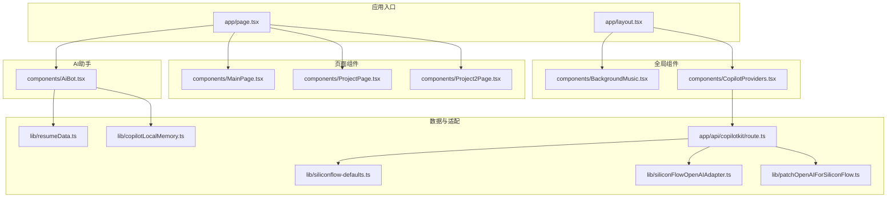
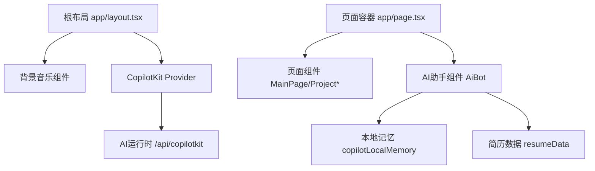
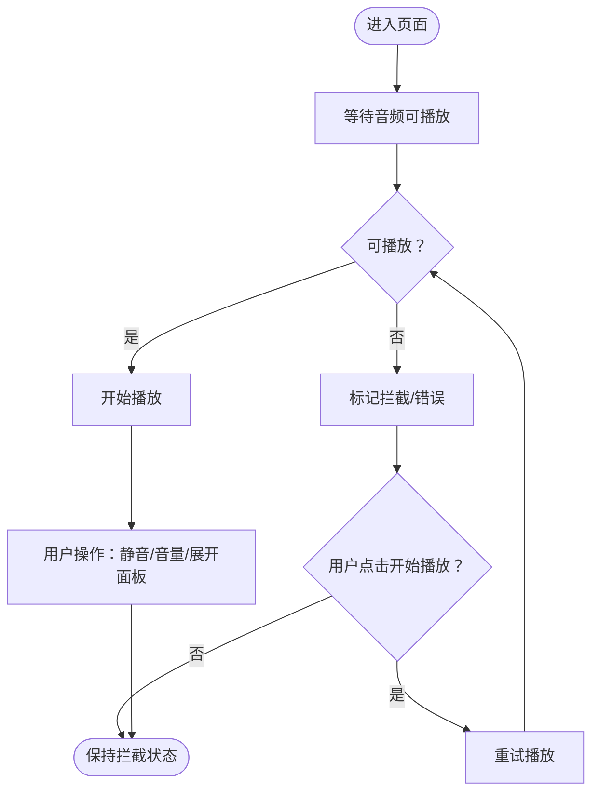
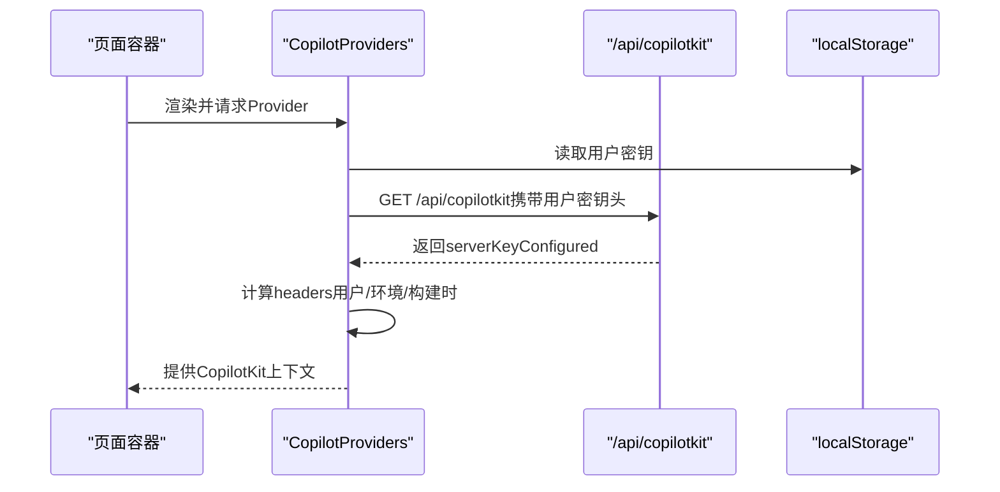
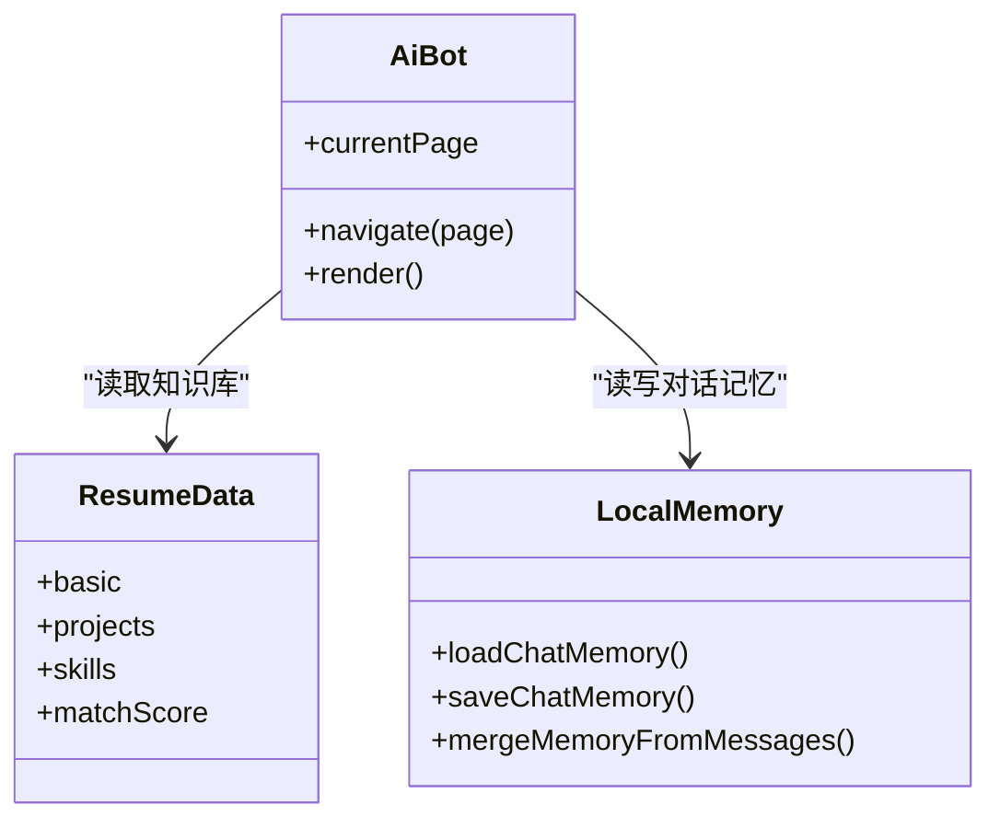
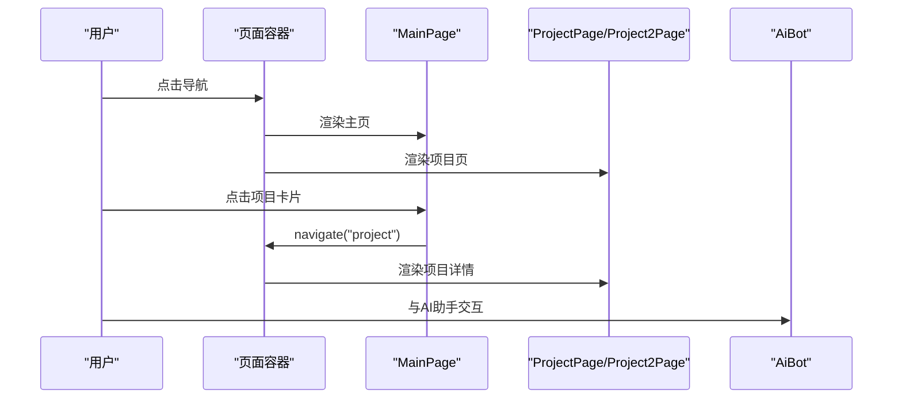
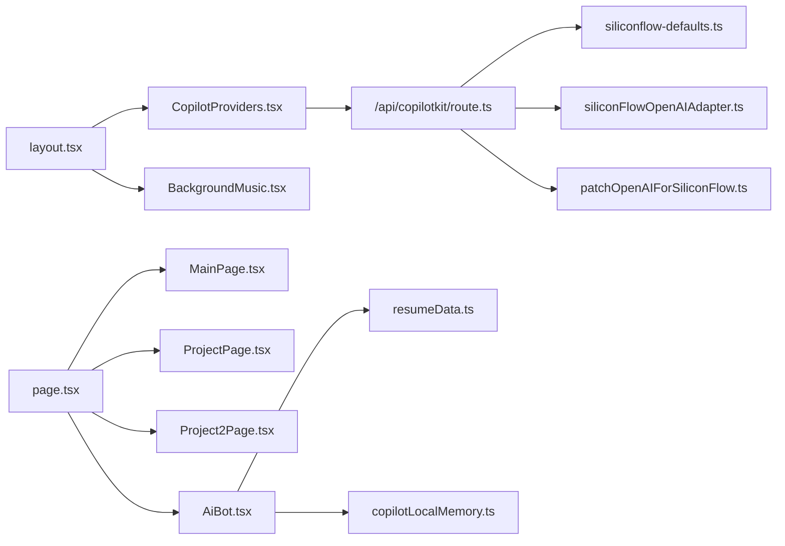

# 组件化架构设计

<cite>
**本文档引用的文件**
- [app/layout.tsx](file://app/layout.tsx)
- [app/page.tsx](file://app/page.tsx)
- [components/CopilotProviders.tsx](file://components/CopilotProviders.tsx)
- [components/AiBot.tsx](file://components/AiBot.tsx)
- [components/MainPage.tsx](file://components/MainPage.tsx)
- [components/ProjectPage.tsx](file://components/ProjectPage.tsx)
- [components/Project2Page.tsx](file://components/Project2Page.tsx)
- [components/BackgroundMusic.tsx](file://components/BackgroundMusic.tsx)
- [lib/resumeData.ts](file://lib/resumeData.ts)
- [lib/copilotLocalMemory.ts](file://lib/copilotLocalMemory.ts)
- [app/api/copilotkit/route.ts](file://app/api/copilotkit/route.ts)
- [lib/siliconflow-defaults.ts](file://lib/siliconflow-defaults.ts)
- [lib/siliconFlowOpenAIAdapter.ts](file://lib/siliconFlowOpenAIAdapter.ts)
- [lib/patchOpenAIForSiliconFlow.ts](file://lib/patchOpenAIForSiliconFlow.ts)
- [package.json](file://package.json)
</cite>

## 目录
1. [引言](#引言)
2. [项目结构](#项目结构)
3. [核心组件](#核心组件)
4. [架构总览](#架构总览)
5. [详细组件分析](#详细组件分析)
6. [依赖分析](#依赖分析)
7. [性能考虑](#性能考虑)
8. [故障排除指南](#故障排除指南)
9. [结论](#结论)
10. [附录](#附录)

## 引言
本项目采用基于 React 18 的组件化架构，围绕“个人AI助手”主题，构建了主页、项目详情页与AI助手对话界面的统一体验。系统通过根布局注入全局状态与背景音乐，使用 CopilotKit Provider 封装AI能力，页面组件通过状态管理实现导航与交互，AI助手组件承载赛博朋克风格的对话界面与交互逻辑。

## 项目结构
- app：Next.js 应用入口与页面组织
  - app/layout.tsx：根布局，注入背景音乐与 CopilotKit Provider
  - app/page.tsx：主页容器，负责页面切换与共享状态
- components：可复用UI与业务组件
  - BackgroundMusic：全局背景音乐控制
  - CopilotProviders：AI能力Provider封装与密钥管理
  - AiBot：AI助手对话组件（含赛博朋克主题与交互）
  - MainPage、ProjectPage、Project2Page：页面级组件
- lib：数据与工具
  - resumeData：简历与AI知识库数据
  - copilotLocalMemory：本地对话记忆持久化
  - siliconflow-defaults、siliconFlowOpenAIAdapter、patchOpenAIForSiliconFlow：AI服务集成适配
  - app/api/copilotkit/route.ts：AI服务后端路由
- 其他：Next/TypeScript配置与依赖声明

图表来源
- [app/layout.tsx:1-48](file://app/layout.tsx#L1-L48)
- [app/page.tsx:1-30](file://app/page.tsx#L1-L30)
- [components/BackgroundMusic.tsx:1-346](file://components/BackgroundMusic.tsx#L1-L346)
- [components/CopilotProviders.tsx:1-157](file://components/CopilotProviders.tsx#L1-L157)
- [components/AiBot.tsx:1-800](file://components/AiBot.tsx#L1-L800)
- [components/MainPage.tsx:1-691](file://components/MainPage.tsx#L1-L691)
- [components/ProjectPage.tsx:1-275](file://components/ProjectPage.tsx#L1-L275)
- [components/Project2Page.tsx:1-247](file://components/Project2Page.tsx#L1-L247)
- [lib/resumeData.ts:1-263](file://lib/resumeData.ts#L1-L263)
- [lib/copilotLocalMemory.ts:1-77](file://lib/copilotLocalMemory.ts#L1-L77)
- [app/api/copilotkit/route.ts:1-131](file://app/api/copilotkit/route.ts#L1-L131)
- [lib/siliconflow-defaults.ts:1-16](file://lib/siliconflow-defaults.ts#L1-L16)
- [lib/siliconFlowOpenAIAdapter.ts:1-36](file://lib/siliconFlowOpenAIAdapter.ts#L1-L36)
- [lib/patchOpenAIForSiliconFlow.ts:1-22](file://lib/patchOpenAIForSiliconFlow.ts#L1-L22)

章节来源
- [app/layout.tsx:1-48](file://app/layout.tsx#L1-L48)
- [app/page.tsx:1-30](file://app/page.tsx#L1-L30)

## 核心组件
- 根布局与全局注入
  - app/layout.tsx：预加载背景音乐资源，注入背景音乐组件与 CopilotKit Provider，确保全局可用
- 页面容器与导航
  - app/page.tsx：集中管理页面状态与导航，支持主页、项目页与AI助手的可见性
- 全局背景音乐
  - components/BackgroundMusic.tsx：自动播放、静音控制、音量调节、外链支持与错误提示
- AI能力Provider
  - components/CopilotProviders.tsx：封装CopilotKit，管理用户API Key、服务端Key状态、fetch补丁与请求头
- 页面组件
  - MainPage：主页内容与交互
  - ProjectPage、Project2Page：项目详情页（STAR法则）
- AI助手
  - components/AiBot.tsx：赛博朋克主题对话界面、快捷问题、结构化卡片、函数调用状态、欢迎语与记忆注入

章节来源
- [app/layout.tsx:19-47](file://app/layout.tsx#L19-L47)
- [app/page.tsx:11-29](file://app/page.tsx#L11-L29)
- [components/BackgroundMusic.tsx:36-307](file://components/BackgroundMusic.tsx#L36-L307)
- [components/CopilotProviders.tsx:49-156](file://components/CopilotProviders.tsx#L49-L156)
- [components/MainPage.tsx:127-691](file://components/MainPage.tsx#L127-L691)
- [components/ProjectPage.tsx:12-86](file://components/ProjectPage.tsx#L12-L86)
- [components/Project2Page.tsx:13-70](file://components/Project2Page.tsx#L13-L70)
- [components/AiBot.tsx:28-800](file://components/AiBot.tsx#L28-L800)

## 架构总览
系统采用“根布局注入 + Provider封装 + 页面容器 + 组件分层”的架构：
- 根布局负责全局资源与Provider注入
- Provider负责AI服务配置与密钥管理
- 页面容器负责状态与导航
- 页面与助手组件负责具体业务与交互

图表来源
- [app/layout.tsx:19-47](file://app/layout.tsx#L19-L47)
- [components/CopilotProviders.tsx:144-156](file://components/CopilotProviders.tsx#L144-L156)
- [app/api/copilotkit/route.ts:86-95](file://app/api/copilotkit/route.ts#L86-L95)
- [app/page.tsx:11-29](file://app/page.tsx#L11-L29)
- [lib/copilotLocalMemory.ts:21-77](file://lib/copilotLocalMemory.ts#L21-L77)
- [lib/resumeData.ts:5-263](file://lib/resumeData.ts#L5-L263)

## 详细组件分析

### 根布局与全局注入
- 职责分离
  - 资源注入：预加载音频资源，设置字体与样式
  - 全局组件：背景音乐始终可见，CopilotKit Provider包裹子树
- 复用策略
  - 通过Provider集中管理AI能力，避免各页面重复配置
  - 背景音乐组件独立封装，便于扩展与替换

章节来源
- [app/layout.tsx:13-47](file://app/layout.tsx#L13-L47)

### 页面容器与导航
- 状态管理
  - 使用useState维护当前页面，提供导航函数
  - 导航时平滑滚动至顶部
- 组件通信
  - 通过props向下传递navigate与currentPage，实现页面间跳转与状态共享

章节来源
- [app/page.tsx:11-29](file://app/page.tsx#L11-L29)

### 背景音乐组件
- 设计要点
  - 自动播放与缓冲等待、静音/取消静音、音量调节
  - 外链与同源资源支持、错误提示与引导
- 交互逻辑
  - 点击喇叭展开控制面板，点击外部区域收起
  - 首次加载延迟播放，避免浏览器拦截

图表来源
- [components/BackgroundMusic.tsx:57-122](file://components/BackgroundMusic.tsx#L57-L122)
- [components/BackgroundMusic.tsx:101-122](file://components/BackgroundMusic.tsx#L101-L122)

章节来源
- [components/BackgroundMusic.tsx:36-307](file://components/BackgroundMusic.tsx#L36-L307)

### CopilotKit Provider 与密钥管理
- 职责分离
  - 用户密钥：浏览器localStorage存储，支持清空
  - 服务端密钥：GET /api/copilotkit返回配置状态
  - 请求头：优先用户密钥，其次环境变量，最后构建时注入
- 错误处理
  - fetch补丁：对特定路径响应进行JSON修复，避免SyntaxError
  - 健康检查：返回服务端配置状态，便于前端判断

图表来源
- [components/CopilotProviders.tsx:54-113](file://components/CopilotProviders.tsx#L54-L113)
- [components/CopilotProviders.tsx:115-133](file://components/CopilotProviders.tsx#L115-L133)
- [app/api/copilotkit/route.ts:120-131](file://app/api/copilotkit/route.ts#L120-L131)

章节来源
- [components/CopilotProviders.tsx:49-156](file://components/CopilotProviders.tsx#L49-L156)
- [app/api/copilotkit/route.ts:30-43](file://app/api/copilotkit/route.ts#L30-L43)

### AI助手组件（赛博朋克主题）
- 设计原则
  - 赛博朋克风格：青色/紫色主色调、发光与渐变、网格与卡片化信息
  - 结构化卡片：项目亮点、技能图谱、岗位匹配度、联系方式
  - 快捷问题与欢迎语：引导式交互，首次展示一次性引导
- 交互逻辑
  - 快捷条：点击触发预设问题
  - 函数调用状态：显示执行中状态条
  - 导航：卡片内按钮跳转至主页或项目页
  - 记忆注入：本地持久化聊天记忆，注入模型上下文

图表来源
- [components/AiBot.tsx:28-800](file://components/AiBot.tsx#L28-L800)
- [lib/resumeData.ts:5-263](file://lib/resumeData.ts#L5-L263)
- [lib/copilotLocalMemory.ts:21-77](file://lib/copilotLocalMemory.ts#L21-L77)

章节来源
- [components/AiBot.tsx:28-800](file://components/AiBot.tsx#L28-L800)
- [lib/resumeData.ts:5-263](file://lib/resumeData.ts#L5-L263)
- [lib/copilotLocalMemory.ts:21-77](file://lib/copilotLocalMemory.ts#L21-L77)

### 页面组件组织（主页与项目详情）
- 主页 MainPage
  - 职责：展示个人简介、技能雷达、岗位匹配度、JD理解、用户视角与产品观点
  - 交互：点击卡片跳转项目页，悬浮效果与动画
- 项目详情 ProjectPage / Project2Page
  - 职责：STAR法则拆解（背景、任务、行动、结果）
  - 交互：标签页切换，返回主页

图表来源
- [app/page.tsx:11-29](file://app/page.tsx#L11-L29)
- [components/MainPage.tsx:127-691](file://components/MainPage.tsx#L127-L691)
- [components/ProjectPage.tsx:12-86](file://components/ProjectPage.tsx#L12-L86)
- [components/Project2Page.tsx:13-70](file://components/Project2Page.tsx#L13-L70)

章节来源
- [components/MainPage.tsx:127-691](file://components/MainPage.tsx#L127-L691)
- [components/ProjectPage.tsx:12-86](file://components/ProjectPage.tsx#L12-L86)
- [components/Project2Page.tsx:13-70](file://components/Project2Page.tsx#L13-L70)

## 依赖分析
- 组件耦合
  - AiBot依赖resumeData与copilotLocalMemory，耦合于知识库与记忆
  - CopilotProviders与API路由耦合于SiliconFlow服务
- 外部依赖
  - @copilotkit/*：React核心/UI/运行时与客户端
  - next：Next.js应用框架
  - react/react-dom：React 18

图表来源
- [components/AiBot.tsx:12-21](file://components/AiBot.tsx#L12-L21)
- [lib/resumeData.ts:1-263](file://lib/resumeData.ts#L1-L263)
- [lib/copilotLocalMemory.ts:1-77](file://lib/copilotLocalMemory.ts#L1-L77)
- [components/CopilotProviders.tsx:13-133](file://components/CopilotProviders.tsx#L13-L133)
- [app/api/copilotkit/route.ts:16-95](file://app/api/copilotkit/route.ts#L16-L95)
- [lib/siliconflow-defaults.ts:9-16](file://lib/siliconflow-defaults.ts#L9-L16)
- [lib/siliconFlowOpenAIAdapter.ts:17-35](file://lib/siliconFlowOpenAIAdapter.ts#L17-L35)
- [lib/patchOpenAIForSiliconFlow.ts:12-22](file://lib/patchOpenAIForSiliconFlow.ts#L12-L22)
- [app/layout.tsx:3-6](file://app/layout.tsx#L3-L6)
- [app/page.tsx:3-7](file://app/page.tsx#L3-L7)

章节来源
- [package.json:12-28](file://package.json#L12-L28)

## 性能考虑
- 资源加载
  - 背景音乐预加载与ready状态等待，减少首播卡顿
  - 仅MP3单源，避免多格式请求与解码开销
- 组件渲染
  - 页面容器集中管理状态，减少重复渲染
  - Provider缓存AI运行时处理器，降低初始化成本
- 交互体验
  - 滚动平滑与轻量动画，避免阻塞主线程
  - 控制面板折叠/展开，减少DOM层级

## 故障排除指南
- 背景音乐无法播放
  - 检查音频资源是否存在与跨域设置
  - 确认浏览器自动播放策略与用户手势
- AI助手无法对话
  - 检查 /api/copilotkit 健康检查返回的serverKeyConfigured
  - 确认SiliconFlow密钥来源（用户头/环境变量/构建时）
  - 查看fetch补丁是否生效，避免空响应导致的SyntaxError
- 本地记忆异常
  - 检查localStorage可用性与容量
  - 确认内存合并逻辑与截断策略

章节来源
- [components/BackgroundMusic.tsx:111-122](file://components/BackgroundMusic.tsx#L111-L122)
- [app/api/copilotkit/route.ts:120-131](file://app/api/copilotkit/route.ts#L120-L131)
- [components/CopilotProviders.tsx:64-87](file://components/CopilotProviders.tsx#L64-L87)
- [lib/copilotLocalMemory.ts:21-47](file://lib/copilotLocalMemory.ts#L21-L47)

## 结论
本项目通过根布局注入、Provider封装与页面容器，实现了清晰的职责分离与良好的复用性。AI助手组件在赛博朋克主题下提供了结构化信息与流畅交互，配合本地记忆与简历数据，形成了可扩展的AI对话体验。建议在后续迭代中进一步抽象Provider配置、增强错误边界与性能监控，以提升可维护性与稳定性。

## 附录
- 扩展建议
  - 将Provider配置抽取为可注入的Hook，便于测试与替换
  - 增加对话历史持久化与跨会话记忆同步
  - 引入主题切换与无障碍访问增强