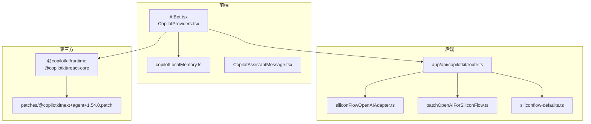
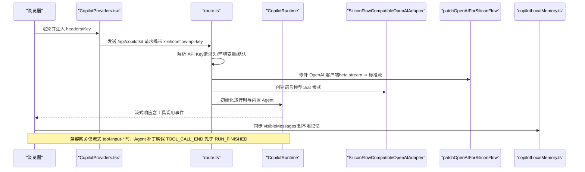
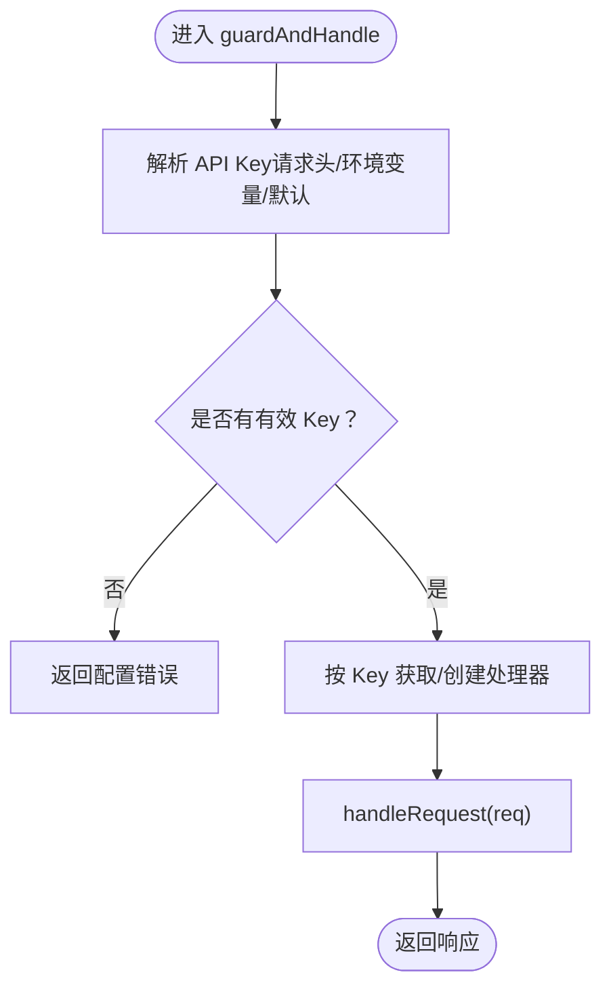
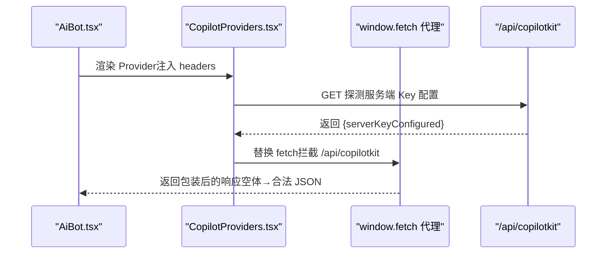
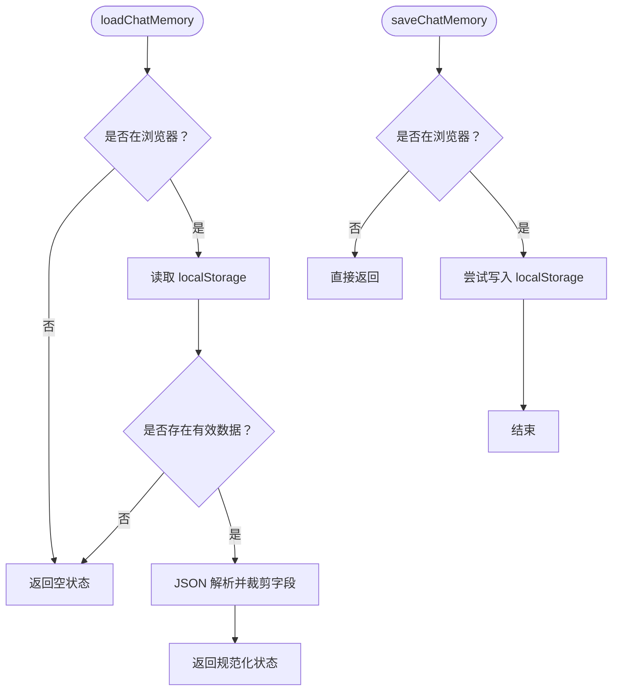
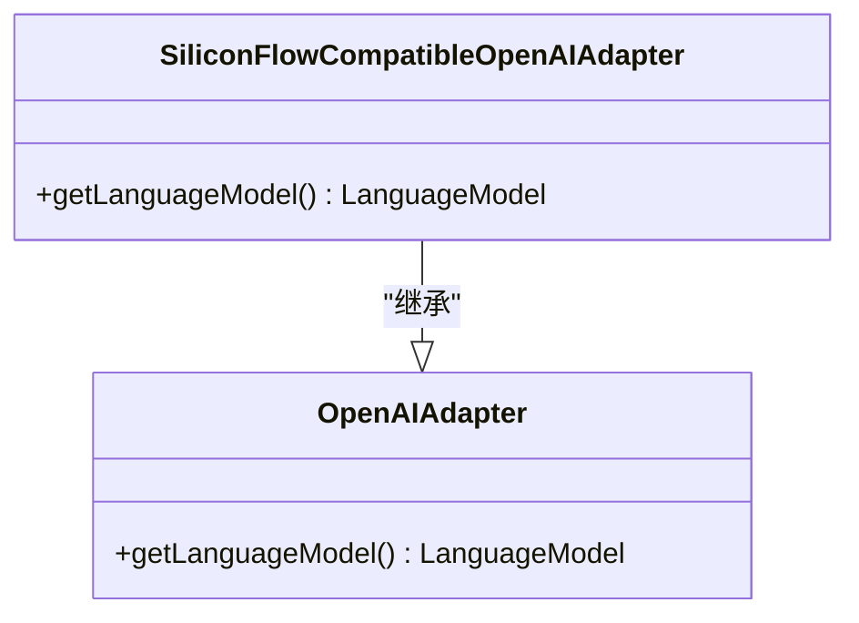
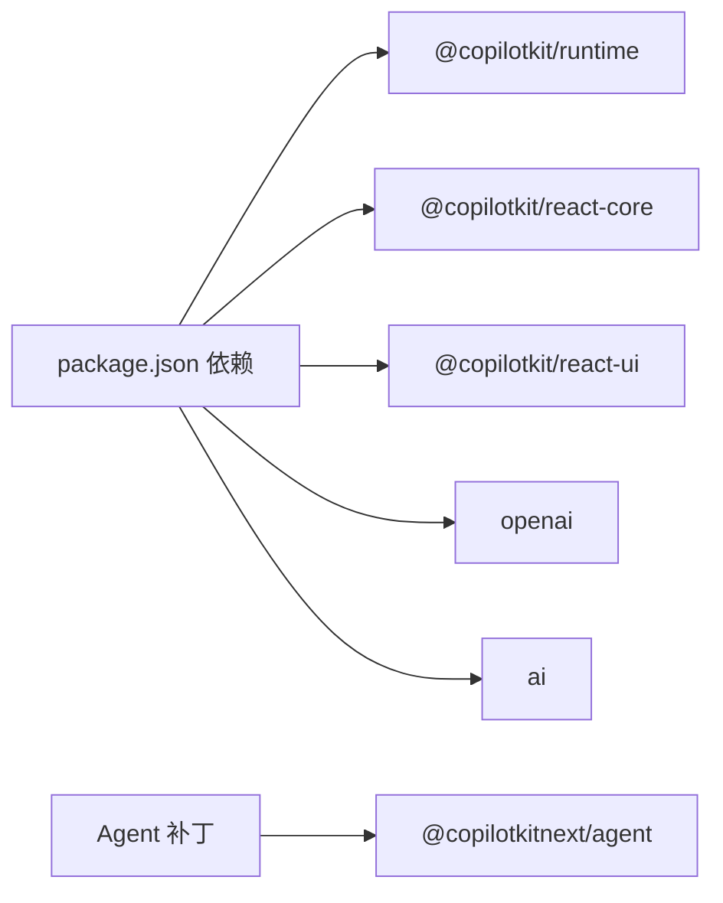
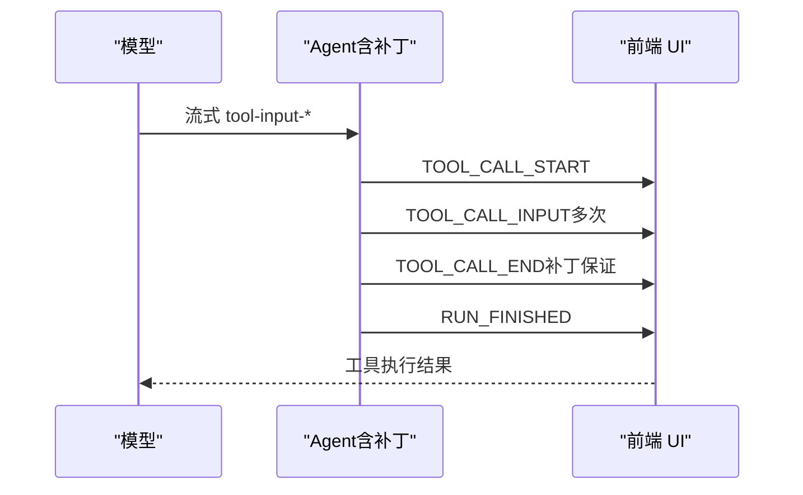

# AI 助手问题排查

<cite>
**本文引用的文件**
- [route.ts](file://app/api/copilotkit/route.ts)
- [CopilotProviders.tsx](file://components/CopilotProviders.tsx)
- [AiBot.tsx](file://components/AiBot.tsx)
- [copilotLocalMemory.ts](file://lib/copilotLocalMemory.ts)
- [siliconFlowOpenAIAdapter.ts](file://lib/siliconFlowOpenAIAdapter.ts)
- [patchOpenAIForSiliconFlow.ts](file://lib/patchOpenAIForSiliconFlow.ts)
- [siliconflow-defaults.ts](file://lib/siliconflow-defaults.ts)
- [package.json](file://package.json)
- [@copilotkitnext+agent+1.54.0.patch](file://patches/@copilotkitnext+agent+1.54.0.patch)
- [CopilotAssistantMessage.tsx](file://components/CopilotAssistantMessage.tsx)
</cite>

## 目录
1. [简介](#简介)
2. [项目结构](#项目结构)
3. [核心组件](#核心组件)
4. [架构总览](#架构总览)
5. [详细组件分析](#详细组件分析)
6. [依赖分析](#依赖分析)
7. [性能考虑](#性能考虑)
8. [故障排除指南](#故障排除指南)
9. [结论](#结论)
10. [附录](#附录)

## 简介
本指南聚焦于 AI 助手系统的故障排除，围绕以下关键领域提供系统化诊断与修复方法：
- CopilotKit 集成问题：API Key 配置错误、网络连接超时、认证失败
- Function Calling 功能异常：函数定义错误、参数传递问题、返回值格式不匹配
- 本地记忆系统故障：聊天历史丢失、记忆同步失败、存储空间不足
- 错误日志分析与调试工具使用技巧
- 常见问题的快速修复方案

## 项目结构
该系统采用 Next.js App Router，前端通过 CopilotKit 提供对话与 Function Calling 能力，后端通过 /api/copilotkit 路由对接 SiliconFlow/OpenAI 兼容网关。本地记忆通过 localStorage 持久化。

**图表来源**
- [route.ts:1-131](file://app/api/copilotkit/route.ts#L1-L131)
- [CopilotProviders.tsx:1-157](file://components/CopilotProviders.tsx#L1-L157)
- [AiBot.tsx:1-1937](file://components/AiBot.tsx#L1-L1937)
- [copilotLocalMemory.ts:1-77](file://lib/copilotLocalMemory.ts#L1-L77)
- [siliconFlowOpenAIAdapter.ts:1-36](file://lib/siliconFlowOpenAIAdapter.ts#L1-L36)
- [patchOpenAIForSiliconFlow.ts:1-22](file://lib/patchOpenAIForSiliconFlow.ts#L1-L22)
- [siliconflow-defaults.ts:1-16](file://lib/siliconflow-defaults.ts#L1-L16)
- [package.json:1-29](file://package.json#L1-L29)
- [@copilotkitnext+agent+1.54.0.patch:1-125](file://patches/@copilotkitnext+agent+1.54.0.patch#L1-L125)

**章节来源**
- [route.ts:1-131](file://app/api/copilotkit/route.ts#L1-L131)
- [CopilotProviders.tsx:1-157](file://components/CopilotProviders.tsx#L1-L157)
- [AiBot.tsx:1-1937](file://components/AiBot.tsx#L1-L1937)
- [copilotLocalMemory.ts:1-77](file://lib/copilotLocalMemory.ts#L1-L77)
- [siliconFlowOpenAIAdapter.ts:1-36](file://lib/siliconFlowOpenAIAdapter.ts#L1-L36)
- [patchOpenAIForSiliconFlow.ts:1-22](file://lib/patchOpenAIForSiliconFlow.ts#L1-L22)
- [siliconflow-defaults.ts:1-16](file://lib/siliconflow-defaults.ts#L1-L16)
- [package.json:1-29](file://package.json#L1-L29)

## 核心组件
- 后端路由与运行时
  - /api/copilotkit/route.ts：负责 API Key 解析、运行时缓存、适配器与 CopilotKit 运行时初始化、健康检查与跨域预检响应。
- 前端提供者与上下文
  - CopilotProviders.tsx：管理用户自定义 API Key、服务端 Key 配置状态、fetch 代理与 CopilotKit Provider 初始化。
- 本地记忆
  - copilotLocalMemory.ts：封装 localStorage 存取、消息片段截取、近期与长期记忆合并、容量限制与异常兜底。
- 适配器与补丁
  - siliconFlowOpenAIAdapter.ts：将 OpenAI 适配器切换到 chat 模式以适配兼容网关。
  - patchOpenAIForSiliconFlow.ts：将 beta.stream 代理到标准流式接口，解决网关不支持 beta 路径的问题。
  - patches/@copilotkitnext+agent+1.54.0.patch：在兼容网关仅流式 tool-input-* 的情况下，确保 TOOL_CALL_END 在 RUN_FINISHED 前发出，避免“仍有活动的工具调用”错误。
- 辅助常量
  - siliconflow-defaults.ts：定义请求头、默认 Key、用户 Key 存储键等。

**章节来源**
- [route.ts:1-131](file://app/api/copilotkit/route.ts#L1-L131)
- [CopilotProviders.tsx:1-157](file://components/CopilotProviders.tsx#L1-L157)
- [copilotLocalMemory.ts:1-77](file://lib/copilotLocalMemory.ts#L1-L77)
- [siliconFlowOpenAIAdapter.ts:1-36](file://lib/siliconFlowOpenAIAdapter.ts#L1-L36)
- [patchOpenAIForSiliconFlow.ts:1-22](file://lib/patchOpenAIForSiliconFlow.ts#L1-L22)
- [siliconflow-defaults.ts:1-16](file://lib/siliconflow-defaults.ts#L1-L16)
- [@copilotkitnext+agent+1.54.0.patch:1-125](file://patches/@copilotkitnext+agent+1.54.0.patch#L1-L125)

## 架构总览
下图展示了从浏览器到后端运行时的关键交互路径，以及本地记忆与 Function Calling 的集成位置。

**图表来源**
- [route.ts:1-131](file://app/api/copilotkit/route.ts#L1-L131)
- [CopilotProviders.tsx:1-157](file://components/CopilotProviders.tsx#L1-L157)
- [siliconFlowOpenAIAdapter.ts:1-36](file://lib/siliconFlowOpenAIAdapter.ts#L1-L36)
- [patchOpenAIForSiliconFlow.ts:1-22](file://lib/patchOpenAIForSiliconFlow.ts#L1-L22)
- [copilotLocalMemory.ts:1-77](file://lib/copilotLocalMemory.ts#L1-L77)
- [@copilotkitnext+agent+1.54.0.patch:1-125](file://patches/@copilotkitnext+agent+1.54.0.patch#L1-L125)

## 详细组件分析

### 后端路由与运行时（route.ts）
- 关键职责
  - API Key 解析优先级：请求头 > 环境变量 > 代码默认
  - 运行时缓存：按 API Key 缓存 Hono 处理器，避免重复初始化
  - 适配器与并行工具调用：禁用并行工具调用，确保兼容网关正确收尾
  - 健康检查：暴露基础 URL、模型、服务端 Key 配置状态与提示
- 故障点
  - 未配置有效 Key：返回配置错误
  - 网关不支持 beta 路径：需依赖补丁将流式代理到标准路径
  - 兼容网关仅流式 tool-input-*：需依赖 Agent 补丁补齐 TOOL_CALL_END

**图表来源**
- [route.ts:100-114](file://app/api/copilotkit/route.ts#L100-L114)

**章节来源**
- [route.ts:1-131](file://app/api/copilotkit/route.ts#L1-L131)

### 前端提供者与上下文（CopilotProviders.tsx）
- 关键职责
  - 用户 Key 管理：localStorage 存取、覆盖请求头、可选公共 Key 注入
  - 服务端 Key 配置探测：GET /api/copilotkit 健康检查
  - fetch 代理：针对空响应体进行 JSON 包装，避免解析异常
  - CopilotKit Provider 初始化：runtimeUrl、headers、开发控制台开关
- 故障点
  - localStorage 不可用：Key 存取与 fetch 代理异常
  - 空响应体：需依赖 fetch 代理兜底
  - 开发控制台弹窗：在语法错误时可能弹出异常横幅

**图表来源**
- [CopilotProviders.tsx:54-113](file://components/CopilotProviders.tsx#L54-L113)
- [CopilotProviders.tsx:66-87](file://components/CopilotProviders.tsx#L66-L87)

**章节来源**
- [CopilotProviders.tsx:1-157](file://components/CopilotProviders.tsx#L1-L157)

### 本地记忆系统（copilotLocalMemory.ts）
- 关键职责
  - 数据结构：recent（最近 3 条摘要）、longTerm（滚动摘要，上限）、updatedAt
  - 截取与合并：文本裁剪、按最近助手消息追加长期摘要
  - 持久化：localStorage 存取，异常时静默忽略
- 故障点
  - localStorage 空间不足或私密模式：写入失败
  - 解析异常：JSON 解析失败时回退为空状态
  - 长期摘要溢出：超出上限时截断

**图表来源**
- [copilotLocalMemory.ts:21-47](file://lib/copilotLocalMemory.ts#L21-L47)

**章节来源**
- [copilotLocalMemory.ts:1-77](file://lib/copilotLocalMemory.ts#L1-L77)

### 适配器与补丁（siliconFlowOpenAIAdapter.ts、patchOpenAIForSiliconFlow.ts）
- 关键职责
  - 适配器：将 OpenAI 适配器切换到 chat 模式，避免 404
  - 补丁：将 beta.stream 代理到标准流式接口
  - Agent 补丁：在兼容网关仅流式 tool-input-* 时，补齐 TOOL_CALL_END
- 故障点
  - 网关不支持 /v1/chat/completions：需使用 chat 模式
  - 网关不支持 /v1/beta/chat/completions：需补丁代理
  - 兼容网关事件顺序不一致：需 Agent 补丁保障事件完整性

**图表来源**
- [siliconFlowOpenAIAdapter.ts:17-35](file://lib/siliconFlowOpenAIAdapter.ts#L17-L35)

**章节来源**
- [siliconFlowOpenAIAdapter.ts:1-36](file://lib/siliconFlowOpenAIAdapter.ts#L1-L36)
- [patchOpenAIForSiliconFlow.ts:1-22](file://lib/patchOpenAIForSiliconFlow.ts#L1-L22)
- [@copilotkitnext+agent+1.54.0.patch:1-125](file://patches/@copilotkitnext+agent+1.54.0.patch#L1-L125)

### Function Calling 与消息渲染（AiBot.tsx、CopilotAssistantMessage.tsx）
- 关键职责
  - AiBot.tsx：注册可调用函数、监听 visibleMessages、同步本地记忆、渲染结构化卡片
  - CopilotAssistantMessage.tsx：处理连续助手消息、复制行为、空回复提示
- 故障点
  - 函数未被调用：检查函数注册与调用时机
  - 参数不匹配：核对参数类型与枚举值
  - 返回值格式不匹配：确保返回字符串或预期结构
  - 连续助手消息导致操作栏重复：依赖渲染逻辑仅在最后一条显示

**章节来源**
- [AiBot.tsx:1038-1139](file://components/AiBot.tsx#L1038-L1139)
- [AiBot.tsx:1530-1729](file://components/AiBot.tsx#L1530-L1729)
- [CopilotAssistantMessage.tsx:1-196](file://components/CopilotAssistantMessage.tsx#L1-L196)

## 依赖分析
- 第三方依赖
  - @copilotkit/*：运行时、React 核心与 UI
  - ai、openai：语言模型与流式补丁
- 本地补丁
  - @copilotkitnext/agent：Agent 行为修正，确保工具调用事件顺序正确

**图表来源**
- [package.json:12-20](file://package.json#L12-L20)
- [@copilotkitnext+agent+1.54.0.patch:1-125](file://patches/@copilotkitnext+agent+1.54.0.patch#L1-L125)

**章节来源**
- [package.json:1-29](file://package.json#L1-L29)
- [@copilotkitnext+agent+1.54.0.patch:1-125](file://patches/@copilotkitnext+agent+1.54.0.patch#L1-L125)

## 性能考虑
- 运行时缓存：按 API Key 缓存处理器，减少重复初始化开销
- 并行工具调用：显式禁用并行工具调用，避免兼容网关压力与事件错序
- 本地记忆写入：仅在可见消息变化时触发，避免频繁写入
- 流式响应：使用标准流式接口，减少中间层转换

[本节为通用指导，无需特定文件来源]

## 故障排除指南

### 一、CopilotKit 集成问题

#### 1. API Key 配置错误
- 现象
  - 后端返回配置错误或 401/403
  - 健康检查返回 serverKeyConfigured=false
- 诊断步骤
  - 检查请求头是否包含 x-siliconflow-api-key
  - 检查环境变量 SILICONFLOW_API_KEY 是否设置
  - 检查代码默认 Key 是否被覆盖
- 修复方案
  - 在前端「API」面板保存 Key（localStorage），或在服务端设置环境变量
  - 确保 SILICONFLOW_BASE_URL 与 SILICONFLOW_MODEL 正确
  - 如需公共 Key，可在构建时注入 NEXT_PUBLIC_SILICONFLOW_API_KEY

**章节来源**
- [route.ts:30-43](file://app/api/copilotkit/route.ts#L30-L43)
- [route.ts:120-130](file://app/api/copilotkit/route.ts#L120-L130)
- [CopilotProviders.tsx:115-133](file://components/CopilotProviders.tsx#L115-L133)
- [siliconflow-defaults.ts:1-16](file://lib/siliconflow-defaults.ts#L1-L16)

#### 2. 网络连接超时
- 现象
  - 前端 fetch 超时或响应缓慢
  - 兼容网关不稳定
- 诊断步骤
  - 使用浏览器开发者工具 Network 面板观察 /api/copilotkit 请求
  - 检查上游网关可用性与限流策略
- 修复方案
  - 优化上游网关配置或切换到稳定节点
  - 前端增加重试与超时控制（在现有 fetch 代理基础上扩展）

**章节来源**
- [CopilotProviders.tsx:66-87](file://components/CopilotProviders.tsx#L66-L87)

#### 3. 认证失败（401/403）
- 现象
  - 响应 401/403，提示无效 Key
- 诊断步骤
  - 确认 Key 是否过期或权限不足
  - 检查请求头是否正确传递
- 修复方案
  - 更新 Key 或调整权限
  - 清除浏览器 localStorage 中的用户 Key，改用服务端环境变量

**章节来源**
- [route.ts:100-114](file://app/api/copilotkit/route.ts#L100-L114)
- [CopilotProviders.tsx:115-133](file://components/CopilotProviders.tsx#L115-L133)

### 二、Function Calling 功能异常

#### 1. 函数定义错误
- 现象
  - 调用函数时报未注册或签名不匹配
- 诊断步骤
  - 检查 AiBot.tsx 中 useCopilotAction 的 name、description、parameters 是否与调用方一致
  - 确认参数类型、必填项与枚举值
- 修复方案
  - 对齐函数定义与调用约定
  - 确保 handler 返回字符串或预期结构

**章节来源**
- [AiBot.tsx:1038-1139](file://components/AiBot.tsx#L1038-L1139)

#### 2. 参数传递问题
- 现象
  - 函数参数类型不匹配或缺失
- 诊断步骤
  - 查看 visibleMessages 中工具调用事件的参数结构
  - 对比 AiBot.tsx 中参数定义
- 修复方案
  - 修正参数类型与必填标记
  - 在前端调用时严格遵循参数规范

**章节来源**
- [AiBot.tsx:1038-1139](file://components/AiBot.tsx#L1038-L1139)

#### 3. 返回值格式不匹配
- 现象
  - 返回值不是字符串或不符合预期结构
- 诊断步骤
  - 检查 handler 返回值类型
  - 确认渲染函数（render）是否正确处理返回值
- 修复方案
  - 确保 handler 返回字符串
  - 在 render 中正确展示返回值或状态

**章节来源**
- [AiBot.tsx:1038-1139](file://components/AiBot.tsx#L1038-L1139)

#### 4. 工具调用事件顺序异常（RUN_FINISHED 早于 TOOL_CALL_END）
- 现象
  - 报错“仍有活动的工具调用”
- 诊断步骤
  - 检查兼容网关是否仅流式 tool-input-* 而不发送最终 tool-call
- 修复方案
  - 应用 Agent 补丁，在 finish/abort 时主动 flush 打开的工具调用

**章节来源**
- [@copilotkitnext+agent+1.54.0.patch:87-99](file://patches/@copilotkitnext+agent+1.54.0.patch#L87-L99)
- [route.ts:70-84](file://app/api/copilotkit/route.ts#L70-L84)

### 三、本地记忆系统故障

#### 1. 聊天历史丢失
- 现象
  - 刷新页面后记忆未恢复
- 诊断步骤
  - 检查 localStorage 是否可用
  - 检查 loadChatMemory 是否返回空状态
- 修复方案
  - 清理浏览器隐私数据或更换存储空间充足的浏览器
  - 确保前端在渲染前调用 loadChatMemory

**章节来源**
- [copilotLocalMemory.ts:21-38](file://lib/copilotLocalMemory.ts#L21-L38)

#### 2. 记忆同步失败
- 现象
  - visibleMessages 变化后未更新本地记忆
- 诊断步骤
  - 检查 AiBot.tsx 中监听 visibleMessages 的 effect
  - 检查 messageToSnippet 与 mergeMemoryFromMessages 的调用
- 修复方案
  - 确保 visibleMessages 有变化且非空
  - 检查 saveChatMemory 是否被调用

**章节来源**
- [AiBot.tsx:1011-1036](file://components/AiBot.tsx#L1011-L1036)
- [copilotLocalMemory.ts:49-76](file://lib/copilotLocalMemory.ts#L49-L76)

#### 3. 存储空间不足
- 现象
  - 保存失败或异常
- 诊断步骤
  - 检查浏览器存储配额与私密模式
- 修复方案
  - 清理不必要的 localStorage 数据
  - 降级为仅短期记忆或移除长期摘要

**章节来源**
- [copilotLocalMemory.ts:40-47](file://lib/copilotLocalMemory.ts#L40-L47)

### 四、错误日志分析与调试工具

#### 1. 健康检查与提示
- 使用 GET /api/copilotkit 获取服务端 Key 配置状态与模型信息
- 注意提示中的模型与流式兼容性说明

**章节来源**
- [route.ts:120-130](file://app/api/copilotkit/route.ts#L120-L130)

#### 2. fetch 代理与空响应兜底
- 当上游返回 Content-Length: 0 时，前端 fetch 代理会将其包装为合法 JSON，避免解析异常
- 如遇异常，检查代理是否生效

**章节来源**
- [CopilotProviders.tsx:66-87](file://components/CopilotProviders.tsx#L66-L87)

#### 3. 控制台与开发模式
- 为避免开发控制台弹窗干扰，Provider 中显式关闭 showDevConsole
- 如需调试，可临时开启并结合浏览器控制台查看错误

**章节来源**
- [CopilotProviders.tsx:146-149](file://components/CopilotProviders.tsx#L146-L149)

#### 4. Function Calling 状态条
- 当模型开始执行工具调用时，AiBot.tsx 会显示橙色状态条，便于用户感知
- 若长时间无响应，检查上游网关与参数

**章节来源**
- [AiBot.tsx:713-757](file://components/AiBot.tsx#L713-L757)

### 五、常见问题快速修复清单
- API Key
  - 在服务端设置 SILICONFLOW_API_KEY，或在前端「API」面板保存 Key
  - 确认请求头 x-siliconflow-api-key 是否正确传递
- 兼容网关
  - 确保使用 chat 模式与标准流式接口
  - 应用 Agent 补丁以补齐工具调用事件
- 本地记忆
  - 确保 localStorage 可用，必要时清理或降级
  - 检查 visibleMessages 同步逻辑

**章节来源**
- [route.ts:52-95](file://app/api/copilotkit/route.ts#L52-L95)
- [siliconFlowOpenAIAdapter.ts:22-34](file://lib/siliconFlowOpenAIAdapter.ts#L22-L34)
- [patchOpenAIForSiliconFlow.ts:12-21](file://lib/patchOpenAIForSiliconFlow.ts#L12-L21)
- [@copilotkitnext+agent+1.54.0.patch:87-99](file://patches/@copilotkitnext+agent+1.54.0.patch#L87-L99)
- [copilotLocalMemory.ts:21-47](file://lib/copilotLocalMemory.ts#L21-L47)

## 结论
本指南提供了从后端路由、前端提供者、本地记忆到 Function Calling 的全链路故障排除方法。通过优先级解析 API Key、启用适配器与补丁、正确处理工具调用事件顺序、以及合理管理本地存储，可显著提升系统稳定性与用户体验。遇到问题时，建议按“健康检查—网络—Key—事件顺序—存储”的顺序逐项排查，并结合提供的诊断步骤与修复方案快速定位与解决问题。

[本节为总结性内容，无需特定文件来源]

## 附录

### A. 关键流程图：Function Calling 事件顺序

**图表来源**
- [@copilotkitnext+agent+1.54.0.patch:87-99](file://patches/@copilotkitnext+agent+1.54.0.patch#L87-L99)