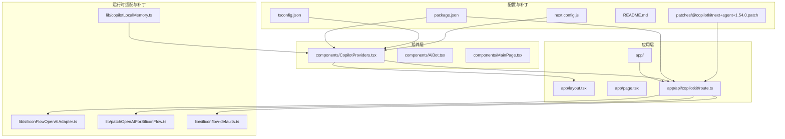
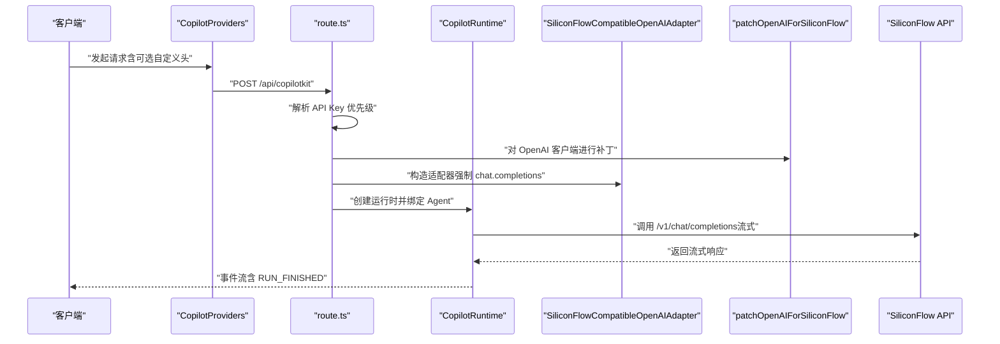
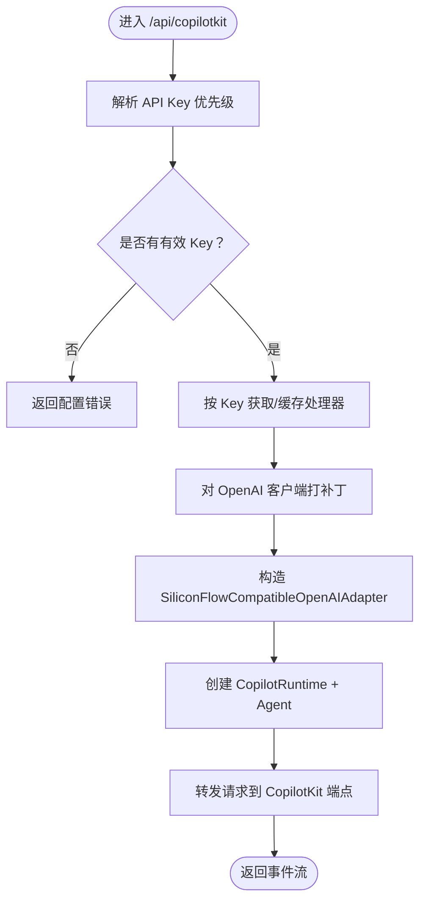
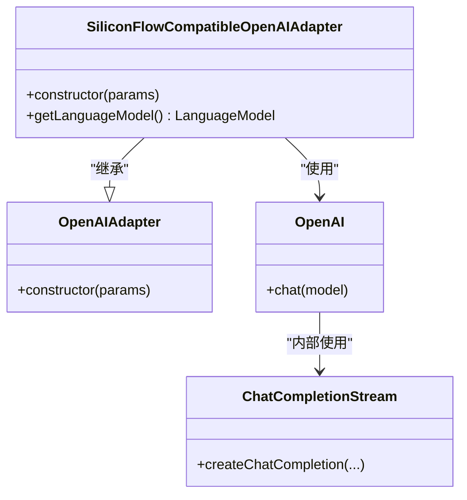
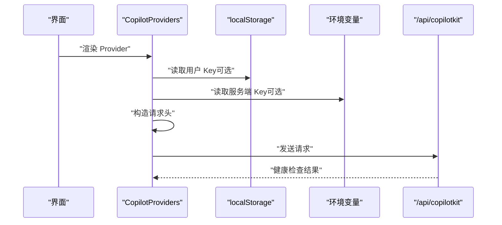

# 代码维护与更新

<cite>
**本文引用的文件列表**
- [package.json](file://package.json)
- [tsconfig.json](file://tsconfig.json)
- [next.config.js](file://next.config.js)
- [next-env.d.ts](file://next-env.d.ts)
- [README.md](file://README.md)
- [.gitignore](file://.gitignore)
- [patches/@copilotkitnext+agent+1.54.0.patch](file://patches/@copilotkitnext+agent+1.54.0.patch)
- [lib/siliconFlowOpenAIAdapter.ts](file://lib/siliconFlowOpenAIAdapter.ts)
- [lib/patchOpenAIForSiliconFlow.ts](file://lib/patchOpenAIForSiliconFlow.ts)
- [lib/copilotLocalMemory.ts](file://lib/copilotLocalMemory.ts)
- [lib/siliconflow-defaults.ts](file://lib/siliconflow-defaults.ts)
- [components/CopilotProviders.tsx](file://components/CopilotProviders.tsx)
- [app/api/copilotkit/route.ts](file://app/api/copilotkit/route.ts)
</cite>

## 目录
1. [引言](#引言)
2. [项目结构](#项目结构)
3. [核心组件](#核心组件)
4. [架构总览](#架构总览)
5. [详细组件分析](#详细组件分析)
6. [依赖更新策略](#依赖更新策略)
7. [补丁包管理最佳实践](#补丁包管理最佳实践)
8. [TypeScript 配置维护建议](#typescript-配置维护建议)
9. [代码重构与兼容性保障](#代码重构与兼容性保障)
10. [版本控制与发布流程](#版本控制与发布流程)
11. [性能考虑](#性能考虑)
12. [故障排查指南](#故障排查指南)
13. [结论](#结论)

## 引言
本指南面向维护与更新本项目的工程团队，聚焦以下目标：
- 依赖更新策略：安全更新、版本兼容性检查、破坏性变更迁移方法（尤其针对 CopilotKit 相关包）
- 补丁包管理：应用、验证与维护流程
- TypeScript 配置维护：类型定义更新、编译选项优化、代码质量检查
- 重构时机与向后兼容性：测试策略制定与回归保障
- 版本控制与发布流程：建立代码审查标准与发布规范

本项目基于 Next.js 14 与 CopilotKit，集成了硅基流动（SiliconFlow）大模型 API，并通过补丁与适配器解决兼容性问题。

## 项目结构
项目采用按功能模块划分的组织方式：
- app：Next.js App Router 路由层，包含全局布局与 API 路由
- components：UI 组件与 CopilotKit Provider
- lib：运行时适配器、补丁、本地记忆与默认配置
- patches：第三方依赖的补丁文件，用于修复兼容性问题
- 根目录配置：package.json、tsconfig.json、next.config.js、.gitignore、README.md

图表来源
- [package.json:1-29](file://package.json#L1-L29)
- [tsconfig.json:1-21](file://tsconfig.json#L1-L21)
- [next.config.js:1-4](file://next.config.js#L1-L4)
- [README.md:68-90](file://README.md#L68-L90)
- [patches/@copilotkitnext+agent+1.54.0.patch:1-125](file://patches/@copilotkitnext+agent+1.54.0.patch#L1-L125)
- [lib/siliconFlowOpenAIAdapter.ts:1-36](file://lib/siliconFlowOpenAIAdapter.ts#L1-L36)
- [lib/patchOpenAIForSiliconFlow.ts:1-22](file://lib/patchOpenAIForSiliconFlow.ts#L1-L22)
- [lib/copilotLocalMemory.ts:1-77](file://lib/copilotLocalMemory.ts#L1-L77)
- [lib/siliconflow-defaults.ts:1-16](file://lib/siliconflow-defaults.ts#L1-L16)
- [components/CopilotProviders.tsx:1-157](file://components/CopilotProviders.tsx#L1-L157)
- [app/api/copilotkit/route.ts:1-131](file://app/api/copilotkit/route.ts#L1-L131)

章节来源
- [README.md:68-90](file://README.md#L68-L90)
- [package.json:1-29](file://package.json#L1-L29)
- [tsconfig.json:1-21](file://tsconfig.json#L1-L21)
- [next.config.js:1-4](file://next.config.js#L1-L4)

## 核心组件
- CopilotKit 运行时与 API 路由：负责将前端请求转发至 CopilotKit 运行时，并通过适配器对接硅基流动 API
- 适配器与补丁：解决 @ai-sdk/openai 与 OpenAI SDK 的流式接口差异，确保与兼容网关的协议一致性
- Provider 与上下文：封装 API Key 解析、fetch 钩子与健康检查，保障运行稳定性
- 本地记忆：持久化对话上下文，提升用户体验与上下文连贯性

章节来源
- [app/api/copilotkit/route.ts:1-131](file://app/api/copilotkit/route.ts#L1-L131)
- [components/CopilotProviders.tsx:1-157](file://components/CopilotProviders.tsx#L1-L157)
- [lib/siliconFlowOpenAIAdapter.ts:1-36](file://lib/siliconFlowOpenAIAdapter.ts#L1-L36)
- [lib/patchOpenAIForSiliconFlow.ts:1-22](file://lib/patchOpenAIForSiliconFlow.ts#L1-L22)
- [lib/copilotLocalMemory.ts:1-77](file://lib/copilotLocalMemory.ts#L1-L77)

## 架构总览
系统从前端发起请求到服务端 API，经 CopilotKit 运行时与适配器处理，最终调用硅基流动 API。补丁与适配器确保与兼容网关的协议一致性，Provider 负责密钥解析与健康检查。

图表来源
- [components/CopilotProviders.tsx:49-157](file://components/CopilotProviders.tsx#L49-L157)
- [app/api/copilotkit/route.ts:27-95](file://app/api/copilotkit/route.ts#L27-L95)
- [lib/patchOpenAIForSiliconFlow.ts:12-22](file://lib/patchOpenAIForSiliconFlow.ts#L12-L22)
- [lib/siliconFlowOpenAIAdapter.ts:17-35](file://lib/siliconFlowOpenAIAdapter.ts#L17-L35)

## 详细组件分析

### CopilotKit 运行时与 API 路由
- 关键职责
  - 解析 API Key 优先级（请求头 > 环境变量 > 默认值）
  - 对 OpenAI 客户端进行补丁，将 beta.stream 代理到标准流式接口
  - 使用适配器强制走 chat.completions，适配兼容网关
  - 缓存按 Key 的处理器，降低重复初始化成本
  - 提供健康检查接口，反馈服务状态与提示
- 兼容性要点
  - 并行工具调用在不同路径下的行为差异，需在 providerOptions 显式禁用
  - 补丁确保在 RUN_FINISHED 前发出 TOOL_CALL_END，避免校验失败

图表来源
- [app/api/copilotkit/route.ts:27-95](file://app/api/copilotkit/route.ts#L27-L95)

章节来源
- [app/api/copilotkit/route.ts:1-131](file://app/api/copilotkit/route.ts#L1-L131)

### 适配器与补丁
- 适配器
  - 将语言模型切换为 chat 接口，与兼容网关的流式协议一致
- 补丁
  - 将 beta.stream 代理到 SDK 内置的 createChatCompletion，走标准流式 chat 接口
- 补丁文件
  - 修复 @copilotkitnext/agent 在特定兼容网关下的 TOOL_CALL_END 与 RUN_FINISHED 顺序问题

图表来源
- [lib/siliconFlowOpenAIAdapter.ts:17-35](file://lib/siliconFlowOpenAIAdapter.ts#L17-L35)
- [lib/patchOpenAIForSiliconFlow.ts:12-22](file://lib/patchOpenAIForSiliconFlow.ts#L12-L22)

章节来源
- [lib/siliconFlowOpenAIAdapter.ts:1-36](file://lib/siliconFlowOpenAIAdapter.ts#L1-L36)
- [lib/patchOpenAIForSiliconFlow.ts:1-22](file://lib/patchOpenAIForSiliconFlow.ts#L1-L22)
- [patches/@copilotkitnext+agent+1.54.0.patch:1-125](file://patches/@copilotkitnext+agent+1.54.0.patch#L1-L125)

### Provider 与上下文
- 负责 API Key 的存储与解析（localStorage > 环境变量 > 默认值）
- 对 fetch 进行钩子，处理兼容网关返回空响应体的情况
- 提供健康检查，告知前端是否可零配置使用

图表来源
- [components/CopilotProviders.tsx:49-157](file://components/CopilotProviders.tsx#L49-L157)
- [lib/siliconflow-defaults.ts:1-16](file://lib/siliconflow-defaults.ts#L1-L16)

章节来源
- [components/CopilotProviders.tsx:1-157](file://components/CopilotProviders.tsx#L1-L157)
- [lib/siliconflow-defaults.ts:1-16](file://lib/siliconflow-defaults.ts#L1-L16)

### 本地记忆
- 提供最近消息与长期摘要的本地持久化
- 支持从可见消息提取片段并合并到现有记忆
- 控制摘要长度上限，避免过度占用存储空间

章节来源
- [lib/copilotLocalMemory.ts:1-77](file://lib/copilotLocalMemory.ts#L1-L77)

## 依赖更新策略
- 更新原则
  - 优先关注安全更新与破坏性变更，确保 CopilotKit 生态（react-core、react-ui、runtime、runtime-client-gql）版本一致
  - 在更新前执行“兼容性检查”：确认 @ai-sdk/openai 与 OpenAI SDK 的流式接口变化是否影响补丁与适配器
  - 验证兼容网关协议：确保 /v1/chat/completions 与流式事件顺序满足 Provider 的期望
- 版本兼容性检查清单
  - 检查 @ai-sdk/openai 的流式接口是否仍需要补丁（beta.stream 是否可用）
  - 检查 CopilotKit agent 的事件流与 TOOL_CALL_END/RUN_FINISHED 顺序是否需要再次补丁
  - 检查 OpenAI SDK 的并行工具调用行为是否发生变化
- 破坏性变更迁移方法
  - 如流式接口变更，优先通过适配器与补丁保持对外协议稳定
  - 如事件流顺序变更，评估是否需要在补丁中增加 flushOpenToolCalls 的触发点
  - 如并行工具调用行为变更，统一在 providerOptions 中禁用并行调用，避免兼容性波动

章节来源
- [package.json:12-27](file://package.json#L12-L27)
- [patches/@copilotkitnext+agent+1.54.0.patch:1-125](file://patches/@copilotkitnext+agent+1.54.0.patch#L1-L125)
- [lib/patchOpenAIForSiliconFlow.ts:12-22](file://lib/patchOpenAIForSiliconFlow.ts#L12-L22)
- [app/api/copilotkit/route.ts:73-84](file://app/api/copilotkit/route.ts#L73-L84)

## 补丁包管理最佳实践
- 应用补丁
  - 通过 postinstall 脚本自动应用补丁，确保团队成员与 CI 环境一致
  - 补丁文件应明确注释修复原因与影响范围
- 验证补丁
  - 在本地与 CI 中运行冒烟测试：GET /api/copilotkit 返回健康信息；POST /api/copilotkit 能产生 TEXT_MESSAGE_CONTENT 事件
  - 针对兼容网关的特殊行为（如只流式 tool-input-* 不发最终 tool-call）进行专项测试
- 维护补丁
  - 当上游依赖修复同类问题时，评估移除补丁的可能性
  - 记录补丁与上游版本的对应关系，便于回滚与升级追踪

章节来源
- [package.json:10](file://package.json#L10)
- [patches/@copilotkitnext+agent+1.54.0.patch:1-125](file://patches/@copilotkitnext+agent+1.54.0.patch#L1-L125)
- [README.md:30](file://README.md#L30)

## TypeScript 配置维护建议
- 类型定义更新
  - 保持 @types/* 与框架版本同步，避免类型冲突
  - 对第三方 SDK 的类型声明进行最小化扩展，避免引入不必要类型
- 编译选项优化
  - 严格模式与 noEmit 配合，确保类型检查与输出分离
  - 使用 isolatedModules 与增量编译，提升开发体验
  - paths 配置与 include/exclude 精简，减少不必要的类型扫描
- 代码质量检查
  - 结合 ESLint 与 Prettier，统一格式与规则
  - 在 CI 中加入类型检查步骤，防止类型错误进入主干

章节来源
- [tsconfig.json:1-21](file://tsconfig.json#L1-L21)
- [package.json:21-27](file://package.json#L21-L27)
- [next-env.d.ts:1-6](file://next-env.d.ts#L1-L6)

## 代码重构与兼容性保障
- 重构时机判断
  - 当上游依赖的流式接口或事件流发生破坏性变更时
  - 当 Provider 的 fetch 钩子或内存逻辑出现性能瓶颈或边界问题时
- 向后兼容性保证
  - 通过适配器与补丁抽象外部协议差异，保持对外接口稳定
  - 在 Provider 中保留健康检查与降级路径，确保服务可用性
- 测试策略
  - 单元测试：对补丁与适配器的关键函数进行隔离测试
  - 集成测试：模拟兼容网关的特殊行为，验证事件流顺序与工具调用结束信号
  - 回归测试：在每次依赖更新后运行冒烟测试与端到端测试

章节来源
- [lib/patchOpenAIForSiliconFlow.ts:12-22](file://lib/patchOpenAIForSiliconFlow.ts#L12-L22)
- [lib/siliconFlowOpenAIAdapter.ts:17-35](file://lib/siliconFlowOpenAIAdapter.ts#L17-L35)
- [components/CopilotProviders.tsx:63-87](file://components/CopilotProviders.tsx#L63-L87)
- [README.md:30](file://README.md#L30)

## 版本控制与发布流程
- 分支策略
  - develop：日常开发分支
  - main：发布分支，仅合并来自 release 的变更
  - release/x.y：发布准备分支，包含版本号与变更日志
- 提交规范
  - feat：新增功能
  - fix：修复缺陷
  - chore：依赖更新、脚本与配置
  - docs：文档更新
- 代码审查标准
  - 依赖更新必须附带兼容性测试结果
  - 补丁变更需说明上游修复情况与风险评估
  - Provider 与 API 路由变更需包含健康检查与端到端测试
- 发布流程
  - 在 release 分支中更新版本号与 CHANGELOG
  - 运行全量测试（类型检查、冒烟测试、兼容性测试）
  - 合并至 main 并打标签，推送至远端
  - 在 CI 中生成产物并发布到部署平台

章节来源
- [package.json:3](file://package.json#L3)
- [README.md:46-55](file://README.md#L46-L55)
- [.gitignore:1-5](file://.gitignore#L1-L5)

## 性能考虑
- 运行时缓存
  - 按 API Key 缓存处理器，避免重复初始化 CopilotRuntime，降低冷启动开销
- 流式处理
  - 确保流式事件顺序正确，避免阻塞或重复事件导致的性能问题
- 存储与内存
  - 限制本地记忆的摘要长度，避免过度占用存储空间
- 开发与生产差异
  - 生产构建有助于减少主线程压力，改善音频播放等资源密集场景的性能

章节来源
- [app/api/copilotkit/route.ts:46-95](file://app/api/copilotkit/route.ts#L46-L95)
- [lib/copilotLocalMemory.ts:6-8](file://lib/copilotLocalMemory.ts#L6-L8)
- [README.md:40](file://README.md#L40)

## 故障排查指南
- 常见问题与定位
  - AI_APICallError: Not Found：检查模型名称是否已下线或拼写错误，确认兼容网关支持 /v1/chat/completions
  - 事件流异常：确认补丁是否生效，检查 TOOL_CALL_END 与 RUN_FINISHED 的顺序
  - 空响应体：Provider 的 fetch 钩子会将空响应体转换为合法 JSON，确认网络层是否正常
- 复现与验证
  - 使用 GET /api/copilotkit 确认服务可用与 Key 配置状态
  - 使用 curl 发送 agent/run 请求，观察事件流输出
- 依赖相关问题
  - 当上游修复同类问题时，评估移除补丁的可能性
  - 在升级依赖后重新运行冒烟测试与兼容性测试

章节来源
- [README.md:25-30](file://README.md#L25-L30)
- [components/CopilotProviders.tsx:63-87](file://components/CopilotProviders.tsx#L63-L87)
- [app/api/copilotkit/route.ts:120-131](file://app/api/copilotkit/route.ts#L120-L131)

## 结论
本指南提供了从依赖更新、补丁管理、TypeScript 配置到重构与发布流程的系统化维护方法。通过适配器与补丁抽象外部协议差异，结合严格的兼容性检查与测试策略，可在保证向后兼容性的前提下平滑演进技术栈。建议团队在每次依赖更新后，遵循本文的验证流程与审查标准，确保系统的稳定性与可维护性。