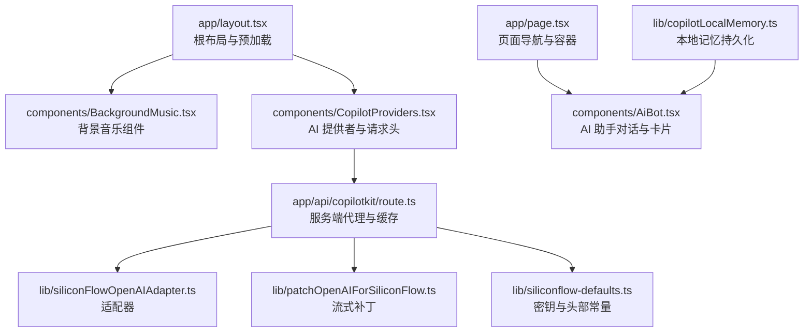
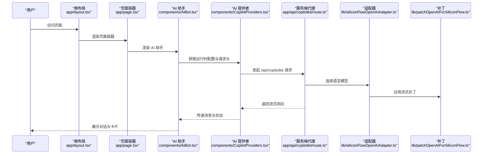
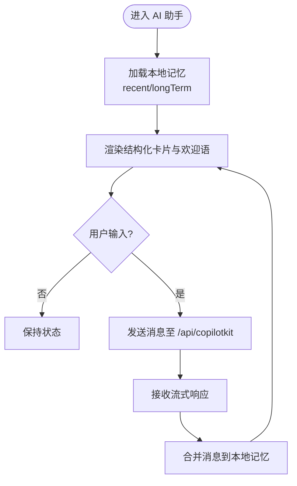
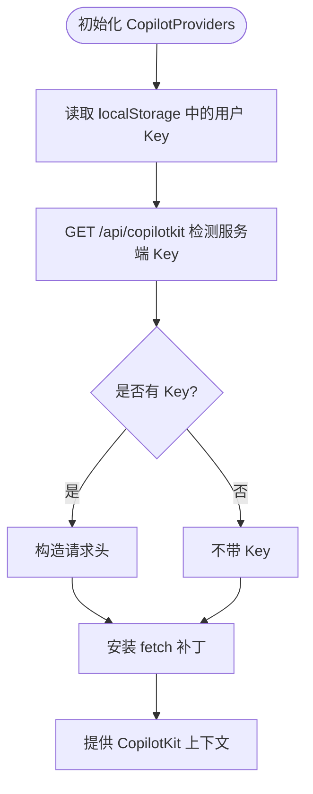
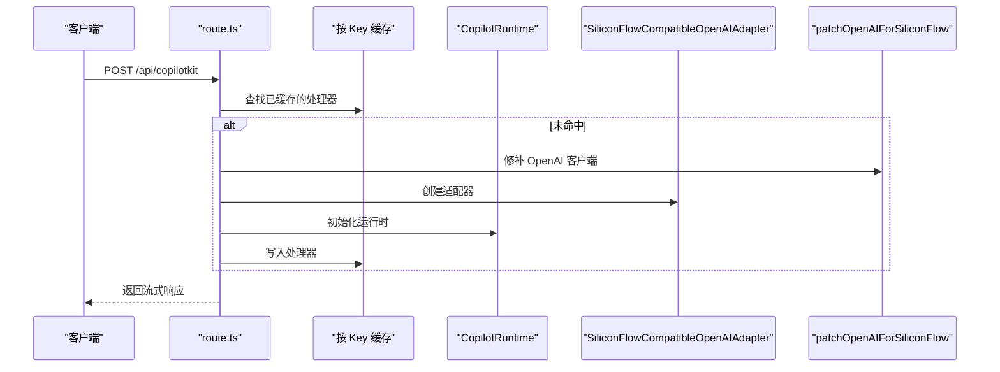
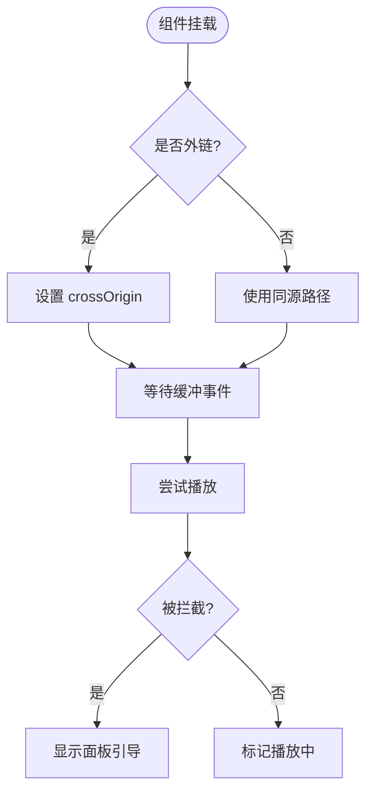
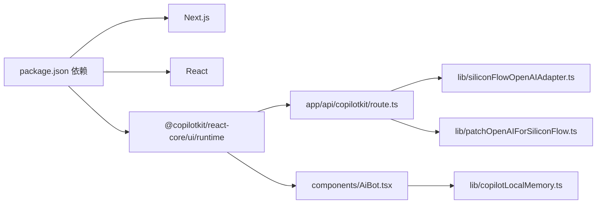

# 性能问题诊断与优化

<cite>
**本文引用的文件**
- [package.json](file://package.json)
- [next.config.js](file://next.config.js)
- [app/layout.tsx](file://app/layout.tsx)
- [app/page.tsx](file://app/page.tsx)
- [components/AiBot.tsx](file://components/AiBot.tsx)
- [components/BackgroundMusic.tsx](file://components/BackgroundMusic.tsx)
- [components/CopilotProviders.tsx](file://components/CopilotProviders.tsx)
- [app/api/copilotkit/route.ts](file://app/api/copilotkit/route.ts)
- [lib/copilotLocalMemory.ts](file://lib/copilotLocalMemory.ts)
- [lib/siliconFlowOpenAIAdapter.ts](file://lib/siliconFlowOpenAIAdapter.ts)
- [lib/patchOpenAIForSiliconFlow.ts](file://lib/patchOpenAIForSiliconFlow.ts)
- [lib/siliconflow-defaults.ts](file://lib/siliconflow-defaults.ts)
- [public/audio/README.md](file://public/audio/README.md)
</cite>

## 目录
1. [简介](#简介)
2. [项目结构](#项目结构)
3. [核心组件](#核心组件)
4. [架构总览](#架构总览)
5. [详细组件分析](#详细组件分析)
6. [依赖关系分析](#依赖关系分析)
7. [性能考量](#性能考量)
8. [故障排查指南](#故障排查指南)
9. [结论](#结论)
10. [附录](#附录)

## 简介
本指南面向 Next.js 应用的性能问题诊断与优化，聚焦以下目标：
- 构建时间过长：识别与缓解构建阶段的瓶颈，结合现有配置与依赖进行优化建议。
- 运行时内存占用过高：定位与降低前端与服务端运行时内存压力，特别是 AI 助手与音频播放相关模块。
- 页面加载缓慢：从资源预加载、渲染路径与第三方集成角度提出优化方案。
- AI 助手性能影响因素：API 调用频率控制、缓存策略优化、异步处理改进的具体实施方案。
- 音频播放性能优化：预加载策略、内存管理与用户体验优化最佳实践。
- 性能监控与基准测试：工具使用方法、实施步骤与持续改进策略。

## 项目结构
该项目采用 Next.js App Router 结构，核心文件分布如下：
- 应用入口与布局：app/layout.tsx、app/page.tsx
- 组件层：components/AiBot.tsx、components/BackgroundMusic.tsx、components/CopilotProviders.tsx
- 服务端 API：app/api/copilotkit/route.ts
- 本地记忆与适配：lib/copilotLocalMemory.ts、lib/siliconFlowOpenAIAdapter.ts、lib/patchOpenAIForSiliconFlow.ts、lib/siliconflow-defaults.ts
- 音频资源：public/audio/README.md

**图表来源**
- [app/layout.tsx:19-47](file://app/layout.tsx#L19-L47)
- [app/page.tsx:11-29](file://app/page.tsx#L11-L29)
- [components/BackgroundMusic.tsx:36-307](file://components/BackgroundMusic.tsx#L36-L307)
- [components/CopilotProviders.tsx:49-156](file://components/CopilotProviders.tsx#L49-L156)
- [app/api/copilotkit/route.ts:16-95](file://app/api/copilotkit/route.ts#L16-L95)
- [lib/siliconFlowOpenAIAdapter.ts:17-35](file://lib/siliconFlowOpenAIAdapter.ts#L17-L35)
- [lib/patchOpenAIForSiliconFlow.ts:12-21](file://lib/patchOpenAIForSiliconFlow.ts#L12-L21)
- [lib/siliconflow-defaults.ts:9-16](file://lib/siliconflow-defaults.ts#L9-L16)
- [lib/copilotLocalMemory.ts:21-76](file://lib/copilotLocalMemory.ts#L21-L76)

**章节来源**
- [package.json:1-29](file://package.json#L1-L29)
- [next.config.js:1-4](file://next.config.js#L1-L4)
- [app/layout.tsx:19-47](file://app/layout.tsx#L19-L47)
- [app/page.tsx:11-29](file://app/page.tsx#L11-L29)

## 核心组件
- 根布局与预加载：在 head 中对音频进行预加载，减少首屏播放阻塞。
- 页面容器：集中管理三个页面与 AI 助手的可见性，避免不必要的重渲染。
- AI 助手：基于 CopilotKit 的聊天 UI 与本地记忆持久化，支持结构化卡片与函数调用。
- AI 提供者：统一处理请求头、服务端密钥检测与 fetch 补丁，保障流式响应稳定性。
- 服务端代理：按 API Key 缓存 Hono 处理器，避免重复初始化，提升并发稳定性。
- 背景音乐：同源 MP3、预加载、缓冲等待与自动播放拦截处理，兼顾性能与体验。
- 本地记忆：限制长期记忆长度与片段截断，降低存储与传输成本。

**章节来源**
- [app/layout.tsx:13-35](file://app/layout.tsx#L13-L35)
- [app/page.tsx:11-29](file://app/page.tsx#L11-L29)
- [components/AiBot.tsx:44-51](file://components/AiBot.tsx#L44-L51)
- [components/CopilotProviders.tsx:49-156](file://components/CopilotProviders.tsx#L49-L156)
- [app/api/copilotkit/route.ts:46-95](file://app/api/copilotkit/route.ts#L46-L95)
- [components/BackgroundMusic.tsx:36-92](file://components/BackgroundMusic.tsx#L36-L92)
- [lib/copilotLocalMemory.ts:6-14](file://lib/copilotLocalMemory.ts#L6-L14)

## 架构总览
下图展示了客户端与服务端在 AI 助手与音频播放方面的交互路径与关键优化点。

**图表来源**
- [app/layout.tsx:19-47](file://app/layout.tsx#L19-L47)
- [app/page.tsx:11-29](file://app/page.tsx#L11-L29)
- [components/AiBot.tsx:44-51](file://components/AiBot.tsx#L44-L51)
- [components/CopilotProviders.tsx:144-156](file://components/CopilotProviders.tsx#L144-L156)
- [app/api/copilotkit/route.ts:73-95](file://app/api/copilotkit/route.ts#L73-L95)
- [lib/siliconFlowOpenAIAdapter.ts:22-34](file://lib/siliconFlowOpenAIAdapter.ts#L22-L34)
- [lib/patchOpenAIForSiliconFlow.ts:12-21](file://lib/patchOpenAIForSiliconFlow.ts#L12-L21)

## 详细组件分析

### AI 助手组件（AiBot）
- 本地记忆持久化：通过 localStorage 存储近期与长期记忆，限制长期记忆长度与片段大小，降低存储与传输成本。
- 首次引导与建议：首次打开仅展示欢迎语与快捷问题，后续由底部 suggestions 推荐，减少初始渲染负担。
- 函数调用与状态：提供“执行中”状态条与卡片渲染，避免频繁重渲染。

**图表来源**
- [components/AiBot.tsx:44-51](file://components/AiBot.tsx#L44-L51)
- [lib/copilotLocalMemory.ts:21-76](file://lib/copilotLocalMemory.ts#L21-L76)

**章节来源**
- [components/AiBot.tsx:44-51](file://components/AiBot.tsx#L44-L51)
- [lib/copilotLocalMemory.ts:6-14](file://lib/copilotLocalMemory.ts#L6-L14)

### AI 提供者与请求头（CopilotProviders）
- 请求头策略：优先使用用户面板保存的 Key（localStorage），其次使用环境变量，最后回退到代码兜底；避免将敏感 Key 打包进前端。
- fetch 补丁：针对特定端点返回空响应体时进行 JSON 包装，避免解析异常导致的崩溃。
- 服务端密钥检测：GET /api/copilotkit 返回服务端是否已配置 Key，便于前端判断“零浏览器配置”。

**图表来源**
- [components/CopilotProviders.tsx:54-113](file://components/CopilotProviders.tsx#L54-L113)
- [components/CopilotProviders.tsx:126-133](file://components/CopilotProviders.tsx#L126-L133)
- [app/api/copilotkit/route.ts:120-130](file://app/api/copilotkit/route.ts#L120-L130)

**章节来源**
- [components/CopilotProviders.tsx:49-156](file://components/CopilotProviders.tsx#L49-L156)
- [app/api/copilotkit/route.ts:39-43](file://app/api/copilotkit/route.ts#L39-L43)

### 服务端代理与适配（API 路由）
- 按 Key 缓存处理器：Map 缓存不同 API Key 的处理器，避免每请求重建 CopilotRuntime，提升并发稳定性与响应速度。
- 适配器与补丁：将 OpenAI 的 beta 流式接口代理到标准 chat.completions，确保兼容网关可用。
- 并行工具调用：显式关闭并行工具调用，避免“RUN_FINISHED while tool calls are still active”的错误。

**图表来源**
- [app/api/copilotkit/route.ts:48-95](file://app/api/copilotkit/route.ts#L48-L95)
- [lib/siliconFlowOpenAIAdapter.ts:17-35](file://lib/siliconFlowOpenAIAdapter.ts#L17-L35)
- [lib/patchOpenAIForSiliconFlow.ts:12-21](file://lib/patchOpenAIForSiliconFlow.ts#L12-L21)

**章节来源**
- [app/api/copilotkit/route.ts:46-95](file://app/api/copilotkit/route.ts#L46-L95)
- [lib/siliconFlowOpenAIAdapter.ts:17-35](file://lib/siliconFlowOpenAIAdapter.ts#L17-L35)
- [lib/patchOpenAIForSiliconFlow.ts:12-21](file://lib/patchOpenAIForSiliconFlow.ts#L12-L21)

### 背景音乐组件（BackgroundMusic）
- 同源 MP3 与预加载：默认使用同源 /audio/prosecco.mp3，配合 preload="auto" 与 canplay/canplaythrough 事件，减少首播卡顿。
- 自动播放拦截处理：延迟自动播放并等待缓冲，若被拦截则显示面板引导用户手动播放。
- 外链支持与跨域：支持 NEXT_PUBLIC_AUDIO_SRC 指定外部地址，自动设置 crossOrigin。

**图表来源**
- [components/BackgroundMusic.tsx:36-92](file://components/BackgroundMusic.tsx#L36-L92)
- [components/BackgroundMusic.tsx:124-141](file://components/BackgroundMusic.tsx#L124-L141)
- [app/layout.tsx:13-35](file://app/layout.tsx#L13-L35)
- [public/audio/README.md:1-13](file://public/audio/README.md#L1-L13)

**章节来源**
- [components/BackgroundMusic.tsx:36-92](file://components/BackgroundMusic.tsx#L36-L92)
- [app/layout.tsx:13-35](file://app/layout.tsx#L13-L35)
- [public/audio/README.md:1-13](file://public/audio/README.md#L1-L13)

## 依赖关系分析
- 构建与运行时依赖：Next.js 14、React 18、@copilotkit 生态组件与运行时。
- 第三方适配：SiliconFlow 兼容网关需要流式补丁与适配器。
- 本地存储：localStorage 用于持久化 AI 对话记忆与用户 Key。

**图表来源**
- [package.json:12-20](file://package.json#L12-L20)
- [app/api/copilotkit/route.ts:5-14](file://app/api/copilotkit/route.ts#L5-L14)
- [components/AiBot.tsx:10-21](file://components/AiBot.tsx#L10-L21)
- [lib/copilotLocalMemory.ts:21-47](file://lib/copilotLocalMemory.ts#L21-L47)
- [lib/siliconFlowOpenAIAdapter.ts:1-8](file://lib/siliconFlowOpenAIAdapter.ts#L1-L8)
- [lib/patchOpenAIForSiliconFlow.ts:1-3](file://lib/patchOpenAIForSiliconFlow.ts#L1-L3)

**章节来源**
- [package.json:12-20](file://package.json#L12-L20)

## 性能考量

### 构建时间过长
- 现状分析：当前 next.config.js 为空配置，未启用构建优化选项。
- 优化建议：
  - 启用实验性功能：如 swcMinify、instrumentationHook 等（依据实际版本支持情况）。
  - 分包策略：拆分 CopilotKit UI 与第三方依赖，减少单包体积。
  - TypeScript 编译：确保 tsconfig 仅包含必要路径，避免扫描过多文件。
  - 产物分析：使用 next bundle-analyzer 识别大体积依赖并评估替换方案。

**章节来源**
- [next.config.js:1-4](file://next.config.js#L1-L4)
- [package.json:12-20](file://package.json#L12-L20)

### 运行时内存占用过高
- AI 助手与本地记忆：
  - 控制长期记忆长度与片段大小，避免无限增长。
  - 合并消息时仅保留最近若干条与关键摘要，降低 DOM 与字符串拼接成本。
- 背景音乐：
  - 同源 MP3 与单一源避免多格式解码开销。
  - 自动播放拦截时及时释放事件监听，避免内存泄漏。
- 服务端代理：
  - 按 Key 缓存处理器，避免重复初始化导致的内存抖动。

**章节来源**
- [lib/copilotLocalMemory.ts:6-14](file://lib/copilotLocalMemory.ts#L6-L14)
- [lib/copilotLocalMemory.ts:61-76](file://lib/copilotLocalMemory.ts#L61-L76)
- [components/BackgroundMusic.tsx:36-92](file://components/BackgroundMusic.tsx#L36-L92)
- [app/api/copilotkit/route.ts:46-95](file://app/api/copilotkit/route.ts#L46-L95)

### 页面加载缓慢
- 音频预加载：在 head 中对音频进行预加载，减少首屏播放阻塞。
- 组件懒加载：将非首屏卡片与富内容组件按需加载，降低首屏 JS 体积。
- 资源优化：同源 MP3 与单一源，减少跨域与解码开销。

**章节来源**
- [app/layout.tsx:13-35](file://app/layout.tsx#L13-L35)
- [components/BackgroundMusic.tsx:124-141](file://components/BackgroundMusic.tsx#L124-L141)

### AI 助手性能优化实施方案
- API 调用频率控制：
  - 输入防抖：在用户快速输入时延迟发送，合并短时间内的多次请求。
  - 会话节流：限制单位时间内消息数量，避免突发流量冲击服务端。
- 缓存策略优化：
  - 本地记忆：限制长期记忆长度与片段大小，定期清理过期摘要。
  - 服务端缓存：按 Key 缓存处理器，避免重复初始化。
- 异步处理改进：
  - 流式响应：确保流式接口稳定，避免阻塞主线程。
  - 错误兜底：对空响应体进行 JSON 包装，防止解析异常。

**章节来源**
- [components/AiBot.tsx:44-51](file://components/AiBot.tsx#L44-L51)
- [lib/copilotLocalMemory.ts:61-76](file://lib/copilotLocalMemory.ts#L61-L76)
- [app/api/copilotkit/route.ts:46-95](file://app/api/copilotkit/route.ts#L46-L95)
- [components/CopilotProviders.tsx:64-87](file://components/CopilotProviders.tsx#L64-L87)

### 音频播放性能优化
- 预加载策略：同源 MP3 与 preload="auto"，等待 canplay/canplaythrough 事件后再播放。
- 内存管理：自动播放拦截时及时清理事件监听，避免内存泄漏。
- 用户体验优化：提供手动播放按钮与音量控制，支持静音与跨域外链。

**章节来源**
- [components/BackgroundMusic.tsx:17-34](file://components/BackgroundMusic.tsx#L17-L34)
- [components/BackgroundMusic.tsx:111-122](file://components/BackgroundMusic.tsx#L111-L122)
- [public/audio/README.md:1-13](file://public/audio/README.md#L1-L13)

## 故障排查指南
- AI 助手 404 或流式错误：
  - 检查服务端是否正确解析 API Key（请求头、环境变量、兜底）。
  - 确认补丁已应用，将 beta 流式接口代理到标准 chat.completions。
- 自动播放被拦截：
  - 检查音频预加载与缓冲等待逻辑，确保在 canplay 事件后播放。
  - 提示用户手动播放，并提供面板操作入口。
- 空响应体导致解析异常：
  - 使用 fetch 补丁对特定端点返回空响应体时包装为合法 JSON。

**章节来源**
- [app/api/copilotkit/route.ts:30-36](file://app/api/copilotkit/route.ts#L30-L36)
- [lib/patchOpenAIForSiliconFlow.ts:12-21](file://lib/patchOpenAIForSiliconFlow.ts#L12-L21)
- [components/CopilotProviders.tsx:64-87](file://components/CopilotProviders.tsx#L64-L87)
- [components/BackgroundMusic.tsx:57-71](file://components/BackgroundMusic.tsx#L57-L71)

## 结论
本项目在 AI 助手与背景音乐方面已具备良好的性能基础：服务端按 Key 缓存处理器、本地记忆限制、同源音频与预加载等。建议进一步通过构建优化、组件懒加载与更严格的缓存策略，持续降低构建时间与运行时内存占用，并完善性能监控与基准测试流程以实现持续改进。

## 附录
- 性能监控与基准测试建议：
  - 使用浏览器性能面板记录首屏渲染、内存峰值与长任务。
  - 使用 Lighthouse 或 WebPageTest 进行自动化基准测试。
  - 在 CI 中集成性能回归检测，设定阈值告警。
- 持续性能改进策略：
  - 定期审查依赖体积，移除未使用包。
  - 采用渐进式增强与懒加载，优先保障关键路径。
  - 建立性能指标看板，跟踪关键指标趋势。