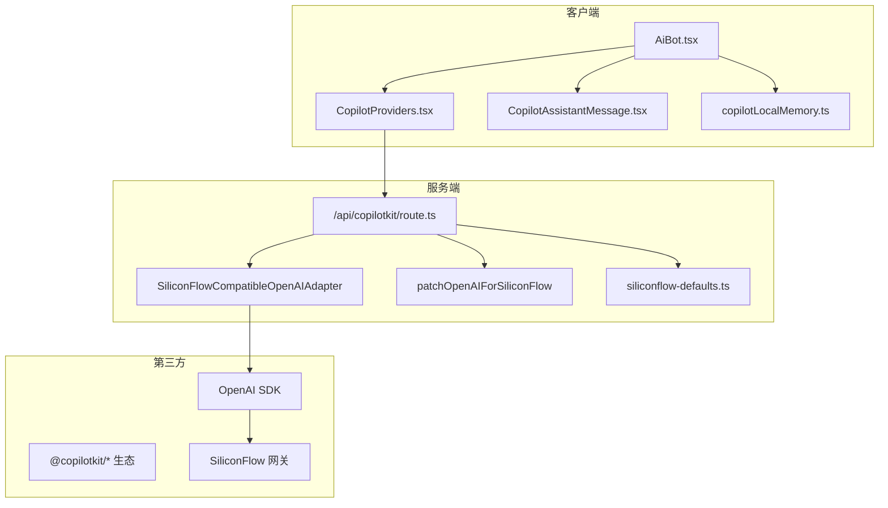
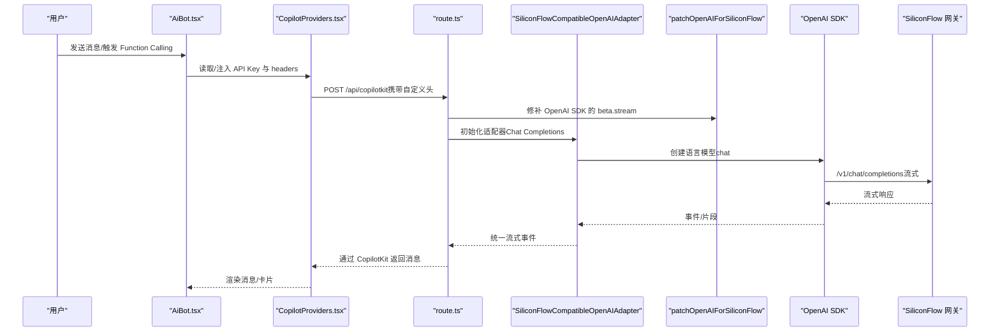
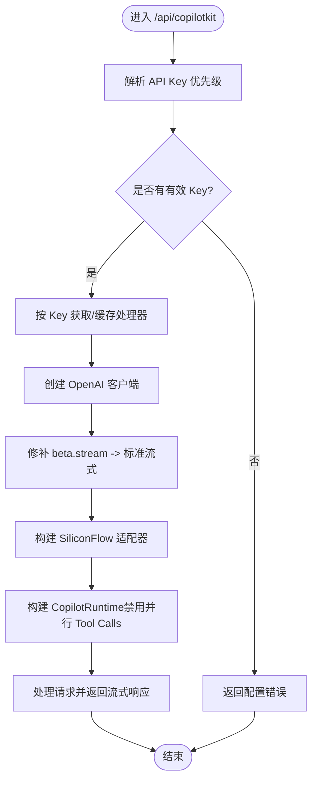
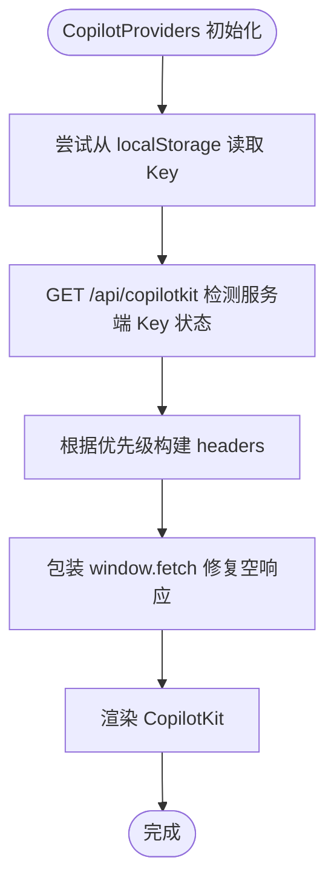
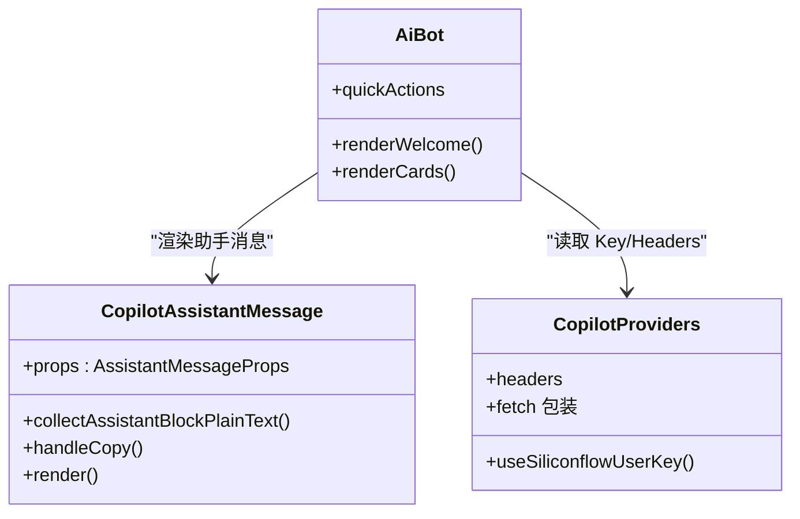
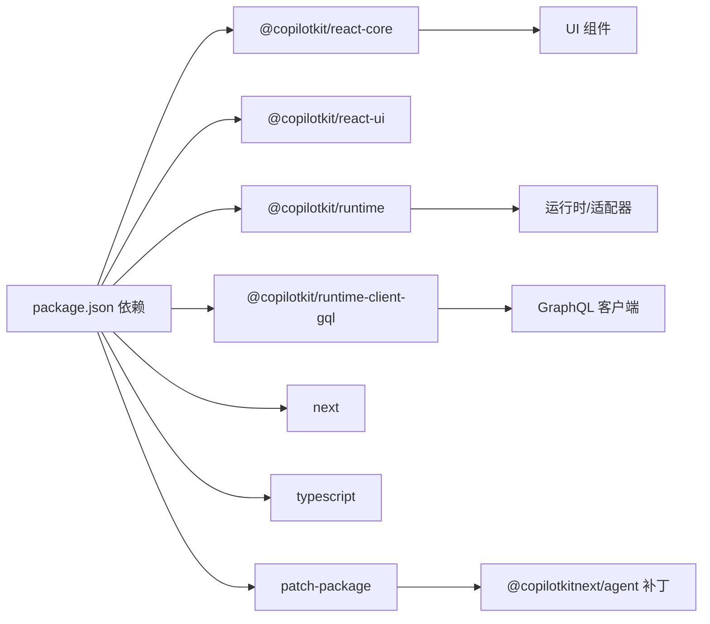

# 故障排除与维护

<cite>
**本文引用的文件**
- [package.json](file://package.json)
- [next.config.js](file://next.config.js)
- [lib/siliconFlowOpenAIAdapter.ts](file://lib/siliconFlowOpenAIAdapter.ts)
- [lib/patchOpenAIForSiliconFlow.ts](file://lib/patchOpenAIForSiliconFlow.ts)
- [lib/siliconflow-defaults.ts](file://lib/siliconflow-defaults.ts)
- [lib/copilotLocalMemory.ts](file://lib/copilotLocalMemory.ts)
- [lib/resumeData.ts](file://lib/resumeData.ts)
- [components/CopilotProviders.tsx](file://components/CopilotProviders.tsx)
- [components/CopilotAssistantMessage.tsx](file://components/CopilotAssistantMessage.tsx)
- [components/AiBot.tsx](file://components/AiBot.tsx)
- [app/api/copilotkit/route.ts](file://app/api/copilotkit/route.ts)
- [patches/@copilotkitnext+agent+1.54.0.patch](file://patches/@copilotkitnext+agent+1.54.0.patch)
</cite>

## 目录
1. [简介](#简介)
2. [项目结构](#项目结构)
3. [核心组件](#核心组件)
4. [架构总览](#架构总览)
5. [详细组件分析](#详细组件分析)
6. [依赖分析](#依赖分析)
7. [性能考虑](#性能考虑)
8. [故障排除指南](#故障排除指南)
9. [结论](#结论)
10. [附录](#附录)

## 简介
本指南面向 Fuqianjiao AI 项目的运维与开发人员，聚焦以下目标：
- 快速定位并解决常见 AI 助手问题：API 连接异常、Function Calling 错误、性能瓶颈。
- 识别与优化性能问题：构建期优化、运行时性能监控、内存泄漏检测。
- 规范化部署排查流程：环境配置错误、依赖冲突与兼容性问题。
- 提供代码维护最佳实践：依赖更新策略、安全补丁应用、版本升级指南。
- 给出具体故障排除步骤、调试工具使用与预防性维护建议。

## 项目结构
该项目基于 Next.js 14，采用 App Router，前端通过 CopilotKit 与服务端 API 集成，实现 AI 助手对话与 Function Calling。关键目录与职责如下：
- app/api/copilotkit/route.ts：服务端 CopilotKit 端点，负责认证、适配器初始化与请求转发。
- components/CopilotProviders.tsx：全局 Provider，注入 CopilotKit、API Key 管理与 fetch 修复。
- lib/siliconFlowOpenAIAdapter.ts、lib/patchOpenAIForSiliconFlow.ts：针对 SiliconFlow 等兼容网关的适配层。
- lib/siliconflow-defaults.ts：API Key 与请求头常量。
- lib/copilotLocalMemory.ts：本地持久化对话记忆，增强上下文。
- lib/resumeData.ts：AI 助手知识库（简历与项目数据）。
- patches/@copilotkitnext+agent+1.54.0.patch：修复部分兼容网关 Tool Call 生命周期问题的补丁。

图表来源
- [components/AiBot.tsx](file://components/AiBot.tsx)
- [components/CopilotProviders.tsx](file://components/CopilotProviders.tsx)
- [components/CopilotAssistantMessage.tsx](file://components/CopilotAssistantMessage.tsx)
- [lib/copilotLocalMemory.ts](file://lib/copilotLocalMemory.ts)
- [app/api/copilotkit/route.ts](file://app/api/copilotkit/route.ts)
- [lib/siliconFlowOpenAIAdapter.ts](file://lib/siliconFlowOpenAIAdapter.ts)
- [lib/patchOpenAIForSiliconFlow.ts](file://lib/patchOpenAIForSiliconFlow.ts)
- [lib/siliconflow-defaults.ts](file://lib/siliconflow-defaults.ts)

章节来源
- [package.json](file://package.json)
- [next.config.js](file://next.config.js)

## 核心组件
- CopilotKit Provider 与 Key 管理
  - 通过自定义 Provider 注入 CopilotKit，支持从浏览器 localStorage 或 NEXT_PUBLIC_* 注入 API Key，并在 /api/copilotkit 发送自定义请求头。
  - 对 fetch 进行包装，修复特定条件下 urql 解析异常导致的 SyntaxError。
- SiliconFlow 适配层
  - 适配器将默认 Responses API 切换为 Chat Completions，确保与兼容网关一致。
  - 修复 OpenAI SDK 的 beta.stream 到标准流式接口的映射。
- 本地记忆与知识库
  - 本地持久化最近对话片段与滚动摘要，注入到 CopilotKit 可读上下文中。
  - 知识库集中于 resumeData.ts，作为 AI 的结构化背景。
- Function Calling 与 UI 渲染
  - 支持生成式 UI 卡片与 Markdown 混合渲染，处理连续助手消息与复制行为。

章节来源
- [components/CopilotProviders.tsx](file://components/CopilotProviders.tsx)
- [lib/siliconFlowOpenAIAdapter.ts](file://lib/siliconFlowOpenAIAdapter.ts)
- [lib/patchOpenAIForSiliconFlow.ts](file://lib/patchOpenAIForSiliconFlow.ts)
- [lib/copilotLocalMemory.ts](file://lib/copilotLocalMemory.ts)
- [lib/resumeData.ts](file://lib/resumeData.ts)
- [components/CopilotAssistantMessage.tsx](file://components/CopilotAssistantMessage.tsx)

## 架构总览
下图展示了从浏览器到服务端再到兼容网关的整体交互流程，以及关键适配与补丁的作用位置。

图表来源
- [components/AiBot.tsx](file://components/AiBot.tsx)
- [components/CopilotProviders.tsx](file://components/CopilotProviders.tsx)
- [app/api/copilotkit/route.ts](file://app/api/copilotkit/route.ts)
- [lib/siliconFlowOpenAIAdapter.ts](file://lib/siliconFlowOpenAIAdapter.ts)
- [lib/patchOpenAIForSiliconFlow.ts](file://lib/patchOpenAIForSiliconFlow.ts)

## 详细组件分析

### 组件一：API 端点与适配层
- 关键职责
  - 解析 API Key 优先级：请求头 > 环境变量 > 代码兜底。
  - 缓存按 Key 的 Hono 处理器，避免重复初始化 CopilotRuntime。
  - 适配 SiliconFlow 的 Chat Completions 接口与流式协议。
  - 修复 Function Calling 生命周期，确保 TOOL_CALL_END 在 RUN_FINISHED 前发出。
- 常见问题定位
  - 404/Not Found：检查 SILICONFLOW_MODEL 是否仍在线上可用；确认网关支持 /v1/chat/completions。
  - 并行 Tool Calls 导致“RUN_FINISHED while tool calls are still active”：确认禁用并行工具调用。
  - OPTIONS 预检失败：确保导出 OPTIONS 方法以允许自定义头预检。

图表来源
- [app/api/copilotkit/route.ts](file://app/api/copilotkit/route.ts)
- [lib/patchOpenAIForSiliconFlow.ts](file://lib/patchOpenAIForSiliconFlow.ts)
- [lib/siliconFlowOpenAIAdapter.ts](file://lib/siliconFlowOpenAIAdapter.ts)

章节来源
- [app/api/copilotkit/route.ts](file://app/api/copilotkit/route.ts)

### 组件二：Provider 与 Key 管理
- 关键职责
  - 浏览器侧 Key 存储与注入：localStorage 与 NEXT_PUBLIC_*。
  - fetch 包装：修复 content-length: 0 导致的 urql SyntaxError。
  - 启动时探测服务端 Key 配置状态，用于前端提示。
- 常见问题定位
  - 浏览器 Key 未生效：检查请求头是否正确传递（x-siliconflow-api-key）。
  - 本地存储异常：私隐模式/配额不足会导致写入失败，需降级处理。
  - 开发台弹窗干扰：showDevConsole 显式关闭，避免 JSON 解析错误误报。

图表来源
- [components/CopilotProviders.tsx](file://components/CopilotProviders.tsx)
- [lib/siliconflow-defaults.ts](file://lib/siliconflow-defaults.ts)

章节来源
- [components/CopilotProviders.tsx](file://components/CopilotProviders.tsx)
- [lib/siliconflow-defaults.ts](file://lib/siliconflow-defaults.ts)

### 组件三：Function Calling 与 UI 渲染
- 关键职责
  - 生成式 UI 卡片与 Markdown 混合渲染，支持连续助手消息的复制行为。
  - 仅在连续助手消息的最后一段展示操作栏，避免重复操作栏。
  - 对空终端回复给出友好提示，引导重新生成或换问法。
- 常见问题定位
  - 仅卡片无正文导致空白气泡：确保即使无正文也保留气泡占位。
  - 工具调用未结束导致 RUN_FINISHED：依赖补丁确保 TOOL_CALL_END 先于 RUN_FINISHED。

图表来源
- [components/CopilotAssistantMessage.tsx](file://components/CopilotAssistantMessage.tsx)
- [components/AiBot.tsx](file://components/AiBot.tsx)
- [components/CopilotProviders.tsx](file://components/CopilotProviders.tsx)

章节来源
- [components/CopilotAssistantMessage.tsx](file://components/CopilotAssistantMessage.tsx)
- [components/AiBot.tsx](file://components/AiBot.tsx)

## 依赖分析
- 核心依赖
  - @copilotkit/*：React Core/UI、Runtime、Runtime Client GQL。
  - next：框架与构建。
  - react/react-dom：UI 基础。
- 开发依赖
  - patch-package：应用补丁。
  - typescript 与类型声明：类型安全。
- 兼容性与适配
  - SiliconFlow 网关仅支持标准 Chat Completions，需通过适配器与补丁切换到标准流式协议。
  - Function Calling 在部分兼容网关上需要补丁保障 TOOL_CALL_END 事件顺序。

图表来源
- [package.json](file://package.json)
- [patches/@copilotkitnext+agent+1.54.0.patch](file://patches/@copilotkitnext+agent+1.54.0.patch)

章节来源
- [package.json](file://package.json)
- [patches/@copilotkitnext+agent+1.54.0.patch](file://patches/@copilotkitnext+agent+1.54.0.patch)

## 性能考虑
- 构建期优化
  - 使用 Next.js 默认优化（Tree Shaking、SplitChunks）。确保生产构建脚本正常执行。
  - 控制补丁体积与数量，避免引入不必要的运行时开销。
- 运行时性能
  - 适配器与 OpenAI 客户端按 Key 缓存，减少重复初始化成本。
  - 禁用并行 Tool Calls，降低兼容网关压力与错误概率。
  - 本地记忆采用滚动摘要与截断，限制内存占用。
- 监控与告警
  - 建议在服务端埋点统计：请求耗时、错误码分布、Tool Calls 成功率。
  - 前端可记录首次渲染延迟、消息生成耗时、卡片渲染耗时。
- 内存泄漏检测
  - 检查长列表渲染与事件绑定，避免闭包持有过期引用。
  - 对定时器、订阅与 fetch 包装进行清理，防止泄漏。

## 故障排除指南

### 一、API 连接问题
- 症状
  - 404/Not Found：模型 ID 下线或网关不支持 Responses API。
  - 配置错误：未配置有效 API Key。
  - CORS/预检失败：OPTIONS 未正确处理。
- 排查步骤
  - 检查服务端 Key 解析顺序：请求头 > 环境变量 > 代码兜底。
  - 确认网关支持 /v1/chat/completions；必要时切换到 Qwen3 系列模型。
  - 确保导出了 OPTIONS 方法以处理自定义头预检。
  - 使用 GET /api/copilotkit 检查服务端 Key 配置状态与提示信息。
- 相关实现参考
  - [app/api/copilotkit/route.ts](file://app/api/copilotkit/route.ts)
  - [lib/siliconflow-defaults.ts](file://lib/siliconflow-defaults.ts)

章节来源
- [app/api/copilotkit/route.ts](file://app/api/copilotkit/route.ts)
- [lib/siliconflow-defaults.ts](file://lib/siliconflow-defaults.ts)

### 二、Function Calling 错误
- 症状
  - “RUN_FINISHED while tool calls are still active”。
  - 工具调用未结束，界面卡住或报错。
- 排查步骤
  - 确认已禁用并行 Tool Calls（适配器与 providerOptions）。
  - 确认补丁已应用，确保 TOOL_CALL_END 在 RUN_FINISHED 前发出。
  - 检查网关是否仅流式 tool-input-* 而不发送最终 tool-call。
- 相关实现参考
  - [app/api/copilotkit/route.ts](file://app/api/copilotkit/route.ts)
  - [patches/@copilotkitnext+agent+1.54.0.patch](file://patches/@copilotkitnext+agent+1.54.0.patch)

章节来源
- [app/api/copilotkit/route.ts](file://app/api/copilotkit/route.ts)
- [patches/@copilotkitnext+agent+1.54.0.patch](file://patches/@copilotkitnext+agent+1.54.0.patch)

### 三、性能瓶颈
- 症状
  - 首屏慢、消息生成慢、卡片渲染卡顿。
- 排查步骤
  - 构建期：确认生产构建成功，未引入冗余依赖。
  - 运行时：启用缓存的适配器与客户端；禁用并行 Tool Calls；控制本地记忆长度。
  - 监控：记录关键指标，定位瓶颈阶段。
- 相关实现参考
  - [lib/siliconFlowOpenAIAdapter.ts](file://lib/siliconFlowOpenAIAdapter.ts)
  - [lib/copilotLocalMemory.ts](file://lib/copilotLocalMemory.ts)

章节来源
- [lib/siliconFlowOpenAIAdapter.ts](file://lib/siliconFlowOpenAIAdapter.ts)
- [lib/copilotLocalMemory.ts](file://lib/copilotLocalMemory.ts)

### 四、部署问题排查
- 环境配置错误
  - 未设置 SILICONFLOW_API_KEY 或值为空。
  - NEXT_PUBLIC_* 与服务端环境变量冲突。
- 依赖冲突与兼容性
  - OpenAI SDK 版本与 CopilotKit 生态不匹配。
  - SiliconFlow 网关仅支持标准流式接口。
- 排查步骤
  - 检查 .env.local 与平台环境变量（如 Vercel）。
  - 确认 patch-package 正确应用补丁。
  - 对比 OpenAI SDK 与 CopilotKit 版本，必要时锁定版本。
- 相关实现参考
  - [package.json](file://package.json)
  - [patches/@copilotkitnext+agent+1.54.0.patch](file://patches/@copilotkitnext+agent+1.54.0.patch)

章节来源
- [package.json](file://package.json)
- [patches/@copilotkitnext+agent+1.54.0.patch](file://patches/@copilotkitnext+agent+1.54.0.patch)

### 五、调试工具与方法
- 前端
  - 打开浏览器开发者工具 Network 面板，观察 /api/copilotkit 请求与响应。
  - 查看 Console，确认 fetch 包装未产生异常。
  - 使用 React DevTools 检查组件渲染与 props。
- 服务端
  - 在 /api/copilotkit 中添加最小化日志，记录 Key 来源、模型与错误码。
  - 使用 curl 或 Postman 直接调用端点，排除前端问题。
- 本地记忆
  - 检查 localStorage 中的存储键，确认截断与滚动摘要逻辑正常。

章节来源
- [components/CopilotProviders.tsx](file://components/CopilotProviders.tsx)
- [lib/copilotLocalMemory.ts](file://lib/copilotLocalMemory.ts)
- [app/api/copilotkit/route.ts](file://app/api/copilotkit/route.ts)

### 六、预防性维护建议
- 依赖更新策略
  - 使用版本锁定与最小化更新，先在本地与测试环境验证。
  - 对 patch-package 的补丁建立回归测试清单。
- 安全补丁应用
  - 定期扫描依赖安全漏洞，及时应用补丁。
  - 对敏感 Key 仅在服务端配置，前端避免硬编码。
- 版本升级指南
  - 升级前备份当前补丁与配置。
  - 逐步替换适配器与补丁，确保兼容网关行为不变。
  - 升级后进行全面的功能与性能回归测试。

## 结论
本指南围绕 Fuqianjiao AI 项目的关键组件与集成点，提供了系统化的故障排除与维护方法。通过明确 API 连接、Function Calling、性能与部署等方面的排查步骤与最佳实践，可显著降低线上问题的影响范围与恢复时间。建议将本文作为日常运维与升级的标准参考，并结合实际监控与日志持续优化。

## 附录
- 常用命令
  - 开发：npm run dev
  - 构建：npm run build
  - 启动：npm run start
  - Lint：npm run lint
  - 应用补丁：npm run postinstall
- 关键配置
  - next.config.js：基础 Next.js 配置。
  - package.json：依赖与脚本。
- 常见问题索引
  - 404/Not Found：检查模型与网关流式接口。
  - RUN_FINISHED while tool calls are still active：确认补丁与禁用并行 Tool Calls。
  - CORS/预检失败：确保导出 OPTIONS。
  - fetch 异常：确认 fetch 包装与 content-length 修复。