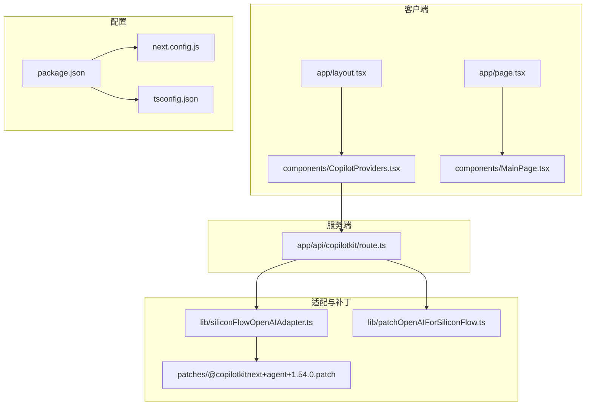
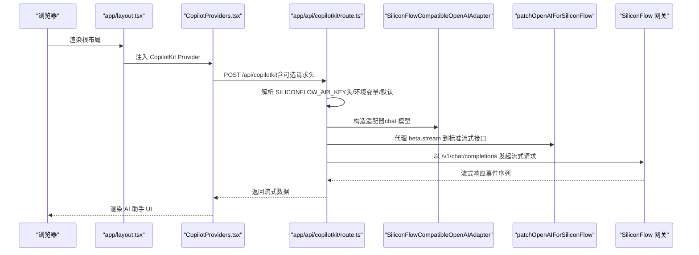
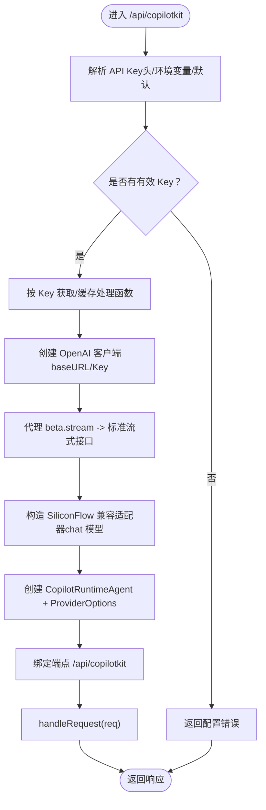
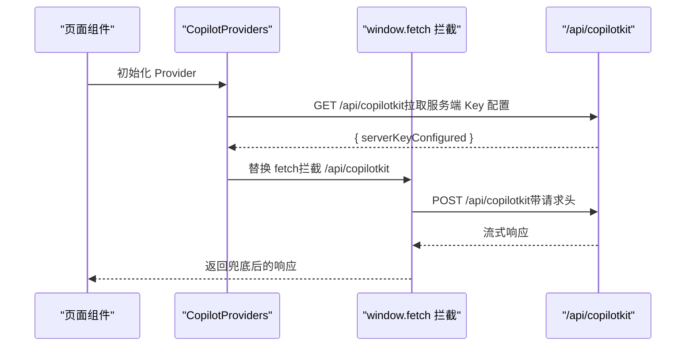
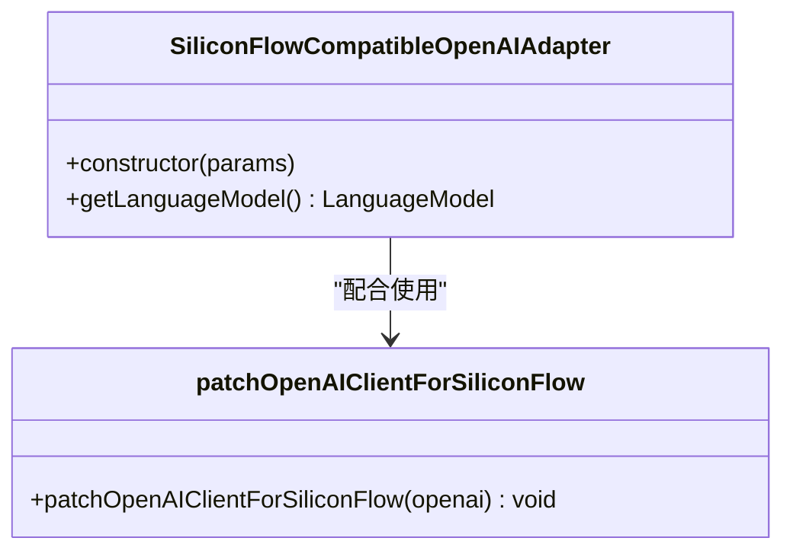
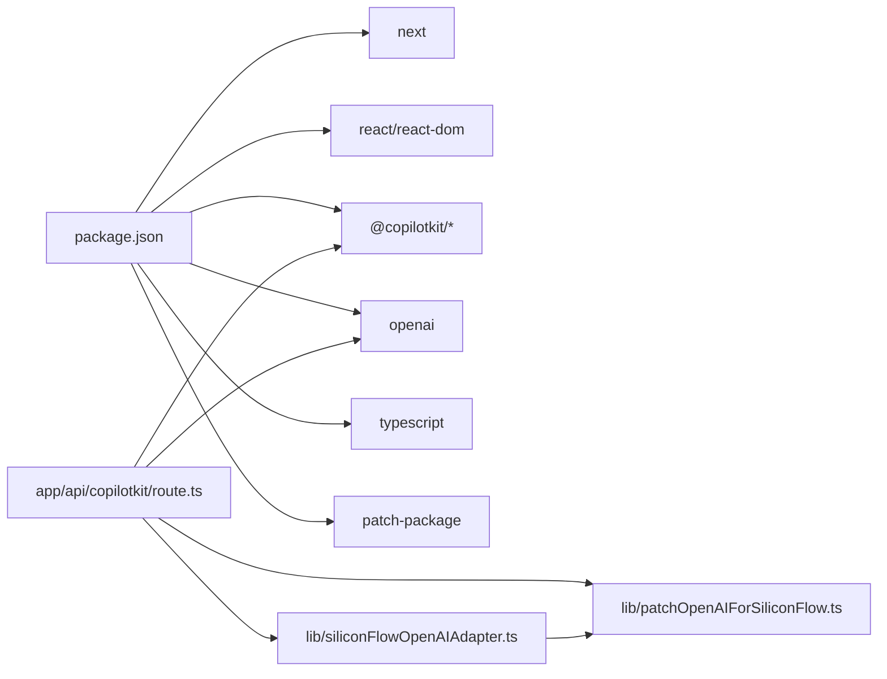

# 部署问题排查

<cite>
**本文引用的文件**
- [package.json](file://package.json)
- [next.config.js](file://next.config.js)
- [tsconfig.json](file://tsconfig.json)
- [patches/@copilotkitnext+agent+1.54.0.patch](file://patches/@copilotkitnext+agent+1.54.0.patch)
- [lib/patchOpenAIForSiliconFlow.ts](file://lib/patchOpenAIForSiliconFlow.ts)
- [lib/siliconFlowOpenAIAdapter.ts](file://lib/siliconFlowOpenAIAdapter.ts)
- [lib/siliconflow-defaults.ts](file://lib/siliconflow-defaults.ts)
- [app/layout.tsx](file://app/layout.tsx)
- [app/page.tsx](file://app/page.tsx)
- [app/api/copilotkit/route.ts](file://app/api/copilotkit/route.ts)
- [components/CopilotProviders.tsx](file://components/CopilotProviders.tsx)
- [components/MainPage.tsx](file://components/MainPage.tsx)
</cite>

## 目录
1. [简介](#简介)
2. [项目结构](#项目结构)
3. [核心组件](#核心组件)
4. [架构总览](#架构总览)
5. [详细组件分析](#详细组件分析)
6. [依赖分析](#依赖分析)
7. [性能考虑](#性能考虑)
8. [故障排除指南](#故障排除指南)
9. [结论](#结论)
10. [附录](#附录)

## 简介
本指南面向 Fuqianjiao AI 项目的部署与运维人员，聚焦以下目标：
- 常见部署环境配置问题：Node.js 版本兼容性、环境变量配置、依赖安装失败。
- 生产环境部署问题：构建失败、静态资源加载错误、服务器配置问题。
- 补丁包应用（patch-package）相关问题：使用注意事项、依赖冲突、版本兼容。
- Docker 容器化部署与 CI/CD 故障排除、云平台部署最佳实践。

本项目基于 Next.js 14，采用 App Router，前端通过 CopilotKit 与硅基流动（SiliconFlow）等 OpenAI 兼容网关进行流式对话，服务端通过自定义适配器与补丁修复兼容性问题。

## 项目结构
项目采用 Next.js App Router 结构，关键目录与文件如下：
- 应用入口与页面：app/layout.tsx、app/page.tsx
- API 路由：app/api/copilotkit/route.ts
- 组件：components/CopilotProviders.tsx、components/MainPage.tsx 等
- 适配与补丁：lib/siliconFlowOpenAIAdapter.ts、lib/patchOpenAIForSiliconFlow.ts、patches/@copilotkitnext+agent+1.54.0.patch
- 构建与类型配置：next.config.js、tsconfig.json
- 依赖与脚本：package.json

图表来源
- [app/layout.tsx:1-48](file://app/layout.tsx#L1-L48)
- [app/page.tsx:1-30](file://app/page.tsx#L1-L30)
- [components/CopilotProviders.tsx:1-157](file://components/CopilotProviders.tsx#L1-L157)
- [components/MainPage.tsx:1-691](file://components/MainPage.tsx#L1-L691)
- [app/api/copilotkit/route.ts:1-131](file://app/api/copilotkit/route.ts#L1-L131)
- [lib/siliconFlowOpenAIAdapter.ts:1-36](file://lib/siliconFlowOpenAIAdapter.ts#L1-L36)
- [lib/patchOpenAIForSiliconFlow.ts:1-22](file://lib/patchOpenAIForSiliconFlow.ts#L1-L22)
- [patches/@copilotkitnext+agent+1.54.0.patch:1-125](file://patches/@copilotkitnext+agent+1.54.0.patch#L1-L125)
- [next.config.js:1-4](file://next.config.js#L1-L4)
- [tsconfig.json:1-21](file://tsconfig.json#L1-L21)
- [package.json:1-29](file://package.json#L1-L29)

章节来源
- [package.json:1-29](file://package.json#L1-L29)
- [next.config.js:1-4](file://next.config.js#L1-L4)
- [tsconfig.json:1-21](file://tsconfig.json#L1-L21)

## 核心组件
- CopilotKit 服务端路由：负责接收前端请求，解析 API Key，选择适配器与模型，构造 CopilotRuntime，并将请求转发至 CopilotKit 端点。
- 适配器与补丁：SiliconFlow 兼容适配器将语言模型切换到 chat 接口；补丁修复 agent 流式事件顺序，确保工具调用结束事件在运行结束前发出。
- 前端 Provider：负责在客户端注入 CopilotKit 运行时、处理用户自定义 API Key、预检请求与异常响应兜底。
- 构建与类型配置：Next.js 与 TypeScript 配置影响产物与运行时行为。

章节来源
- [app/api/copilotkit/route.ts:1-131](file://app/api/copilotkit/route.ts#L1-L131)
- [lib/siliconFlowOpenAIAdapter.ts:1-36](file://lib/siliconFlowOpenAIAdapter.ts#L1-L36)
- [lib/patchOpenAIForSiliconFlow.ts:1-22](file://lib/patchOpenAIForSiliconFlow.ts#L1-L22)
- [components/CopilotProviders.tsx:1-157](file://components/CopilotProviders.tsx#L1-L157)
- [next.config.js:1-4](file://next.config.js#L1-L4)
- [tsconfig.json:1-21](file://tsconfig.json#L1-L21)

## 架构总览
下图展示了从浏览器到服务端 API，再到兼容网关的整体调用链与关键决策点。

图表来源
- [app/layout.tsx:1-48](file://app/layout.tsx#L1-L48)
- [components/CopilotProviders.tsx:1-157](file://components/CopilotProviders.tsx#L1-L157)
- [app/api/copilotkit/route.ts:1-131](file://app/api/copilotkit/route.ts#L1-L131)
- [lib/siliconFlowOpenAIAdapter.ts:1-36](file://lib/siliconFlowOpenAIAdapter.ts#L1-L36)
- [lib/patchOpenAIForSiliconFlow.ts:1-22](file://lib/patchOpenAIForSiliconFlow.ts#L1-L22)

## 详细组件分析

### 服务端 API 路由（/api/copilotkit）
职责与关键点：
- 优先从请求头读取用户自定义 Key，其次读取环境变量，最后使用内置默认值。
- 为每个 Key 缓存 Hono 处理函数，避免重复初始化 CopilotRuntime。
- 使用 SiliconFlow 兼容适配器，强制使用 chat 模型接口，适配网关限制。
- 代理 OpenAI SDK 的 beta.stream 到标准流式接口，解决兼容性问题。
- 为跨域场景导出 OPTIONS 预检方法。
- 提供 GET 健康检查，返回服务端配置状态与提示信息。

图表来源
- [app/api/copilotkit/route.ts:1-131](file://app/api/copilotkit/route.ts#L1-L131)
- [lib/siliconFlowOpenAIAdapter.ts:1-36](file://lib/siliconFlowOpenAIAdapter.ts#L1-L36)
- [lib/patchOpenAIForSiliconFlow.ts:1-22](file://lib/patchOpenAIForSiliconFlow.ts#L1-L22)

章节来源
- [app/api/copilotkit/route.ts:1-131](file://app/api/copilotkit/route.ts#L1-L131)

### 前端 Provider（CopilotProviders）
职责与关键点：
- 在客户端注入 CopilotKit 运行时，设置 runtimeUrl、禁用 Inspector 与开发控制台。
- 支持用户在「API」面板保存自定义 Key，保存到 localStorage 并随请求头发送。
- 通过 GET /api/copilotkit 拉取服务端 Key 配置状态，决定是否显示「访客可对话」。
- 对 /api/copilotkit 的 fetch 进行拦截，针对空响应体兜底为合法 JSON，避免 urql 解析异常。
- 依据用户覆盖 Key 或 NEXT_PUBLIC_SILICONFLOW_API_KEY 构造请求头。

图表来源
- [components/CopilotProviders.tsx:1-157](file://components/CopilotProviders.tsx#L1-L157)
- [app/api/copilotkit/route.ts:1-131](file://app/api/copilotkit/route.ts#L1-L131)

章节来源
- [components/CopilotProviders.tsx:1-157](file://components/CopilotProviders.tsx#L1-L157)

### 适配器与补丁（SiliconFlow 兼容）
- 适配器：将语言模型切换到 chat 接口，使流式聊天协议与网关兼容。
- 补丁：将 OpenAI SDK 的 beta.stream 代理到标准流式接口，避免网关不支持 beta 路径导致的 404。
- 补丁还修复 agent 的事件顺序，确保工具调用结束事件在运行结束前发出，避免“仍有活跃工具调用”的校验错误。

图表来源
- [lib/siliconFlowOpenAIAdapter.ts:1-36](file://lib/siliconFlowOpenAIAdapter.ts#L1-L36)
- [lib/patchOpenAIForSiliconFlow.ts:1-22](file://lib/patchOpenAIForSiliconFlow.ts#L1-L22)
- [patches/@copilotkitnext+agent+1.54.0.patch:1-125](file://patches/@copilotkitnext+agent+1.54.0.patch#L1-L125)

章节来源
- [lib/siliconFlowOpenAIAdapter.ts:1-36](file://lib/siliconFlowOpenAIAdapter.ts#L1-L36)
- [lib/patchOpenAIForSiliconFlow.ts:1-22](file://lib/patchOpenAIForSiliconFlow.ts#L1-L22)
- [patches/@copilotkitnext+agent+1.54.0.patch:1-125](file://patches/@copilotkitnext+agent+1.54.0.patch#L1-L125)

### 构建与类型配置
- next.config.js 为空配置，使用 Next.js 默认行为。
- tsconfig.json 启用严格类型检查开关与 bundler 模块解析，便于 App Router 与 ESM 使用。
- package.json 定义了构建、启动与 postinstall 脚本，postinstall 执行 patch-package 应用补丁。

章节来源
- [next.config.js:1-4](file://next.config.js#L1-L4)
- [tsconfig.json:1-21](file://tsconfig.json#L1-L21)
- [package.json:1-29](file://package.json#L1-L29)

## 依赖分析
- 运行时依赖：Next.js、React、@copilotkit/* 系列、OpenAI SDK。
- 开发依赖：patch-package、TypeScript、类型声明。
- 关键耦合点：服务端路由依赖适配器与补丁；前端 Provider 依赖服务端端点与环境变量；补丁作用于 node_modules 中的第三方包。

图表来源
- [package.json:1-29](file://package.json#L1-L29)
- [app/api/copilotkit/route.ts:1-131](file://app/api/copilotkit/route.ts#L1-L131)
- [lib/siliconFlowOpenAIAdapter.ts:1-36](file://lib/siliconFlowOpenAIAdapter.ts#L1-L36)
- [lib/patchOpenAIForSiliconFlow.ts:1-22](file://lib/patchOpenAIForSiliconFlow.ts#L1-L22)

章节来源
- [package.json:1-29](file://package.json#L1-L29)

## 性能考虑
- 服务端缓存：按 API Key 缓存 Hono 处理函数，避免重复初始化 CopilotRuntime，降低冷启动开销。
- 流式传输：使用 OpenAI 标准流式接口，减少中间层阻塞，提升响应速度。
- 构建优化：保持 Next.js 默认配置，避免不必要的自定义优化导致的兼容性问题。

## 故障排除指南

### 一、环境与依赖安装问题
- Node.js 版本兼容性
  - 症状：安装阶段报错、构建失败、运行时报模块解析错误。
  - 排查步骤：
    - 确认 Node.js 版本与 Next.js 14 的兼容范围（建议使用长期支持版本）。
    - 清理 node_modules 与 lock 文件后重装依赖。
  - 相关配置参考
    - [package.json:1-29](file://package.json#L1-L29)
    - [next.config.js:1-4](file://next.config.js#L1-L4)
    - [tsconfig.json:1-21](file://tsconfig.json#L1-L21)

- 依赖安装失败
  - 症状：npm/yarn/pnpm 安装过程中出现权限、网络或版本冲突错误。
  - 排查步骤：
    - 检查网络与镜像源配置，必要时切换为国内镜像。
    - 删除 node_modules、lock 文件与 .cache，重新安装。
    - 使用 --legacy-peer-deps 或 --force（谨慎）绕过 peer 依赖冲突。
  - 相关配置参考
    - [package.json:1-29](file://package.json#L1-L29)

- postinstall 与补丁包（patch-package）
  - 症状：安装后补丁未生效、运行时报第三方包相关错误。
  - 排查步骤：
    - 确认 postinstall 脚本已执行，补丁文件存在于 patches 目录。
    - 检查补丁目标文件是否与 node_modules 中的实际路径一致。
    - 如补丁失效，删除 node_modules 与缓存后重新安装，确保补丁再次应用。
  - 相关配置参考
    - [package.json:1-29](file://package.json#L1-L29)
    - [patches/@copilotkitnext+agent+1.54.0.patch:1-125](file://patches/@copilotkitnext+agent+1.54.0.patch#L1-L125)

### 二、生产环境构建与启动问题
- 构建失败
  - 症状：next build 报错，类型检查失败或模块解析异常。
  - 排查步骤：
    - 检查 tsconfig.json 的 strict、moduleResolution 等选项是否与项目实际一致。
    - 确保所有页面与组件遵循 App Router 的命名规范与路径约定。
    - 查看具体报错信息，定位到具体文件与行号，修正类型或导入路径。
  - 相关配置参考
    - [tsconfig.json:1-21](file://tsconfig.json#L1-L21)
    - [next.config.js:1-4](file://next.config.js#L1-L4)

- 静态资源加载错误
  - 症状：图片、字体或音频资源 404 或跨域错误。
  - 排查步骤：
    - 检查 public 目录下的资源路径与引用方式，确保相对路径正确。
    - 在 layout.tsx 中预加载音频资源时，确认 NEXT_PUBLIC_AUDIO_SRC 环境变量指向有效地址。
  - 相关配置参考
    - [app/layout.tsx:1-48](file://app/layout.tsx#L1-L48)

- 服务器配置问题
  - 症状：服务端路由无法访问、OPTIONS 预检失败、跨域错误。
  - 排查步骤：
    - 确认 API 路由导出了 POST 与 OPTIONS 方法。
    - 检查运行时环境（如 Vercel）的环境变量配置（SILICONFLOW_API_KEY、SILICONFLOW_MODEL、SILICONFLOW_BASE_URL）。
  - 相关配置参考
    - [app/api/copilotkit/route.ts:1-131](file://app/api/copilotkit/route.ts#L1-L131)

### 三、补丁包应用相关问题
- 使用注意事项
  - 补丁仅对 node_modules 中的第三方包生效，升级依赖后可能失效。
  - 修改补丁后需重新安装依赖以应用变更。
- 依赖冲突与版本兼容
  - 若出现类型不兼容或运行时异常，检查第三方包版本与补丁目标版本是否一致。
  - 必要时在本地临时禁用补丁，定位具体冲突模块并升级或降级版本。
- 版本兼容性处理
  - 通过适配器与补丁共同解决网关差异，确保流式接口与事件顺序符合预期。
  - 相关实现参考
    - [lib/siliconFlowOpenAIAdapter.ts:1-36](file://lib/siliconFlowOpenAIAdapter.ts#L1-L36)
    - [lib/patchOpenAIForSiliconFlow.ts:1-22](file://lib/patchOpenAIForSiliconFlow.ts#L1-L22)
    - [patches/@copilotkitnext+agent+1.54.0.patch:1-125](file://patches/@copilotkitnext+agent+1.54.0.patch#L1-L125)

### 四、Docker 容器化部署与 CI/CD
- Docker 部署建议
  - 使用多阶段构建，缩小镜像体积并减少攻击面。
  - 在构建阶段安装依赖并执行 next build，在运行阶段仅保留生产所需文件。
  - 设置环境变量（NEXT_PUBLIC_* 与服务端密钥）通过镜像参数或编排系统注入。
- CI/CD 故障排除
  - 构建缓存：确保缓存命中策略包含依赖安装与构建缓存。
  - 端到端测试：在流水线中增加健康检查与关键路由测试（GET /api/copilotkit）。
  - 日志与回滚：启用详细日志，失败时快速回滚至上一稳定版本。
- 云平台部署最佳实践
  - 使用平台提供的环境变量与密钥管理服务，避免硬编码。
  - 配置健康检查与扩缩容策略，确保服务可用性与弹性。
  - 对静态资源与 API 路由进行 CDN 加速与边缘缓存优化。

### 五、常见错误定位清单
- “未配置有效的硅基流动 API Key”
  - 检查请求头、环境变量与默认值是否正确配置。
  - 参考
    - [app/api/copilotkit/route.ts:28-43](file://app/api/copilotkit/route.ts#L28-L43)
- “AI_APICallError: Not Found”
  - 检查模型名称与网关支持情况，确认使用 /v1/chat/completions 而非 beta 路径。
  - 参考
    - [app/api/copilotkit/route.ts:16-25](file://app/api/copilotkit/route.ts#L16-L25)
    - [lib/patchOpenAIForSiliconFlow.ts:1-22](file://lib/patchOpenAIForSiliconFlow.ts#L1-L22)
- “Cannot send RUN_FINISHED while tool calls are still active”
  - 确认补丁已应用，工具调用结束事件在运行结束前发出。
  - 参考
    - [patches/@copilotkitnext+agent+1.54.0.patch:1-125](file://patches/@copilotkitnext+agent+1.54.0.patch#L1-L125)
- “Content-Length: 0” 导致的 JSON 解析异常
  - 检查前端 fetch 拦截逻辑是否正确兜底为空响应。
  - 参考
    - [components/CopilotProviders.tsx:63-87](file://components/CopilotProviders.tsx#L63-L87)

## 结论
本指南围绕 Fuqianjiao AI 项目的部署与运维，系统梳理了环境配置、依赖安装、生产构建、补丁应用与云平台部署的关键问题与排查流程。通过明确服务端路由、适配器与补丁的作用边界，结合前端 Provider 的关键行为，可高效定位并解决部署过程中的大多数问题。建议在 CI/CD 中固化检查点与回滚策略，确保发布质量与稳定性。

## 附录
- 关键文件索引
  - [package.json:1-29](file://package.json#L1-L29)
  - [next.config.js:1-4](file://next.config.js#L1-L4)
  - [tsconfig.json:1-21](file://tsconfig.json#L1-L21)
  - [patches/@copilotkitnext+agent+1.54.0.patch:1-125](file://patches/@copilotkitnext+agent+1.54.0.patch#L1-L125)
  - [lib/patchOpenAIForSiliconFlow.ts:1-22](file://lib/patchOpenAIForSiliconFlow.ts#L1-L22)
  - [lib/siliconFlowOpenAIAdapter.ts:1-36](file://lib/siliconFlowOpenAIAdapter.ts#L1-L36)
  - [lib/siliconflow-defaults.ts:1-16](file://lib/siliconflow-defaults.ts#L1-L16)
  - [app/layout.tsx:1-48](file://app/layout.tsx#L1-L48)
  - [app/page.tsx:1-30](file://app/page.tsx#L1-L30)
  - [app/api/copilotkit/route.ts:1-131](file://app/api/copilotkit/route.ts#L1-L131)
  - [components/CopilotProviders.tsx:1-157](file://components/CopilotProviders.tsx#L1-L157)
  - [components/MainPage.tsx:1-691](file://components/MainPage.tsx#L1-L691)