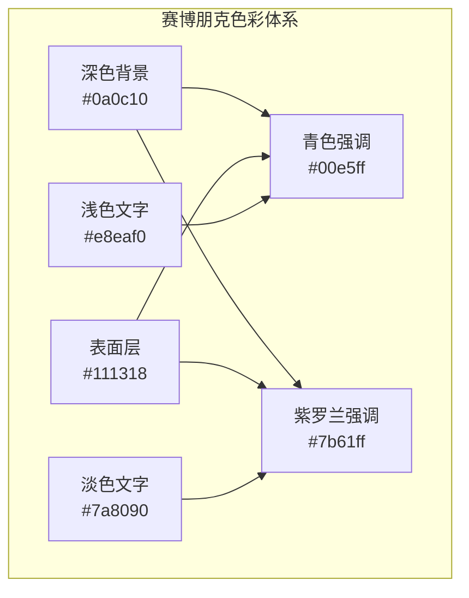
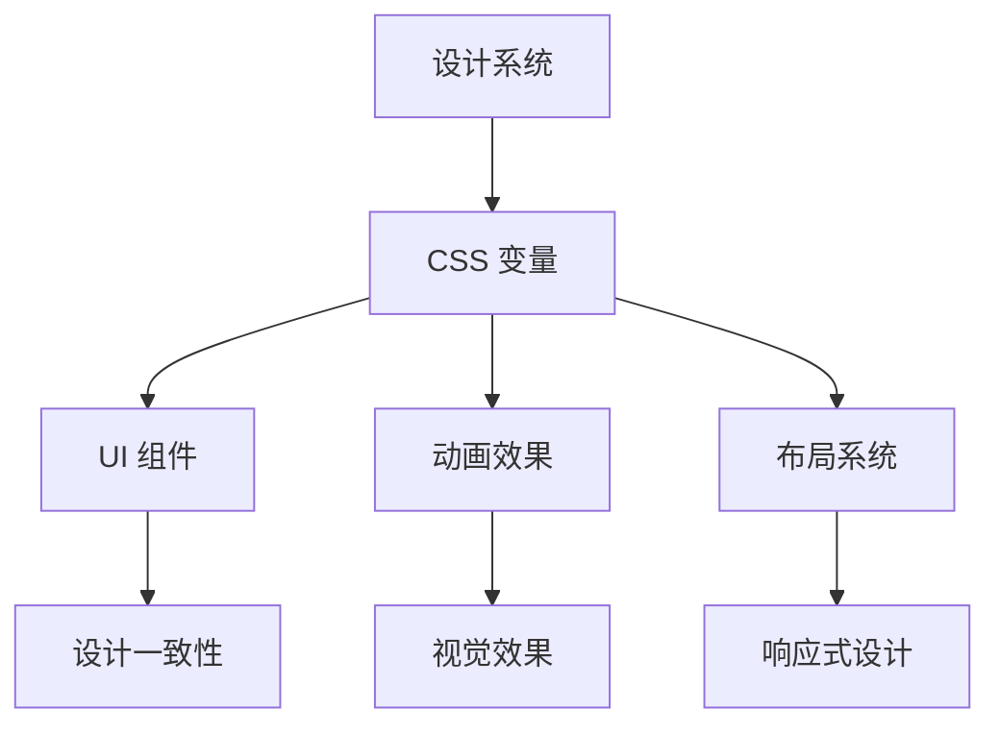
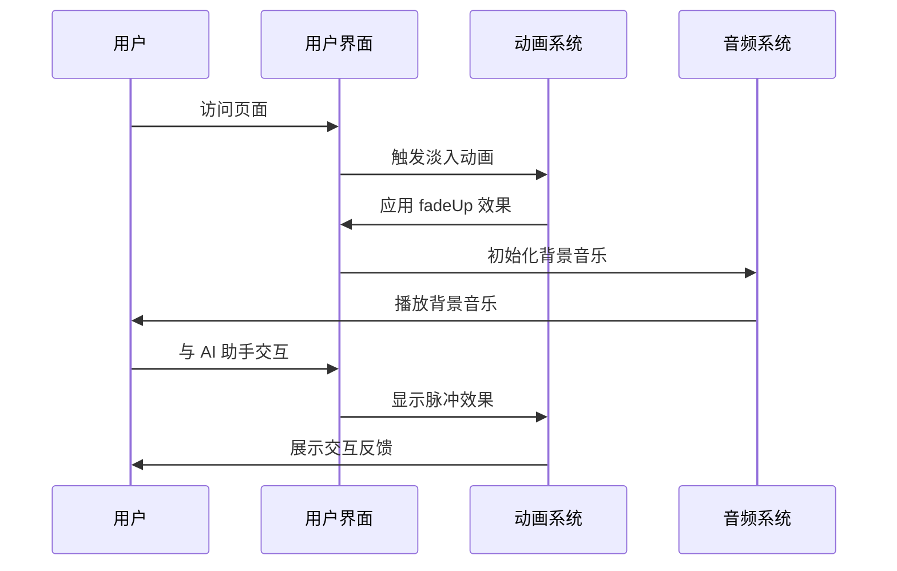
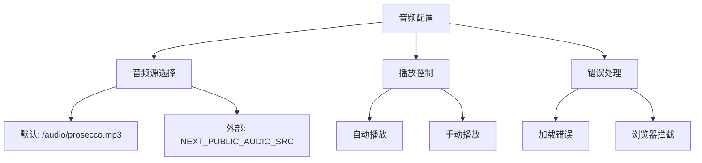
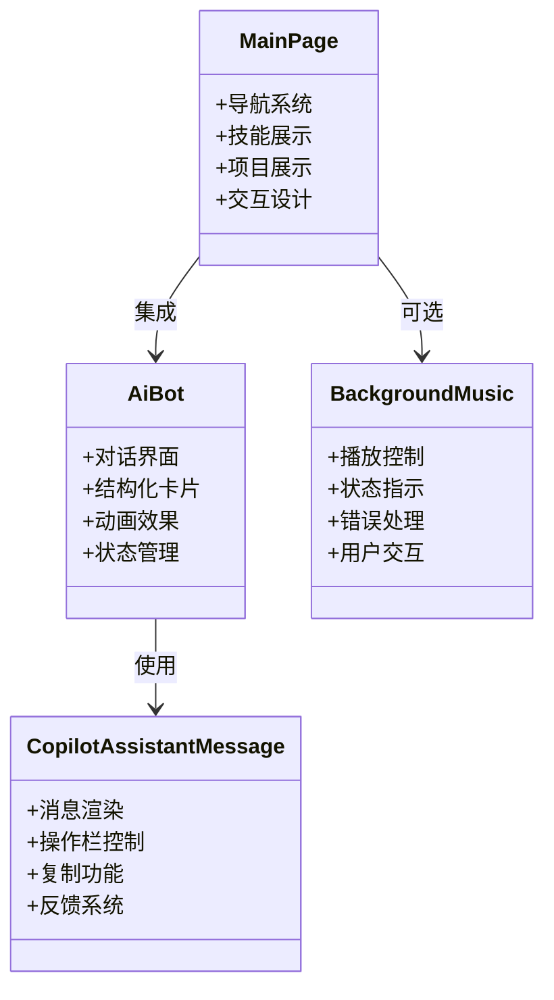
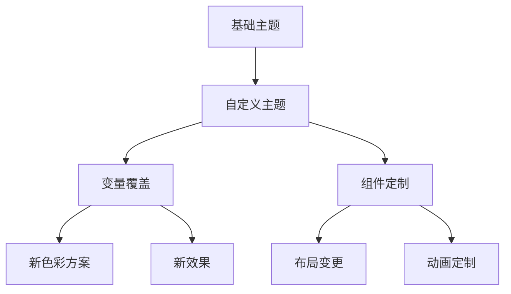
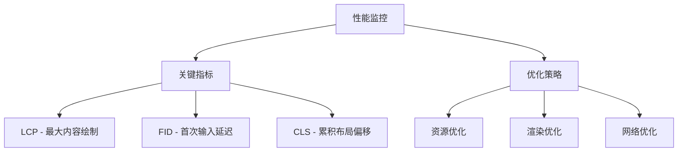

# 用户界面系统

<cite>
**本文档引用的文件**
- [app/globals.css](file://app/globals.css)
- [app/layout.tsx](file://app/layout.tsx)
- [app/page.tsx](file://app/page.tsx)
- [components/MainPage.tsx](file://components/MainPage.tsx)
- [components/BackgroundMusic.tsx](file://components/BackgroundMusic.tsx)
- [components/AiBot.tsx](file://components/AiBot.tsx)
- [components/CopilotProviders.tsx](file://components/CopilotProviders.tsx)
- [components/CopilotAssistantMessage.tsx](file://components/CopilotAssistantMessage.tsx)
- [lib/resumeData.ts](file://lib/resumeData.ts)
- [package.json](file://package.json)
- [next.config.js](file://next.config.js)
</cite>

## 目录
1. [项目概述](#项目概述)
2. [赛博朋克主题设计理念](#赛博朋克主题设计理念)
3. [CSS 变量系统](#css-变量系统)
4. [动画效果实现](#动画效果实现)
5. [响应式设计策略](#响应式设计策略)
6. [背景音乐系统](#背景音乐系统)
7. [UI 组件设计规范](#ui-组件设计规范)
8. [主题扩展机制](#主题扩展机制)
9. [性能优化建议](#性能优化建议)
10. [跨浏览器兼容性](#跨浏览器兼容性)
11. [最佳实践指南](#最佳实践指南)
12. [总结](#总结)

## 项目概述

Fuqianjiao AI 项目是一个采用赛博朋克主题设计的个人作品集网站，集成了 AI 助手功能和背景音乐系统。该项目展示了现代 Web 技术栈在创意项目中的应用，包括 Next.js、React、TypeScript 和 CopilotKit。

项目的核心特色：
- **赛博朋克美学**：深色背景、霓虹色彩、未来感设计
- **AI 助手集成**：基于 CopilotKit 的智能对话系统
- **沉浸式体验**：背景音乐与视觉设计的完美结合
- **响应式布局**：适配各种设备尺寸的现代化设计

## 赛博朋克主题设计理念

### 色彩体系设计

项目采用了经典的赛博朋克配色方案，通过精心设计的色彩搭配营造未来科技感：



**Section sources**
- [app/globals.css:2-12](file://app/globals.css#L2-L12)

### 设计元素应用

赛博朋克主题在各个层面得到了充分体现：

1. **渐变效果**：使用青色到紫罗兰的渐变营造科技感
2. **霓虹光晕**：通过阴影和发光效果模拟霓虹灯效果
3. **几何图形**：圆形、药丸形状等未来感元素
4. **字体选择**：现代无衬线字体与等宽字体的组合

## CSS 变量系统

### 核心变量定义

项目建立了完整的 CSS 变量系统，确保设计的一致性和可维护性：

| 变量名 | 值 | 用途 |
|--------|-----|------|
| `--bg` | #0a0c10 | 主背景色 |
| `--surface` | #111318 | 表面层背景色 |
| `--surface2` | #181c24 | 第二表面层背景色 |
| `--accent` | #00e5ff | 青色强调色 |
| `--accent2` | #7b61ff | 紫罗兰强调色 |
| `--text` | #e8eaf0 | 主要文字颜色 |
| `--text-dim` | #7a8090 | 次要文字颜色 |
| `--border` | rgba(0, 229, 255, 0.12) | 边框颜色 |
| `--glow` | 0 0 30px rgba(0, 229, 255, 0.15) | 光晕效果 |

### 变量使用模式

CSS 变量在整个项目中得到广泛应用，确保主题的一致性：



**Section sources**
- [app/globals.css:1-23](file://app/globals.css#L1-L23)

## 动画效果实现

### 关键帧动画定义

项目实现了多种动画效果，增强用户体验和视觉吸引力：

#### 基础动画效果

1. **淡入动画** (`fadeUp`)
   - 从底部移动到当前位置
   - 透明度从 0 到 1 渐变

2. **脉冲动画** (`pulse`)
   - 缩放效果，从 1 到 0.7 再回到 1
   - 透明度变化增强视觉效果

3. **呼吸动画** (`fabCyberPulse`)
   - 霓虹灯效果的呼吸式闪烁
   - 使用多重阴影模拟光晕

#### AI 助手专用动画

1. **闪烁动画** (`fcBlink`)
   - 用于 Function Calling 状态指示
   - 0.6 秒间隔的交替闪烁

2. **Orb 脉冲** (`orbPulse`)
   - 旋转球体的脉冲效果
   - 1.18 倍缩放的呼吸式动画

### 动画应用场景



**Section sources**
- [app/globals.css:93-101](file://app/globals.css#L93-L101)
- [app/globals.css:516-534](file://app/globals.css#L516-L534)

## 响应式设计策略

### 移动优先设计

项目采用移动优先的响应式设计策略，确保在各种设备上的良好表现：

#### 主要断点设置

| 断点 | 设备类型 | 网格布局 |
|------|----------|----------|
| 480px | 小屏手机 | 单列网格 |
| 768px | 大屏手机 | 双列网格 |
| 1024px | 平板 | 固定列数 |
| 1200px | 桌面机 | 最大化布局 |

#### 数字团队网格系统

```mermaid
graph LR
subgraph "数字团队网格"
Mobile[小屏: 单列<br/>1fr]
Tablet[中屏: 双列<br/>repeat(2, minmax(0, 1fr))]
Desktop[桌面: 固定<br/>1fr 1fr 1fr 1fr]
end
Mobile --> Tablet
Tablet --> Desktop
```

**Section sources**
- [app/globals.css:500-508](file://app/globals.css#L500-L508)
- [components/MainPage.tsx:203-251](file://components/MainPage.tsx#L203-L251)

### 滚动条定制

项目实现了自定义滚动条样式，符合整体设计风格：

- **宽度**：4px 细滚动条
- **轨道**：透明背景
- **滑块**：青色渐变，悬停时加深
- **圆角**：2px 圆角设计

## 背景音乐系统

### 音频播放控制

背景音乐系统提供了完整的音频播放控制功能：

#### 核心功能特性

1. **自动播放检测**
   - 页面加载后尝试自动播放
   - 检测浏览器拦截并提供手动播放选项
   - 智能错误处理和状态反馈

2. **播放状态管理**
   - 静音/取消静音切换
   - 音量调节控制
   - 播放/暂停状态同步

3. **预加载优化**
   - 使用 `preload="auto"` 提前加载音频
   - `waitUntilPlayable` 确保缓冲完成后再播放
   - 支持同源和跨域音频源

### 音频配置选项



**Section sources**
- [components/BackgroundMusic.tsx:36-141](file://components/BackgroundMusic.tsx#L36-L141)
- [app/layout.tsx:13-35](file://app/layout.tsx#L13-L35)

### 用户交互设计

背景音乐控制面板提供了直观的用户交互：

1. **状态指示**
   - 静音状态：特殊图标显示
   - 播放状态：青色强调
   - 错误状态：红色警告

2. **控制面板**
   - 音量滑块调节
   - 开始播放按钮
   - 静音切换按钮
   - 错误信息提示

## UI 组件设计规范

### 组件架构设计

项目采用模块化的组件架构，每个组件都有明确的设计规范：

#### 主要组件分类

1. **页面级组件**
   - MainPage：主页内容展示
   - ProjectPage：项目详情页面
   - Project2Page：第二个项目页面

2. **功能组件**
   - AiBot：AI 助手对话框
   - BackgroundMusic：背景音乐控制器
   - CopilotProviders：AI 助手提供者

3. **工具组件**
   - CopilotAssistantMessage：自定义助手消息
   - ResumeData：简历数据管理

### 设计规范统一



**Section sources**
- [components/MainPage.tsx:127-691](file://components/MainPage.tsx#L127-L691)
- [components/AiBot.tsx:1-800](file://components/AiBot.tsx#L1-L800)

## 主题扩展机制

### CSS 变量扩展

项目提供了灵活的主题扩展机制：

#### 变量覆盖系统



#### 扩展点设计

1. **色彩扩展**
   - 新增色彩变量
   - 更新现有色彩映射
   - 创建新的强调色方案

2. **动画扩展**
   - 添加新的关键帧动画
   - 创建动画组合效果
   - 实现响应式动画

3. **组件扩展**
   - 新增组件类型
   - 扩展现有组件功能
   - 创建复合组件

### 组件定制选项

项目中的组件都支持一定程度的定制：

#### AiBot 组件定制

- **消息样式**：支持自定义消息外观
- **卡片布局**：可调整卡片显示方式
- **交互行为**：可修改交互响应
- **动画效果**：可替换或禁用动画

**Section sources**
- [components/AiBot.tsx:28-31](file://components/AiBot.tsx#L28-L31)
- [app/globals.css:103-108](file://app/globals.css#L103-L108)

## 性能优化建议

### 音频性能优化

1. **预加载策略**
   - 使用 `preload="auto"` 提前加载
   - 实现缓冲等待机制
   - 优化音频格式选择

2. **内存管理**
   - 及时清理音频事件监听器
   - 合理管理音频对象生命周期
   - 避免内存泄漏

### 渲染性能优化

1. **动画性能**
   - 使用 `transform` 和 `opacity` 进行动画
   - 避免触发重排的属性
   - 合理使用 `will-change` 属性

2. **组件性能**
   - 实现必要的 `useMemo` 和 `useCallback`
   - 优化重渲染频率
   - 使用 React.lazy 进行代码分割

### 资源优化

1. **图片优化**
   - 使用现代图片格式（WebP）
   - 实现响应式图片
   - 适当的图片懒加载

2. **CSS 优化**
   - 移除未使用的 CSS
   - 压缩和合并 CSS 文件
   - 使用 CSS-in-JS 合理缓存

## 跨浏览器兼容性

### 浏览器支持策略

项目针对现代浏览器进行了优化，同时考虑了兼容性问题：

#### 核心浏览器支持

- **Chrome**：完全支持
- **Firefox**：完全支持  
- **Safari**：主要功能支持
- **Edge**：完全支持

#### 兼容性处理

1. **CSS 前缀处理**
   - 自动添加必要的 CSS 前缀
   - 使用 PostCSS 进行兼容性处理
   - 渐进增强策略

2. **JavaScript 兼容性**
   - 使用 Babel 转译
   - 提供必要的 polyfill
   - 功能检测而非浏览器检测

3. **媒体查询兼容**
   - 使用标准媒体查询语法
   - 提供降级方案
   - 测试不同设备表现

### 性能监控



## 最佳实践指南

### 设计实践

1. **一致性原则**
   - 保持色彩、字体、间距的一致性
   - 统一组件样式和交互模式
   - 建立设计系统文档

2. **可访问性设计**
   - 确保足够的颜色对比度
   - 支持键盘导航
   - 提供屏幕阅读器支持

3. **用户体验优化**
   - 提供清晰的视觉层次
   - 实现流畅的过渡动画
   - 确保交互的即时反馈

### 开发实践

1. **代码组织**
   - 模块化组件设计
   - 清晰的文件命名约定
   - 完善的注释和文档

2. **状态管理**
   - 合理的状态划分
   - 状态持久化策略
   - 错误状态处理

3. **测试策略**
   - 单元测试覆盖
   - 集成测试验证
   - 用户体验测试

### 部署实践

1. **构建优化**
   - 代码分割和懒加载
   - 资源压缩和优化
   - 缓存策略配置

2. **监控和维护**
   - 性能监控设置
   - 错误日志收集
   - 用户反馈收集

## 总结

Fuqianjiao AI 项目的用户界面系统展现了现代 Web 开发的最佳实践，成功地将赛博朋克美学与功能性需求相结合。通过精心设计的 CSS 变量系统、丰富的动画效果、完善的响应式设计和智能的背景音乐系统，创造了一个沉浸式的用户体验。

### 核心成就

1. **设计一致性**：通过 CSS 变量系统确保了设计的一致性和可维护性
2. **用户体验**：流畅的动画效果和直观的交互设计提升了用户满意度
3. **技术先进性**：采用最新的 Web 技术栈和最佳实践
4. **可扩展性**：模块化的架构设计便于功能扩展和维护

### 未来发展

项目为未来的扩展奠定了坚实的基础，包括：
- 更丰富的主题定制选项
- 增强的 AI 助手功能
- 更多的交互动画效果
- 改进的性能优化策略

这个项目不仅展示了技术实力，更重要的是体现了设计思维和技术实现的完美结合，为类似的创意项目提供了宝贵的参考和借鉴。