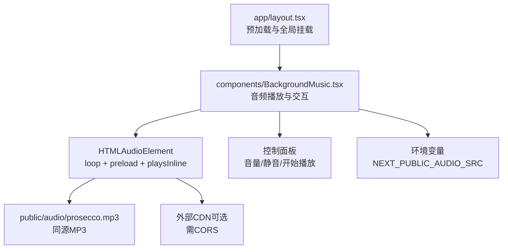
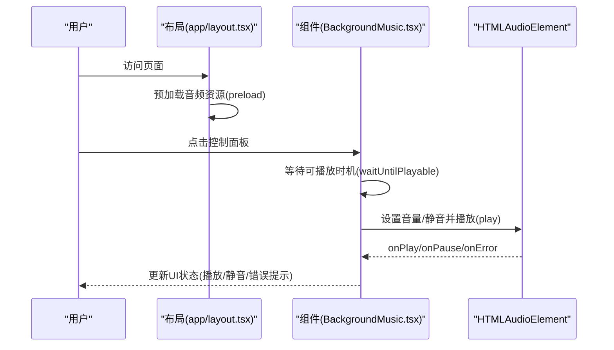
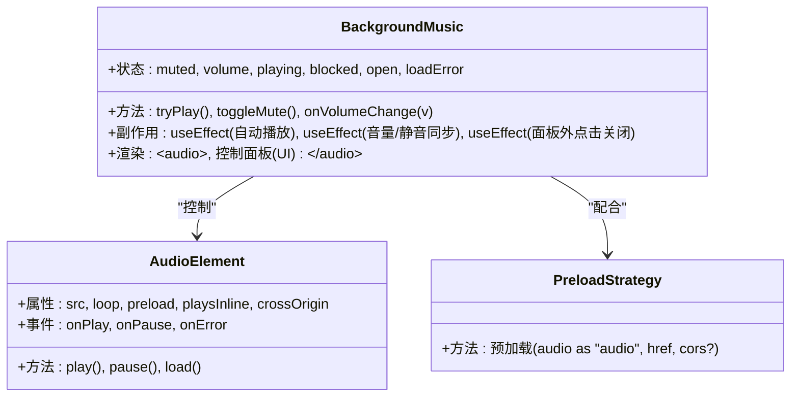
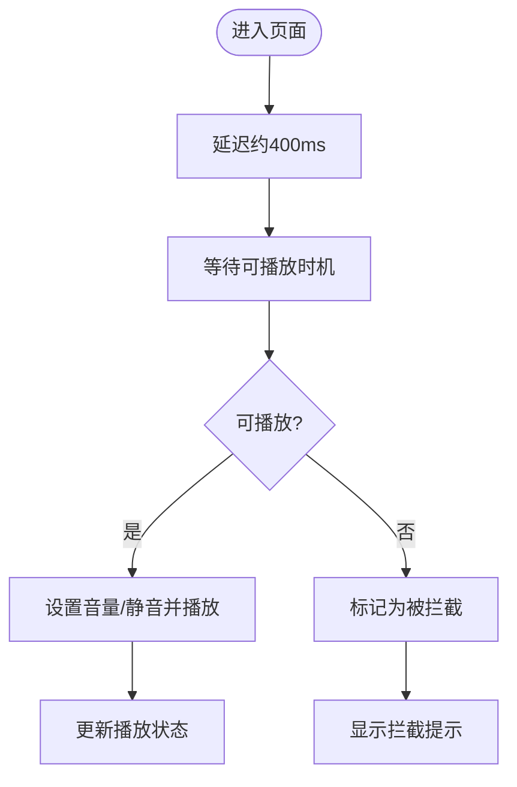
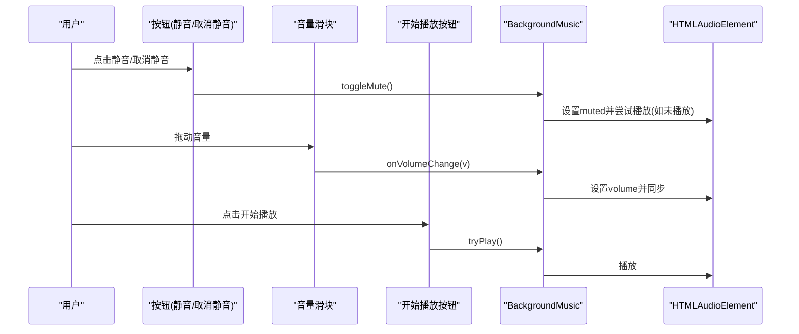
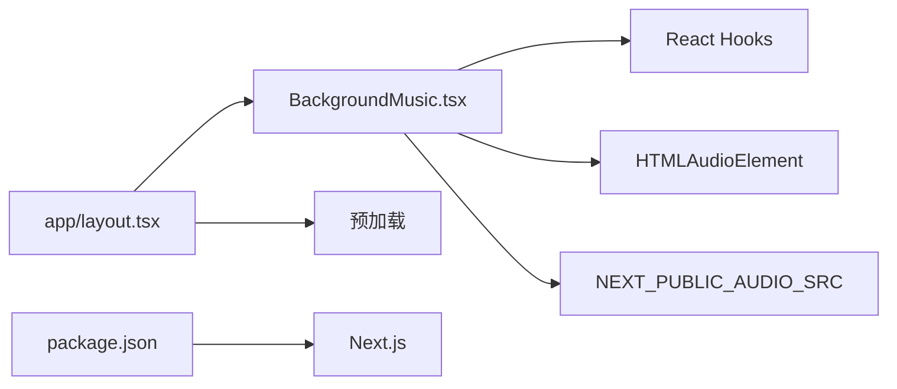

# 背景音乐系统

<cite>
**本文档引用的文件**
- [components/BackgroundMusic.tsx](file://components/BackgroundMusic.tsx)
- [app/layout.tsx](file://app/layout.tsx)
- [public/audio/README.md](file://public/audio/README.md)
- [package.json](file://package.json)
- [next.config.js](file://next.config.js)
</cite>

## 目录
1. [简介](#简介)
2. [项目结构](#项目结构)
3. [核心组件](#核心组件)
4. [架构总览](#架构总览)
5. [详细组件分析](#详细组件分析)
6. [依赖分析](#依赖分析)
7. [性能考量](#性能考量)
8. [故障排查指南](#故障排查指南)
9. [结论](#结论)
10. [附录](#附录)

## 简介
本项目在全站范围内提供背景音乐播放能力，采用 HTMLAudioElement 实现，支持自动播放、静音控制、音量调节、循环播放与错误处理。系统通过预加载策略优化首次缓冲，确保在移动端与受限网络环境下也能流畅播放。组件提供简洁直观的 UI 控制面板，便于用户随时开启/暂停、调节音量与解除浏览器自动播放拦截。

## 项目结构
背景音乐系统主要由以下部分组成：
- 组件层：BackgroundMusic.tsx 提供音频播放与交互控制
- 布局层：app/layout.tsx 注入预加载与全局挂载点
- 资源层：public/audio/README.md 说明音频文件放置与转换方式
- 配置层：next.config.js 与 package.json 提供构建与运行环境

**图表来源**
- [app/layout.tsx:13-35](file://app/layout.tsx#L13-L35)
- [components/BackgroundMusic.tsx:126-141](file://components/BackgroundMusic.tsx#L126-L141)
- [public/audio/README.md:3-6](file://public/audio/README.md#L3-L6)

**章节来源**
- [app/layout.tsx:19-47](file://app/layout.tsx#L19-L47)
- [components/BackgroundMusic.tsx:36-307](file://components/BackgroundMusic.tsx#L36-L307)
- [public/audio/README.md:1-13](file://public/audio/README.md#L1-L13)

## 核心组件
- BackgroundMusic 组件
  - 状态管理：静音(muted)、音量(volume)、播放中(playing)、被拦截(blocked)、面板打开(open)、加载错误(loadError)
  - 关键行为：自动播放延时、等待可播放时机、音量与静音同步、错误处理、外部CDN跨域设置
  - UI 交互：点击按钮打开控制面板，滑块调节音量，静音/取消静音，点击“开始播放”解除拦截
  - 音频属性：loop 循环播放、preload="auto" 预加载、playsInline 移动端内联播放

**章节来源**
- [components/BackgroundMusic.tsx:36-122](file://components/BackgroundMusic.tsx#L36-L122)
- [components/BackgroundMusic.tsx:124-307](file://components/BackgroundMusic.tsx#L124-L307)

## 架构总览
背景音乐系统采用“组件 + 预加载 + 环境变量”的架构：
- 组件负责播放控制与用户交互
- 布局负责预加载音频资源，减少首屏等待
- 环境变量支持同源或外部CDN两种部署模式

**图表来源**
- [app/layout.tsx:27-35](file://app/layout.tsx#L27-L35)
- [components/BackgroundMusic.tsx:17-34](file://components/BackgroundMusic.tsx#L17-L34)
- [components/BackgroundMusic.tsx:57-92](file://components/BackgroundMusic.tsx#L57-L92)

## 详细组件分析

### 组件类图

**图表来源**
- [components/BackgroundMusic.tsx:36-122](file://components/BackgroundMusic.tsx#L36-L122)
- [components/BackgroundMusic.tsx:126-141](file://components/BackgroundMusic.tsx#L126-L141)
- [app/layout.tsx:13-35](file://app/layout.tsx#L13-L35)

### 播放控制流程
- 自动播放：组件在挂载后延迟约 400ms 再尝试播放，期间等待可播放时机
- 可播放时机：通过监听 canplay/canplaythrough 或超时（最多 15 秒）判定
- 用户交互：点击“开始播放”或调整音量/静音也会触发播放尝试

**图表来源**
- [components/BackgroundMusic.tsx:73-92](file://components/BackgroundMusic.tsx#L73-L92)
- [components/BackgroundMusic.tsx:17-34](file://components/BackgroundMusic.tsx#L17-L34)

### 用户交互设计
- 控制面板：固定在页面底部左侧，点击按钮展开
- 静音控制：切换静音状态，自动同步到音频元素
- 音量调节：范围输入框，实时更新音量并同步到音频元素
- 开始播放：当被拦截时显示按钮，点击解除拦截并播放

**图表来源**
- [components/BackgroundMusic.tsx:111-122](file://components/BackgroundMusic.tsx#L111-L122)
- [components/BackgroundMusic.tsx:57-71](file://components/BackgroundMusic.tsx#L57-L71)

### 预加载优化策略
- 预加载：在布局中使用 <link rel="preload" as="audio"> 提前加载音频资源
- 跨域：当使用外部CDN时设置 crossOrigin="anonymous"
- 预加载时机：根据 NEXT_PUBLIC_AUDIO_SRC 或默认同源路径动态决定

**章节来源**
- [app/layout.tsx:13-35](file://app/layout.tsx#L13-L35)

### 音频组件状态管理
- 播放状态：playing 由 onPlay/onPause 事件驱动
- 拦截状态：blocked 在播放失败时置位
- 加载错误：loadError 在 onError 时置位
- 面板状态：open 控制控制面板显示/隐藏
- 外部源：isExternalSrc 判断是否为外部CDN并设置跨域

**章节来源**
- [components/BackgroundMusic.tsx:36-109](file://components/BackgroundMusic.tsx#L36-L109)

### 音频格式与浏览器兼容性
- 格式：仅使用 MP3（public/audio/prosecco.mp3），避免多格式切换导致的额外请求与解码卡顿
- 浏览器策略：移动端 playsInline 与预加载配合，减少自动播放拦截
- 外部CDN：需支持跨域播放（CORS）

**章节来源**
- [public/audio/README.md:3-6](file://public/audio/README.md#L3-L6)
- [components/BackgroundMusic.tsx:130-133](file://components/BackgroundMusic.tsx#L130-L133)

### 移动端适配方案
- 内联播放：playsInline 确保音频在移动端以内联方式播放
- 预加载：提前加载音频，降低移动端首帧等待
- 交互：通过控制面板显式触发播放，规避自动播放限制

**章节来源**
- [components/BackgroundMusic.tsx:130-133](file://components/BackgroundMusic.tsx#L130-L133)
- [app/layout.tsx:27-35](file://app/layout.tsx#L27-L35)

## 依赖分析
- 组件依赖
  - React Hooks：useRef/useEffect/useMemo/useCallback/useState
  - HTMLAudioElement：播放、暂停、错误处理
  - 环境变量：NEXT_PUBLIC_AUDIO_SRC
- 构建与运行
  - Next.js：页面布局与预加载
  - package.json：运行时依赖

**图表来源**
- [components/BackgroundMusic.tsx:3-3](file://components/BackgroundMusic.tsx#L3-L3)
- [app/layout.tsx:27-35](file://app/layout.tsx#L27-L35)
- [package.json:12-20](file://package.json#L12-L20)

**章节来源**
- [package.json:12-20](file://package.json#L12-L20)
- [next.config.js:1-4](file://next.config.js#L1-L4)

## 性能考量
- 预加载策略：使用 preload="auto" 与 <link rel="preload">，显著减少首屏卡顿
- 缓冲等待：waitUntilPlayable 在 readyState 达到 HAVE_FUTURE_DATA 时才播放，避免断续
- 单格式播放：仅使用 MP3，减少解码与切换成本
- 移动端优化：playsInline 与预加载结合，提高自动播放成功率
- 外部CDN：启用 CORS，避免跨域导致的额外失败重试

[本节为通用性能指导，无需特定文件引用]

## 故障排查指南
- 无法加载音频
  - 检查 public/audio/prosecco.mp3 是否存在且已提交
  - 若使用外部CDN，确认地址可访问且支持CORS
- 浏览器拦截自动播放
  - 点击控制面板中的“开始播放”按钮
  - 确认用户手势触发播放
- 音量无效或静音不生效
  - 确认音量值与静音状态同步到音频元素
  - 检查音量滑块事件绑定

**章节来源**
- [components/BackgroundMusic.tsx:136-140](file://components/BackgroundMusic.tsx#L136-L140)
- [components/BackgroundMusic.tsx:111-122](file://components/BackgroundMusic.tsx#L111-L122)
- [public/audio/README.md:5-6](file://public/audio/README.md#L5-L6)

## 结论
背景音乐系统通过简洁的组件设计与合理的预加载策略，在保证用户体验的同时兼顾了性能与兼容性。其单格式、预加载与显式交互的设计，有效降低了自动播放拦截与缓冲卡顿的风险。开发者可根据需要选择同源或外部CDN部署，并遵循CORS与移动端内联播放的最佳实践。

[本节为总结性内容，无需特定文件引用]

## 附录

### API 使用指南
- 环境变量
  - NEXT_PUBLIC_AUDIO_SRC：可选，外部CDN地址（需支持CORS）
- 组件属性
  - 音频元素属性：src、loop、preload、playsInline、crossOrigin
  - 事件回调：onPlay、onPause、onError
- 控制方法
  - tryPlay：等待可播放时机后播放
  - toggleMute：切换静音状态
  - onVolumeChange：设置音量并同步到音频元素

**章节来源**
- [components/BackgroundMusic.tsx:46-55](file://components/BackgroundMusic.tsx#L46-L55)
- [components/BackgroundMusic.tsx:126-141](file://components/BackgroundMusic.tsx#L126-L141)
- [components/BackgroundMusic.tsx:57-71](file://components/BackgroundMusic.tsx#L57-L71)

### 集成最佳实践
- 部署模式
  - 推荐使用同源 MP3（public/audio/prosecco.mp3），确保缓存与稳定性
  - 外部CDN需配置CORS，避免跨域错误
- 性能优化
  - 使用预加载与预设音量，减少首帧等待
  - 保持单一音频格式，避免多格式切换
- 用户体验
  - 显式提供“开始播放”按钮，降低拦截风险
  - 提供直观的静音与音量控制

**章节来源**
- [public/audio/README.md:3-6](file://public/audio/README.md#L3-L6)
- [app/layout.tsx:13-35](file://app/layout.tsx#L13-L35)