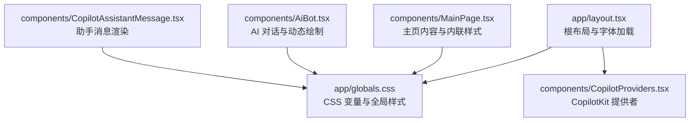
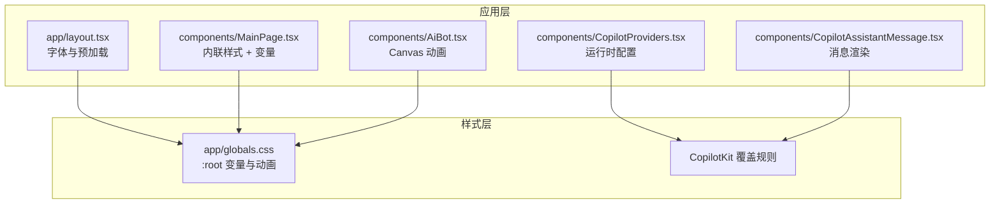
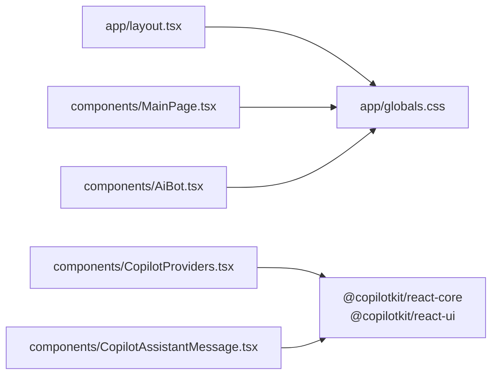

# 赛博朋克主题设计

<cite>
**本文引用的文件**
- [app/globals.css](file://app/globals.css)
- [app/layout.tsx](file://app/layout.tsx)
- [components/CopilotProviders.tsx](file://components/CopilotProviders.tsx)
- [components/MainPage.tsx](file://components/MainPage.tsx)
- [components/AiBot.tsx](file://components/AiBot.tsx)
- [components/CopilotAssistantMessage.tsx](file://components/CopilotAssistantMessage.tsx)
- [package.json](file://package.json)
</cite>

## 目录
1. [简介](#简介)
2. [项目结构](#项目结构)
3. [核心组件](#核心组件)
4. [架构总览](#架构总览)
5. [详细组件分析](#详细组件分析)
6. [依赖关系分析](#依赖关系分析)
7. [性能考量](#性能考量)
8. [故障排查指南](#故障排查指南)
9. [结论](#结论)
10. [附录](#附录)

## 简介
本文件面向 Fuqianjiao AI 项目的赛博朋克主题设计，系统性阐述 CSS 变量体系、动画系统、响应式与网格布局、以及 CopilotKit UI 的主题适配策略。文档旨在帮助开发者快速理解并扩展主题系统，确保视觉一致性与可维护性。

## 项目结构
项目采用 Next.js 结构，主题样式集中于全局 CSS，页面与组件通过内联样式与 CSS 变量协同实现一致的赛博朋克风格。

图表来源
- [app/layout.tsx:19-47](file://app/layout.tsx#L19-L47)
- [app/globals.css:1-23](file://app/globals.css#L1-L23)
- [components/CopilotProviders.tsx:49-156](file://components/CopilotProviders.tsx#L49-L156)
- [components/MainPage.tsx:127-139](file://components/MainPage.tsx#L127-L139)
- [components/AiBot.tsx:1-22](file://components/AiBot.tsx#L1-L22)
- [components/CopilotAssistantMessage.tsx:37-52](file://components/CopilotAssistantMessage.tsx#L37-L52)

章节来源
- [app/layout.tsx:19-47](file://app/layout.tsx#L19-L47)
- [app/globals.css:1-23](file://app/globals.css#L1-L23)

## 核心组件
- 全局 CSS 变量与动画：定义基础色彩、表面层级、文本与边框变量，并提供关键帧动画，用于统一视觉节奏与动效体验。
- CopilotKit 主题适配：通过自定义 CSS 变量与覆盖规则，将默认 UI 适配为赛博朋克风格。
- 响应式与网格：基于媒体查询与 CSS Grid 实现移动端优先的布局策略。
- 主页与对话组件：通过内联样式与 CSS 变量，结合 Canvas 动态绘制，强化赛博朋克氛围。

章节来源
- [app/globals.css:1-12](file://app/globals.css#L1-L12)
- [app/globals.css:25-68](file://app/globals.css#L25-L68)
- [app/globals.css:493-508](file://app/globals.css#L493-L508)
- [app/globals.css:516-538](file://app/globals.css#L516-L538)
- [components/MainPage.tsx:134-139](file://components/MainPage.tsx#L134-L139)
- [components/AiBot.tsx:807-850](file://components/AiBot.tsx#L807-L850)

## 架构总览
整体架构围绕“全局变量 + 组件内联样式 + CopilotKit 覆盖”的思路展开，确保主题一致性与可扩展性。

图表来源
- [app/globals.css:1-12](file://app/globals.css#L1-L12)
- [app/layout.tsx:36-40](file://app/layout.tsx#L36-L40)
- [components/CopilotProviders.tsx:144-156](file://components/CopilotProviders.tsx#L144-L156)
- [components/MainPage.tsx:141-142](file://components/MainPage.tsx#L141-L142)
- [components/AiBot.tsx:838-850](file://components/AiBot.tsx#L838-L850)
- [components/CopilotAssistantMessage.tsx:37-52](file://components/CopilotAssistantMessage.tsx#L37-L52)

## 详细组件分析

### CSS 变量系统与颜色方案
- 基础色板
  - 背景色与表面：--bg、--surface、--surface2
  - 强调色：--accent（青蓝）、--accent2（紫罗兰）
  - 文本与辅助：--text、--text-dim
  - 边框与光晕：--border、--glow
- 设计理念
  - 深色背景与高对比文本，强调赛博朋克的未来感与科技感。
  - 强调色作为交互与高亮元素，弱化色相差异，突出明度变化。
  - 边框与光晕变量统一用于统一阴影与描边风格，减少重复计算。
- 使用方式
  - 全局 body 使用 --bg 与 --text，确保页面基调一致。
  - 组件内联样式通过 var(--...) 引用变量，保证主题一致性。

章节来源
- [app/globals.css:2-12](file://app/globals.css#L2-L12)
- [app/globals.css:17-23](file://app/globals.css#L17-L23)
- [components/MainPage.tsx:134-139](file://components/MainPage.tsx#L134-L139)

### 动画系统与关键帧
- 关键帧定义
  - fcBlink：用于闪烁提示，强调交互状态。
  - orbPulse：用于圆形元素的呼吸脉冲，营造能量流动感。
  - fabCyberPulse：FAB（浮动操作按钮）信封图标霓虹呼吸，增强赛博朋克氛围。
  - fadeUp：页面元素入场动画，平滑过渡。
  - pulse：指示灯脉冲，强调在线状态。
  - barIn：进度条填充动画，逐级延时，形成流水线效果。
- 参数与表现
  - 时间曲线：ease-in-out、ease 与 steps 等，兼顾自然与机械感。
  - 持续时间：2.8s（fabCyberPulse）、1s（fadeUp）、0.7s（pulse）等，符合赛博朋克的高频节奏。
  - 变换组合：opacity、scale、filter(drop-shadow) 与 transform 组合，强化层次与动感。
- 使用方式
  - 通过类名绑定关键帧，如 .fab-cyber-mail 绑定 fabCyberPulse。
  - 进度条通过类名组合（bar-fill-100、bar-fill-95 等）实现逐级动画。

章节来源
- [app/globals.css:93-101](file://app/globals.css#L93-L101)
- [app/globals.css:526-534](file://app/globals.css#L526-L534)
- [app/globals.css:516-519](file://app/globals.css#L516-L519)
- [app/globals.css:521-524](file://app/globals.css#L521-L524)
- [app/globals.css:540-549](file://app/globals.css#L540-L549)

### 响应式设计与网格布局
- 断点与策略
  - 数字团队网格在 480px 以上切换为双列，窄屏单列，末尾卡片跨列。
  - 使用 CSS Grid 的 repeat(2, minmax(0, 1fr)) 实现等分布局。
- 实现要点
  - .digital-team-grid 控制网格容器。
  - .digital-team-card--span 在宽屏下跨列，适配末尾卡片的视觉需求。
- 优势
  - 移动优先，保证在小屏设备上的可读性与可触达性。
  - 灵活的跨列策略，满足内容密度与视觉平衡。

章节来源
- [app/globals.css:493-508](file://app/globals.css#L493-L508)

### CopilotKit UI 主题适配
- 覆盖策略
  - 隐藏默认按钮与弹窗，使用自定义 Orb 按钮与面板。
  - 在 .copilotKitChat.copilot-custom 中统一气泡尺寸、圆角、内边距与最大宽度。
  - 使用 CSS 变量覆盖默认主题色，如 --ck-bubble-*、--copilot-kit-* 系列变量。
- 消息与输入区
  - 消息区设置为纵向布局，底部输入区固定，避免内容溢出。
  - 输入区采用渐变发送按钮与圆角边框，强调赛博朋克的霓虹风格。
- 建议胶囊条
  - 小号字体、紧内边距、全圆角胶囊，与顶部快捷条风格一致。
- 适配细节
  - 隐藏 Powered by 区域，避免默认浅色背景穿透。
  - 统一 Markdown 标签的字号与行高，确保与气泡一致。

章节来源
- [app/globals.css:25-68](file://app/globals.css#L25-L68)
- [app/globals.css:70-80](file://app/globals.css#L70-L80)
- [app/globals.css:87-91](file://app/globals.css#L87-L91)
- [app/globals.css:103-108](file://app/globals.css#L103-L108)
- [app/globals.css:124-147](file://app/globals.css#L124-L147)
- [app/globals.css:149-189](file://app/globals.css#L149-L189)
- [app/globals.css:191-247](file://app/globals.css#L191-L247)
- [app/globals.css:256-272](file://app/globals.css#L256-L272)
- [app/globals.css:314-322](file://app/globals.css#L314-L322)
- [app/globals.css:324-354](file://app/globals.css#L324-L354)
- [app/globals.css:356-375](file://app/globals.css#L356-L375)
- [app/globals.css:377-382](file://app/globals.css#L377-L382)
- [app/globals.css:384-474](file://app/globals.css#L384-L474)
- [app/globals.css:476-491](file://app/globals.css#L476-L491)

### 主页与对话组件中的主题运用
- 主页
  - 使用内联样式与 CSS 变量，如 section、sectionLabel、sectionTitle、sectionDesc 等，统一字号、行高与间距。
  - 渐变背景与径向光晕，配合动画 fadeUp，营造赛博朋克的未来感。
- 对话组件
  - Canvas 动态绘制椭圆轨道，使用线性渐变与透明度，模拟能量脉冲。
  - 通过鼠标事件动态更新阴影与边框，增强交互反馈。

章节来源
- [components/MainPage.tsx:134-139](file://components/MainPage.tsx#L134-L139)
- [components/MainPage.tsx:141-146](file://components/MainPage.tsx#L141-L146)
- [components/MainPage.tsx:564-613](file://components/MainPage.tsx#L564-L613)
- [components/AiBot.tsx:807-850](file://components/AiBot.tsx#L807-L850)

## 依赖关系分析
- 样式依赖
  - app/layout.tsx 引入全局样式与字体资源，确保字体与样式在根节点生效。
  - app/globals.css 提供全局变量与动画，被各组件共享。
- 运行时依赖
  - components/CopilotProviders.tsx 通过 CopilotKit 提供运行时配置与请求头，间接影响 UI 行为。
- 组件依赖
  - components/MainPage.tsx 与 components/AiBot.tsx 通过内联样式与变量引用全局样式。
  - components/CopilotAssistantMessage.tsx 依赖 CopilotKit UI 的 Markdown 渲染与控制栏。

图表来源
- [app/layout.tsx:5-6](file://app/layout.tsx#L5-L6)
- [components/CopilotProviders.tsx:12-14](file://components/CopilotProviders.tsx#L12-L14)
- [components/CopilotAssistantMessage.tsx:13-14](file://components/CopilotAssistantMessage.tsx#L13-L14)

章节来源
- [app/layout.tsx:5-6](file://app/layout.tsx#L5-L6)
- [components/CopilotProviders.tsx:12-14](file://components/CopilotProviders.tsx#L12-L14)
- [components/CopilotAssistantMessage.tsx:13-14](file://components/CopilotAssistantMessage.tsx#L13-L14)

## 性能考量
- 动画性能
  - 使用 transform 与 opacity 动画，避免频繁重排与重绘。
  - 关键帧数量合理，避免过度复杂的滤镜链导致 GPU 压力。
- 样式体积
  - 全局变量集中管理，减少重复定义与计算。
  - CopilotKit 覆盖规则集中在一处，便于维护与压缩。
- 交互反馈
  - 鼠标事件更新阴影与边框，建议在必要时节流，避免高频更新造成卡顿。

## 故障排查指南
- CopilotKit 默认样式穿透
  - 若出现白色背景或默认浅色 UI，检查 .copilotKitChat.copilot-custom 是否正确覆盖背景与文本色。
  - 确认 .copilotKitChat.copilot-custom 的 display 与 flex 属性未被其他样式覆盖。
- 动画不生效
  - 检查关键帧是否在 CSS 文件中定义，且类名与绑定一致。
  - 确认动画持续时间与延迟设置合理，避免被覆盖。
- 响应式布局异常
  - 检查媒体查询断点与 grid-template-columns 设置，确认在目标屏幕宽度下生效。
- 字体加载问题
  - 确保字体链接在 head 中正确加载，避免 FOIT 或 FOUT 导致的布局抖动。

章节来源
- [app/globals.css:25-68](file://app/globals.css#L25-L68)
- [app/globals.css:516-538](file://app/globals.css#L516-L538)
- [app/globals.css:493-508](file://app/globals.css#L493-L508)
- [app/layout.tsx:36-40](file://app/layout.tsx#L36-L40)

## 结论
本主题系统通过全局 CSS 变量、统一动画与响应式网格，以及 CopilotKit 的深度适配，实现了赛博朋克风格的一致性与可扩展性。建议在新增组件时遵循“变量优先、动画统一、响应式优先”的原则，确保视觉与交互体验的连贯性。

## 附录
- 设计规范摘要
  - 色彩：深色背景 + 青蓝/紫罗兰强调色；高对比文本。
  - 字体：Noto Sans SC（正文）、Noto Serif SC（标题）、Space Mono（标签与强调）。
  - 动画：ease-in-out 与 ease 曲线；脉冲与呼吸类动画增强科技感。
  - 响应式：移动优先，480px 断点切换双列网格。
- 最佳实践
  - 使用 CSS 变量统一管理色彩与尺寸，避免硬编码。
  - 将动画参数抽象为变量，便于统一调整。
  - 在组件内联样式中引用变量，保持主题一致性。
  - 对 CopilotKit 的覆盖规则进行集中管理，避免散落的样式片段。