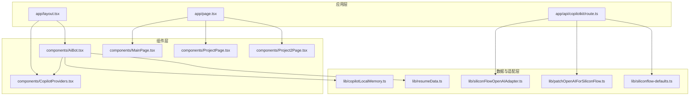
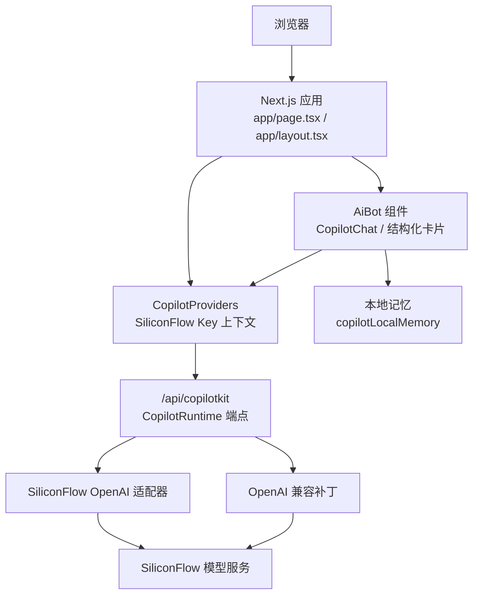
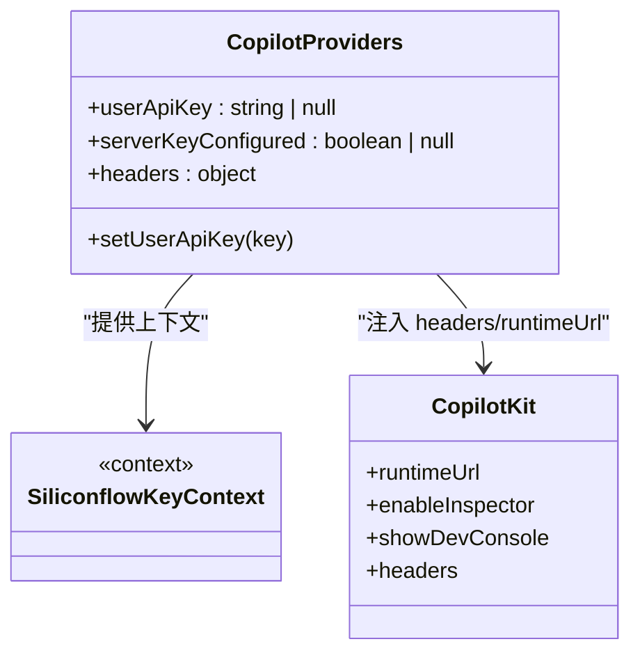
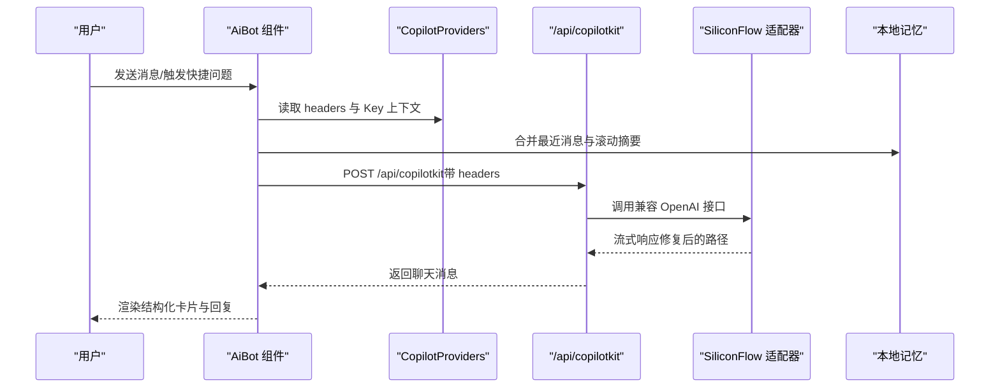
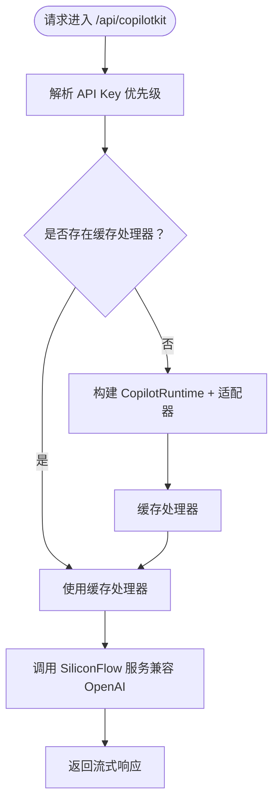
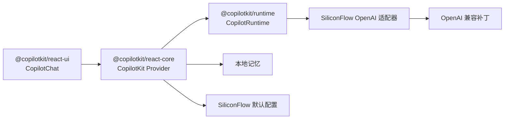

# 项目概述

<cite>
**本文档引用的文件**
- [package.json](file://package.json)
- [layout.tsx](file://app/layout.tsx)
- [page.tsx](file://app/page.tsx)
- [CopilotProviders.tsx](file://components/CopilotProviders.tsx)
- [AiBot.tsx](file://components/AiBot.tsx)
- [route.ts](file://app/api/copilotkit/route.ts)
- [resumeData.ts](file://lib/resumeData.ts)
- [siliconFlowOpenAIAdapter.ts](file://lib/siliconFlowOpenAIAdapter.ts)
- [patchOpenAIForSiliconFlow.ts](file://lib/patchOpenAIForSiliconFlow.ts)
- [siliconflow-defaults.ts](file://lib/siliconflow-defaults.ts)
- [copilotLocalMemory.ts](file://lib/copilotLocalMemory.ts)
- [MainPage.tsx](file://components/MainPage.tsx)
- [ProjectPage.tsx](file://components/ProjectPage.tsx)
- [Project2Page.tsx](file://components/Project2Page.tsx)
- [next.config.js](file://next.config.js)
- [tsconfig.json](file://tsconfig.json)
</cite>

## 目录
1. [引言](#引言)
2. [项目结构](#项目结构)
3. [核心组件](#核心组件)
4. [架构总览](#架构总览)
5. [详细组件分析](#详细组件分析)
6. [依赖分析](#依赖分析)
7. [性能考虑](#性能考虑)
8. [故障排查指南](#故障排查指南)
9. [结论](#结论)
10. [附录](#附录)

## 引言
本项目是一个基于 Next.js 14 + React 18 + TypeScript 构建的 AI 产品经理个人品牌展示网站。项目以“赛博朋克”为主题风格，围绕傅倩娇的个人经历、技能与对 AI 笔记/知识库方向的产品思考，提供多页面内容展示与智能 AI 助手对话两大核心功能。AI 助手通过 CopilotKit 集成，结合本地记忆与硅基流动（SiliconFlow）兼容的 OpenAI 适配层，实现稳定的流式对话体验，并将个人简历数据作为知识库注入模型上下文，使助手能够进行结构化的项目解读、技能展示与岗位匹配分析。

本项目既适合初学者理解现代前端全栈架构与 AI 集成的基本路径，也为有经验的开发者提供了可复用的 Provider 模式、本地记忆持久化、服务端密钥安全传递与兼容网关适配等技术亮点。

## 项目结构
项目采用 Next.js App Router 目录结构，核心目录与职责如下：
- app：应用入口与页面路由，包含全局布局、首页与 API 路由
- components：可复用 UI 组件与业务组件（AI 助手、页面容器等）
- lib：业务数据与第三方适配层（简历数据、SiliconFlow 适配、本地记忆等）
- public：公共资源（音频等）
- patches：第三方依赖的补丁（修复工具调用并行问题）

图表来源
- [layout.tsx:1-48](file://app/layout.tsx#L1-L48)
- [page.tsx:1-30](file://app/page.tsx#L1-L30)
- [CopilotProviders.tsx:1-157](file://components/CopilotProviders.tsx#L1-L157)
- [AiBot.tsx:1-800](file://components/AiBot.tsx#L1-L800)
- [route.ts:1-131](file://app/api/copilotkit/route.ts#L1-L131)
- [resumeData.ts:1-263](file://lib/resumeData.ts#L1-L263)
- [siliconFlowOpenAIAdapter.ts:1-36](file://lib/siliconFlowOpenAIAdapter.ts#L1-L36)
- [patchOpenAIForSiliconFlow.ts:1-22](file://lib/patchOpenAIForSiliconFlow.ts#L1-L22)
- [siliconflow-defaults.ts:1-16](file://lib/siliconflow-defaults.ts#L1-L16)
- [copilotLocalMemory.ts:1-77](file://lib/copilotLocalMemory.ts#L1-L77)

章节来源
- [package.json:1-29](file://package.json#L1-L29)
- [next.config.js:1-4](file://next.config.js#L1-L4)
- [tsconfig.json:1-21](file://tsconfig.json#L1-L21)

## 核心组件
- 全局布局与 Provider
  - app/layout.tsx：设置站点元数据、预加载背景音乐、引入全局样式与 CopilotProviders，确保 AI 助手在整站范围内可用
  - components/CopilotProviders.tsx：提供 SiliconFlow API Key 上下文、服务端 Key 配置探测、fetch 代理与本地存储覆盖 Key 的能力，屏蔽前端暴露敏感信息
- 首页与页面导航
  - app/page.tsx：多页面切换容器，支持主页、项目页与第二项目页的平滑跳转
  - components/MainPage.tsx：主页内容聚合，包含经历、匹配度雷达、JD 理解、AI 笔记观点与技能图谱等
  - components/ProjectPage.tsx 与 components/Project2Page.tsx：项目详情页（STAR 法则拆解）
- AI 助手与对话
  - components/AiBot.tsx：集成 CopilotKit UI，提供快捷问题、欢迎语、结构化卡片（项目亮点、技能栈、岗位匹配度）与函数调用状态提示
  - app/api/copilotkit/route.ts：服务端 CopilotKit 端点，按请求头/环境变量解析 API Key，缓存 Hono 处理器，适配 SiliconFlow 兼容网关
  - lib/resumeData.ts：AI 助手知识库，包含个人信息、教育背景、项目经历、技能与对 AI 笔记的观点等
  - lib/copilotLocalMemory.ts：本地持久化对话记忆，保留最近消息与滚动摘要，增强上下文连续性
  - lib/siliconFlowOpenAIAdapter.ts 与 lib/patchOpenAIForSiliconFlow.ts：适配 SiliconFlow 的 OpenAI 兼容接口，将 beta 流式路径代理到标准 chat.completions 接口
  - lib/siliconflow-defaults.ts：定义 API Key 请求头、默认 Key 存储键与默认 Key 常量

章节来源
- [layout.tsx:1-48](file://app/layout.tsx#L1-L48)
- [page.tsx:1-30](file://app/page.tsx#L1-L30)
- [CopilotProviders.tsx:1-157](file://components/CopilotProviders.tsx#L1-L157)
- [AiBot.tsx:1-800](file://components/AiBot.tsx#L1-L800)
- [route.ts:1-131](file://app/api/copilotkit/route.ts#L1-L131)
- [resumeData.ts:1-263](file://lib/resumeData.ts#L1-L263)
- [copilotLocalMemory.ts:1-77](file://lib/copilotLocalMemory.ts#L1-L77)
- [siliconFlowOpenAIAdapter.ts:1-36](file://lib/siliconFlowOpenAIAdapter.ts#L1-L36)
- [patchOpenAIForSiliconFlow.ts:1-22](file://lib/patchOpenAIForSiliconFlow.ts#L1-L22)
- [siliconflow-defaults.ts:1-16](file://lib/siliconflow-defaults.ts#L1-L16)

## 架构总览
项目采用“组件化 + Provider 模式”的前端架构，配合服务端 API 端点与第三方 AI 服务适配层，形成“前端 UI + 本地记忆 + 服务端运行时 + 第三方模型服务”的完整链路。

图表来源
- [page.tsx:1-30](file://app/page.tsx#L1-L30)
- [layout.tsx:1-48](file://app/layout.tsx#L1-L48)
- [CopilotProviders.tsx:1-157](file://components/CopilotProviders.tsx#L1-L157)
- [AiBot.tsx:1-800](file://components/AiBot.tsx#L1-L800)
- [route.ts:1-131](file://app/api/copilotkit/route.ts#L1-L131)
- [siliconFlowOpenAIAdapter.ts:1-36](file://lib/siliconFlowOpenAIAdapter.ts#L1-L36)
- [patchOpenAIForSiliconFlow.ts:1-22](file://lib/patchOpenAIForSiliconFlow.ts#L1-L22)

## 详细组件分析

### 组件 A：CopilotProviders（Provider 模式与密钥管理）
- 职责
  - 提供 SiliconFlow API Key 上下文，支持用户在前端面板保存 Key（localStorage），并在请求头中携带
  - 通过 GET /api/copilotkit 健康检查，告知前端服务端是否已配置 Key，从而决定是否允许“零浏览器配置”
  - 代理 window.fetch，对 CopilotKit 专用端点返回空响应体时进行安全修复，避免语法错误
  - 计算请求头优先级：请求头 > 环境变量 > 代码兜底
- 关键点
  - 默认不将 Key 注入浏览器，保护敏感信息
  - 通过 useMemo 缓存上下文对象，避免重复渲染
  - 在 CopilotKit Provider 中注入 headers 与 runtimeUrl

图表来源
- [CopilotProviders.tsx:1-157](file://components/CopilotProviders.tsx#L1-L157)

章节来源
- [CopilotProviders.tsx:1-157](file://components/CopilotProviders.tsx#L1-L157)
- [siliconflow-defaults.ts:1-16](file://lib/siliconflow-defaults.ts#L1-L16)

### 组件 B：AI 助手（对话系统与结构化卡片）
- 职责
  - 集成 CopilotKit UI，提供聊天界面、快捷问题与欢迎语
  - 通过 useCopilotReadable 注入本地记忆与 resumeData 作为上下文
  - 渲染结构化卡片：项目亮点（含指标与跳转）、技能栈图谱、岗位匹配度分析与联系方式
  - 支持函数调用执行中的状态提示与首次引导的本地存储标记
- 关键点
  - 本地记忆：最近消息与滚动摘要，限制长度并截断文本
  - 知识库：resumeData 作为 CopilotKit 的 readable 内容，确保模型具备结构化背景
  - 导航：卡片内按钮可直接跳转到主页特定锚点或项目页

图表来源
- [AiBot.tsx:1-800](file://components/AiBot.tsx#L1-L800)
- [CopilotProviders.tsx:1-157](file://components/CopilotProviders.tsx#L1-L157)
- [route.ts:1-131](file://app/api/copilotkit/route.ts#L1-L131)
- [siliconFlowOpenAIAdapter.ts:1-36](file://lib/siliconFlowOpenAIAdapter.ts#L1-L36)
- [patchOpenAIForSiliconFlow.ts:1-22](file://lib/patchOpenAIForSiliconFlow.ts#L1-L22)
- [copilotLocalMemory.ts:1-77](file://lib/copilotLocalMemory.ts#L1-L77)

章节来源
- [AiBot.tsx:1-800](file://components/AiBot.tsx#L1-L800)
- [copilotLocalMemory.ts:1-77](file://lib/copilotLocalMemory.ts#L1-L77)
- [resumeData.ts:1-263](file://lib/resumeData.ts#L1-L263)

### 组件 C：服务端端点（CopilotKit 运行时与适配）
- 职责
  - 解析 API Key 优先级：请求头 > 环境变量 > 代码兜底
  - 缓存 Hono 处理器，避免每请求重建 CopilotRuntime，提升稳定性与性能
  - 适配 SiliconFlow 兼容网关：将 OpenAI beta 流式路径代理到标准 chat.completions
  - 提供 GET 健康检查，返回服务端配置状态与提示信息
- 关键点
  - 并行工具调用禁用：在 agent providerOptions 中显式关闭，避免兼容网关不支持 tool-call 结束事件
  - 通过 patch 修复 OpenAI SDK 的流式路径差异

图表来源
- [route.ts:1-131](file://app/api/copilotkit/route.ts#L1-L131)
- [siliconFlowOpenAIAdapter.ts:1-36](file://lib/siliconFlowOpenAIAdapter.ts#L1-L36)
- [patchOpenAIForSiliconFlow.ts:1-22](file://lib/patchOpenAIForSiliconFlow.ts#L1-L22)

章节来源
- [route.ts:1-131](file://app/api/copilotkit/route.ts#L1-L131)
- [siliconFlowOpenAIAdapter.ts:1-36](file://lib/siliconFlowOpenAIAdapter.ts#L1-L36)
- [patchOpenAIForSiliconFlow.ts:1-22](file://lib/patchOpenAIForSiliconFlow.ts#L1-L22)

### 组件 D：主页与项目页（内容展示与导航）
- MainPage：整合个人经历、能力雷达、JD 理解、AI 笔记观点与技能图谱，支持点击跳转到项目页与锚点
- ProjectPage / Project2Page：STAR 法则深度拆解，包含背景、任务、行动与结果，辅以指标与 AB 测试验证
- 页面切换：app/page.tsx 通过状态机切换当前页面，支持平滑回到顶部

章节来源
- [MainPage.tsx:1-691](file://components/MainPage.tsx#L1-L691)
- [ProjectPage.tsx:1-275](file://components/ProjectPage.tsx#L1-L275)
- [page.tsx:1-30](file://app/page.tsx#L1-L30)

## 依赖分析
- 前端依赖
  - next、react、react-dom：框架与运行时
  - @copilotkit/react-core、@copilotkit/react-ui、@copilotkit/runtime：AI 助手核心与 UI 组件
  - @copilotkit/runtime-client-gql：GraphQL 客户端（用于可见消息与消息片段）
- 开发依赖
  - patch-package：应用补丁（修复工具调用并行问题）
  - typescript、@types/*：类型支持
- 关键依赖关系
  - AiBot 依赖 CopilotKit Provider 与本地记忆
  - 服务端端点依赖 SiliconFlow 适配器与补丁
  - Provider 依赖环境变量与请求头，决定 API Key 传递策略

图表来源
- [package.json:12-27](file://package.json#L12-L27)
- [AiBot.tsx:1-800](file://components/AiBot.tsx#L1-L800)
- [CopilotProviders.tsx:1-157](file://components/CopilotProviders.tsx#L1-L157)
- [route.ts:1-131](file://app/api/copilotkit/route.ts#L1-L131)
- [siliconFlowOpenAIAdapter.ts:1-36](file://lib/siliconFlowOpenAIAdapter.ts#L1-L36)
- [patchOpenAIForSiliconFlow.ts:1-22](file://lib/patchOpenAIForSiliconFlow.ts#L1-L22)
- [siliconflow-defaults.ts:1-16](file://lib/siliconflow-defaults.ts#L1-L16)
- [copilotLocalMemory.ts:1-77](file://lib/copilotLocalMemory.ts#L1-L77)

章节来源
- [package.json:1-29](file://package.json#L1-L29)

## 性能考虑
- 本地记忆与上下文注入
  - 通过本地存储与滚动摘要，减少重复注入长上下文，提升响应速度与稳定性
- 服务端处理器缓存
  - 按 API Key 缓存 Hono 处理器，避免重复初始化 CopilotRuntime，降低冷启动开销
- 流式响应与兼容适配
  - 通过补丁将 beta 流式路径映射到标准 chat.completions，减少兼容性问题带来的失败重试
- 前端渲染优化
  - Provider 使用 useMemo 缓存上下文对象，避免不必要的重渲染
  - 页面切换使用状态机与平滑滚动，减少跳闪

## 故障排查指南
- “未配置有效的硅基流动 API Key”
  - 检查请求头 x-siliconflow-api-key 是否正确传递
  - 确认环境变量 SILICONFLOW_API_KEY 或代码兜底是否可用
  - 通过 GET /api/copilotkit 查看 serverKeyConfigured 状态
- “AI_APICallError: Not Found”
  - 确认 SILICONFLOW_MODEL 是否有效，兼容网关通常不支持旧模型 ID
  - 检查是否使用了 beta 流式路径，需依赖补丁将路径代理到标准接口
- “RUN_FINISHED while tool calls are still active”
  - 确保 agent providerOptions 中已禁用并行工具调用，或应用补丁修复兼容网关行为
- “前端显示空响应或语法错误”
  - 检查 CopilotProviders 的 fetch 代理是否生效，确保对空响应体进行安全修复

章节来源
- [route.ts:1-131](file://app/api/copilotkit/route.ts#L1-L131)
- [CopilotProviders.tsx:1-157](file://components/CopilotProviders.tsx#L1-L157)
- [patchOpenAIForSiliconFlow.ts:1-22](file://lib/patchOpenAIForSiliconFlow.ts#L1-L22)

## 结论
本项目以“个人品牌 + AI 助手”的形式，展示了现代前端全栈架构与 AI 集成的最佳实践：组件化与 Provider 模式、服务端密钥安全传递、本地记忆与知识库注入、以及第三方兼容网关适配。对于初学者，项目提供了清晰的目录结构与职责划分；对于有经验的开发者，项目在安全性、稳定性与可扩展性方面均有明确的设计取舍与实现细节，可作为构建类似个人品牌或产品展示型网站的参考样板。

## 附录
- 术语说明
  - CopilotKit：AI 助手 UI 与运行时框架
  - SiliconFlow：兼容 OpenAI 协议的模型服务网关
  - 流式响应：服务器端逐步返回消息片段，提升交互体验
- 功能演示示例（路径指引）
  - 打开主页并查看“岗位匹配度分析”卡片：[AiBot.tsx:396-711](file://components/AiBot.tsx#L396-L711)
  - 查看项目 STAR 拆解（千牛项目）：[ProjectPage.tsx:1-275](file://components/ProjectPage.tsx#L1-L275)
  - 查看技能图谱卡片：[AiBot.tsx:251-394](file://components/AiBot.tsx#L251-L394)
  - 切换页面（主页/项目页）：[page.tsx:1-30](file://app/page.tsx#L1-L30)
  - 设置/清除 SiliconFlow API Key（前端面板）：[CopilotProviders.tsx:115-124](file://components/CopilotProviders.tsx#L115-L124)